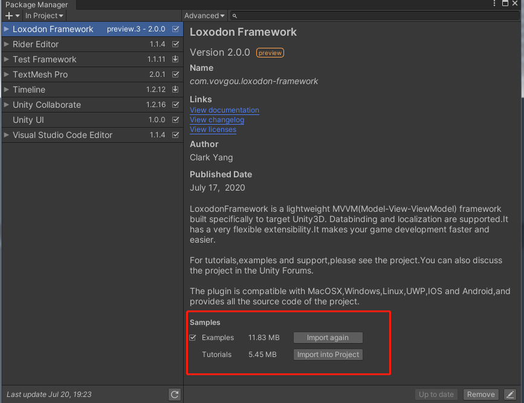

## 安装

自Loxodon.Framework 2.0版本开始，保留了原有的 .unitypackage包发布方式，同时添加了UPM发布方式，此版本要求Unity 2018.4.2及以上版本，框架的目录结构和API都进行了一些调整，同时引入了async/await、Task等新特性，升级前请先查看下文的升级注意事项。

**安装注意：在中国区下载的Unity版本屏蔽了第三方仓库，会导致UPM包安装失败，咨询了Unity中国相关人员说是马上会放开，如果UPM方式安装失败请使用.unitypackage文件安装或者使用非中国区的Unity版本**

### 1.x.x版本升级到2.0注意事项

**从1.x.x版本升级到2.0版本前，请先删除老版本的所有文件，按下面的安装步骤安装新版本。2.0版本的教程和示例代码默认不会自动导入，如需要请手动导入到项目中。**

** Loxodon.Framework.XLua和Loxodon.Framework.Bundle因为依赖问题仍然使用传统方式发布。 **

**不兼容的改变：**
- **修改了IUIViewLocator接口以及实现，如果继承了此接口的自定义实现需要调整。**
- **修改了本地化模块的IDataProvider接口及实现，如果没有自定义类，不会有影响。**
- **IAsyncTask和IProgressTask有用到多线程,在WebGL平台不支持，2.0版本后建议不再使用，框架中用到了它们的地方都改为IAsyncResult和IProgressResult。**
- **新的API使用了async/await和Task，不再支持.net 2.0**
- **修改了Window、WindowManager等几个类的函数，改IAsyncTask为IAsyncResult**

### 使用 OpenUPM 安装

[OpenUPM](https://openupm.com/) 是一个开源的UPM包仓库，它支持发布第三方的UPM包，它能够自动管理包的依赖关系，可以使用它安装本框架.

通过openupm命令安装包,要求[nodejs](https://nodejs.org/en/download/) and openupm-cli客户端的支持，如果没有安装请先安装nodejs和open-cli。

    # 使用npm命令安装openupm-cli，如果已经安装请忽略.
    npm install -g openupm-cli 
    
    #切换当前目录到项目的根目录
    cd F:/workspace/New Unity Project
    
    #安装 loxodon-framework
    openupm add com.vovgou.loxodon-framework
    
### 修改Packages/manifest.json文件安装(推荐)

通过修改manifest.json文件安装，不需要安装nodejs和openupm-cli客户端。在Unity项目根目录下找到Packages/manifest.json文件，在文件的scopedRegistries（没有可以自己添加）节点下添加第三方仓库package.openupm.com的配置，同时在dependencies节点下添加com.vovgou.loxodon-framework的配置，保存后切换到Unity窗口即可完成安装。

框架及所有插件同时也发布到npm的仓库中，也可以使用npm的仓库安装下载插件：[https://registry.npmjs.org/](https://registry.npmjs.org/)

    {
      "dependencies": {
        ...
        "com.unity.modules.xr": "1.0.0",
        "com.vovgou.loxodon-framework": "2.0.0-preview"
      },
      "scopedRegistries": [
        {
          "name": "package.openupm.com",
          "url": "https://package.openupm.com",
          "scopes": [
            "com.vovgou",
            "com.openupm"
          ]
        }
      ]
    }

### 通过git URL安装

Unity 2019.3.4f1及以上版本支持使用git URL安装. 如下图添加 https://github.com/vovgou/loxodon-framework.git?path=Loxodon.Framework/Assets/LoxodonFramework 地址到UPM管理器，耐性等待一段时间，下载完成后即安装成功。

### 通过 *.unitypackage 文件安装

从以下地址下载 [Loxodon.Framework2.x.x.unitypackage](https://github.com/vovgou/loxodon-framework/releases) 后,导入到你的项目中即完成安装.

- [AssetStore](https://assetstore.unity.com/packages/tools/gui/loxodon-framework-77446)
- [Releases](https://github.com/vovgou/loxodon-framework/releases)

### 导入示例

 - Unity 2019 及以上版本可以通过Package Manager导入示例

   打开包管理器，找到Import into project 按钮点击，导入示例到项目中。

   
   
 - Unity 2018 版本导入示例

   在Packages/Loxodon Framework/PackageResources/ 目录中找到Examples.unitypackage和Tutorials.unitypackage，双击导入到项目。