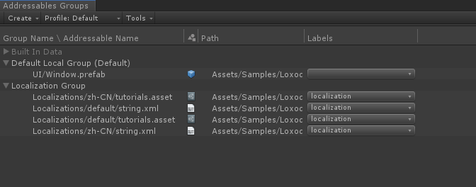

# Loxodon Framework Addressable

 

*Developed by Clark*

Requires Unity 2018.4 or higher.

This is a Addressable plugin for Loxodon.Framework.

## Installation

### Install via OpenUPM (recommended)

[OpenUPM](https://openupm.com/) can automatically manage dependencies, it is recommended to use it to install the framework.

Requires [nodejs](https://nodejs.org/en/download/)'s npm and openupm-cli, if not installed please install them first.

    # Install openupm-cli,please ignore if it is already installed.
    npm install -g openupm-cli

    #Go to the root directory of your project
    cd F:/workspace/New Unity Project

    #Install loxodon-framework-addressable
    openupm add com.vovgou.loxodon-framework-addressable

### Install via Packages/manifest.json

Modify the Packages/manifest.json file in your project, add the third-party repository "package.openupm.com"'s configuration and add "com.vovgou.loxodon-framework-addressable" in the "dependencies" node.

Installing the framework in this way does not require nodejs and openm-cli.

    {
      "dependencies": {
        ...
        "com.unity.modules.xr": "1.0.0",
        "com.vovgou.loxodon-framework-addressable": "2.0.1"
      },
      "scopedRegistries": [
        {
          "name": "package.openupm.com",
          "url": "https://package.openupm.com",
          "scopes": [
            "com.vovgou",
            "com.openupm"
          ]
        }
      ]
    }

### Install via git URL

After Unity 2019.3.4f1 that support path query parameter of git package. You can add https://github.com/vovgou/loxodon-framework.git?path=Loxodon.Framework/Assets/LoxodonFramework to Package Manager

Loxodon.Framework.Addressable depends on Loxodon.Framework, please install Loxodon.Framework first.

- Loxodon.Framework:  https://github.com/vovgou/loxodon-framework.git?path=Loxodon.Framework/Assets/LoxodonFramework

- Loxodon.Framework.Addressable: https://github.com/vovgou/loxodon-framework.git?path=Loxodon.Framework.Addressable/Assets/LoxodonFramework/Addressable

### Install via *.unitypackage file

Download Loxodon.Framework.unitypackage and Loxodon.Framework.Addressable.unitypackage, import them into your project.

- [Releases](https://github.com/vovgou/loxodon-framework/releases)

## Examples

### Loads localized assets using the Addressable Assets System

    async void Start()
    {
        Localization localization = Localization.Current;
        localization.CultureInfo = CultureInfo.CurrentCulture;

        //Load localized resources from Assetbundles based on asset label.
        await localization.AddDataProvider(new XmlAddressableDataProvider("localization"));

        //Load localized resources from Assetbundles based on asset address.
        string filename = "Localizations/default/tutorials.asset";
        await localization.AddDataProvider(new AddressableLocalizationSourceDataProvider(filename));

        // or

        //Load localized resources from Assetbundles based on asset label and file names.
        //await localization.AddDataProvider(new AddressableLocalizationSourceDataProvider("localization",
        //    new string[] { "tutorials.asset" }));

        string name = localization.GetText("app.name");

        Debug.LogFormat("name:{0}", name);
    }

### Loads the window using the Addressable Assets System

    async void Start()
    {
        IUIViewLocator locator = new AddressableUIViewLocator();
        IWindow window =await locator.LoadWindowAsync<ExampleWindow>("UI/Window.prefab");
        await window.Show();
    }

## Contact Us
Email: [yangpc.china@gmail.com](mailto:yangpc.china@gmail.com)   
Website: [https://vovgou.github.io/loxodon-framework/](https://vovgou.github.io/loxodon-framework/)  
QQ Group: 622321589 
