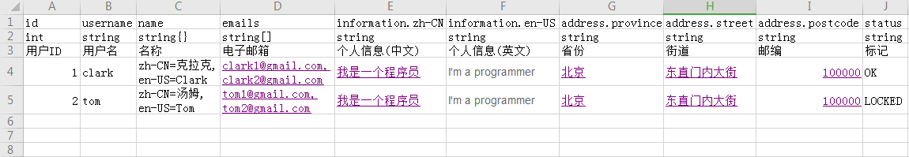
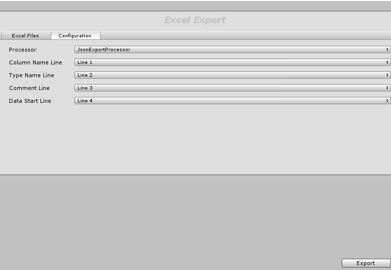
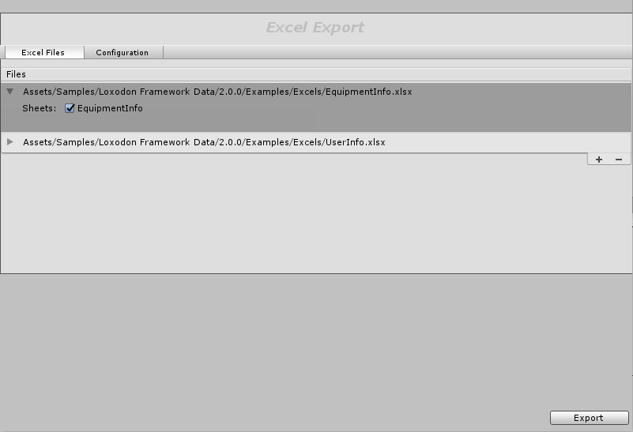
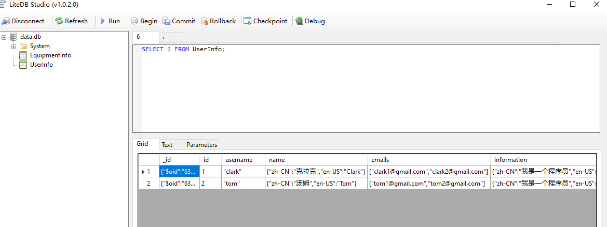
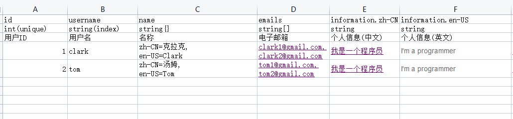
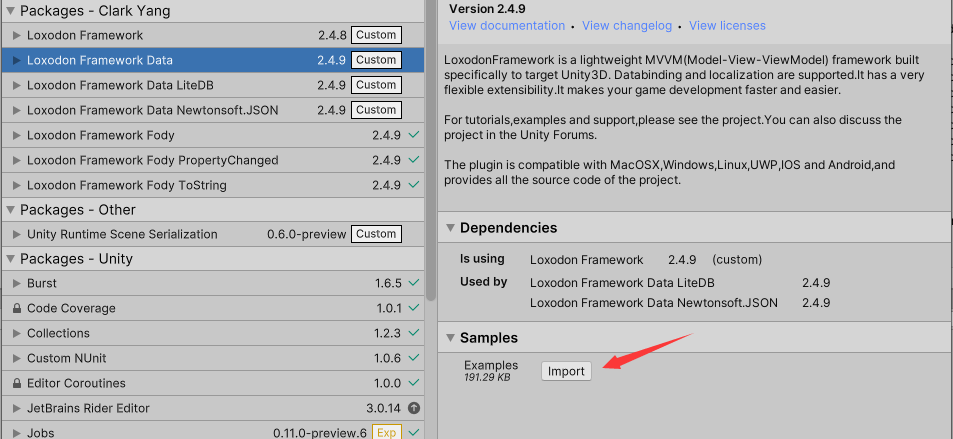
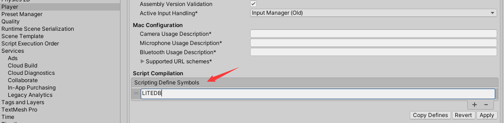

<!--
---
puppeteer:
    landscape: false
    format: "A3"
    timeout: 3000 # <= 特殊设置，意味着等待（waitFor） 3000 毫秒
---
-->

# Loxodon Framework Data

 

*开发者 Clark*

要求Unity 2018.4或者更高版本

本插件支持从Excel文件中导出数据到Json文件、Lua文件或者LiteDB数据库，以及通过Json.Net将数据转为C#对象。推荐使用LiteDB存储配置数据，这是一个轻量级的NoSQL嵌入式数据库，它本身就支持ORM功能、支持BSON格式、支持数据索引功能，使用起来非常方便。

## 安装

- [Loxodon Framework Data](https://github.com/vovgou/loxodon-framework?path=Loxodon.Framework.Data)（必选）

	必选插件，它支持解析excel文件，并且可以从excel文件导出到数据到Lua或者Json文件中。

- [Loxodon Framework Data LiteDB](https://github.com/vovgou/loxodon-framework?path=Loxodon.Framework.Data)(可选)

	可选插件，它支持将数据导出到LiteDB数据库中，支持ORM，并且自动注册了Color、Vector2、Vector3、Vector4、Vector2Int、Vector3Int、Version等类的序列化和反序列化函数，列如：自动将(1.0,1.0,1.0)字符串转换为C#对象Vector3。如果需要使用LiteDB数据库来存储配表文件，那么必须安装此插件（推荐）。

- [Loxodon Framework Data Newtonsoft.Json](https://github.com/vovgou/loxodon-framework?path=Loxodon.Framework.Data)(可选)

	可选插件，支持使用Newtonsoft.Json解析Json数据，支持Color、Vector2、Vector3、Vector4、Vector2Int、Vector3Int、Version等类的Json类型转换器。

在Unity项目的Packages目录中找到manifest.json 文件，增加第三方仓库 "https://package.openupm.com"或者"https://registry.npmjs.org"到配置文件中，然后增加"com.vovgou.loxodon-framework-data"到dependencies节点下，然后保存文件，Unity会自动下载安装插件。

    {
      "dependencies": {
        ...
        "com.unity.modules.xr": "1.0.0",
        "com.vovgou.loxodon-framework-data": "2.4.9", //必选
        "com.vovgou.loxodon-framework-litedb": "2.4.9", //可选
        "com.vovgou.loxodon-framework-newtonsoft": "2.4.9" //可选
      },
      "scopedRegistries": [
        {
          "name": "package.openupm.com",
          "url": "https://package.openupm.com",
          "scopes": [
            "com.vovgou",
            "com.openupm"
          ]
        }
      ]
    }

## Excel数据

### Excel文件格式如下：

### 表头定义

- **第一行：** 字段名称（必选），只能使用英文、数字、中划线或者下划线，首字母不能使用数字，建议采用驼峰命名法。同时也支持路径配置，路径由多个字段组成，字段之间使用点号(.)分割，比如user.firstName,user.lastName。
- **第二行：** 字段类型和列索引（必选），格式：类型(索引)，列如：int(index)，如果不需要索引则只填写类型即可，字段类型的定义见下文中数据类型章节，字段索引包括唯一索引unique和非唯一索引index，字段索引仅在导出到嵌入式数据库时有效。
- **第三行：** 备注信息（可选）

### 数据类型

- **基本数据类型：** int, string, float, bool

    bool类型支持字符串的配置方式”true”或者”false”，不区分大小写，也支持数字配置方式1或者0
    枚举类型可以使用int类型配置，也可以使用string类型配置，如果上图中的status字段

- **数组类型：** int[], string[], float[], bool[]

    数组元素使用半角的逗号”,”分割，并且自动忽略空格。如int[]数组填写：2,3,4

- **字典类型：** int{}, string[], float{}, bool{}

    字典的多个键值对使用半角的逗号”,”分割，键值对格式为 key=value 的方式。
    字典的配置支持两种方式，第一种是如上表的name字段的配置，类型是string{}，配置在一个单元格中，这种方式配置必须确保所有的元素都是相同类型；另一种是information的配置，分别配置在多个单元格中，可以单独定义子字段的类型。一般来说很短的文本内容使用第一种方式，比较长的文本内容或者子字段是不同的类型，比如对象配置，则使用第二种方式。    

    它们导出到Json格式是一样的，如下：

      {
        "name":{"zh-CN":"克拉克","en-US":"Clark"},
        "information":{"zh-CN":"我是一个程序员","en-US":"I'm a programmer"}
      }

    如果需要支持Color、Vector2、Vector3、Vector4、Version等其他类型，请使用string类型存储，在Json序列化时通过自定义的JsonConverter转换为对应的类型。如Color可以存储为"#FF0000",Vector3可以存储为"(1.0,2.0,3.0)"
### 列索引

列索引支持唯一索引和非唯一索引，仅支持单列索引，不支持联合索引，列索引仅在导出数据到支持索引功能的数据库时有效，导出到json或者lua时忽略索引。

- **唯一索引**

    unique

- **非唯一索引**

    index

### 导出数据

通过Tools/Loxodon/Excel Export Wizard菜单打开导出向导界面如下图。选择导出处理器，字段行行号，数据类型行号，备注信息的行号，数据起始行号以及导出的文件格式。

点列表右下角的"+"号导入Excel文件列表，排除不需要导出的Sheet表单。点击右下角的Export按钮导出文件。

- **导出的Json**

	导出的Json格式如下，Excel中的每行对应到Json文件中每一行，以换行符分割。

		{ "id":1,"username":"clark","name":{ "zh-CN":"克拉克","en-US":"Clark" },"emails":[ "clark1@gmail.com","clark2@gmail.com" ],"information":{ "zh-CN":"我是一个程序员","en-US":"I'm a programmer" },"address":{ "province":"北京","street":"东直门内大街","postcode":"100000" },"status":"OK" }
		{ "id":2,"username":"tom","name":{ "zh-CN":"汤姆","en-US":"Tom" },"emails":[ "tom1@gmail.com","tom2@gmail.com" ],"information":{ "zh-CN":"我是一个程序员","en-US":"I'm a programmer" },"address":{ "province":"北京","street":"东直门内大街","postcode":"100000" },"status":"LOCKED" }

- **导出的LiteDB数据**

    

### 自定义导出工具

可以通过继承ExportProcessor类，定制自己的导出格式，在项目中创建类CustomExportProcessor(类名没有要求，只要继承ExportProcessor就行)如下，在导出工具的Configuration界面会自动出现CustomExportProcessor处理器，选择CustomExportProcessor处理器，则会使用自定义处理器导出。

如下代码，自定义一个了Json格式的表单导出处理器。

    public class CustomExportProcessor : ExportProcessor
    {
        protected override bool Filter(FileInfo file, ISheet sheet)
        {
            //自定义Sheet表单过滤方法，只导出第一个Sheet
            var workbook = sheet.Workbook;
            if (workbook.GetSheetIndex(sheet) != 0)
                return false;
            return true;
        }

        protected override void DoExportSheet(FileInfo file, ISheet sheet, ISheetReader reader, string outputRoot)
        {
            string filename = string.Format("{0}.json", sheet.SheetName).ToLower();
            string fullname = Path.Combine(outputRoot, filename);
            StringBuilder text = Parse(reader);
            File.WriteAllText(fullname, text.ToString());
            Debug.LogFormat("File:{0} Sheet:{1} OK……", GetRelativePath(file.FullName), sheet.SheetName);
        }

        protected StringBuilder Parse(ISheetReader reader)
        {
            StringBuilder buf = new StringBuilder();
            for (int i = reader.StartLine; i <= reader.TotalCount; i++)
            {
                var data = reader.ReadLine(i);
                if (data == null)
                    continue;

                string json = JsonConvert.SerializeObject(data, Formatting.None);
                buf.AppendLine(json);
            }
            return buf;
        }
    }

## 本地化支持

本插件支持本地化配置，如下图中的name字段和infomation字段配置，会解析为一个字典对象，其中的Key是System.Globalization.CultureInfo的Name值，即语言类型，比如简体中文为zh-CN。在C#类中，可以将字典反序列化为LocalizedString对象，LocalizedString对象可以直接通过数据绑定绑定到UI上，并且随Localization模块动态切换语言。

## 使用示例

入下图所示，导入示例代码。

如果使用Newtomsoft.Json库，请添加宏定义**NEWTOMSOFT**，与Json加载相关的测试代码生效。如果使用LiteDB数据库，则添加**LITEDB**宏定义，开启LiteDB数据库加载的示例代码。

### Json载入示例

从Json文件加载数据，可以使用各种开源的Json解析库，请自行选择安装即可，下面的示例使用的是Newtonsoft.Json解析库。

    public class UserInfo
    {
        [JsonProperty("id")]
        public int Id { get; set; }

        [JsonProperty("username")]
        public string Username { get; set; }

        [JsonProperty("name")]
        public LocalizedString Name { get; set; }

        [JsonProperty("emails")]
        public List<string> Emails { get; set; }

        [JsonProperty("information")]
        public LocalizedString Information { get; set; }

        [JsonProperty("address")]
        public Address Address { get; set; }

        [JsonProperty("status")]
        public Status Status { get; set; }
    }

    public interface IUserInfoRepository
    {
        UserInfo GetById(int id);

        UserInfo GetByUsername(string username);
    }

    public class JsonUserInfoRepository : IUserInfoRepository
    {
        private Dictionary<int, UserInfo> idAndUserInfoMapping = new Dictionary<int, UserInfo>();
        private Dictionary<string, UserInfo> usernameAndUserInfoMapping = new Dictionary<string, UserInfo>();
        private bool loaded = false;
        private void LoadAll()
        {
            var text = Resources.Load<TextAsset>("Json/userinfo");
            if (text == null || text.text.Length <= 0)
                return;

            using (StringReader reader = new StringReader(text.text))
            {
                string line;
                while ((line = reader.ReadLine()) != null)
                {
                    if (string.IsNullOrWhiteSpace(line))
                        continue;

                    UserInfo userInfo = JsonConvert.DeserializeObject<UserInfo>(line);
                    if (userInfo == null)
                        continue;

                    idAndUserInfoMapping[userInfo.Id] = userInfo;
                    usernameAndUserInfoMapping[userInfo.Username] = userInfo;
                }
            }
            this.loaded = true;
        }

        public virtual UserInfo GetById(int id)
        {
            if (!loaded)
                this.LoadAll();

            UserInfo userInfo = null;
            idAndUserInfoMapping.TryGetValue(id, out userInfo);
            return userInfo;
        }

        public virtual UserInfo GetByUsername(string username)
        {
            if (!loaded)
                this.LoadAll();

            UserInfo userInfo = null;
            usernameAndUserInfoMapping.TryGetValue(username, out userInfo);
            return userInfo;
        }
    }

### LiteDB载入示例

从LiteDB数据库中加载数据，使用方式请查看下面的示例。更多的内容请查看[LiteDB官方文档](https://github.com/mbdavid/LiteDB)

    public class UserInfo
    {
        public int Id { get; set; }

        public string Username { get; set; }

        public LocalizedString Name { get; set; }

        public List<string> Emails { get; set; }

        public LocalizedString Information { get; set; }

        public Address Address { get; set; }

        public Status Status { get; set; }
    }

    public interface IUserInfoRepository
    {
        UserInfo GetById(int id);

        UserInfo GetByUsername(string username);
    }

    public class LiteDBUserInfoRepository : LiteDBRepository<UserInfo>, IUserInfoRepository
    {
        public LiteDBUserInfoRepository(ILiteDatabase database) : base(database)
        {
        }

        public UserInfo GetById(int id)
        {
            return GetCollection().FindById(id);
        }

        public UserInfo GetByUsername(string username)
        {
            return GetCollection().FindOne(c => c.Username.Equals(username));
        }
    }
