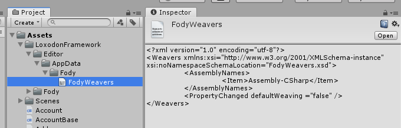

# Loxodon Framework Fody

 

[(English)](README.md)

*Developed by Clark*

Requires Unity 2018.4 or higher.

这是一个静态织入代码的工具，已将[Fody](https://github.com/Fody/Fody)整合到Unity项目中，可以利用Fody丰富的插件来简化代码，提高开发效率。目前我已经将[PropertyChanged.Fody](https://github.com/Fody/PropertyChanged)和[ToString.Fody](https://github.com/Fody/ToString)插件也发布为Unity的package.

[PropertyChanged.Fody](https://github.com/Fody/PropertyChanged)是一个注入INotifyPropertyChanged相关代码的插件，通过为ViewModel类Model类添加注解，自动生成"INotifyPropertyChanged"接口和相关的代码。关于[PropertyChanged.Fody](https://github.com/Fody/PropertyChanged)注解的使用请查看官方文档。

[ToString.Fody](https://github.com/Fody/ToString)能够为类自动生成ToString函数。只要类添加了[ToString]注解，就会重载类的ToString函数。

[BindingProxy.Fody](https://github.com/vovgou/BindingProxy) 为ViewModel静态织入字段、属性、方法的代理类，数据绑定时使用静态注入的代理类访问对象的属性和方法，优化调用的性能。

## 安装

### 从OpenUPM安装

[OpenUPM](https://openupm.com/) 中提供了很多的Unity插件，自动管理依赖，推荐从OpenUPM仓库安装本插件.

命令行方式安装，要求 [nodejs](https://nodejs.org/en/download/)'s npm and openupm-cli, 如果没有安装nodejs命令行环境请先安装nodejs。

    # Install openupm-cli,please ignore if it is already installed.
    npm install -g openupm-cli

    #Go to the root directory of your project
    cd F:/workspace/New Unity Project

    #Install loxodon-framework-fody-propertychanged
    openupm add com.vovgou.loxodon-framework-fody-propertychanged

    #Install loxodon-framework-fody-tostring
    openupm add com.vovgou.loxodon-framework-fody-tostring

    #Install loxodon-framework-fody-bindingproxy
    openupm add com.vovgou.loxodon-framework-fody-bindingproxy

### 通过修改 Packages/manifest.json 文件安装插件(推荐)

在Unity项目的Packages目录中找到manifest.json 文件，增加第三方仓库 "https://package.openupm.com"或者"https://registry.npmjs.org"到配置文件中，然后增加"com.vovgou.loxodon-framework-fody" 到dependencies节点下，Unity会自动下载插件，使用这种方式安装也相当方便，且省去了安装nodejs和openm-cli客户端的麻烦。

    {
      "dependencies": {
        ...
        "com.unity.modules.xr": "1.0.0",
        "com.vovgou.loxodon-framework-fody": "2.4.9",
        "com.vovgou.loxodon-framework-fody-propertychanged": "2.6.0",
        "com.vovgou.loxodon-framework-fody-tostring": "2.6.0",
        "com.vovgou.loxodon-framework-fody-bindingproxy": "2.6.0"
      },
      "scopedRegistries": [
        {
          "name": "package.openupm.com",
          "url": "https://package.openupm.com",
          "scopes": [
            "com.vovgou",
            "com.openupm"
          ]
        }
      ]
    }

## 快速开始

### [PropertyChanged.Fody](https://github.com/Fody/PropertyChanged)
插件导入到项目后，会在Assets\LoxodonFramework\Editor\AppData\Fody目录下自动生成FodyWeavers.xml文件。修改这个文件，添加需要织入代码的程序集名称即可。XML文件中的PropertyChanged节点是关于PropertyChanged.Fody插件的配置，具体可以查看[PropertyChanged.Fody](https://github.com/Fody/PropertyChanged/wiki/Options)的文档。

PropertyChanged默认会织入所有继承了INotifyPropertyChanged或者添加了AddINotifyPropertyChangedInterface注解的类，如果某个类不想被织入代码，可以使用DoNotNotify注解排除。老的项目引入此插件后，会导致所有已经添加了属性通知的ViewModel类再次被织入RaisePropertyChanged函数，造成重复触发通知事件的情况，因此我重写了PropertyChanged.Fody插件的部分方法，为xml配置文件PropertyChanged节点增加了一个属性defaultWeaving。当defaultWeaving=false时，只会为添加了AddINotifyPropertyChangedInterface注解的类织入通知代码，避免老的ViewModel类被重复的织入RaisePropertyChanged函数。

FodyWeavers.xml

    <Weavers xmlns:xsi="http://www.w3.org/2001/XMLSchema-instance" xsi:noNamespaceSchemaLocation="FodyWeavers.xsd">
		<AssemblyNames>
	  		<Item>Assembly-CSharp</Item>
		</AssemblyNames>
		<PropertyChanged defaultWeaving ="true" />
    </Weavers>

在项目中创建一个User类，添加注解"AddINotifyPropertyChangedInterface", 代码如下:

    [AddINotifyPropertyChangedInterface]
    public class User
    {
        public string FirstName { get; set; }

        public string LastName { get; set; }

        public string FullName => $"{FirstName} {LastName}";
    }

在代码被Unity编译后，PropertyChanged.Fody会自动织入INotifyPropertyChanged接口相关的代码，所有的属性都会增加RaisePropertyChanged或者OnPropertyChanged函数触发属性改变通知事件。使用ILSpy反编译工具打开Assembly-CSharp.dll程序集，User类的代码如下：

	public class User : INotifyPropertyChanged
	{
		public string FirstName
		{
			[CompilerGenerated]
			get
			{
				return FirstName;
			}
			[CompilerGenerated]
			set
			{
				if (!string.Equals(FirstName, value, StringComparison.Ordinal))
				{
					FirstName = value;
					<>OnPropertyChanged(<>PropertyChangedEventArgs.FullName);
					<>OnPropertyChanged(<>PropertyChangedEventArgs.FirstName);
				}
			}
		}

		public string LastName
		{
			[CompilerGenerated]
			get
			{
				return LastName;
			}
			[CompilerGenerated]
			set
			{
				if (!string.Equals(LastName, value, StringComparison.Ordinal))
				{
					LastName = value;
					<>OnPropertyChanged(<>PropertyChangedEventArgs.FullName);
					<>OnPropertyChanged(<>PropertyChangedEventArgs.LastName);
				}
			}
		}

		public string FullName => FirstName + " " + LastName;

		[field: NonSerialized]
		public event PropertyChangedEventHandler PropertyChanged;

		[GeneratedCode("PropertyChanged.Fody", "3.4.1.0")]
		[DebuggerNonUserCode]
		protected void <>OnPropertyChanged(PropertyChangedEventArgs eventArgs)
		{
			this.PropertyChanged?.Invoke(this, eventArgs);
		}
	}

### [ToString.Fody](https://github.com/Fody/ToString)

FodyWeavers.xml

    <Weavers xmlns:xsi="http://www.w3.org/2001/XMLSchema-instance" xsi:noNamespaceSchemaLocation="FodyWeavers.xsd">
		<AssemblyNames>
	  		<Item>Assembly-CSharp</Item>
		</AssemblyNames>
		<ToString />
    </Weavers>

User类代码如下，为User类添加[ToString]注解。

    [AddINotifyPropertyChangedInterface]
    [ToString]
    public class User
    {
        public string FirstName { get; set; }  

        public string LastName { get; set; }

        public string FullName => $"{FirstName} {LastName}";
    }

织入后的代码如下，自动生成了ToString函数。

	public string FirstName
	{
		[CompilerGenerated]
		get
		{
			return FirstName;
		}
		[CompilerGenerated]
		set
		{
			if (!string.Equals(FirstName, value, StringComparison.Ordinal))
			{
				FirstName = value;
				<>OnPropertyChanged(<>PropertyChangedEventArgs.FullName);
				<>OnPropertyChanged(<>PropertyChangedEventArgs.FirstName);
			}
		}
	}

	public string LastName
	{
		[CompilerGenerated]
		get
		{
			return LastName;
		}
		[CompilerGenerated]
		set
		{
			if (!string.Equals(LastName, value, StringComparison.Ordinal))
			{
				LastName = value;
				<>OnPropertyChanged(<>PropertyChangedEventArgs.FullName);
				<>OnPropertyChanged(<>PropertyChangedEventArgs.LastName);
			}
		}
	}

	public string FullName => FirstName + " " + LastName;

	[field: NonSerialized]
	public event PropertyChangedEventHandler PropertyChanged;

	[GeneratedCode("PropertyChanged.Fody", "4.0.2.0")]
	[DebuggerNonUserCode]
	protected void <>OnPropertyChanged(PropertyChangedEventArgs eventArgs)
	{
		this.PropertyChanged?.Invoke(this, eventArgs);
	}

	[GeneratedCode("Fody.ToString", "1.11.1.0")]
	[DebuggerNonUserCode]
	public override string ToString()
	{
		return string.Format(CultureInfo.InvariantCulture, "{T: 'User', FirstName: '{0}', LastName: '{1}', FullName: '{2}'}", new object[3]
		{
			FirstName ?? "null",
			LastName ?? "null",
			FullName ?? "null"
		});
	}

### [BindingProxy.Fody](https://github.com/vovgou/BindingProxy)

BindingProxy.Fody是一个性能优化组件，它可以为一个类的Property、Field和Method静态织入绑定代理类，在一些不允许JIT的平台上，可以绕过动态委托调用或者反射调用，达到直接调用Property、Field、Method的效果。 本插件仅会扫描所有继承了INotifyPropertyChanged接口的类，默认不会为类的Property和Field生成绑定代理对象（PropertyNodeProxy、FieldNodeProxy），但是可以通过修改FodyWeavers.xml配置文件中的defaultWeaveProperty ="true"   和defaultWeaveField="true"来改变默认值。但是对于Method，必须显示的为方法添加[GenerateMethodProxy]注解，才会织入方法代理类（MethodNodeProxy）。

#### 执行效率

在魅族18s pro真机测试结果：

- 直接调用100万次取值函数，耗时:0ms
- 静态注入方式调用100万次取值函数，耗时:2ms
- 动态委托方式调用100万次取值函数，耗时:11ms
- 反射方式调用100万次取值函数，耗时:545ms
- 直接调用100万次赋值函数，耗时:103ms
- 静态注入方式调用100万次赋值函数，耗时:114ms
- 动态委托方式调用100万次赋值函数，耗时:140ms
- 反射方式调用100万次赋值函数，耗时:934ms

测试代码

	using BindingProxy;
	using Loxodon.Framework.Binding.Proxy;
	using Loxodon.Framework.Binding.Proxy.Sources.Weaving;
	using Loxodon.Framework.Binding.Reflection;
	using Loxodon.Framework.Observables;
	using PropertyChanged;
	using System;
	using UnityEngine;
	
	public class PerformanceTest : MonoBehaviour
	{
	    [AddINotifyPropertyChangedInterface]
	    [GeneratePropertyProxy]
	    public class AccountViewModel : ObservableObject
	    {
	        public string FirstName { get; set; }
	
	        public string LastName { get; set; }
	
	        public string FullName => $"{FirstName} {LastName}";
	
	    }
	
	    void Start()
	    {
	        AccountViewModel account = new AccountViewModel();
	        account.FirstName = "Clark";
	
	        Type accountType = typeof(AccountViewModel);
	        IWovenNodeProxyFinder finder = account as IWovenNodeProxyFinder;
	        var sourceProxy = finder.GetSourceProxy("FirstName");
	        IObtainable<string> obtainable = (IObtainable<string>)sourceProxy;
	        IModifiable<string> modifiable = (IModifiable<string>)sourceProxy;
	
	        var proxyPropertyInfo = accountType.AsProxy().GetProperty("FirstName");
	        var propertyInfo = accountType.GetProperty("FirstName");
	
	        int n = 1000000;
	        System.Diagnostics.Stopwatch w = new System.Diagnostics.Stopwatch();
	        w.Start();
	        for (int i = 0; i < n; i++)
	        {
	            var v = account.FirstName;
	        }
	        w.Stop();
	        Debug.LogFormat("直接调用100万次取值函数，耗时:{0}ms", w.ElapsedMilliseconds);
	        w.Reset();
	        w.Start();
	        for (int i = 0; i < n; i++)
	        {
	            var v = obtainable.GetValue();
	        }
	        w.Stop();
	        Debug.LogFormat("静态注入方式调用100万次取值函数，耗时:{0}ms", w.ElapsedMilliseconds);
	
	        w.Reset();
	        w.Start();
	        for (int i = 0; i < n; i++)
	        {
	            var v = proxyPropertyInfo.GetValue(account);
	        }
	        w.Stop();
	        Debug.LogFormat("动态委托方式调用100万次取值函数，耗时:{0}ms", w.ElapsedMilliseconds);
	
	        w.Reset();
	        w.Start();
	        for (int i = 0; i < n; i++)
	        {
	            var v = propertyInfo.GetValue(account);
	        }
	        w.Stop();
	        Debug.LogFormat("反射方式调用100万次取值函数，耗时:{0}ms", w.ElapsedMilliseconds);
	
	        string value1 = "Clark1";
	        string value2 = "Clark2";
	        w.Reset();
	        w.Start();
	        for (int i = 0; i < n; i++)
	        {
	            account.FirstName = ((i & 0x1) == 0x1 ? value1 : value2);
	        }
	        w.Stop();
	        Debug.LogFormat("直接调用100万次赋值函数，耗时:{0}ms", w.ElapsedMilliseconds);
	
	        w.Reset();
	        w.Start();
	        for (int i = 0; i < n; i++)
	        {
	            modifiable.SetValue((i & 0x1) == 0x1 ? value1 : value2);
	        }
	        w.Stop();
	        Debug.LogFormat("静态注入方式调用100万次赋值函数，耗时:{0}ms", w.ElapsedMilliseconds);
	
	        w.Reset();
	        w.Start();
	        for (int i = 0; i < n; i++)
	        {
	            proxyPropertyInfo.SetValue(account, (i & 0x1) == 0x1 ? value1 : value2);
	        }
	        w.Stop();
	        Debug.LogFormat("动态委托方式调用100万次赋值函数，耗时:{0}ms", w.ElapsedMilliseconds);
	
	        w.Reset();
	        w.Start();
	        for (int i = 0; i < n; i++)
	        {
	            propertyInfo.SetValue(account, (i & 0x1) == 0x1 ? value1 : value2);
	        }
	        w.Stop();
	        Debug.LogFormat("反射方式调用100万次赋值函数，耗时:{0}ms", w.ElapsedMilliseconds);
	    }
	}

#### 配置文件

FodyWeavers.xml

    <Weavers xmlns:xsi="http://www.w3.org/2001/XMLSchema-instance" xsi:noNamespaceSchemaLocation="FodyWeavers.xsd">
		<AssemblyNames>
	  		<Item>Assembly-CSharp</Item>
		</AssemblyNames>
		<BindingProxy defaultWeaveProperty ="false"  defaultWeaveField="false" Debug="true"/>
    </Weavers>

#### 支持的注解类型
- GenerateFieldProxyAttribute

    在类上标注，则为整个类的所有public的field生成FieldNodeProxy对象。在Field上标注，则仅表示此字段需要生成FieldNodeProxy对象。

- GeneratePropertyProxyAttribute

    在类上标注，则为整个类的所有public的Property生成PropertyNodeProxy对象。在Property上标注，则仅表示此属性需要生成PropertyNodeProxy对象。

- GenerateMethodProxyAttribute

    只能在方法上标注，表示此方法需要生成MethodNodeProxy对象。

- IgnoreAttribute

    可以在类，属性、字段、方法上标注，表示忽略生成绑定代理对象。

### 注册绑定代理工厂

在绑定服务BindingServiceBundle启动时，将WovenNodeProxyFactory工厂注册到INodeProxyFactoryRegister中，WovenNodeProxyFactory的优先级要高于默认的UniversalNodeProxyFactory优先级（优先级0），可以设置为100。在创建绑定代理时即可使用WovenNodeProxyFactory创建本插件静态织入的代理对象，已达到优化性能的目的。

	ApplicationContext context = Context.GetApplicationContext();
    IServiceContainer container = context.GetContainer();

    /* Initialize the data binding service */
    BindingServiceBundle bundle = new BindingServiceBundle(context.GetContainer());
    bundle.Start();

    INodeProxyFactoryRegister nodeFactoryRegister = container.Resolve<INodeProxyFactoryRegister>();
    nodeFactoryRegister.Register(new WovenNodeProxyFactory(),100);//优先级设置为100即可

### 示例代码如下：

    //当defaultWeaveField ="true" 或者类添加GenerateFieldProxy注解，则会为类中所有public的Field生成FieldProxyNodeProxy类。
    [GenerateFieldProxy]
    //当defaultWeaveProperty ="true" 或者类添加GeneratePropertyProxy注解，则会为类中所有public的Property生成PropertyProxyNodeProxy类。
    [GeneratePropertyProxy]
    [AddINotifyPropertyChangedInterface]
    public class AccountViewModel : INotifyPropertyChanged
    {

        public event PropertyChangedEventHandler PropertyChanged;

        public string Mobile;

        public string FirstName { get; set; }

        public string LastName { get; protected set; }

        public string FullName => $"{FirstName} {LastName}";

        //忽略此属性，不生成属性绑定代理
        [Ignore]
        public int Age { get; set; }

        [GenerateMethodProxy]
        public void OnValueChanged()
        {
        }

        [GenerateMethodProxy]
        public void OnValueChanged(int value)
        {
        }
    }

插件会在Unity编译后为公共的字段、属性和标注了[GenerateMethodProxy]注解的方法自动织入代理类，比如FirstName属性，会自动生成一个FirstNamePropertyNodeProxy的类。除了代理类，还会为AccountViewModel类织入IWovenNodeProxyFinder的接口和实现，通过IWovenNodeProxyFinder接口的GetSourceProxy(name)函数，即可获得属性的代理实例。前文中的WovenNodeProxyFactory便是通过此函数来获得属性的代理。

织入后的代码如下：

	public class AccountViewModel : INotifyPropertyChanged, IWovenNodeProxyFinder
	{
		[GeneratedCode("BindingProxy.Fody", "1.0.0.0")]
		[DebuggerNonUserCode]
		[Preserve]
		private class MobileFieldNodeProxy : WovenFieldNodeProxy<AccountViewModel, string>
		{
			public MobileFieldNodeProxy(AccountViewModel source)
				: base(source)
			{
			}
	
			public override string GetValue()
			{
				return source.Mobile;
			}
	
			public override void SetValue(string value)
			{
				source.Mobile = value;
			}
		}
	
		[GeneratedCode("BindingProxy.Fody", "1.0.0.0")]
		[DebuggerNonUserCode]
		[Preserve]
		private class FirstNamePropertyNodeProxy : WovenPropertyNodeProxy<AccountViewModel, string>
		{
			public FirstNamePropertyNodeProxy(AccountViewModel source)
				: base(source)
			{
			}
	
			public override string GetValue()
			{
				return source.FirstName;
			}
	
			public override void SetValue(string value)
			{
				source.FirstName = value;
			}
		}
	
		[GeneratedCode("BindingProxy.Fody", "1.0.0.0")]
		[DebuggerNonUserCode]
		[Preserve]
		private class LastNamePropertyNodeProxy : WovenPropertyNodeProxy<AccountViewModel, string>
		{
			public LastNamePropertyNodeProxy(AccountViewModel source)
				: base(source)
			{
			}
	
			public override string GetValue()
			{
				return source.LastName;
			}
	
			public override void SetValue(string value)
			{
				throw new MemberAccessException("AccountViewModel.LastName is read-only or inaccessible.");
			}
		}
	
		[GeneratedCode("BindingProxy.Fody", "1.0.0.0")]
		[DebuggerNonUserCode]
		[Preserve]
		private class FullNamePropertyNodeProxy : WovenPropertyNodeProxy<AccountViewModel, string>
		{
			public FullNamePropertyNodeProxy(AccountViewModel source)
				: base(source)
			{
			}
	
			public override string GetValue()
			{
				return source.FullName;
			}
	
			public override void SetValue(string value)
			{
				throw new MemberAccessException("AccountViewModel.FullName is read-only or inaccessible.");
			}
		}
	
		[GeneratedCode("BindingProxy.Fody", "1.0.0.0")]
		[DebuggerNonUserCode]
		[Preserve]
		private class OnValueChangedMethodNodeProxy : WovenMethodNodeProxy<AccountViewModel>, IInvoker<int>
		{
			public OnValueChangedMethodNodeProxy(AccountViewModel source)
				: base(source)
			{
			}
	
			public object Invoke()
			{
				source.OnValueChanged();
				return null;
			}
	
			public object Invoke(int value)
			{
				source.OnValueChanged(value);
				return null;
			}
	
			public override object Invoke(params object[] args)
			{
				switch ((args != null) ? args.Length : 0)
				{
				case 0:
					return Invoke();
				case 1:
					return Invoke((int)args[0]);
				default:
					return null;
				}
			}
		}
	
		public string Mobile;
	
		[GeneratedCode("BindingProxy.Fody", "1.0.0.0")]
		private WovenNodeProxyFinder _finder;
	
		public string FirstName
		{
			[CompilerGenerated]
			get
			{
				return FirstName;
			}
			[CompilerGenerated]
			set
			{
				if (!string.Equals(FirstName, value, StringComparison.Ordinal))
				{
					FirstName = value;
					<>OnPropertyChanged(<>PropertyChangedEventArgs.FullName);
					<>OnPropertyChanged(<>PropertyChangedEventArgs.FirstName);
				}
			}
		}
	
		public string LastName
		{
			[CompilerGenerated]
			get
			{
				return LastName;
			}
			[CompilerGenerated]
			protected set
			{
				if (!string.Equals(LastName, value, StringComparison.Ordinal))
				{
					LastName = value;
					<>OnPropertyChanged(<>PropertyChangedEventArgs.FullName);
					<>OnPropertyChanged(<>PropertyChangedEventArgs.LastName);
				}
			}
		}
	
		public string FullName => FirstName + " " + LastName;
	
		public int Age
		{
			[CompilerGenerated]
			get
			{
				return Age;
			}
			[CompilerGenerated]
			set
			{
				if (Age != value)
				{
					Age = value;
					<>OnPropertyChanged(<>PropertyChangedEventArgs.Age);
				}
			}
		}
	
		public event PropertyChangedEventHandler PropertyChanged;
	
		public void OnValueChanged()
		{
		}
	
		public void OnValueChanged(int value)
		{
		}
	
		[GeneratedCode("PropertyChanged.Fody", "3.4.1.0")]
		[DebuggerNonUserCode]
		protected void <>OnPropertyChanged(PropertyChangedEventArgs eventArgs)
		{
			this.PropertyChanged?.Invoke(this, eventArgs);
		}
	
		[GeneratedCode("BindingProxy.Fody", "1.0.0.0")]
		[DebuggerNonUserCode]
		ISourceProxy IWovenNodeProxyFinder.GetSourceProxy(string name)
		{
			if (_finder == null)
			{
				_finder = new WovenNodeProxyFinder(this);
			}
			return _finder.GetSourceProxy(name);
		}
	}

## Contact Us
Email: [yangpc.china@gmail.com](mailto:yangpc.china@gmail.com)   
Website: [https://vovgou.github.io/loxodon-framework/](https://vovgou.github.io/loxodon-framework/)  
QQ Group: 622321589 
