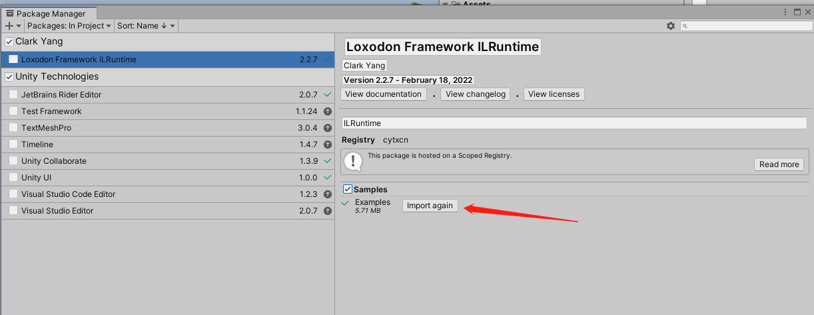
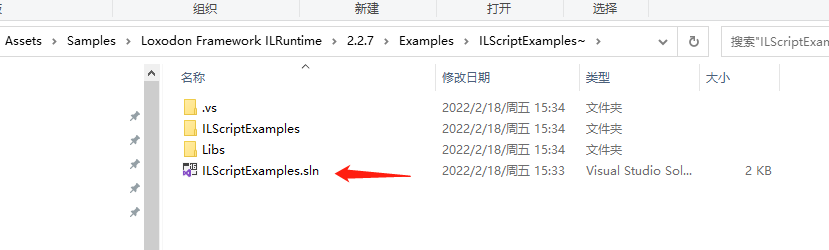
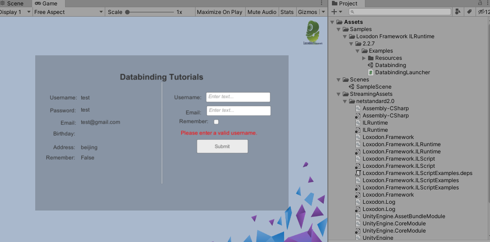

# Loxodon Framework ILRuntime

 

*Developed by Clark*

Requires Unity 2018.4 or higher.

This is a ILRuntime plugin for Loxodon.Framework.

## Installation

### Install via OpenUPM (recommended)

[OpenUPM](https://openupm.com/) can automatically manage dependencies, it is recommended to use it to install the framework.

Requires [nodejs](https://nodejs.org/en/download/)'s npm and openupm-cli, if not installed please install them first.

    # Install openupm-cli,please ignore if it is already installed.
    npm install -g openupm-cli

    #Go to the root directory of your project
    cd F:/workspace/New Unity Project

    #Install loxodon-framework-ilruntime
    openupm add com.vovgou.loxodon-framework-ilruntime

### Install via Packages/manifest.json

Modify the Packages/manifest.json file in your project, add the third-party repository "package.openupm.com"'s configuration and add "com.vovgou.loxodon-framework-addressable" in the "dependencies" node.

Installing the framework in this way does not require nodejs and openm-cli.

    {
      "dependencies": {
        ...
        "com.unity.modules.xr": "1.0.0",
        "com.vovgou.loxodon-framework-ilruntime": "2.2.7"
      },
      "scopedRegistries": [
        {
          "name": "package.openupm.com",
          "url": "https://package.openupm.com",
          "scopes": [
            "com.vovgou",
            "com.openupm"
          ]
        }
      ]
    }

### Install via git URL

After Unity 2019.3.4f1 that support path query parameter of git package. You can add https://github.com/vovgou/loxodon-framework.git?path=Loxodon.Framework/Assets/LoxodonFramework to Package Manager

Loxodon.Framework.ILRuntime depends on Loxodon.Framework, please install Loxodon.Framework first.

- Loxodon.Framework:  https://github.com/vovgou/loxodon-framework.git?path=Loxodon.Framework/Assets/LoxodonFramework

- Loxodon.Framework.ILRuntime: https://github.com/vovgou/loxodon-framework.git?path=Loxodon.Framework.ILRuntime/Assets/LoxodonFramework/ILRuntime

### Install via *.unitypackage file

Download Loxodon.Framework.unitypackage and Loxodon.Framework.ILRuntime.unitypackage, import them into your project.

- [Releases](https://github.com/vovgou/loxodon-framework/releases)

### Import the samples

 - Unity 2019 and later versions can import examples through Package Manager.

   
   
 - If the Editor is Unity 2018 version, please find Examples.unitypackage in the "Packages/Loxodon Framework ILRuntime/PackageResources/" folder, double-click to import into the project.
 - Find ILScriptExamples.sln according to the path in the figure below, open the project, compile and generate the DLL library to the StreamAssets directory.

   

 - Run the example

   

## Contact Us
Email: [yangpc.china@gmail.com](mailto:yangpc.china@gmail.com)   
Website: [https://vovgou.github.io/loxodon-framework/](https://vovgou.github.io/loxodon-framework/)  
QQ Group: 622321589 
