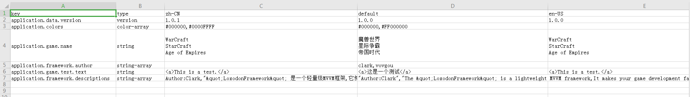

# Loxodon Framework Localization For CSV

 

*开发者 Clark*

要求Unity 2018.4 或者更高版本

框架的本地化模块默认支持XML文件格式和Asset文件格式，本插件主要是扩展了Localization模块的功能，支持使用CSV格式的本地化配置文件，配置文件格式如下。

- key：配置文件的key，不能为空，此列必须存在。
- type：配置文件值的类型，此列必须存在。如：字符串类型 string ，整形数组 int-array
- description:描述，可以为空，并且此列可以省略
- default：默认值，最好不要为空,如果此列不存在，则会使用值的第一列作为默认列
- zh:中文配置，zh取值自CultureInfo.TwoLetterISOLanguageName，如果字段为空则使用默认配置
- zh-CN：中国，简体中文配置,zh-CN取值自CultureInfo.Name，如果字段为空，则使用zh的配置

以上只有key列和type列是必须存在的，其他可以根据实际情况添加或者省略。

**关于值的本地化查询规则是根据System.Globalization.CultureInfo类的TwoLetterISOLanguageName和Name字段来查询的。
优先按CultureInfo.Name查询，如果不存在则使用CultureInfo.TwoLetterISOLanguageName查询，最后才会使用默认值，比如下图中，如果当前语言是zh-CN的话，优先使用zh-CN的配置，如果不存在zh-CN的列或者zh-CN配置为空，则使用zh列的配置，如果zh列不存在或者字段为空则使用默认列的配置。**

### 文件编码 ###

 如果文件中包含中文，请确保CSV文件使用UTF-8编码，否则在文件转换时可能出现乱码，使用WPS从excel文件导出为csv文件时，请重点检查编码格式是否为UTF-8编码(可以使用记事本或者EditPlus查看)。

### 支持的类型 ###

 默认支持以下所有类型和他们的数组类型，通过自定义类型转换器ITypeConverter，可以支持新的数据类型。基本数据类型如下，数组类型是在基本类型后添加后缀"-array",比如字符串的数组：string-array

| 基本类型(Type) | 默认值(Default Value) | 描述(Description) |
| :------| ------: | :------: |
| string | "" | 字符串类型 |
| boolean | false | 布尔值，flase或者true |
| sbyte | 0 | 有符号的byte，-127-128 |
| byte | 0 | 无符号byte，0-255 |
| short | 0 | short类型 |
| ushort | 0 | 无符号short类型 |
| int | 0 | 整型 |
| uint | 0 | 无符号整型 |
| long | 0 | 长整型 |
| ulong | 0 | 无符号长整型 |
| char | ‘’ | 字符类型 |
| float | 0 | 单精度浮点类型 |
| double | 0 | 双精度浮点类型 |
| decimal | 0 | 数字类型 |
| datetime | 1970-01-01T00:00:00 | 时间类型 |
| vector2 | (0,0) | Vector2类型,示例：(0,0) |
| vector3 | (0,0,0) | Vector3类型，示例：(0,0,0) |
| vector4 | (0,0,0) | Vector4类型，示例：(0,0,0,0)|
| color | #000000 | Color类型，示例：#FF0000 |

### 数组的表示 ###

CSV配置和XML配置一样，支持所有基本数据类型，支持单元格内换行符，唯一不同的是CSV文件中使用逗号分隔符来支持数组类型，如下表所示。

**注意：数组使用半角逗号分隔，在半角的双引号、单引号、小括号()、中括号[]、大括号{}、尖括号<>之间的逗号会被忽略，如数组的字符串中有逗号，请使用双引号或者单引号将字符串引起来,否则在数组分隔时会出错**

| key | type | us-EN |
| :------| ------: | :------: |
| usernames | string-array | tom,clark,kate |
| chars | string-array | "a,b,c","d,e,f","g,h,i" |
| positions | vector3-array | (0,1,1.2),(2,2,0),(1.3,0.5,5) |
| colors | color-array | #FF0000,#00FF00 |

### XML和CSV的相互转换 ###

XML的配置文件和CSV的配置文件可以相互转换，但是对于数组类型的配置需要注意，在CSV中是使用","分割的，而在XML中是<item>标识分割的，在<item></item>之间如果包含了","转换为csv文件格式时可能出错。

选择XML配置文件的根目录，右键选择Loxodon/Xml To Csv 命令，会自动将目录下的所有xml文件转换为csv格式的文件，XML中不同语言版本会合并到同一个csv文件中。同样，CSV文件也可以转换为XML文件，如果CSV文件中包含多个语言的配置版本，会被拆分成多个XML文件。

生成csv文件如下

### 文件示例 ###
CSV原文件

转换为XML文件格式后的中文本地化文件（魔兽世界、星际争霸、帝国时代后面的换行符仍然存在，只是不可见）。

## 安装

自Loxodon.Framework 2.0版本开始，保留了原有的 *.unitypackage包发布方式，同时添加了UPM发布方式，此版本要求Unity 2018.4.2及以上版本，框架的目录结构进行了一些调整，以符合UPM格式要求。

**安装注意：在中国区下载的Unity版本屏蔽了第三方仓库，会导致UPM包安装失败，咨询了Unity中国相关人员说是马上会放开，如果UPM方式安装失败请使用*.unitypackage文件安装或者使用非中国区的Unity版本**

### 使用 OpenUPM 安装(推荐)

[OpenUPM](https://openupm.com/) 是一个开源的UPM包仓库，它支持发布第三方的UPM包，它能够自动管理包的依赖关系，推荐使用它安装本框架.

通过openupm命令安装包,要求[nodejs](https://nodejs.org/en/download/) and openupm-cli客户端的支持，如果没有安装请先安装nodejs和open-cli。

    # 使用npm命令安装openupm-cli，如果已经安装请忽略.
    npm install -g openupm-cli

    #切换当前目录到项目的根目录
    cd F:/workspace/New Unity Project

    #安装 loxodon-framework
    openupm add com.vovgou.loxodon-framework-localization-csv

### 修改Packages/manifest.json文件安装

通过修改manifest.json文件安装，不需要安装nodejs和openupm-cli客户端。在Unity项目根目录下找到Packages/manifest.json文件，在文件的scopedRegistries（没有可以自己添加）节点下添加第三方仓库package.openupm.com的配置，同时在dependencies节点下添加com.vovgou.loxodon-framework和com.vovgou.loxodon-framework-localization-csv的配置，保存后切换到Unity窗口即可完成安装。

    {
      "dependencies": {
        ...
        "com.unity.modules.xr": "1.0.0",
        "com.vovgou.loxodon-framework-localization-csv": "2.0.0-preview"
      },
      "scopedRegistries": [
        {
          "name": "package.openupm.com",
          "url": "https://package.openupm.com",
          "scopes": [
            "com.vovgou.loxodon-framework-localization-csv",
            "com.vovgou.loxodon-framework",
            "com.openupm"
          ]
        }
      ]
    }

### 通过git URL安装

Unity 2019.3.4f1及以上版本支持使用git URL安装. 如下图添加 https://github.com/vovgou/loxodon-framework.git?path=Loxodon.Framework.LocalizationsForCsv/Assets/LoxodonFramework/LocalizationsForCsv 地址到UPM管理器，耐性等待一段时间，下载完成后即安装成功。

### 通过 *.unitypackage 文件安装

从以下地址下载 [Loxodon.Framework.LocalizationsForCsv2.x.x.unitypackage](https://github.com/vovgou/loxodon-framework/releases) 后,导入到你的项目中即完成安装.

- [Releases](https://github.com/vovgou/loxodon-framework/releases)

## 联系方式
邮箱: [yangpc.china@gmail.com](mailto:yangpc.china@gmail.com)   
网站: [https://vovgou.github.io/loxodon-framework/](https://vovgou.github.io/loxodon-framework/)  
QQ群: 622321589 
