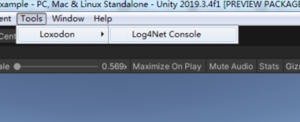

# Loxodon Framework Log4Net

 

*Developed by Clark*

Requires Unity 2018.4 or higher.

This is a plugin for the logging feature of Loxodon.Framework, which helps you use Log4Net in your Unity project.

For tutorials,examples and support,please see the project.You can also discuss the project in the Unity Forums.

The version is compatible with MacOSX,Windows,Linux,IOS and Android etc.

## Key features:
-  Full source code;
-  Receive remote logs over network protocols;
-  Multiple platforms;
-  Output to multiple logging targets;
-  XML Configuration;
-  Modular and extensible design;
-  High performance with flexibility;

## Installation

### Install via OpenUPM (recommended)

[OpenUPM](https://openupm.com/) can automatically manage dependencies, it is recommended to use it to install the framework.

Requires [nodejs](https://nodejs.org/en/download/)'s npm and openupm-cli, if not installed please install them first.

    # Install openupm-cli,please ignore if it is already installed.
    npm install -g openupm-cli

    #Go to the root directory of your project
    cd F:/workspace/New Unity Project

    #Install loxodon-framework-log4net
    openupm add com.vovgou.loxodon-framework-log4net

### Install via Packages/manifest.json

Modify the Packages/manifest.json file in your project, add the third-party repository "package.openupm.com"'s configuration and add "com.vovgou.loxodon-framework-log4net" in the "dependencies" node.

Installing the framework in this way does not require nodejs and openm-cli.

    {
      "dependencies": {
        ...
        "com.unity.modules.xr": "1.0.0",
        "com.vovgou.loxodon-framework-log4net": "2.0.1"
      },
      "scopedRegistries": [
        {
          "name": "package.openupm.com",
          "url": "https://package.openupm.com",
          "scopes": [
            "com.vovgou",
            "com.openupm"
          ]
        }
      ]
    }

### Install via git URL

After Unity 2019.3.4f1 that support path query parameter of git package. You can add https://github.com/vovgou/loxodon-framework.git?path=Loxodon.Framework/Assets/LoxodonFramework to Package Manager

Loxodon.Framework.Log4Net depends on Loxodon.Framework, please install Loxodon.Framework first.

- Loxodon.Framework:  https://github.com/vovgou/loxodon-framework.git?path=Loxodon.Framework/Assets/LoxodonFramework

- Loxodon.Framework.Log4Net: https://github.com/vovgou/loxodon-framework.git?path=Loxodon.Framework.Log4Net/Assets/LoxodonFramework/Log4Net

### Install via *.unitypackage file

Download Loxodon.Framework.unitypackage and Loxodon.Framework.Log4Net.unitypackage, import them into your project.

- [Releases](https://github.com/vovgou/loxodon-framework/releases)

## English manual

- [HTML](https://github.com/vovgou/loxodon-framework/blob/master/docs/LoxodonFramework_en.md)
- [PDF](https://github.com/vovgou/loxodon-framework/blob/master/docs/LoxodonFramework_en.pdf)

## Quick Start

Log4NetConfig.xml

    <?xml version="1.0" encoding="utf-8"?>
    <configuration>
    	<log4net>
    		<root>
    			<level value="DEBUG" />
    			<appender-ref ref="Console" />
    			<appender-ref ref="File" />
    			<appender-ref ref="UdpAppender" />
    		</root>
    		<appender name="Console" type="Loxodon.Log.Log4Net.Appender.UnityDebugAppender">
    		  <layout type="log4net.Layout.PatternLayout">
            		<conversionPattern value="%date Thread[%thread] %-5level %logger - %message%newline" />
        		</layout>
    		</appender>
    		<appender name="File" type="Loxodon.Log.Log4Net.Appender.UnityFileAppender">
        		<file type="log4net.Util.PatternString" value="Unity-%date{yyyy-MM-dd_HH-mm-ss}.log" />
        		<appendToFile value="true" />
        		<layout type="log4net.Layout.PatternLayout">
            		<conversionPattern value="%date Thread[%thread] %-5level %logger - %message%newline" />
        		</layout>
    		</appender>
    		<appender name="UdpAppender" type="Loxodon.Log.Log4Net.Appender.UnityUdpRemotingAppender">
    			<localPort value="9000" />
    			<remoteAddress value="127.0.0.1" />
    			<remotePort value="8085" />
    			<filter type="log4net.Filter.LevelRangeFilter">
    			  <param name="LevelMin" value="DEBUG" />
    			  <param name="LevelMax" value="FATAL" />
    			</filter>
    		</appender>
    	</log4net>
    </configuration>

Read Log4Net configuration file and create LogFactory.

    public class Log4NetManager : MonoBehaviour
    {
        void Awake()
        {
            InitializeLog();
            DontDestroyOnLoad(this.gameObject);
        }

        protected void InitializeLog()
        {
            /* Initialize the log4net */
            string configFilename = "Log4NetConfig";
            TextAsset configText = Resources.Load<TextAsset>(configFilename);
            if (configText != null)
            {
                using (MemoryStream memStream = new MemoryStream(configText.bytes))
                {
                    log4net.Config.XmlConfigurator.Configure(memStream);
                }
            }

            /* Initialize the Loxodon.Log.LogManager */
            LogManager.Registry(new Log4NetFactory());
        }

        void OnDestroy()
        {
            log4net.LogManager.Shutdown();
        }
    }

Usage example.

    public class Log4NetExample : MonoBehaviour
    {
        private ILog log;
        void Start()
        {
            log = LogManager.GetLogger(typeof(Log4NetExample));

            log.Debug("This is a debug test.");
        }
    }

Open a Console in menu: Tools/Loxodon/Log4Net Console   

## Contact Us
Email: [yangpc.china@gmail.com](mailto:yangpc.china@gmail.com)   
Website: [https://vovgou.github.io/loxodon-framework/](https://vovgou.github.io/loxodon-framework/)  
QQ Group: 622321589 
