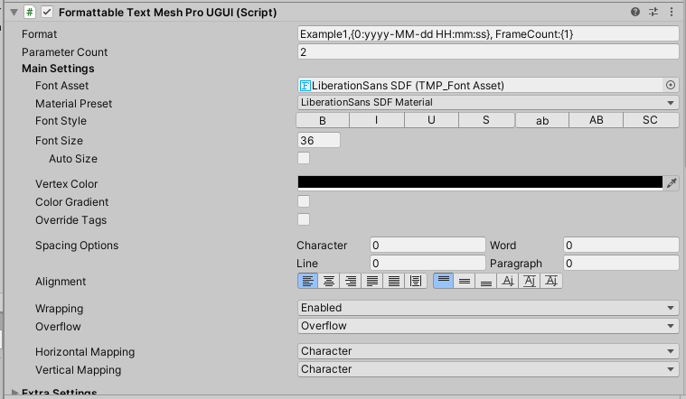
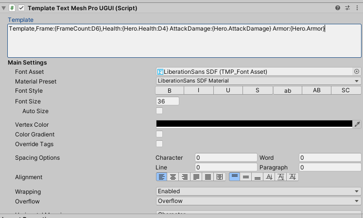

# Loxodon Framework TextMeshPro

 

[(中文版)](README_CN.md)

*Developed by Clark*

Requires Unity 2021.3 or higher.

This plugin primarily serves to enhance AlertDialog and Toast views by providing TextMeshPro support, replacing UnityEngine.UI.Text with TextMeshProUGUI for optimized UI views.

Additionally, the plugin depends on the Loxodon.Framework.TextFormatting plugin, further optimizing garbage collection. By utilizing FormattableTextMeshProUGUI and TemplateTextMeshProUGUI controls, updating UI views results in absolutely no garbage collection (GC), achieving a fully GC-free view update.

## Installation

### Install via OpenUPM (recommended)

[OpenUPM](https://openupm.com/) can automatically manage dependencies, it is recommended to use it to install the framework.

Requires [nodejs](https://nodejs.org/en/download/)'s npm and openupm-cli, if not installed please install them first.

    # Install openupm-cli,please ignore if it is already installed.
    npm install -g openupm-cli

    #Go to the root directory of your project
    cd F:/workspace/New Unity Project

    #Install loxodon-framework-textmeshpro
    openupm add com.vovgou.loxodon-framework-textmeshpro

### Install via Packages/manifest.json

Modify the Packages/manifest.json file in your project, add the third-party repository "package.openupm.com"'s configuration and add "com.vovgou.loxodon-framework-textmeshpro" in the "dependencies" node.

Installing the framework in this way does not require nodejs and openm-cli.

    {
      "dependencies": {
        ...
        "com.vovgou.loxodon-framework-textmeshpro": "2.6.2"
      },
      "scopedRegistries": [
        {
          "name": "package.openupm.com",
          "url": "https://package.openupm.com",
          "scopes": [
            "com.vovgou",
            "com.openupm"
          ]
        }
      ]
    }

## Quick Start

### FormattableTextMeshProUGUI

This control supports string formatting and data binding. The AsParameters<>() function of the FormattableTextMeshProUGUI control can convert to a set of generic parameters, accommodating 1-4 different parameters or a generic array. It enables binding with a ViewModel. With this plugin, string and array concatenation are garbage collection (GC)-free. Additionally, updating the TextMeshPro control with a StringBuilder doesn't require a ToString(), allowing for a completely GC-free update of text on the UI.

	public class FormattableTextMeshProUGUIExample : MonoBehaviour
    {
        public FormattableTextMeshProUGUI paramBinding1;
        
        private ExampleViewModel viewModel;

        private void Start()
        {
            ApplicationContext context = Context.GetApplicationContext();
            IServiceContainer container = context.GetContainer();
            BindingServiceBundle bundle = new BindingServiceBundle(context.GetContainer());
            bundle.Start();
            
            BindingSet<FormattableTextMeshProUGUIExample, ExampleViewModel> bindingSet = this.CreateBindingSet<FormattableTextMeshProUGUIExample, ExampleViewModel>();

            //Create a parameter collection using AsParameters<P1, P2, ...>(). It supports 1-4 parameters 
            //without the need for value type boxing/unboxing or string concatenation, ensuring a GC-free 
            //experience. For testing the 0GC effect on a mobile device, if testing in Unity Editor, please 
            //modify the source code of the TextMeshPro plugin by removing any code related to 
            //StringBuilder.ToString() in the functions TMP_Text.SetText and TMP_Text.StringBuilderToIntArray.
            //format:The format follows the same formatting parameters as string.Format(), for example: DateTime - Example1, {0:yyyy-MM-dd HH:mm:ss}, FrameCount: {1}
            bindingSet.Bind(paramBinding1.AsParameters<DateTime, int>()).For(v => v.Parameter1).To(vm => vm.Time);
            bindingSet.Bind(paramBinding1.AsParameters<DateTime, int>()).For(v => v.Parameter2).To(vm => vm.FrameCount);            
            bindingSet.Build();

            this.viewModel = new ExampleViewModel();
            this.viewModel.Time = DateTime.Now;
            this.viewModel.FrameCount = 1;
            this.SetDataContext(this.viewModel);
        }
    }

### TemplateTextMeshProUGUI

This control surpasses the capabilities of a formatted text control, offering enhanced functionality and user-friendliness. It supports binding a ViewModel object or sub-object to the TemplateTextMeshProUGUI.Data property. The template control comes with built-in path resolution and data binding features, automatically binding properties from the Data object using the text template. Similarly, updating the UI using this control incurs zero garbage collection.

Template Format: Template, Frame: {FrameCount:D6}, Health: {Hero.Health:D4}, AttackDamage: {Hero.AttackDamage}, Armor: {Hero.Armor}

Here, FrameCount and Hero are properties bound to the Data object, while Health, AttackDamage, and Armor are properties of the Hero object. The D6 after FrameCount represents a numeric format parameter for frame count.

	public class FormattableTextMeshProUGUIExample : MonoBehaviour
    {
        public FormattableTextMeshProUGUI paramBinding1;
        public GenericParameters<DateTime, int> paramBinding2;
        public FormattableTextMeshProUGUI arrayBinding;
        public TemplateTextMeshProUGUI template;

        private ExampleViewModel viewModel;

        private void Start()
        {
            ApplicationContext context = Context.GetApplicationContext();
            IServiceContainer container = context.GetContainer();
            BindingServiceBundle bundle = new BindingServiceBundle(context.GetContainer());
            bundle.Start();
            
            BindingSet<FormattableTextMeshProUGUIExample, ExampleViewModel> bindingSet = this.CreateBindingSet<FormattableTextMeshProUGUIExample, ExampleViewModel>();

            bindingSet.Bind(paramBinding1.AsParameters<DateTime, int>()).For(v => v.Parameter1).To(vm => vm.Time);
            bindingSet.Bind(paramBinding1.AsParameters<DateTime, int>()).For(v => v.Parameter2).To(vm => vm.FrameCount);

            //format:Example2,{0:yyyy-MM-dd HH:mm:ss}, FrameCount:{1}
            bindingSet.Bind(paramBinding2).For(v => v.Parameter1).To(vm => vm.Time);
            bindingSet.Bind(paramBinding2).For(v => v.Parameter2).To(vm => vm.FrameCount);

            //AsArray<T>() 
            bindingSet.Bind(arrayBinding.AsArray<float>()).For(v => v[0]).To(vm => vm.Hero.MoveSpeed);
            bindingSet.Bind(arrayBinding.AsArray<float>()).For(v => v[1]).To(vm => vm.Hero.AttackSpeed);

            bindingSet.Bind(template).For(v => v.Template).To(vm => vm.Template);
            bindingSet.Bind(template).For(v => v.Data).To(vm => vm);
            bindingSet.Build();

            this.viewModel = new ExampleViewModel();
            this.viewModel.Template = "Template,Frame:{FrameCount:D6},Health:{Hero.Health:D4} AttackDamage:{Hero.AttackDamage} Armor:{Hero.Armor}";
            this.viewModel.Time = DateTime.Now;
            this.viewModel.TimeSpan = TimeSpan.FromSeconds(0);
            this.viewModel.Hero = new Hero();
            this.SetDataContext(this.viewModel);
        }

        void Update()
        {
            viewModel.Time = DateTime.Now;
            viewModel.FrameCount = Time.frameCount;
            viewModel.Hero.Health = (Time.frameCount % 1000) / 10;
        }
    }

    public class ExampleViewModel : ObservableObject
    {
        private DateTime time;
        private TimeSpan timeSpan;
        private string template;
        private int frameCount;
        private Hero hero;
        public DateTime Time
        {
            get { return this.time; }
            set { this.Set(ref time, value); }
        }

        public TimeSpan TimeSpan
        {
            get { return this.timeSpan; }
            set { this.Set(ref timeSpan, value); }
        }

        public int FrameCount
        {
            get { return this.frameCount; }
            set { this.Set(ref frameCount, value); }
        }

        public string Template
        {
            get { return this.template; }
            set { this.Set(ref template, value); }
        }

        public Hero Hero
        {
            get { return this.hero; }
            set { this.Set(ref hero, value); }
        }
    }

    public class Hero : ObservableObject
    {
        private float attackSpeed = 95.5f;
        private float moveSpeed = 2.4f;
        private int health = 100;
        private int attackDamage = 20;
        private int armor = 30;

        public float AttackSpeed
        {
            get { return this.attackSpeed; }
            set { this.Set(ref attackSpeed, value); }
        }

        public float MoveSpeed
        {
            get { return this.moveSpeed; }
            set { this.Set(ref moveSpeed, value); }
        }

        public int Health
        {
            get { return this.health; }
            set { this.Set(ref health, value); }
        }

        public int AttackDamage
        {
            get { return this.attackDamage; }
            set { this.Set(ref attackDamage, value); }
        }

        public int Armor
        {
            get { return this.armor; }
            set { this.Set(ref armor, value); }
        }

    }

## Contact Us
Email: [yangpc.china@gmail.com](mailto:yangpc.china@gmail.com)   
Website: [https://vovgou.github.io/loxodon-framework/](https://vovgou.github.io/loxodon-framework/)  
QQ Group: 622321589 
