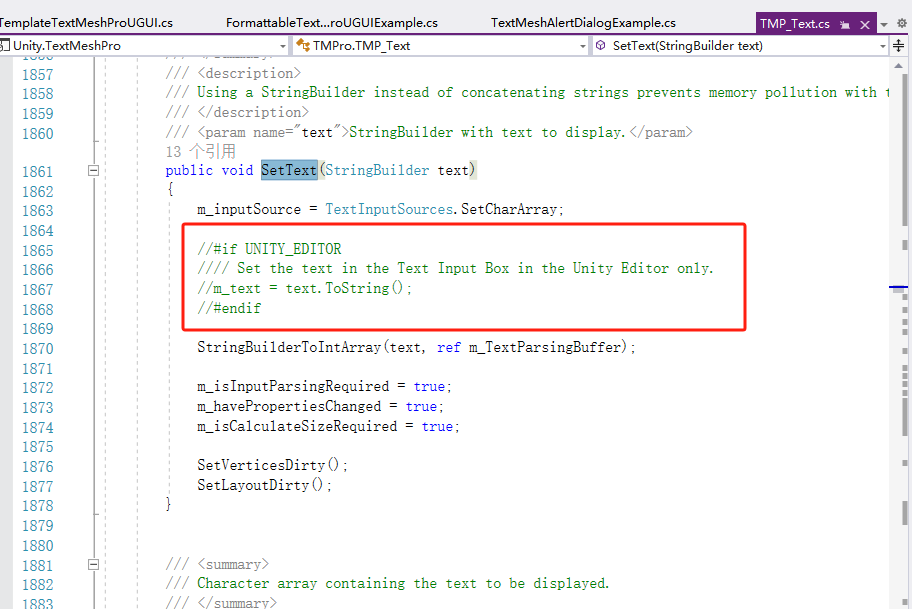
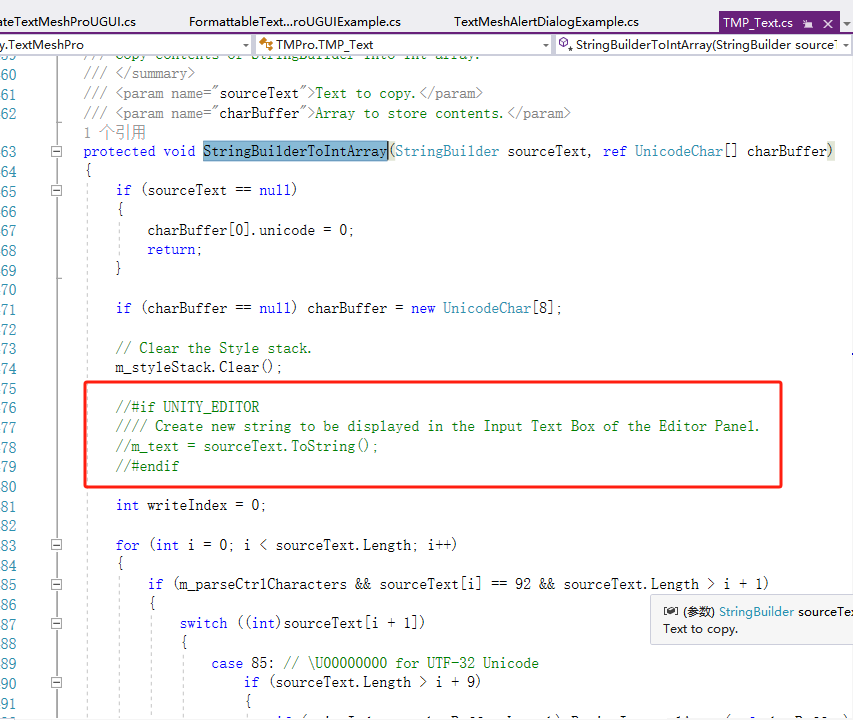
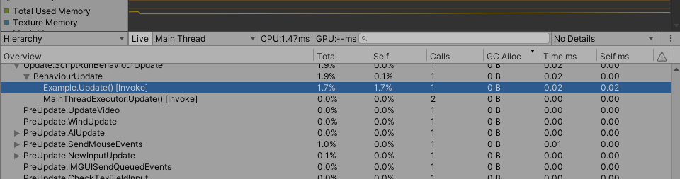

# Loxodon Framework TextMeshPro

 

[(English)](README.md)

*开发者 Clark*

要求Unity 2021.3 或者更高版本

这个插件主要作用是为AlertDialog和Toast视图提供TextMeshPro的支持，使用TextMeshProUGUI代替UnityEngine.UI.Text，来优化UI视图。

此外此插件依赖Loxodon.Framework.TextFormatting插件，进一步优化了垃圾收集，使用FormattableTextMeshProUGUI和TemplateTextMeshProUGUI控件更新UI视图完全不会产生垃圾回收(GC)，完全做到0GC更新视图。

## 安装

### 使用 OpenUPM 安装(推荐)

[OpenUPM](https://openupm.com/) 是一个开源的UPM包仓库，它支持发布第三方的UPM包，它能够自动管理包的依赖关系，推荐使用它安装本框架.

通过openupm命令安装包,要求[nodejs](https://nodejs.org/en/download/) and openupm-cli客户端的支持，如果没有安装请先安装nodejs和open-cli。

    # 使用npm命令安装openupm-cli，如果已经安装请忽略.
    npm install -g openupm-cli

    #切换当前目录到项目的根目录
    cd F:/workspace/New Unity Project

    #安装 loxodon-framework-textmeshpro
    openupm add com.vovgou.loxodon-framework-textmeshpro

### 修改Packages/manifest.json文件安装

通过修改manifest.json文件安装，不需要安装nodejs和openupm-cli客户端。在Unity项目根目录下找到Packages/manifest.json文件，在文件的scopedRegistries（没有可以自己添加）节点下添加第三方仓库package.openupm.com的配置，同时在dependencies节点下添加com.vovgou.loxodon-framework-textmeshpro的配置，保存后切换到Unity窗口即可完成安装。

    {
      "dependencies": {
        ...
        "com.unity.modules.xr": "1.0.0",
        "com.vovgou.loxodon-framework-textmeshpro": "2.6.2"
      },
      "scopedRegistries": [
        {
          "name": "package.openupm.com",
          "url": "https://package.openupm.com",
          "scopes": [
            "com.vovgou",
            "com.openupm"
          ]
        }
      ]
    }

## 快速开始

### 注意:请在手机测试0GC效果，如果在Editor下测试，需要修改一下TextMeshPro的源代码。

请注掉下图中的两处ToString()

### 格式化字符串

  本插件扩展了StringBuilder的AppendFormat<>()函数。支持多个不同类型的泛型参数或者泛型数组参数，当这些参数为数字类型、DateTime、TimeSpan等值类型时，没有装箱拆箱，数字类型转为String类型进行字符串拼接时没有GC。同时可以支持数组类型、DateTime类型，TimeSpan类型的字符串格式化操作（format的格式与C#官方完全一致，具体可以查阅C#文档），使用方式见下面的示例。

	using System;
	using System.Text;
	using UnityEngine;
	using Loxodon.Framework.TextFormatting;//必须先引入这个包名
	public class Example : MonoBehaviour
	{
	    StringBuilder builder = new StringBuilder();
	    void Update()
	    {
	        builder.Clear();
	        builder.AppendFormat<DateTime,int>("Now:{0:yyyy-MM-dd HH:mm:ss} Frame:{0:D6}", DateTime.Now,Time.frameCount);
	        builder.AppendFormat<float>("{0:f2}", Time.realtimeSinceStartup);       
	    }	    
	}

### 支持格式化的文本控件(FormattableTextMeshProUGUI)

此控件支持字符串格式化功能，支持数据绑定，FormattableTextMeshProUGUI控件的AsParameters<>()函数可以转为一个泛型参数集，支持1-4个不同参数，也可以支持一个泛型数组，通过泛型参数集和ViewModel进行绑定。使用这个插件，字符串和数组拼接是无GC的，StringBuilder也无需ToString()就可以更新TextMeshPro控件，所以可以做到完全0GC更新UI上的文本。

	public class FormattableTextMeshProUGUIExample : MonoBehaviour
    {
        public FormattableTextMeshProUGUI paramBinding1;//参数绑定示例1，支持1-4个不同参数
        
        private ExampleViewModel viewModel;

        private void Start()
        {
            ApplicationContext context = Context.GetApplicationContext();
            IServiceContainer container = context.GetContainer();
            BindingServiceBundle bundle = new BindingServiceBundle(context.GetContainer());
            bundle.Start();
            
            BindingSet<FormattableTextMeshProUGUIExample, ExampleViewModel> bindingSet = this.CreateBindingSet<FormattableTextMeshProUGUIExample, ExampleViewModel>();

            // 使用AsParameters<P1,P2,...>() 创建一个参数集合，它支持1-4个参数，没有值对象的装箱拆箱，没有字符串拼接，没有垃圾回收(GC)
            //（请在手机上测试0GC效果。如果要在UnityEditor下测，请修改TextMeshPro插件的源码，将TMP_Text.SetText和TMP_Text.StringBuilderToIntArray
            // 函数中有关StringBuilder.ToString()的代码删除）
            // format:格式与string.Format()的格式化参数相同如：DateTime:Example1,{0:yyyy-MM-dd HH:mm:ss}, FrameCount:{1}
            bindingSet.Bind(paramBinding1.AsParameters<DateTime, int>()).For(v => v.Parameter1).To(vm => vm.Time);
            bindingSet.Bind(paramBinding1.AsParameters<DateTime, int>()).For(v => v.Parameter2).To(vm => vm.FrameCount);            
            bindingSet.Build();

            this.viewModel = new ExampleViewModel();
            this.viewModel.Time = DateTime.Now;
            this.viewModel.FrameCount = 1;
            this.SetDataContext(this.viewModel);
        }
    }

### 文本模版控件（TemplateTextMeshProUGUI)

这个控件比格式化文本控件更强大，更好用，支持将一个ViewModel对象或者子对象绑定到TemplateTextMeshProUGUI.Data属性，模版控件内置了路径解析和数据绑定功能，能自动通过文本模板来绑定Data对象中的属性。同样使用这个控件更新UI也是0GC的。

模版格式：Template,Frame:{FrameCount:D6},Health:{Hero.Health:D4} AttackDamage:{Hero.AttackDamage} Armor:{Hero.Armor}

其中FrameCount、Hero是绑定到Data的对象的属性。Health、AttackDamage、Armor是Hero对象的属性。FrameCount后面的D6是帧数这个数字类型的格式化参数。

	public class FormattableTextMeshProUGUIExample : MonoBehaviour
    {
        public FormattableTextMeshProUGUI paramBinding1;//参数绑定示例1，支持1-4个不同参数
        public GenericParameters<DateTime, int> paramBinding2;//参数绑定的另外一种方式，支持1-4个不同参数
        public FormattableTextMeshProUGUI arrayBinding;//也可以使用 ArrayParameters<float>
        public TemplateTextMeshProUGUI template;//模版绑定

        private ExampleViewModel viewModel;

        private void Start()
        {
            ApplicationContext context = Context.GetApplicationContext();
            IServiceContainer container = context.GetContainer();
            BindingServiceBundle bundle = new BindingServiceBundle(context.GetContainer());
            bundle.Start();
            
            BindingSet<FormattableTextMeshProUGUIExample, ExampleViewModel> bindingSet = this.CreateBindingSet<FormattableTextMeshProUGUIExample, ExampleViewModel>();

            //使用AsParameters<P1,P2,...>() 函数创建一个参数集合，然后绑定，支持1-4个参数，没有值对象的装箱拆箱，没有字符串拼接，无GC（请在手机上测试，Editor下需要修改TMP_Text.SetText和TMP_Text.StringBuilderToIntArray的源码，关闭调试代码）
            //format:格式与string.Format()的格式化参数相同如：DateTime:Example1,{0:yyyy-MM-dd HH:mm:ss}, FrameCount:{1}
            bindingSet.Bind(paramBinding1.AsParameters<DateTime, int>()).For(v => v.Parameter1).To(vm => vm.Time);
            bindingSet.Bind(paramBinding1.AsParameters<DateTime, int>()).For(v => v.Parameter2).To(vm => vm.FrameCount);

            //本质上与上面的例子是相同的，只是另外一种用法
            //format:Example2,{0:yyyy-MM-dd HH:mm:ss}, FrameCount:{1}
            bindingSet.Bind(paramBinding2).For(v => v.Parameter1).To(vm => vm.Time);
            bindingSet.Bind(paramBinding2).For(v => v.Parameter2).To(vm => vm.FrameCount);

            //使用AsArray<T>() 获得一个数组然后进行绑定，支持多个类型相同的参数，没有值对象的装箱拆箱，没有字符串拼接，无GC（请在手机上测试，Editor下需要修改TMP_Text.SetText和TMP_Text.StringBuilderToIntArray的源码，关闭调试代码）
            //format:MoveSpeed:{0:f4}  AttackSpeed:{1:f2}
            bindingSet.Bind(arrayBinding.AsArray<float>()).For(v => v[0]).To(vm => vm.Hero.MoveSpeed);
            bindingSet.Bind(arrayBinding.AsArray<float>()).For(v => v[1]).To(vm => vm.Hero.AttackSpeed);

            //使用文本模版（TemplateTextMeshProUGUI）绑定，直接将一个对象绑定到模板的Data属性上即可。
            //文本模版格式与string.Format类似，仅需要将{0},{1}中的数字，替换为对象属性名即可
            //template text：当前时间：{Time:yyyy-MM-dd HH:mm:ss} 
            bindingSet.Bind(template).For(v => v.Template).To(vm => vm.Template);//模版可以绑定，也可以在编辑器上配置
            bindingSet.Bind(template).For(v => v.Data).To(vm => vm);
            bindingSet.Build();

            this.viewModel = new ExampleViewModel();
            this.viewModel.Template = "Template,Frame:{FrameCount:D6},Health:{Hero.Health:D4} AttackDamage:{Hero.AttackDamage} Armor:{Hero.Armor}";
            this.viewModel.Time = DateTime.Now;
            this.viewModel.TimeSpan = TimeSpan.FromSeconds(0);
            this.viewModel.Hero = new Hero();
            this.SetDataContext(this.viewModel);
        }

        void Update()
        {
            viewModel.Time = DateTime.Now;
            viewModel.FrameCount = Time.frameCount;
            viewModel.Hero.Health = (Time.frameCount % 1000) / 10;
        }
    }

    public class ExampleViewModel : ObservableObject
    {
        private DateTime time;
        private TimeSpan timeSpan;
        private string template;
        private int frameCount;
        private Hero hero;
        public DateTime Time
        {
            get { return this.time; }
            set { this.Set(ref time, value); }
        }

        public TimeSpan TimeSpan
        {
            get { return this.timeSpan; }
            set { this.Set(ref timeSpan, value); }
        }

        public int FrameCount
        {
            get { return this.frameCount; }
            set { this.Set(ref frameCount, value); }
        }

        public string Template
        {
            get { return this.template; }
            set { this.Set(ref template, value); }
        }

        public Hero Hero
        {
            get { return this.hero; }
            set { this.Set(ref hero, value); }
        }
    }

    public class Hero : ObservableObject
    {
        private float attackSpeed = 95.5f;
        private float moveSpeed = 2.4f;
        private int health = 100;
        private int attackDamage = 20;
        private int armor = 30;

        public float AttackSpeed
        {
            get { return this.attackSpeed; }
            set { this.Set(ref attackSpeed, value); }
        }

        public float MoveSpeed
        {
            get { return this.moveSpeed; }
            set { this.Set(ref moveSpeed, value); }
        }

        public int Health
        {
            get { return this.health; }
            set { this.Set(ref health, value); }
        }

        public int AttackDamage
        {
            get { return this.attackDamage; }
            set { this.Set(ref attackDamage, value); }
        }

        public int Armor
        {
            get { return this.armor; }
            set { this.Set(ref armor, value); }
        }

    }

## 联系方式
邮箱: [yangpc.china@gmail.com](mailto:yangpc.china@gmail.com)   
网站: [https://vovgou.github.io/loxodon-framework/](https://vovgou.github.io/loxodon-framework/)  
QQ群: 622321589 
