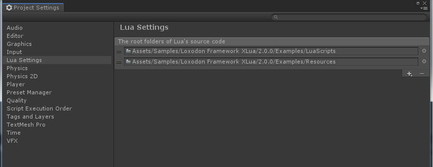
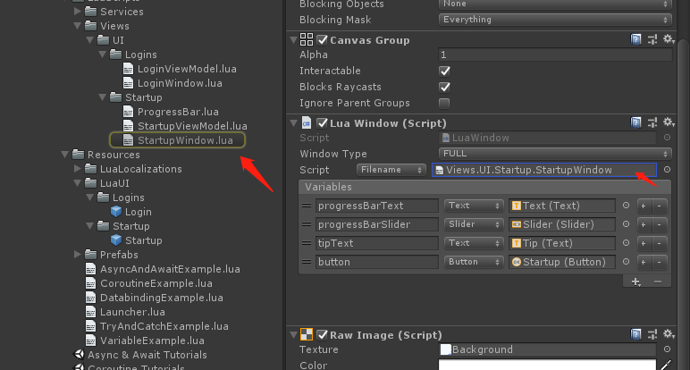
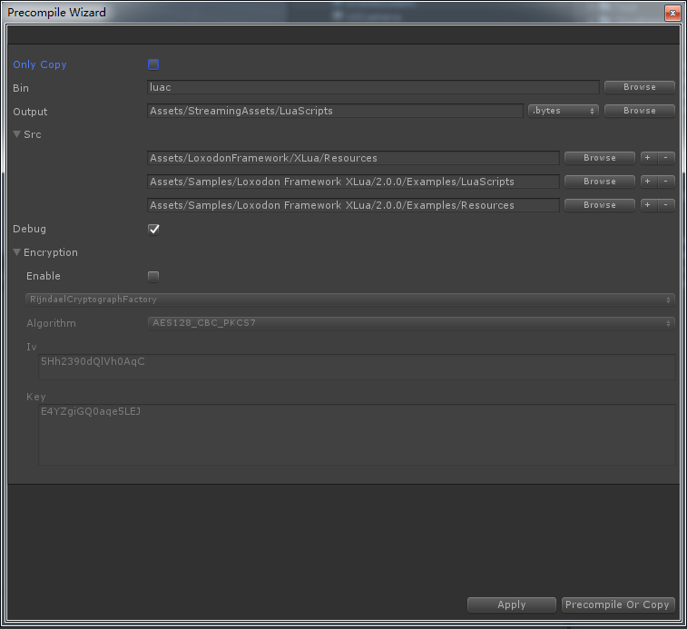

# Loxodon Framework XLua

 

**要求Unity 2018.4 或者更高版本**

Loxodon.Framework框架的XLua插件，它是一个lua的MVVM框架，支持lua和c#混合编程或者也可以完全使用lua来编写您的整个游戏。

## 要求 ##

[Loxodon Framework](https://github.com/vovgou/loxodon-framework)

本项目作为Loxodon.Framework插件，必须在Loxodon.Framework环境下使用，请在安装使用前先安装Loxodon.Framework框架。

## Quick start ##

1. If [Loxodon.Framework 2.0](https://github.com/vovgou/loxodon-framework/blob/master/README.md) is not installed, please install it first.

2. You can download the latest version of xlua from Xlua's Github repository,the file name is usually xlua_v2.x.xx.zip, unzip and copy it to your project.[XLua Download](https://github.com/Tencent/xLua/releases)  
        
3. Download [Loxodon.Framework.XLua.unitypackage](https://github.com/vovgou/loxodon-framework/releases) from github and import it into your Unity project.

4. **In Unity2018 and above, if you use .net 4.x and .net standard 2.0, there will be compatibility issues. Please see the xlua's FAQs.** [XLua FAQ](https://github.com/Tencent/xLua/blob/master/Assets/XLua/Doc/Faq_EN.md) 

5. Find Examples.unitypackage in the "Assets/LoxodonFramework/XLua/Package Resources" folder and import it into the project.

## 安装教程 ##

1. 从Xlua的Github仓库下载最新版的XLua，可以使用源码版本Source code.zip或者xlua_v2.x.xx.zip版本（建议使用xlua_v2.x.xx.zip版本，避免命XLua目录下测试类导致的类名冲突）。将下载好的xlua解压缩，拷贝到项目中。**注意：Unity2018请使用.net3.5,否则会出错，如果想使用.net4.6请参考xlua的FQA解决兼容性问题。**[XLua FAQ](https://github.com/Tencent/xLua/blob/master/Assets/XLua/Doc/faq.md) [下载XLua](https://github.com/Tencent/xLua/releases) 
        
2. 从Github下载[Loxodon.Framework.XLua.unitypackage](https://github.com/vovgou/loxodon-framework/releases)，并导入到项目中。如果出现编译错误，请检查是否导入了XLua的Examples目录，这个目录下的InvokeLua.cs文件定义了PropertyChangedEventArgs类，因没有使用命名空间，会导致和System.ComponentModel.PropertyChangedEventArgs类冲突，请删除XLua目录下的Examples文件夹或者给InvokeLua.cs文件中的PropertyChangedEventArgs类添加上命名空间。

3.如果需要导入示例，请在"Assets/LoxodonFramework/XLua/PackageResources"文件夹下找到Examples.unitypackage，双击导入项目。

## Lua Async

### async & await

async是一个函数，async只能有一个输入参数，而且必须是一个函数，async将输入的函数包装为一个lua协程，返回值是一个被包装后的函数。async的输入函数可以是有参数的，也可以是无参数的函数，函数可以有一个或者多个返回值，也可以无返回值。

await同样也是一个函数，await函数的输入参数必须是一个AsyncTask对象，或者是任何一个实现了GetAwaiter()函数的异步结果，不管是C#的对象还是lua对象都支持，所以无论是C#的Task、UniTask还是Unity的异步结果，都可以作为await的输入参数。await函数会监听异步结果的回调，同时挂起当前协程，当异步任务完成，回调后会触发协程继续执行。await同样支持无返回值，单个返回值或者多个返回值的异步结果。

async & await函数定义在AsyncTask模块中，只要在lua文件中通过require导入AsyncTask模块，即可使用

下面请看示例，将下面的lua类挂在LuaBehaviour上，通过LuaBehaviour自动调用start函数。

    require("framework.System")     
    local AsyncTask = require("framework.AsyncTask") --导入AsyncTask模块，同时导入了 async、await、try 函数

    local M=class("Example",target)    

    --定义position函数，输入参数是xyz，返回AsyncTask异步对象
    --async支持多个返回值的函数
    M.position = async(function(x,y,z)
		return x/1000.0,y/1000.0,z/1000.0
	end)
	
    M.start = async(function(self)		
		await(AsyncTask.Delay(1000)) --Delay 1000 milliseconds
		
		local x,y,z = await(M.position(1200,500,240)) --异步调用position函数，返回x,y,z
		
		printf("x=%s y=%s z=%s",x,y,z)		
		
		--异步调用Resources.LoadAsync
		local goTemplate = await(CS.UnityEngine.Resources.LoadAsync("Prefabs/Cube",typeof(CS.UnityEngine.GameObject)))
		
		local go = GameObject.Instantiate(goTemplate)
		
		go.transform.localPosition = CS.UnityEngine.Vector3.zero;
	end)

### C# 调用Lua的async函数

在C#运行时，我实现了ILuaTask接口，在C#方可以很方便的将AsyncTask对象自动转换为ILuaTask对象，方便C#调用。

如上示例中的M.start函数，执行start()将会返回一个AsyncTask的lua对象，请看下面的C#调用代码。

    public class LuaBehaviour : MonoBehaviour, ILuaExtendable
    {
        protected LuaTable metatable;
        protected Func<MonoBehaviour, ILuaTask> onStart;

        protected virtual void Awake()
        {
            ...
            
            metatable = (LuaTable)result[0];
            //调用lua的start函数，此函数可以是async包装的异步函数，也可以是普通函数
            onStart = metatable.Get<Func<MonoBehaviour, ILuaTask>>("start");
        }

        protected virtual async void Start()
        {
            if (onStart != null)
            {
                //start是async包装的异步函数则会返回ILuaTask对象，否则返回null
                ILuaTask task = onStart(this);
                if (task != null)
                    await task;
            }
        }
    }

### try / catch / finally

为配合async和await的使用，使用try函数包装了lua的xpcall函数，以方便在lua函数中捕获异常。

try函数的输入参数一个lua表，起结构如下，t[0]是主函数，t.catch是catch函数，t.finally是finally函数

	{
		function()	
			--这是主函数
		end,
		catch=function(e)
			--这是catch函数
		end,
		finally =function()
			--这是finally函数
		end			
	}
	
try/catch的示例

    local position = async(function(x,y,z)
    
        --try 实际是一个函数，如果需要返回值则在try之前加return，否则不需要加return
    
		return try{
			function()	
				--这是主函数
				error("This a test,throw an exception")				
				return x/1000.0,y/1000.0,z/1000.0
			end,
			catch=function(e)
				--这是catch函数
				printf("Catch exception:%s",e)
				return 0,0,0 --发生异常，返回默认值
			end,
			finally =function()
				--这是finally函数
				print("Execute the finally block")
			end			
		}		
	end)
	
## LuaBehaviour's ScriptReference

LuaBehaviour对象挂载Lua脚本支持两种方式，TextAsset方式和Filename方式，TextAsset方式挂载的Lua脚本会随Prefab一起打包到AssetBundle中，如果要更新脚本则必须和Prefab对象一起更新，而Filename则不会，仅仅只是在Prefab对象中存储了一个字符串，在LuaBehaviour初始化时通过这个字符串动态加载lua脚本，正式生产环境，建议使用Filename方式挂载脚本。

新版本的ScriptReference支持自动生成Filename，在Editor/Project Settings/Lua Settings界面，配置好Lua源代码的根目录后（可以配置多个目录），只要将目录下的Lua文件拖放到LuaBehaviour上，则会自动生成Filename，并且可以在TextAsset和Filename类型之间随意切换。

 

 

## Lua 预编译工具 ##

使用Lua预编译工具可以将Lua脚本预编译为字节码文件，并且可以选择是否加密该文件。Lua官方的luac命令编译的字节码分64位和32位，如果想编译64位和32位兼容的字节码，请参考XLua的官方文件，有关通用字节码编译的部分[《通用字节码》](https://github.com/Tencent/xLua/blob/master/Assets/XLua/Doc/compatible_bytecode.md)。

- Only Copy:勾选这个选择，只拷贝源文件到目标文件夹中，不会预编译Lua代码，但同样可以加密和修改文件名。开发阶段请勾选此项，避免预编译因为版本等不兼容问题导致的麻烦。
- Bin:luac命令的路径，如果要编译64位或者32位或者两者相兼容的字节码，请选择对应的luac命令。
- Output：编译后的字节码文件的存储目录。可以选择Assets下面的某个目录，统一打包为一个AssetBundle，也可以选择StreamingAssets下的某个目录，直接从StreamingAssets文件夹中加载。预编译后的字节码文件的扩展名可以选择".luac"或者".bytes"，也可以自定义其他的扩展名。
- Src：lua源代码的根目录，支持多个源代码目录。源代码文件扩展名必须是".lua"或者".lua.txt"。
- Encryption：加密功能，默认支持AES加密方式，也可以自己扩展新的加密方式，加密部分的面板是动态的，扩展了新的加密方式，会自动显示在工具的界面中。
- Apply：保存设置
- Precompile Or Copy：预编译或者拷贝Lua脚本

### Lua加载器 ###

- FileLoader 文件加载
    
    文件加载器，支持从本地文件夹加载Lua脚本或者Lua字节码文件，同时也支持从Android的apk或者obb中加载文件，所以如果你的lua源代码或者字节码文件存放在StreamingAssets文件夹中，在Android平台也能够正确加载。
    
- AssetBundleLoader 加载器
    
    支持从AssetBundle中加载lua脚本或者字节码，一般来说建议将所有的lua字节码都放在同一个AssetBundle中，在游戏启动时加载到内存，配置AssetBundleLoader加载器，优先从这个AssetBundle中加载lua代码。

- DecodableLoader 可解码的加载器

    可解码的加载器，它配合文件加载器或者AssetBundle加载器一起使用，对二进制数据进行解密。

### 示例 ###

在下面的示例中，在Editor模式，通过FileLoader从Assets/LuaScripts/目录中加载扩展名为".lua.txt"或者".lua"的lua文件。在真机模式，则通过FileLoader从Application.persistentDataPath + "/LuaScripts/"目录加载lua字节码文件，如果没有找到则搜索Application.streamingAssetsPath + "/LuaScripts/"目录，并且使用DecodableLoader加载器进行解密。

**在LuaEnv中可以添加多个加载器，后加入的加载器优先级高于先加入的加载器。**

    var luaEnv = LuaEnvironment.LuaEnv;

    #if UNITY_EDITOR
        //开发模式，从本地目录加载lua源码
        luaEnv.AddLoader(new FileLoader(Application.dataPath + "/LuaScripts/", ".lua"));
        luaEnv.AddLoader(new FileLoader(Application.dataPath + "/LuaScripts/", ".lua.txt"));
    #else
        //真机模式，从persistentDataPath或者streamingAssetsPath目录加载lua的bytecode.
        var key = Encoding.ASCII.GetBytes("E4YZgiGQ0aqe5LEJ");
        var iv = Encoding.ASCII.GetBytes("5Hh2390dQlVh0AqC");
        var decryptor = new RijndaelCryptograph(128,key, iv);
        
        var loader1 = new FileLoader(Application.streamingAssetsPath + "/LuaScripts/", ".bytes");
        luaEnv.AddLoader(new DecodableLoader(loader1, decryptor));
        
        var loader2 = new FileLoader(Application.persistentDataPath + "/LuaScripts/", ".bytes");
        luaEnv.AddLoader(new DecodableLoader(loader2, decryptor));
    #endif
    
### 扩展其他加密方式 ###

继承Loxodon.Framework.Security.Cryptography.IDecryptor和Loxodon.Framework.Security.Cryptography.IEncryptor接口创建加密解密器，具体实现可以参考RijndaelCryptograph类的源代码。 

继承Loxodon.Framework.XLua.Editors.EncryptorFactory类可以为新的加密器创建一个工厂类，将加密需要的参数作为类的成员变量定义在类中，并标识字段为可序列化，即添加"SerializeField"属性。，这样预编译工具可以自动搜索到这个类，并为它创建一个编辑界面。具体实现请参考RijndaelCryptographFactory类。

比如添加如下代码，则可以在编辑界面看到如图中所示的界面

    public class ExampleCryptographFactory : EncryptorFactory
    {
        [Multiline(2)]
        [SerializeField]
        private string privateKey;

        [Multiline(5)]
        [SerializeField]
        private string publicKey;

        public override IEncryptor Create()
        {
            throw new NotImplementedException();
        }
    }
    

## 联系方式
邮箱: [yangpc.china@gmail.com](mailto:yangpc.china@gmail.com)   
网站: [https://vovgou.github.io/loxodon-framework/](https://vovgou.github.io/loxodon-framework/)  
QQ群: 622321589 
