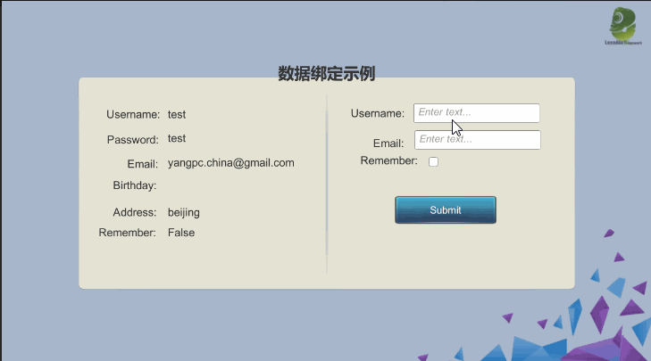
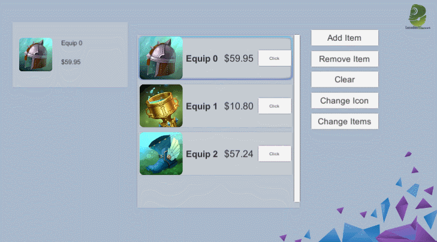
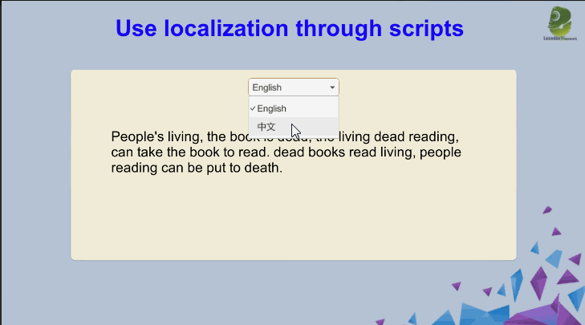
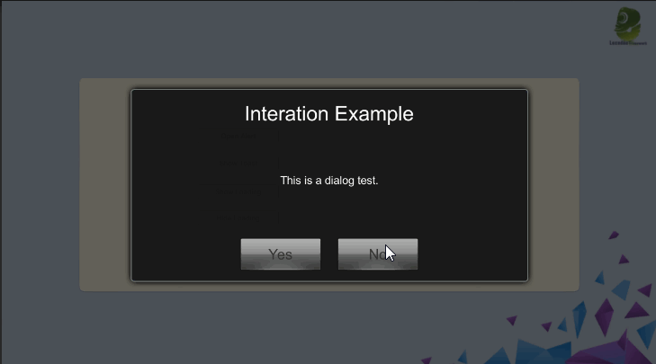
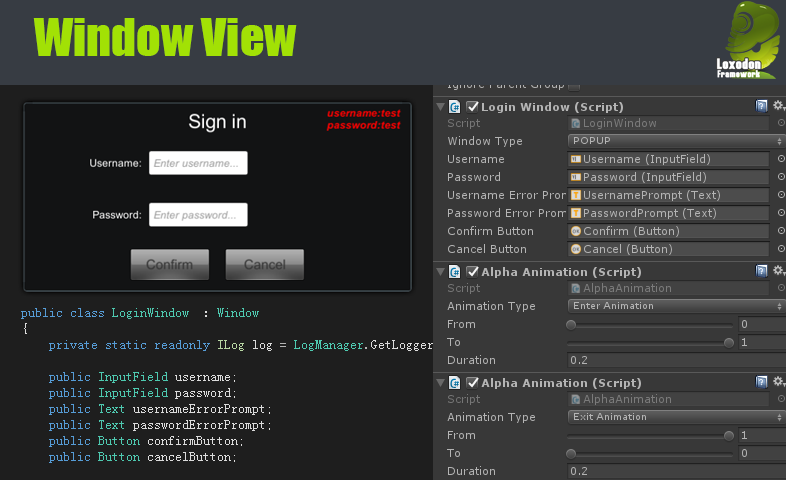
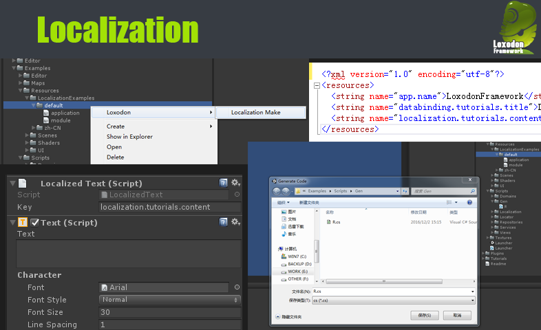
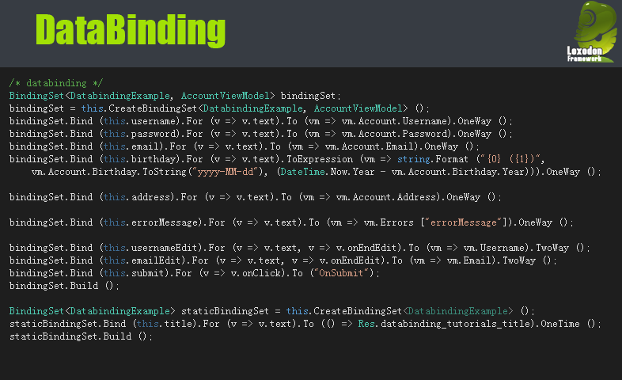
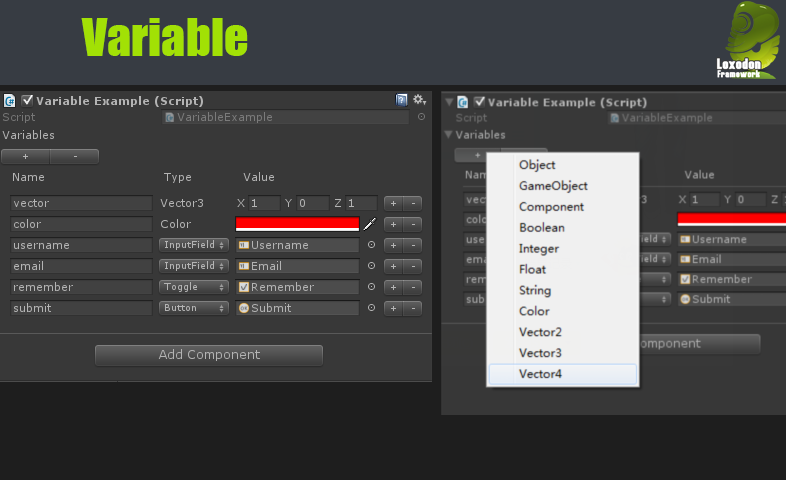

# Loxodon Framework(Unity-MVVM)

[(中文版)](README_CN.md)

**MVVM and Databinding for Unity3d(C# & XLua & ILRuntime)**

*Developed by Clark*

Requires Unity 2018.4 or higher.

LoxodonFramework is a lightweight MVVM(Model-View-ViewModel) framework built specifically to target Unity3D.
Databinding and localization are supported.It has a very flexible extensibility.It makes your game development faster and easier.

For tutorials,examples and support,please see the project.You can also discuss the project in the Unity Forums.

The plugin is compatible with MacOSX,Windows,Linux,UWP,WebGL,IOS and Android,and provides all the source code of the project.

If you like this framework or think it is useful, please write a review on [AssetStore](https://assetstore.unity.com/packages/tools/gui/loxodon-framework-2-0-178583#reviews) or give me a STAR or FORK it on Github, thank you!

**Tested in Unity 3D on the following platforms:**  
PC/Mac/Linux  
IOS  
Android  
UWP(window10)  
WebGL  

## Installation

For detailed installation steps, please refer to the **[installation documentation](Installation.md)**.

## English manual

- [HTML](https://github.com/vovgou/loxodon-framework/blob/master/docs/LoxodonFramework_en.md)
- [PDF](https://github.com/vovgou/loxodon-framework/blob/master/docs/LoxodonFramework_en.pdf)

## Key Features:
- MVVM Framework;
- Multiple platforms;
- Higher Extensibility;
- async&await (C#&Lua)
- try&catch&finally for lua
- XLua support(You can make your game in lua.);
- Asynchronous result and asynchronous task are supported;
- Scheduled Executor and Multi-threading; 
- Messaging system support;
- Preferences can be encrypted;
- Localization support;
- Databinding support:
    - Field binding;
    - Property binding;
    - Dictionary,list and array binding;
    - Event binding;
    - Unity3d's EventBase binding;
    - Static property and field binding;
    - Method binding;
    - Command binding;
    - ObservableProperty,ObservableDictionary and ObservableList binding;
    - Expression binding;

## Notes  
- .Net2.0 and .Net2.0 Subset,please use version 1.9.x.
- LoxodonFramework 2.0 supports .Net4.x and .Net Standard2.0  
- LoxodonFramework 2.0 supports Mono and IL2CPP 

## Plugins
- [Loxodon Framework OSA](https://github.com/vovgou/loxodon-framework?path=Loxodon.Framework.OSA)

- [Loxodon Framework TextMeshPro](https://github.com/vovgou/loxodon-framework?path=Loxodon.Framework.TextMeshPro) 

- [Loxodon Framework Data](https://github.com/vovgou/loxodon-framework?path=Loxodon.Framework.Data)

- [Loxodon Framework Fody](https://github.com/vovgou/loxodon-framework?path=Loxodon.Framework.Fody)

    - [Loxodon.Framework.Fody.PropertyChanged](https://github.com/vovgou/loxodon-framework?path=Loxodon.Framework.Fody/Packages/com.vovgou.loxodon-framework-fody-propertychanged)
    - [Loxodon.Framework.Fody.ToString](https://github.com/vovgou/loxodon-framework?path=Loxodon.Framework.Fody/Packages/com.vovgou.loxodon-framework-fody-tostring)
    - [Loxodon.Framework.Fody.BindingProxy](https://github.com/vovgou/loxodon-framework?path=Loxodon.Framework.Fody/Packages/com.vovgou.loxodon-framework-fody-bindingproxy)
    

- [Loxodon Framework UIToolkit](https://github.com/vovgou/loxodon-framework?path=Loxodon.Framework.UIToolkit)

- [Loxodon Framework ILRuntime](https://github.com/vovgou/loxodon-framework?path=Loxodon.Framework.ILRuntime)

- [Loxodon Framework Localization For CSV](https://github.com/vovgou/loxodon-framework?path=Loxodon.Framework.LocalizationsForCsv)

    It supports localization files in csv format, requires Unity2018.4 or higher.

- [Loxodon Framework XLua](https://github.com/vovgou/loxodon-framework?path=Loxodon.Framework.XLua)

    It supports making games with lua scripts.

- [Loxodon Framework Bundle](https://assetstore.unity.com/packages/slug/87419)

    Loxodon Framework Bundle is an AssetBundle manager.It provides a functionality that can automatically manage/load an AssetBundle and its dependencies from local or remote location.Asset Dependency Management including BundleManifest that keep track of every AssetBundle and all of their dependencies. An AssetBundle Simulation Mode which allows for iterative testing of AssetBundles in a the Unity editor without ever building an AssetBundle.

    The asset redundancy analyzer can help you find the redundant assets included in the AssetsBundles.Create a fingerprint for the asset by collecting the characteristic data of the asset. Find out the redundant assets in all AssetBundles by fingerprint comparison.it only supports the AssetBundle of Unity 5.6 or higher.

    

- [Loxodon Framework Log4Net](https://github.com/vovgou/loxodon-framework?path=Loxodon.Framework.Log4Net)

    This is a log plugin.It helps you to use Log4Net in the Unity3d.

    

- [Loxodon Framework Obfuscation](https://github.com/vovgou/loxodon-framework?path=Loxodon.Framework.Obfuscation)

    **NOTE:Please enable "Allow unsafe Code"**

    

    **Example:**

		ObfuscatedInt  length = 200;
		ObfuscatedFloat scale = 20.5f;
		int offset = 30;
		
		float value = (length * scale) + offset;

- [Loxodon Framework Addressable](https://github.com/vovgou/loxodon-framework?path=Loxodon.Framework.Addressable)

- [Loxodon Framework Connection](https://github.com/vovgou/loxodon-framework?path=Loxodon.Framework.Connection)

    This is a network connection component, implemented using TcpClient, supports IPV6 and IPV4, automatically recognizes the current network when connecting with a domain name, and preferentially connects to the IPV4 network.

- [DotNetty for Unity](https://github.com/vovgou/DotNettyForUnity)

    DotNetty is a port of [Netty](https://github.com/netty/netty), asynchronous event-driven network application framework for rapid development of maintainable high performance protocol servers & clients.

    This version is modified based on [DotNetty](https://github.com/Azure/DotNetty)'s 0.7.2 version and is a customized version for the Unity development platform. It removes some dependent libraries and passes the test under IL2CPP.

- [LiteDB](https://github.com/mbdavid/LiteDB)

    LiteDB is a small, fast and lightweight NoSQL embedded database.

    

## Quick Start

Create a view and view model of the progress bar.

    public class ProgressBarViewModel : ViewModelBase
    {
        private string tip;
        private bool enabled;
        private float value;
        public ProgressBarViewModel()
        {
        }

        public string Tip
        {
            get { return this.tip; }
            set { this.Set<string>(ref this.tip, value, nameof(Tip)); }
        }

        public bool Enabled
        {
            get { return this.enabled; }
            set { this.Set<bool>(ref this.enabled, value, nameof(Enabled)); }
        }

        public float Value
        {
            get { return this.value; }
            set { this.Set<float>(ref this.value, value, nameof(Value)); }
        }
    }

    public class ProgressBarView : UIView
    {
        public GameObject progressBar;
        public Text progressTip;
        public Text progressText;
        public Slider progressSlider;

        protected override void Awake()
        {
            var bindingSet = this.CreateBindingSet<ProgressBar, ProgressBarViewModel>();

            bindingSet.Bind(this.progressBar).For(v => v.activeSelf).To(vm => vm.Enabled).OneWay();
            bindingSet.Bind(this.progressTip).For(v => v.text).To(vm => vm.Tip).OneWay();
            bindingSet.Bind(this.progressText).For(v => v.text)
                .ToExpression(vm => string.Format("{0:0.00}%", vm.Value * 100)).OneWay();
            bindingSet.Bind(this.progressSlider).For(v => v.value).To(vm => vm.Value).OneWay();

            bindingSet.Build();
        }
    }

    IEnumerator Unzip(ProgressBarViewModel progressBar)
    {
        progressBar.Tip = "Unziping";
        progressBar.Enabled = true;//Display the progress bar

        for(int i=0;i<30;i++)
        {            
            //TODO:Add unzip code here.

            progressBar.Value = (i/(float)30);            
            yield return null;
        }

        progressBar.Enabled = false;//Hide the progress bar
        progressBar.Tip = "";        
    }

## Tutorials and Examples

 

 

 

 

## Introduction
- Window View

  
- Localization

  
- Databinding

  
- Variable Example

  
- ListView Binding

  

## Contact Us
Email: [yangpc.china@gmail.com](mailto:yangpc.china@gmail.com)   
Website: [https://vovgou.github.io/loxodon-framework/](https://vovgou.github.io/loxodon-framework/)  
QQ Group: 622321589 15034148
