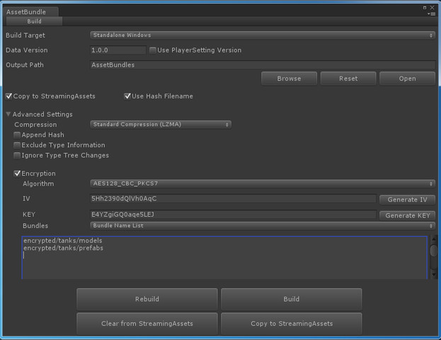
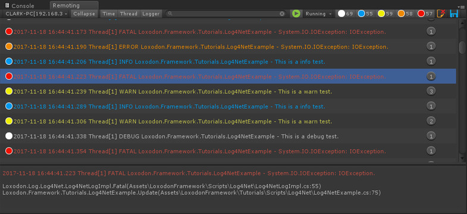
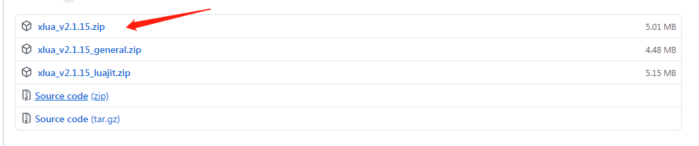
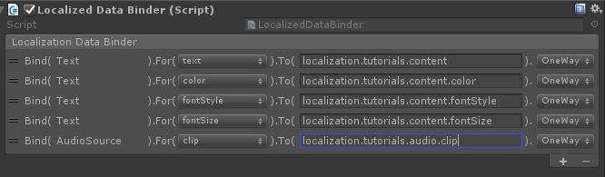
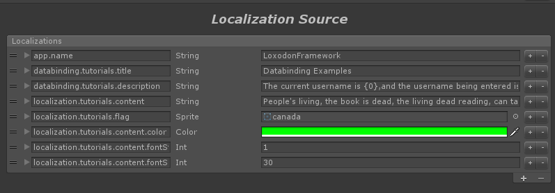

<!--
---
puppeteer:
    landscape: false
    format: "A3"
    timeout: 3000 # <= 特殊设置，意味着等待（waitFor） 3000 毫秒
---
-->

# Loxodon Framework

*MVVM Framework for Unity3D(C# & XLua & ILRuntime)*

*开发者 Clark*
*Version 2.0.0*

目录
---

<!-- @import "[TOC]" {cmd="toc" depthFrom=2 depthTo=6 orderedList=false} -->
<!-- code_chunk_output -->

- [概述](#概述)
- [安装](#安装)
  - [1.x.x版本升级到2.0注意事项](#1xx版本升级到20注意事项)
  - [使用 OpenUPM 安装(推荐)](#使用-openupm-安装推荐)
  - [修改Packages/manifest.json文件安装](#修改packagesmanifestjson文件安装)
  - [通过git URL安装](#通过git-url安装)
  - [通过 *.unitypackage 文件安装](#通过-unitypackage-文件安装)
  - [导入示例](#导入示例)
- [官方插件（可选）](#官方插件可选)
- [Lua插件安装（可选）](#lua插件安装可选)
  - [安装XLua](#安装xlua)
  - [导入Lua插件](#导入lua插件)
  - [导入示例](#导入示例-1)
- [快速入门](#快速入门)
  - [C# 示例](#c-示例)
  - [Lua 示例](#lua-示例)
- [功能介绍](#功能介绍)
  - [上下文（Context）](#上下文context)
    - [应用上下文（ApplicationContext）](#应用上下文applicationcontext)
    - [玩家上下文（PlayerContext）](#玩家上下文playercontext)
    - [其它上下文（Context）](#其它上下文context)
  - [服务容器](#服务容器)
    - [服务注册器(IServiceRegistry)](#服务注册器iserviceregistry)
    - [服务定位器(IServiceLocator)](#服务定位器iservicelocator)
    - [服务Bundle(IServiceBundle)](#服务bundleiservicebundle)
  - [应用配置（Preference）](#应用配置preference)
  - [配置文件（Properties文件）](#配置文件properties文件)
    - [支持的数值类型](#支持的数值类型)
    - [数组分隔符](#数组分隔符)
    - [配置文件的组合](#配置文件的组合)
    - [配置文件的子集](#配置文件的子集)
    - [配置文件示例](#配置文件示例)
  - [国际化和本地化](#国际化和本地化)
    - [目录结构](#目录结构)
    - [配置文件的格式](#配置文件的格式)
    - [XML特殊字符](#xml特殊字符)
    - [XML支持的数值类型](#xml支持的数值类型)
    - [生成C#脚本](#生成c脚本)
    - [本地化视图组件](#本地化视图组件)
    - [本地化数据绑定器(LocalizedDataBinder)](#本地化数据绑定器localizeddatabinder)
    - [数据提供器(IDataProvider)](#数据提供器idataprovider)
    - [获得设备的当前语言](#获得设备的当前语言)
    - [使用示例](#使用示例)
    - [支持CSV格式的本地化插件](#支持csv格式的本地化插件)
  - [日志系统](#日志系统)
  - [StreamingAssets目录文件读取（Android）](#streamingassets目录文件读取android)
  - [线程/协程异步结果和异步任务](#线程协程异步结果和异步任务)
    - [AsyncResult](#asyncresult)
    - [ProgressResult](#progressresult)
    - [AsyncTask](#asynctask)
    - [ProgressTask](#progresstask)
    - [CoroutineTask](#coroutinetask)
  - [Async & Await](#async-await)
    - [C# 的 async & await](#c-的-async-await)
    - [Task转Unity协程](#task转unity协程)
    - [Lua的async & await](#lua的async-await)
    - [C# 调用Lua的async函数](#c-调用lua的async函数)
    - [Lua的try / catch / finally](#lua的try-catch-finally)
  - [线程/协程执行器](#线程协程执行器)
    - [执行器(Executors)](#执行器executors)
    - [定时任务执行器(IScheduledExecutor)](#定时任务执行器ischeduledexecutor)
    - [可拦截的迭代器(InterceptableEnumerator)](#可拦截的迭代器interceptableenumerator)
  - [消息系统(Messenger)](#消息系统messenger)
  - [可观察的对象(Observables)](#可观察的对象observables)
  - [数据绑定(Databinding)](#数据绑定databinding)
    - [数据绑定示例](#数据绑定示例)
    - [绑定模式](#绑定模式)
    - [类型转换器(IConverter)](#类型转换器iconverter)
    - [绑定类型](#绑定类型)
    - [Command Parameter](#command-parameter)
    - [Scope Key](#scope-key)
    - [绑定的生命周期](#绑定的生命周期)
    - [注册属性和域的访问器](#注册属性和域的访问器)
  - [UI框架](#ui框架)
    - [动态变量集(Variables)](#动态变量集variables)
    - [UI视图定位器(IUIViewLocator)](#ui视图定位器iuiviewlocator)
    - [UI视图动画(Animations)](#ui视图动画animations)
    - [UI控件](#ui控件)
    - [视图、窗口和窗口管理器](#视图-窗口和窗口管理器)
    - [交互请求(InteractionRequest)](#交互请求interactionrequest)
    - [交互行为(InteractionAction)](#交互行为interactionaction)
    - [集合与列表视图的绑定](#集合与列表视图的绑定)
    - [数据绑定与异步加载精灵](#数据绑定与异步加载精灵)
- [Lua](#lua)
  - [模块与继承](#模块与继承)
  - [Lua的ObserableObject](#lua的obserableobject)
  - [Lua中使用Unity的协程](#lua中使用unity的协程)
  - [Lua中使用日志系统](#lua中使用日志系统)
  - [Lua 预编译工具](#lua-预编译工具)
    - [Lua加载器](#lua加载器)
    - [示例](#示例)
    - [扩展其他加密方式](#扩展其他加密方式)
- [分层架构](#分层架构)
  - [表现层(View)](#表现层view)
  - [应用层(Service)](#应用层service)
  - [领域层(Domain Model)](#领域层domain-model)
  - [基础层(Infrastructure)](#基础层infrastructure)
- [联系方式](#联系方式)

<!-- /code_chunk_output -->

## 概述

**要求Unity 2018.4 或者更高版本**

LoxodonFramework是一个轻量级的MVVM(Model-View-ViewModel)框架，它是专门为Unity3D游戏开发设计的，参考了WPF和Android的MVVM设计，它提供了视图和视图模型的数据绑定、本地化、一个简单的服务容器、配置文件组件、线程工具组件、应用上下文和玩家上下文，异步线程和协程的任务组件等基本组件，同时还提供了一个UI视图的框架。所有代码都基于面向对象面向接口的思路设计，几乎所有功能都可以自定义。而且在数据绑定部分进行了性能优化，在支持JIT的平台上使用的是委托的方式绑定，在不支持JIT的平台，默认使用的是反射，但是可以通过注入委托函数的方式来优化！

本框架使用C#语言开发，同时也支持使用XLua来开发，XLua插件是一个可选项，如果项目需要热更新，那么只要安装了XLua插件，则可以完全使用Lua来开发游戏。

这个插件兼容 MacOSX,Windows,Linux,UWP,WebGL,IOS and Android等等，并且完全开源。

**已测试的平台：**  

- **PC/Mac/Linux**  (.Net4.x; .Net Standard 2.0; IL2CPP)  
- **IOS**  (.Net4.x; .Net Standard 2.0; IL2CPP)  
- **Android**  (.Net4.x; .Net Standard 2.0; IL2CPP)  
- **UWP(window10)** (.Net4.x; .Net Standard 2.0; IL2CPP)
- **WebGL**  (.Net4.x; .Net Standard 2.0; IL2CPP)

**关键特性**

- 支持多平台，高扩展性，面向接口开发;
- 支持UGUI和FairyGUI;
- 支持XLua，可以完全使用Lua脚本开发（可选）;  
- 支持async&await (C#和Lua都支持);
- Lua支持了try&catch&finally;
- 支持线程和协程的异步结果和异步任务，采用Future/Promise设计模式;
- 提供了多线程组件，线程切换组件和定时执行器;
- 提供了一个消息系统，支持订阅和发布;
- 提供可加密的配置文件，支持对象存取，可自定义类型转换器，扩展功能;
- 提供了本地化支持，与Android的本地化类似，支持基本数据类型、数组、和U3D的一些值类型;
- 支持全局上下文和玩家上下文;
- 提供了一个服务容器，支持注册和注销服务;
- 提供了AlertDialog、Loading、Toast等通用UI控件，支持自定义外观;
- 提供了UI视图的控制和管理功能；
- 提供数据绑定功能:
    - Field绑定，只支持OneTime的模式，因无法支持改变通知;
    - 属性绑定，支持TwoWay双向绑定，值修改自动通知;
    - 普通字典、列表绑定，不支持改变通知;
    - 支持C#事件绑定;
    - 支持Unity3D的EventBase事件绑定;
    - 支持静态类的属性和Field的绑定;
    - 支持方法绑定（包括静态方法）;
    - 支持命令绑定，通过命令绑定可以方便控制按钮的有效无效状态;
    - 支持可观察属性、字典、列表的绑定，支持改变通知，视图模型修改自动更改UI显示;
    - 支持表达式的绑定;
    - 支持交互请求和交互行为的绑定;
    - 支持类型转换器，可以将图片名称转换为图集中的Sprite;
    - 可以自定义扩展更多的绑定类型;

## 安装

自Loxodon.Framework 2.0版本开始，保留了原有的 .unitypackage包发布方式，同时添加了UPM发布方式，此版本要求Unity 2018.4.2及以上版本，框架的目录结构和API都进行了一些调整，同时引入了async/await、Task等新特性，升级前请先查看下文的升级注意事项。

**安装注意：在中国区下载的Unity版本屏蔽了第三方仓库，会导致UPM包安装失败，咨询了Unity中国相关人员说是马上会放开，如果UPM方式安装失败请使用.unitypackage文件安装或者使用非中国区的Unity版本**

### 1.x.x版本升级到2.0注意事项

**从1.x.x版本升级到2.0版本前，请先删除老版本的所有文件，按下面的安装步骤安装新版本。2.0版本的教程和示例代码默认不会自动导入，如需要请手动导入到项目中。**

**Loxodon.Framework.XLua和Loxodon.Framework.Bundle因为依赖问题仍然使用传统方式发布**

**不兼容的改变：**
- **修改了IUIViewLocator接口以及实现，如果继承了此接口的自定义实现需要调整。**
- **修改了本地化模块的IDataProvider接口及实现，如果没有自定义类，不会有影响。**
- **IAsyncTask和IProgressTask有用到多线程,在WebGL平台不支持，2.0版本后建议不再使用，框架中用到了它们的地方都改为IAsyncResult和IProgressResult。**
- **新的API使用了async/await和Task，不再支持 .net 2.0**
- **修改了Window、WindowManager等几个类的函数，改IAsyncTask为IAsyncResult**

### 使用 OpenUPM 安装(推荐)

[OpenUPM](https://openupm.com/) 是一个开源的UPM包仓库，它支持发布第三方的UPM包，它能够自动管理包的依赖关系，推荐使用它安装本框架.

通过openupm命令安装包,要求[nodejs](https://nodejs.org/en/download/) and openupm-cli客户端的支持，如果没有安装请先安装nodejs和open-cli。

    # 使用npm命令安装openupm-cli，如果已经安装请忽略.
    npm install -g openupm-cli

    #切换当前目录到项目的根目录
    cd F:/workspace/New Unity Project

    #安装 loxodon-framework
    openupm add com.vovgou.loxodon-framework

### 修改Packages/manifest.json文件安装

通过修改manifest.json文件安装，不需要安装nodejs和openupm-cli客户端。在Unity项目根目录下找到Packages/manifest.json文件，在文件的scopedRegistries（没有可以自己添加）节点下添加第三方仓库package.openupm.com的配置，同时在dependencies节点下添加com.vovgou.loxodon-framework的配置，保存后切换到Unity窗口即可完成安装。

    {
      "dependencies": {
        ...
        "com.unity.modules.xr": "1.0.0",
        "com.vovgou.loxodon-framework": "2.0.0-preview"
      },
      "scopedRegistries": [
        {
          "name": "package.openupm.com",
          "url": "https://package.openupm.com",
          "scopes": [
            "com.vovgou.loxodon-framework",
            "com.openupm"
          ]
        }
      ]
    }

### 通过git URL安装

Unity 2019.3.4f1及以上版本支持使用git URL安装. 如下图添加 https://github.com/vovgou/loxodon-framework.git?path=Loxodon.Framework/Assets/LoxodonFramework 地址到UPM管理器，耐性等待一段时间，下载完成后即安装成功。

### 通过 *.unitypackage 文件安装

从以下地址下载 [Loxodon.Framework2.x.x.unitypackage](https://github.com/vovgou/loxodon-framework/releases) 后,导入到你的项目中即完成安装.

- [AssetStore](https://assetstore.unity.com/packages/tools/gui/loxodon-framework-77446)
- [Releases](https://github.com/vovgou/loxodon-framework/releases)

### 导入示例

 - Unity 2019 及以上版本可以通过Package Manager导入示例

   打开包管理器，找到Import into project 按钮点击，导入示例到项目中。

   

 - Unity 2018 版本导入示例

   在Packages/Loxodon Framework/Package Resources/ 目录中找到Examples.unitypackage和Tutorials.unitypackage，双击导入到项目。

## 官方插件（可选）

- [Loxodon Framework XLua](https://github.com/vovgou/loxodon-framework?path=Loxodon.Framework.XLua)

    Loxodon.Framework框架的XLua插件，它是一个lua的MVVM框架，支持lua和c#混合编程或者也可以完全使用lua来编写您的整个游戏。安装步骤详见下一章节或者查看[Loxodon.Framework.XLua的文档](https://github.com/vovgou/loxodon-framework?path=Loxodon.Framework.XLua)    

- [Loxodon Framework Localization For CSV](https://github.com/vovgou/loxodon-framework?path=Loxodon.Framework.LocalizationsForCsv)

    支持本地化文件格式为csv文件格式，要求 Unity2018.4 以上版本.

- [Loxodon Framework Bundle](http://u3d.as/NkT)

    Loxodon.Framework.Bundle 是AssetBundle加载和管理的工具，也是一个AssetBundle资源冗余分析工具。它能够自动管理AssetBundle之间复杂的依赖关系，它通过引用计数来维护AssetBundle之间的依赖。你既可以预加载一个AssetBundle，自己管理它的释放，也可以直接通过异步的资源加载函数直接加载资源，资源加载函数会自动去查找资源所在的AB包，自动加载AB，使用完后又会自动释放AB。 它还支持弱缓存，如果对象模板已经在缓存中，则不需要重新去打开AB。它支持多种加载方式，WWW加载，UnityWebRequest加载，File方式的加载等等（在Unity5.6以上版本，请不要使用WWW加载器，它会产生内存峰值）。它提供了一个AssetBundle的打包界面，支持加密AB包（只建议加密敏感资源，因为会影响性能）。同时它也绕开了Unity3D早期版本的一些bug，比如多个协程并发加载同一个资源，在android系统会出错。它的冗余分析是通过解包AssetBundle进行的，这比在编辑器模式下分析的冗余更准确。

    

- [Loxodon Framework FairyGUI](https://github.com/vovgou/loxodon-framework?path=Loxodon.Framework.FairyGUI)

    框架已支持FairyGUI控件的数据绑定，请下载FairyGUI-unity和Loxodon Framework FairyGUI，并导入项目中。

    **下载：**
    [FairyGUI-unity](https://github.com/fairygui/FairyGUI-unity)
    [Loxodon Framework FairyGUI](https://github.com/vovgou/loxodon-framework/releases)  

- [Loxodon Framework Log4Net](https://github.com/vovgou/loxodon-framework?path=Loxodon.Framework.Log4Net)

    支持使用Log4Net在Unity中打印日志的插件，支持在局域网中远程调试。

    

- [Loxodon Framework Obfuscation](https://github.com/vovgou/loxodon-framework?path=Loxodon.Framework.Obfuscation)

    数据类型内存混淆插件，支持ObfuscatedByte，ObfuscatedShort，ObfuscatedInt,ObfuscatedLong,ObfuscatedFloat,ObfuscatedDouble类型，防止内存修改器修改游戏数值，支持数值类型的所有运算符，与byte、short、int、long、float、double类型之间可以自动转换，使用时替换对应的数值类型即可。
    Float和Double类型混淆时转为int和long类型进行与或运算，确保不会丢失精度，类型转换时使用unsafe代码，兼顾转换性能。

    **注意：要求Unity2018以上版本，请开启"Allow unsafe Code"**

    

    **使用示例：**

       ObfuscatedInt  length = 200;
       ObfuscatedFloat scale = 20.5f;
       int offset = 30;

       float value = (length * scale) + offset;

- [Loxodon Framework Addressable](https://github.com/vovgou/loxodon-framework?path=Loxodon.Framework.Addressable)

    有关Addressable Asset System功能的扩展与支持。

## Lua插件安装（可选）

在本框架中，对于Lua语言的支持是通过插件扩展的方式来支持，它依赖腾讯的XLua项目和Loxodon.Framework框架，从Github下载[Loxodon.Framework.XLua.unitypackage](https://github.com/vovgou/loxodon-framework/releases)，导入你的项目。它是可选的，只有需要热更新并且使用Lua语言开发的项目才需要安装它。具体安装步骤如下。

### 安装XLua
从Xlua的Github仓库下载最新版的XLua，可以使用源码版本Source code.zip或者xlua_v2.x.xx.zip版本（建议使用xlua_v2.x.xx.zip版本，避免和XLua示例类名冲突）。请将下载好的xlua解压缩，拷贝到当前项目中。

**注意：XLua在Unity2018有兼容性问题，在编辑器模式下，请使用.Net3.5 或者 .Net4.x 不要使用.Net Standard2.0,否则会出错，如果想使用.Net Standard2.0 请参考xlua的FAQ解决兼容性问题。**

[XLua FAQ](https://github.com/Tencent/xLua/blob/master/Assets/XLua/Doc/faq.md)

[XLua下载](https://github.com/Tencent/xLua/releases)

### 导入Lua插件
从Github下载[Loxodon.Framework.XLua.unitypackage](https://github.com/vovgou/loxodon-framework/releases)文件，双击导入项目。

如果出现编译错误，请检查是否导入了XLua的Examples目录，这个目录下的InvokeLua.cs文件定义了PropertyChangedEventArgs类，因没有使用命名空间，会导致类名冲突，请删除XLua目录下的Examples文件夹或者给InvokeLua.cs文件中的PropertyChangedEventArgs类添加上命名空间。

### 导入示例
在文件夹LoxodonFramework/XLua/PackageResources/目录下找到Examples.unitypackage 文件，双击导入项目。

## 快速入门

创建一个视图，左侧显示一个账号信息，右侧是一个表单，通过提交按钮可以修改左侧的账号信息，现在我们通过框架的视图和数据绑定功能来演示我们是如何做的。界面如下图：

### C# 示例

在一个UI视图的根对象上添加视图脚本组件DatabindingExample，并且将UI控件赋值到对应的属性上,这个示例中属性都是通过C#硬编码来定义的，当然你也可以使用动态的属性表VariableArray来动态定义属性，具体可以看Lua的例子，配置好属性后如下图所示。

下面请看代码，我们是如果来定义视图模型和视图脚本的，又是怎么样来绑定视图到视图模型的。

    /// 

    /// 账号子视图模型
    /// 

    public class AccountViewModel : ObservableObject
    {
        private int id;
        private string username;
        private string password;
        private string email;
        private DateTime birthday;
        private readonly ObservableProperty<string> address = new ObservableProperty<string>();

        public int ID
        {
            get { return this.id; }
            set { this.Set<int>(ref this.id, value, "ID"); }
        }

        public string Username
        {
            get { return this.username; }
            set { this.Set<string>(ref this.username, value, "Username"); }
        }

        public string Password
        {
            get { return this.password; }
            set { this.Set<string>(ref this.password, value, "Password"); }
        }

        public string Email
        {
            get { return this.email; }
            set { this.Set<string>(ref this.email, value, "Email"); }
        }

        public DateTime Birthday
        {
            get { return this.birthday; }
            set { this.Set<DateTime>(ref this.birthday, value, "Birthday"); }
        }

        public ObservableProperty<string> Address
        {
            get { return this.address; }
        }
    }

    /// 

    /// 数据绑定示例的视图模型
    /// 

    public class DatabindingViewModel : ViewModelBase
    {
        private AccountViewModel account;
        private bool remember;
        private string username;
        private string email;
        private ObservableDictionary<string, string> errors = new ObservableDictionary<string, string>();

        public AccountViewModel Account
        {
            get { return this.account; }
            set { this.Set<AccountViewModel>(ref account, value, "Account"); }
        }

        public string Username
        {
            get { return this.username; }
            set { this.Set<string>(ref this.username, value, "Username"); }
        }

        public string Email
        {
            get { return this.email; }
            set { this.Set<string>(ref this.email, value, "Email"); }
        }

        public bool Remember
        {
            get { return this.remember; }
            set { this.Set<bool>(ref this.remember, value, "Remember"); }
        }

        public ObservableDictionary<string, string> Errors
        {
            get { return this.errors; }
            set { this.Set<ObservableDictionary<string, string>>(ref this.errors, value, "Errors"); }
        }

        public void OnUsernameValueChanged(string value)
        {
            Debug.LogFormat("Username ValueChanged:{0}", value);
        }

        public void OnEmailValueChanged(string value)
        {
            Debug.LogFormat("Email ValueChanged:{0}", value);
        }

        public void OnSubmit()
        {
            if (string.IsNullOrEmpty(this.Username) || !Regex.IsMatch(this.Username, "^[a-zA-Z0-9_-]{4,12}$"))
            {
                this.errors["errorMessage"] = "Please enter a valid username.";
                return;
            }

            if (string.IsNullOrEmpty(this.Email) || !Regex.IsMatch(this.Email, @"^\w+([-+.]\w+)*@\w+([-.]\w+)*\.\w+([-.]\w+)*$"))
            {
                this.errors["errorMessage"] = "Please enter a valid email.";
                return;
            }

            this.errors.Clear();
            this.Account.Username = this.Username;
            this.Account.Email = this.Email;
        }
    }

    /// 

    /// 数据绑定示例视图
    /// 

    public class DatabindingExample : UIView
    {
        public Text title;
        public Text username;
        public Text password;
        public Text email;
        public Text birthday;
        public Text address;
        public Text remember;

        public Text errorMessage;

        public InputField usernameEdit;
        public InputField emailEdit;
        public Toggle rememberEdit;
        public Button submit;

        protected override void Awake()
        {
            //获得应用上下文
            ApplicationContext context = Context.GetApplicationContext();

            //启动数据绑定服务
            BindingServiceBundle bindingService = new BindingServiceBundle(context.GetContainer());
            bindingService.Start();

            //初始化本地化服务
            CultureInfo cultureInfo = Locale.GetCultureInfo();
            var provider = new DefaultDataProvider("LocalizationTutorials", new XmlDocumentParser())
            Localization.Current = Localization.Create(provider, cultureInfo);

        }

        protected override void Start()
        {
            //创建账号子视图
            AccountViewModel account = new AccountViewModel()
            {
                ID = 1,
                Username = "test",
                Password = "test",
                Email = "yangpc.china@gmail.com",
                Birthday = new DateTime(2000, 3, 3)
            };
            account.Address.Value = "beijing";

            //创建数据绑定视图
            DatabindingViewModel databindingViewModel = new DatabindingViewModel()
            {
                Account = account
            };

            //获得数据绑定上下文
            IBindingContext bindingContext = this.BindingContext();

            //将视图模型赋值到DataContext
            bindingContext.DataContext = databindingViewModel;

            //绑定UI控件到视图模型
            BindingSet<DatabindingExample, DatabindingViewModel> bindingSet;
            bindingSet = this.CreateBindingSet<DatabindingExample, DatabindingViewModel>();

            //绑定左侧视图到账号子视图模型
            bindingSet.Bind(this.username).For(v => v.text).To(vm => vm.Account.Username).OneWay();
            bindingSet.Bind(this.password).For(v => v.text).To(vm => vm.Account.Password).OneWay();
            bindingSet.Bind(this.email).For(v => v.text).To(vm => vm.Account.Email).OneWay();
            bindingSet.Bind(this.remember).For(v => v.text).To(vm => vm.Remember).OneWay();
            bindingSet.Bind(this.birthday).For(v => v.text).ToExpression(vm => string.Format("{0} ({1})",
             vm.Account.Birthday.ToString("yyyy-MM-dd"), (DateTime.Now.Year - vm.Account.Birthday.Year))).OneWay();
            bindingSet.Bind(this.address).For(v => v.text).To(vm => vm.Account.Address).OneWay();

            //绑定右侧表单到视图模型
            bindingSet.Bind(this.errorMessage).For(v => v.text).To(vm => vm.Errors["errorMessage"]).OneWay();
            bindingSet.Bind(this.usernameEdit).For(v => v.text, v => v.onEndEdit).To(vm => vm.Username).TwoWay();
            bindingSet.Bind(this.usernameEdit).For(v => v.onValueChanged).To<string>(vm => vm.OnUsernameValueChanged);
            bindingSet.Bind(this.emailEdit).For(v => v.text, v => v.onEndEdit).To(vm => vm.Email).TwoWay();
            bindingSet.Bind(this.emailEdit).For(v => v.onValueChanged).To<string>(vm => vm.OnEmailValueChanged);
            bindingSet.Bind(this.rememberEdit).For(v => v.isOn, v => v.onValueChanged).To(vm => vm.Remember).TwoWay();
            bindingSet.Bind(this.submit).For(v => v.onClick).To(vm => vm.OnSubmit);
            bindingSet.Build();

            //绑定标题,标题通过本地化文件配置
            BindingSet<DatabindingExample> staticBindingSet = this.CreateBindingSet<DatabindingExample>();
            staticBindingSet.Bind(this.title).For(v => v.text).To(() => Res.databinding_tutorials_title).OneTime();
            staticBindingSet.Build();
        }
    }

### Lua 示例

在Lua示例中，LuaBehaviour脚本是一个通用的脚本，它是由框架提供的，我们只需要编写绑定到这个脚本上的Lua脚本即可，如下图中的DatabindingExample.lua。在LuaBehaviour中，为确保通用性，所有的成员属性也是通过VariableArray属性表来动态定义的，如下图所示。

在Lua脚本DatabindingExample.lua中，上图所有的动态属性都被注册到Lua环境中，我们可以通过self对象来访问所有的属性，请看下面的代码。

    require("framework.System")

    local Context = CS.Loxodon.Framework.Contexts.Context
    local LuaBindingServiceBundle = CS.Loxodon.Framework.Binding.LuaBindingServiceBundle
    local ObservableObject = require("framework.ObservableObject")
    local ObservableDictionary = require("framework.ObservableDictionary")

    ---
    --创建一个Account子视图模型
    --@module AccountViewModel
    local AccountViewModel = class("AccountViewModel",ObservableObject)

    function AccountViewModel:ctor(t)
        --执行父类ObservableObject的构造函数，这个重要，否则无法监听数据改变
        AccountViewModel.base(self).ctor(self,t)

        if not (t and type(t)=="table") then
            self.id = 0
            self.username = ""
            self.Password = ""
            self.email = ""
            self.birthday = os.time({year =1970, month = 00, day =00, hour =00, min =00, sec = 00})
            self.address = ""
        end
    end

    ---
    --创建一个数据绑定示例的视图模型
    --@module DatabindingViewModel
    local DatabindingViewModel = class("DatabindingViewModel",ObservableObject)

    function DatabindingViewModel:ctor(t)
        --执行父类ObservableObject的构造函数，这个重要，否则无法监听数据改变
        DatabindingViewModel.base(self).ctor(self,t)

        if not (t and type(t)=="table") then
            self.account = Account()
            self.remember = false
            self.username = ""
            self.email = ""
            self.errors = ObservableDictionary()
        end

    end

    function DatabindingViewModel:submit()
        if #self.username < 1 then
            --注意C#字典类型的使用方式，通过set_Item或者get_Item 访问
            self.errors:set_Item("errorMessage","Please enter a valid username.")
            return
        end

        if #self.email < 1 then
            --注意C#字典类型的使用方式，通过set_Item或者get_Item 访问
            self.errors:set_Item("errorMessage","Please enter a valid email.")
            return
        end

        self.errors:Clear()

        self.account.username = self.username
        self.account.email = self.email
        self.account.remember = self.remember
    end

    ---
    --创建一个数据绑定视图,扩展DatabindingExample.cs 对象，这里的target是从C#脚本传过来的
    --@module DatabindingExample
    local M = class("DatabindingExample",target)

    function M:awake()
        local context = Context.GetApplicationContext()
        local container = context:GetContainer()

        --初始化Lua的数据绑定服务，一般建议在游戏的C#启动脚本创建
        local bundle = LuaBindingServiceBundle(container)
        bundle:Start();
    end

    function M:start()
        --初始化Account子视图模型
        local account = AccountViewModel({
                id = 1,
                username = "test",
                password = "test",
                email = "yangpc.china@gmail.com",
                birthday = os.time({year =2000, month = 03, day =03, hour =00, min =00, sec = 00}),
                address = "beijing",
                remember = true
            })

        --初始化视图模型
        self.viewModel = DatabindingViewModel({
                account = account,
                username = "",
                email = "",
                remember = true,
                errors = ObservableDictionary()
            })

        self:BindingContext().DataContext = self.viewModel

        --绑定UI控件到视图模型
        local bindingSet = self:CreateBindingSet();

        bindingSet:Bind(self.username):For("text"):To("account.username"):OneWay()
        bindingSet:Bind(self.password):For("text"):To("account.password"):OneWay()
        bindingSet:Bind(self.email):For("text"):To("account.email"):OneWay()
        bindingSet:Bind(self.remember):For("text"):To("account.remember"):OneWay()
        bindingSet:Bind(self.birthday):For("text"):ToExpression(function(vm)
                return os.date("%Y-%m-%d",vm.account.birthday)
            end ,"account.birthday"):OneWay()
        bindingSet:Bind(self.address):For("text"):To("account.address"):OneWay()
        bindingSet:Bind(self.errorMessage):For("text"):To("errors['errorMessage']"):OneWay()    
        bindingSet:Bind(self.usernameInput):For("text","onEndEdit"):To("username"):TwoWay()
        bindingSet:Bind(self.emailInput):For("text","onEndEdit"):To("email"):TwoWay()
        bindingSet:Bind(self.rememberInput):For("isOn","onValueChanged"):To("remember"):TwoWay()
        bindingSet:Bind(self.submit):For("onClick"):To("submit"):OneWay()

        bindingSet:Build()
    end

    return M

## 功能介绍

### 上下文（Context）
在很多框架中，我们应该经常看到上下文这个概念，它可以说就是与当前代码运行相关的一个环境，你能在上下文中提供了当前运行需要的环境数据或者服务等。在这里，我根据游戏开发的特点，我提供了应用上下文（ApplicationContext）、玩家上下文（PlayerContext），同时也支持开发人员根据自己的需求来创建其他的上下文。

在上下文中，我创建了一个服务容器（有关服务容器的介绍请看下一章节）来存储与当前上下文相关的服务，同时创建了个字典来存储数据。通过上下文的Dispose()，可以释放所有在上下文容器中注册的服务。**但是需要注意的是，服务必须继承System.IDisposable接口，否则不能自动释放。**

#### 应用上下文（ApplicationContext）

应用上下文是一个全局的上下文，它是单例的，它主要存储全局共享的一些数据和服务。所有的基础服务，比如视图定位服务、资源加载服务，网络连接服务、本地化服务、配置文件服务、Json/Xml解析服务、数据绑定服务等等，这些在整个游戏中都可能使用到的基础服务都应该注册到应用上下文的服务容器当中，可以通过应用上下文来获得。

    //获得全局的应用上下文
    ApplicationContext context = Context.GetApplicationContext();

    //获得上下文中的服务容器
    IServiceContainer container = context.GetContainer();

    //初始化数据绑定服务，这是一组服务，通过ServiceBundle来初始化并注册到服务容器中
    BindingServiceBundle bundle = new BindingServiceBundle(context.GetContainer());
    bundle.Start();

    //初始化IUIViewLocator，并注册到容器
    container.Register<IUIViewLocator>(new ResourcesViewLocator ());

    //初始化本地化服务，并注册到容器中
    CultureInfo cultureInfo = Locale.GetCultureInfo();
    var dataProvider = new ResourcesDataProvider("LocalizationExamples", new XmlDocumentParser());
    Localization.Current = Localization.Create(dataProvider, cultureInfo);
    container.Register<Localization>(Localization.Current);

    //从全局上下文获得IUIViewLocator服务
    IUIViewLocator locator = context.GetService<IUIViewLocator>();

    //从全局上下文获得本地化服务
    Localization localization = context.GetService<Localization>();

#### 玩家上下文（PlayerContext）

玩家上下文是只跟当前登录的游戏玩家相关的上下文，比如一个游戏玩家Clark登录游戏后，他在游戏中的基本信息和与之相关的服务，都应该存储在玩家上下文中。比如背包服务，它负责拉取和同步玩家的背包数据，缓存了玩家背包中的武器、装备、道具等等，它只与当前玩家有关，当玩家退出登录切换账号时，这些数据都应该被清理和释放。我们使用了玩家上下文来存储这些服务和数值时，只需要调用PlayerContext.Dispose()函数，就可以释放与当前玩家有关的所有数据和服务。

玩家上下文中默认继承了全局上下文的所有服务和属性，所以通过玩家上下文可以获取到所有在全局上下文中的服务和数据，当玩家上下文注册了与全局上下文中Key值相同的服务或者是属性时，它会在玩家上下文中存储，不会覆盖全局上下文中存储的数据，当通过Key访问时，优先返回玩家上下文中的数据，只有在玩家上下文中找不到时才会去全局上下文中查找。

    //为玩家clark创建一个玩家上下文
    PlayerContext playerContext = new PlayerContext("clark");

    //获得玩家上下文中的服务容器
    IServiceContainer container = playerContext.GetContainer();

    //将角色信息存入玩家上下文
    playerContext.Set("roleInfo", roleInfo);

    //初始化背包服务，注册到玩家上下文的服务容器中
    container.Register<IKnapsackService>(new KnapsackService());

    //从通过玩家上下文获得在全局上下文注册的IViewLocator服务
    IUIViewLocator locator = playerContext.GetService<IUIViewLocator>();

    //从通过玩家上下文获得在全局上下文注册的本地化服务
    Localization localization = playerContext.GetService<Localization>();

    //当用户clark退出登录时，注销玩家上下文，自动注销所有注册在当前玩家上下文中的服务。
    playerContext.Dispose();

#### 其它上下文（Context）

一般来说，在很多游戏开发中，我们只需要全局上下文和玩家上下文就足以满足要求，但是在某些情况下，我们还需要一个上下文来存储环境数据，比如在MMO游戏中，进入某个特定玩法的副本，那么我就需要为这个副本创建一个专属的上下文，当副本中的战斗结束，退出副本时，则销毁这个副本上下文来释放资源。

    //创建一个上下文，参数container值为null，在Context内部会自动创建
    //参数contextBase值为playerContext，自动继承了playerContext中的服务和属性
    Context context = new Context(null,playerContext);

    //获得上下文中的服务容器
    IServiceContainer container = context.GetContainer();

    //注册一个战斗服务到容器中
    container.Register<IBattleService>(new BattleService());

### 服务容器
在项目开始时，我曾调研过很多C#的控制反转和依赖注入（IoC/DI）方面的开源项目，开始是想用Zenject来做为服务的容器使用，后来因为考虑到移动项目中，内存和CPU资源都相当宝贵，不想再引入一个这么大的库来消耗内存，也不想因为反射导致的性能损失，而且强制用户使用IoC/DI也不太合适，毕竟不是所有人都喜欢，所以我就自己设计了一个简单的服务容器，来满足服务注册、注销、读取这些最基本的功能。

**注意：所有注册的服务，只有继承System.IDisposable接口，实现了Dispose函数，才能在IServiceContainer.Dispose()时自动释放。**

#### 服务注册器(IServiceRegistry)

服务注册负责注册和注销服务，它可以根据服务类型或者服务名称注册一个服务实例到容器中，也可以注册一个服务工厂到容器中，用户可以根据自己的需求来选择是否需要注册一个服务工厂，是创建一个单态的服务，还是每次都创建一个新的服务实例。

    IServiceContainer container = ...
    IBinder binder = ...
    IPathParser pathParser = ...

    //注册一个类型为IBinder的服务到容器中,可以通过container.Resolve<IBinder>() 或者
    //container.Resolve("IBinder") 来访问这个服务，在容器中默认使用了typeof(IBinder).Name做为Key存储。   
    container.Register<IBinder>(binder);

    //如果需要注册多个IPathParser到容器中，请使用name参数区分
    //在取值时通过name参数取值，如：container.Resolve("parser")
    container.Register<IPathParser>("parser",pathParser);
    container.Register<IPathParser>("parser2",pathParser2);

#### 服务定位器(IServiceLocator)  

通过服务定位器可以获得服务，服务定位器可以根据服务名称或者类型来查询服务，当服务以类型的方式注册，则可以通过类型或者类型名来查找服务，当服务以特定的名称为Key注册，则只能通过服务名来查找服务。

    IServiceContainer container = ...

    //IBinder服务在上段代码中，以类型方式注册，所以可以通过类型或者名称方式查询服务
    IBinder binder = container.Resolve<IBinder>()；//or container.Resolve("IBinder")

    //IPathParser在上段代码中以特定名称"parser"注册，则只能通过名称"parser"来查询服务
    IPathParser pathParser = container.Resolve("parser");

#### 服务Bundle(IServiceBundle)

ServiceBundle的作用是将一组相关的服务打包注册和注销，比如我的数据绑定服务，就是通过ServiceBundle.Start()方法一次性注册所有数据绑定有关的服务，当服务不在需要时，又可以通过ServiceBundle.Stop()方法来注销整个模块的所有服务（见下面的代码）。这在某些时候非常有用，比如启动和停止一个模块的所有服务。

    //初始化数据绑定模块，启动数据绑定服务,注册服务
    BindingServiceBundle bundle = new BindingServiceBundle(context.GetContainer());
    bundle.Start();

    //停止数据绑定模块，注销所有数据绑定相关的服务
    bundle.Stop();

### 应用配置（Preference）
Perference可以说就是Unity3d的PlayerPrefs，只是我对PlayerPrefs的功能进行了扩展、补充和标准化。Perference除了可以存储boolean、int、 float、string等基本数据类型之外，还可以存储DateTime、Vector2、Vector3、Vector4、Color、Version，以及任何JsonUtility可以序列化的对象类型，甚至你可以自己自定义类型编码解码器（ITypeEncoder）来扩展任何你想存储的类型。Perference支持加密的方式存储数据，并且我实现了两种持久化的方式，第一种是将数据转换为string的方式存储在Unity3D的PlayerPrefs中。第二种是以二进制的方式存储在文件中，一般在项目测试时我都使用文件持久化的方式，因为我可以直接删除Application.persistentDataPath目录下的文件方便的删除配置。

Perference除了扩展以上功能外，我还扩展了配置的作用域，如同前文中的Context一样，同样包括全局的配置和玩家的配置，也同样支持某个局部模块的配置。全局配置可以用来存放当前资源更新的版本，最后登录的用户名等与应用相关的信息；玩家配置可以存在多个（如果在一台机器上有多个账户登录的话），可以存放具体某个玩家在本机的配置信息，如玩家在游戏中背景音乐、音效、画面质量、视距远近的设置等等。

下面跟随我的代码，我们来了解它是如何使用的。

    //注册一个Preference的工厂，默认是PlayerPrefsPreferencesFactory工厂，只有使用File持久化才需要改为BinaryFilePreferencesFactory工厂
    Preferences.Register(new BinaryFilePreferencesFactory());

    //获得全局配置，如果不存在则自动创建
    Preferences globalPreferences = Preferences.GetGlobalPreferences();

    //存储当前资源更新后的数据版本
    globalPreferences.SetObject<Version>("DATA_VERSION",dataVersion);

    //存储游戏最后成功登录的用户名，下次启动游戏时自动填写在账号输入框中
    globalPreferences.SetString("username","clark");

    //数据修改后调用Save函数保存数据
    globalPreferences.Save();

    //根据key值"clark@zone5"获得配置，如果不存在则自动创建，这里的意思是获得游戏第5区名为clark的用户的配置信息
    //在Preferences.GetPreferences()函数中，name只是一个存取的Key，你可以完全按自己的意思组合使用。
    Preferences userPreferences Preferences.GetPreferences("clark@zone5");

    //设置游戏音乐、音效开关，并保存
    userPreferences.SetBool("Music_Enable",true);
    userPreferences.SetBool("Sound_Enable",true);
    userPreferences.Save();

在Preferences中，我虽然已支持了很多种的数据类型，但是总有些特殊需求我是无法满足的，那么你通过ITypeEncoder来扩展自己的类型；并且如果你对配置数据的安全性是有要求的，那么你也可以使用自己的密码来加密数据。

    /// 

    /// 自定义一个类型编码器
    /// 

    public class ColorTypeEncoder : ITypeEncoder
    {
        private int priority = 900; //当一个类型被多个类型编码器支持时，优先级最高的有效(优先级在-999到999之间)

        public int Priority
        {
            get { return this.priority; }
            set { this.priority = value; }
        }

        public bool IsSupport(Type type)
        {
            if (type.Equals(typeof(Color)))
                return true;
            return false;
        }

        //将string类型转回对象类型
        public object Decode(Type type, string value)
        {
            if (string.IsNullOrEmpty(value))
                return null;

            Color color;
            if(ColorUtility.TryParseHtmlString(value,out color))
                return color;

            return null;
        }

        //将对象转换为string来保存，因为PlayerPrefs只支持string类型的数据
        public string Encode(object value)
        {            
            return ColorUtility.ToHtmlStringRGBA((Color)value);
        }
    }

    //默认使用AES128_CBC_PKCS7加密，当然你也可以自己实现IEncryptor接口，定义自己的加密算法。
    byte[] iv = Encoding.ASCII.GetBytes("5CyM5tcL3yDFiWlN");
    byte[] key = Encoding.ASCII.GetBytes("W8fnmqMynlTJXPM1");

    IEncryptor encryptor = new DefaultEncryptor(key, iv);

    //序列化和反序列化类
    ISerializer serializer = new DefaultSerializer();

    //添加自定义的类型编码器
    serializer.AddTypeEncoder(new ColorTypeEncoder());

    //注册Preferences工厂
    BinaryFilePreferencesFactory factory = new BinaryFilePreferencesFactory(serializer, encryptor);
    Preferences.Register(factory);

更多的示例请查看教程 Basic Tutorials.unity

### 配置文件（Properties文件）

在游戏或者应用开发中，配置文件是一个必不可少的东西，通过Properties配置文件来管理游戏或者应用的配置参数，特别现在游戏开发要接入不同的平台，有众多的SDK配置参数，而且不同平台有不同的接入要求，有不同的升级更新策略，需要配置不同的参数，虽然这些配置我们也可以继承Unity3D的ScriptableObject类来创建一个配置类，但是因为接入平台多，参数不统一，随着需求的变化会导致频繁的修改这些配置类，为了避免这种情况，我这里采用传统的Properties配置文件来配置这些参数，一个Properties文件可以满足所有的配置需求。

#### 支持的数值类型

默认支持以下所有类型和他们的数组类型，通过自定义类型转换器ITypeConverter，可以支持新的数据类型。

| 基本类型(Type) | 默认值(Default Value) | 描述(Description) |
| :------| ------: | :------: |
| string | "" | 字符串类型 |
| boolean | false | 布尔值，flase或者true |
| sbyte | 0 | 有符号的byte，-127-128 |
| byte | 0 | 无符号byte，0-255 |
| short | 0 | short类型 |
| ushort | 0 | 无符号short类型 |
| int | 0 | 整型 |
| uint | 0 | 无符号整型 |
| long | 0 | 长整型 |
| ulong | 0 | 无符号长整型 |
| char | ‘’ | 字符类型 |
| float | 0 | 单精度浮点类型 |
| double | 0 | 双精度浮点类型 |
| datetime | 1970-01-01T00:00:00 | 时间类型 |
| vector2 | (0,0) | Vector2类型,示例：(0,0) |
| vector3 | (0,0,0) | Vector3类型，示例：(0,0,0) |
| vector4 | (0,0,0) | Vector4类型，示例：(0,0,0,0)|
| color | #000000 | Color类型，示例：#FF0000 |
| rect | (0,0,0,0) | Rect类型，示例：(x,y,width,height) |
| version | 1.0.0 | Version类型，示例：1.0.0 |

#### 数组分隔符

与CSV格式的本地化配置一样，数组使用半角逗号分隔，在半角的双引号、单引号、小括号()、中括号[]、大括号{}、尖括号<>之间的逗号会被忽略，如数组的字符串中有逗号，请使用双引号或者单引号将字符串引起来。

#### 配置文件的组合

配置文件支持组合功能，可以将多个配置文件组合成一个配置文件使用。如果你是在开发一个需要发布到多个平台的游戏，并且不同平台之间配置的参数是有差异的，那么你可以有一个默认的配置文件application.properties.txt，在默认配置文件中配置所有需要的参数，然后为Android平台增加"application.android.properties.txt"文件，为ios平台增加"application.ios.properties.txt"文件，在这些文件中，您只需要配置需要修改的项，无需修改的项可以不配置，直接使用默认配置文件中的配置。使用示例如下，先加载配置配置，添加到组合配置文件中，然后加载当前平台的配置到组合配置中，使用时会优先查找平台配置，然后查找默认配置。

**注意：组合配置中如果加入了多个配置文件，后加入的配置优先级越高。**

    /* 创建一个组合配置. */
    CompositeConfiguration configuration = new CompositeConfiguration();

    /* 加载默认配置文件. */
    string defaultText = FileUtil.ReadAllText(Application.streamingAssetsPath + "/application.properties.txt");
    configuration.AddConfiguration(new PropertiesConfiguration(defaultText));

    #if UNITY_EDITOR
      string text = FileUtil.ReadAllText(Application.streamingAssetsPath + "/application.editor.properties.txt");
    #elif UNITY_ANDROID
      string text = FileUtil.ReadAllText(Application.streamingAssetsPath + "/application.android.properties.txt");
    #elif UNIYT_IOS
      string text = FileUtil.ReadAllText(Application.streamingAssetsPath + "/application.ios.properties.txt");
    #endif

    /* 加载当前平台的配置文件. */
    configuration.AddConfiguration(new PropertiesConfiguration(text));
    /* 注册配置文件到容器中 */
    container.Register<IConfiguration>(configuration);

#### 配置文件的子集

除了组合配置功能之外，配置文件还支持配置文件子集的功能，使用时请按功能模块规划好配置文件的Key，以点号分割配置文件的key，这样只要通过一个key的前缀，就可以创建一个配置文件子集。具体使用方式请看下面的示例。

#### 配置文件示例

Properties文件格式如下，以key = value 的方式配置所有内容，key可以用点号分割，以#开头的是注释文字，空行会被忽略。下文中，我为升级模块配置了四个组，本地组local、开发组develop，预发布组pre-release，发布组release，以及application.config-group = local，也就是说应用可以根据application.config-group的值来读取当前有效的组，这里设置的是local组有效。使用前缀"application.local"可以获得本地组的配置子集,localConfig = config.Subset("application.local")。

    #application config
    application.app.version = 1.0.0
    application.data.version = 1.0.0

    #gateway     
    application.config-group = local

    #local
    application.local.upgrade.url = http://test.your domain name.com/loxodon/framework/upgrade/check
    application.local.username = loxodon.framework
    application.local.password = loxodon.framework
    application.local.gateway = 127.0.0.1:8000 , 192.168.0.30:8000

    #develop
    application.develop.upgrade.url = http://test.your domain name.com/loxodon/framework/upgrade/check
    application.develop.username = loxodon.framework
    application.develop.password = loxodon.framework
    application.develop.gateway = 192.168.0.1:8000

    #pre-release
    application.pre-release.upgrade.url = http://pre.release.your domain name.com/loxodon/framework/upgrade/check
    application.pre-release.username = loxodon.framework
    application.pre-release.password = loxodon.framework
    application.pre-release.gateway = 172.217.160.78:8000 , 172.217.160.79:8000 , 172.217.160.80:8000

    #release
    application.release.upgrade.url = http://release.your domain name.com/loxodon/framework/upgrade/check
    application.release.username = loxodon.framework
    application.release.password = loxodon.framework
    application.release.gateway =  172.217.161.78:8000 , 172.217.161.79:8000 , 172.217.161.80:8000

配置文件读取示例

    //初始化配置文件
    TextAsset text = Resources.Load<TextAsset>("application.properties");
    IConfiguration conf = new PropertiesConfiguration(text.text);

    //应用版本号
    Version appVersion = conf.GetVersion("application.app.version");
    //数据版本号
    Version dataVersion = conf.GetVersion("application.data.version");

    //当前有效配置组的组名，使用这个组名做为前缀可以获得一个子配置文件
    string groupName = conf.GetString("application.config-group");

    //根据Key值的前缀 "application.local" 获得配置的子集
    IConfiguration currentGroupConf = conf.Subset("application." + groupName);

    //通过子集获配置信息，注意key要省略前缀
    string upgradeUrl = currentGroupConf.GetString("upgrade.url");
    string username = currentGroupConf.GetString("username");
    string password = currentGroupConf.GetString("password");
    string[] gatewayArray = currentGroupConf.GetArray<string>("gateway");

### 国际化和本地化

国际化和本地化是指软件、应用、游戏等使之能适应目标市场的语言、地区差异以及技术需要等。所以在游戏开发中，为适用不同的市场需求，本地化是必不可少的功能，我参考了Android的本地化设计思路，设计了本框架的本地化模块。本地化模块和前面提到的任何模块一样，它也是可以自定义的，可以自由扩展的，下面我就来介绍一下如何来使用本地化模块。

#### 目录结构

本地化文件可以放在Resources目录下，通过Unity3D的Resources来访问，也可以放入AssetBundle中，通过AssetBundle来加载，甚至你可以放入任何其他地方，通过自定义的IDataProvider来读取。并且这些方式可以同时存在，后加载的覆盖先加载的。在本框架中，我提供了DefaultDataProvider和AssetBundleDataProvider两个数据提供器分别来加载Resources中和AssetBundle中的本地化数据文件。无论在Resources中还是在AssetBundle，其目录结构和加载规则是一致的。首先必须有一个本地化配置文件的根目录，如下图的LocalizationExamples目录，在根目录下创建各个语言的目录，比如 default、zh、zh-CN、zh-TW、zh-HK、en、en-US、en-CA、en-AU等等（具体可以参考System.Globalization.CultureInfo类的Name和TwoLetterISOLanguageName，如zh-CN是Name，zh是TwoLetterISOLanguageName）。在default目录中的配置必须是最完整的，它是默认语言配置，而且是必须的，而其他目录都是可选的。zh目录是中文目录，zh-CN是中国大陆的配置目录，zh-TW是台湾区的配置目录，zh-HK是中国香港的配置目录。从配置文件的优先级来说（zh-CN|zh-TW|zh-HK) > zh > default，优先级高的配置将覆盖优先级低的配置。

在每一个配置文件目录中，配置文件建议按业务模块分多个文件配置，不要所有的配置都写入一个文本文件中，如下图所示，所有全局的配置写入application.xml中，而其他的配置则按模块名称来命名配置文件。

#### 配置文件的格式

配置文件默认支持XML、Asset文件（LocalizationSourceAsset）格式和本地化数据源脚本方式。如有必要也可以通过自定义IDocumentParser来支持其他的格式，如Json格式，csv文件格式，二进制格式，或者从SQLite中加载等。

精灵(Sprite)、纹理(Texture2D/Texture3D)、字体(Font)、音效(AudioClip)、视频(VideoClip)等属于UnityEngine.Object对象资源只能使用Asset文件格式或者本地化数据源脚本存储。其他可以文本化的资源推荐使用XML或者其他文本文件格式存储。

- 本地化数据源Asset文件格式(LocalizationSourceAsset)
本地化数据源Asset文件格式如下图，可以配置多种类型的资源，每一个文件对应一种语言的资源，它的目录规则与XML方式完全一致，唯一不同是文件格式。
图片、声音等文件都比较占用内存，请按业务模块拆分资源，同一个模块的配置在同一个Asset文件中，在需要使用之前加载到内存，在使用完之后从内存中卸载资源。

- 本地化数据源脚本方式(LocalizationSourceBehaviour)
通过本地化数据源脚本挂在GameObject对象上，可以直接存储在Prefab中或场景中，它无法按语言分别存储，所有支持语言的本地化资源都应该配置在同一个脚本文件中。LocalizationSourceBehaviour脚本中自带了DataProvider，当脚本运行会自动加载数据，当对象销毁时又会自动卸载数据。这种方式特别适合与UIView配合使用，当UIView创建时自动加载本地化数据，当UIView关闭时又会释放本地化数据。与Asset文件格式相比，它的优点是可以像一个Unity对象一样使用，拖入场景或者prefab中即可，不需要写脚本来管理它，它的缺点是所配置多个语言版本的数据都会加载到内存中，会占用更多的内存。

- XML文件格式
XML文件格式可以很方便的配置文本类型的数据，但是无法直接配置UnityEngine.Object对象的资源。如果要使用XML配置声音、图片、字体等资源，只能将声音、图片、字体等资源的文件路径配置在XML中，在使用时通过文件路径的改变动态加载这些资源。
文本类型的本地化不会占用太多内存，建议在游戏启动时全部加载到内存中，并且不要释放它们。
XML 格式配置如下:

      <!-- application.xml -->
      <?xml version="1.0" encoding="utf-8"?>
      <resources>
          <string name="app.name">Loxodon Framework Examples</string>
          <string name="framework.name">LoxodonFramework</string>
          <vector3 name="user.position">(20 , 20.2 , 30)</vector3>
          <color name="color.black">#000000</color>
          <color-array name="button.transition.colors">
              <item>#FFFFFFFF</item>
              <item>#F5F5F5FF</item>
              <item>#C8C8C8FF</item>
              <item>#C8C8C880</item>
          </color-array>
          <datetime name="created">2016-10-27T00:00:00.000</datetime>
      </resources>

      <!-- module.xml -->
      <?xml version="1.0" encoding="utf-8"?>
      <resources>
          <string name="startup.progressbar.tip.loading">Loading...</string>
          <string name="startup.progressbar.tip.unziping">Unziping...</string>
          <string name="login.failure.tip">Login failure.</string>
          <string name="login.exception.tip">Login exception.</string>
          <string name="login.validation.username.error">Please enter a valid username.</string>
          <string name="login.validation.password.error">Please enter a valid password.</string>
          <string name="login.label.title.text">Sign in</string>
          <string name="login.button.confirm.text">Confirm</string>
          <string name="login.button.cancel.text">Cancel</string>
          <string name="login.label.username.text">Username:</string>
          <string name="login.label.password.text">Password:</string>
          <string name="login.input.username.prompt">Enter username...</string>
          <string name="login.input.password.prompt">Enter password...</string>
      </resources>

#### XML特殊字符

在XML的名称、属性和本文内容中，"<"、">"、"&"等字符是不能直接使用的，如果在一个XML标记中出现这些字符，XML的解析会报错，如果我们使用的内容必须包括这些字符，有两种解决方式，第一是使用转义字符，如前文中的三个字符可以使用"&amp;lt;"、"&amp;gt;"、"&amp;amp;"来替换。第二种方式是使用&lt;![CDATA[]]&gt;标记将文本内容包起来，比如&lt;![CDATA[&lt;color=#FF0000&gt;This is a test.&lt;/color&gt;]]&gt;，它表示的文本内容是“&lt;color=#FF0000&gt;This is a test &lt;/color&gt;”。一般来说推荐使用&lt;![CDATA[]]&gt;标记。

**转义字符表**

**转义字符或者&lt;![CDATA[]]&gt;示例**

    <?xml version="1.0" encoding="utf-8"?>
    <resources>
        <string name="mainpage.title"><![CDATA[This text is <color=#FF0000>red</color>]]></string>
        <string name="mainpage.text">This text is &lt;color=#FF0000&gt;red&lt;/color&gt;</string>
    </resources>

#### XML支持的数值类型

默认支持以下所有类型和他们的数组类型，通过自定义类型转换器ITypeConverter，可以支持新的数据类型。

数组类型的表述方式是在基本类型后面添加"-array"的后缀，如前文中字符串数组类型：string-array，在&lt;string-array&gt;&lt;/string-array&gt;之间用&lt;item&gt;&lt;item&gt;添加数组元素。

| 基本类型(Type) | 默认值(Default Value) | 描述(Description) |
| :------| ------: | :------: |
| string | "" | 字符串类型 |
| boolean | false | 布尔值，flase或者true |
| sbyte | 0 | 有符号的byte，-127-128 |
| byte | 0 | 无符号byte，0-255 |
| short | 0 | short类型 |
| ushort | 0 | 无符号short类型 |
| int | 0 | 整型 |
| uint | 0 | 无符号整型 |
| long | 0 | 长整型 |
| ulong | 0 | 无符号长整型 |
| char | ‘’ | 字符类型 |
| float | 0 | 单精度浮点类型 |
| double | 0 | 双精度浮点类型 |
| decimal | 0 | 数字类型 |
| datetime | 1970-01-01T00:00:00 | 时间类型 |
| vector2 | (0,0) | Vector2类型,示例：(0,0) |
| vector3 | (0,0,0) | Vector3类型，示例：(0,0,0) |
| vector4 | (0,0,0) | Vector4类型，示例：(0,0,0,0)|
| color | #000000 | Color类型，示例：#FF0000 |
| rect | (0,0,0,0) | Rect类型，示例：(x,y,width,height) |

#### 生成C#脚本

本地化配置的属性，类似Android配置一样，可以生成一个静态类来使用，如果是使用C#版本的MVVM，可以这么使用，这样增加了语言的编译校验机制，避免出错。如果是使用Lua编程，则不建议这么做，直接使用Localization类即可。

在本地化配置的根目录右击，弹出代码生成菜单如下图，点击Localization Make，选择代码目录和文件名，生成C#静态类。

    public static partial class R
    {
        public readonly static V<string> startup_progressbar_tip_loading = new V<string>("startup.progressbar.tip.loading");

        public readonly static V<string> startup_progressbar_tip_unziping = new V<string>("startup.progressbar.tip.unziping");

        public readonly static V<string> login_failure_tip = new V<string>("login.failure.tip");

        public readonly static V<string> login_exception_tip = new V<string>("login.exception.tip");
    }

#### 本地化视图组件

- **文字的本地化**

    支持在UnityEngine.UI.Text或者UnityEngine.TextMesh对象上挂一个脚本，配置本地化字符串的key，就可以自动支持多语言的切换，如果仅仅只是显示文本，不会随业务逻辑改变，支持使用这种方式配置。当然也可以通过数据绑定的方式来更新Text或者TextMesh的文字，在ViewModel中修改文字，则视图中的文字跟着改变。

    

- **图片、声音、视频、字体、材质的本地化**

    图片、声音、视频、字体、材质资源的本地化推荐使用Asset文件配置（LocalizationSourceAsset），将不同语言版本的资源配置按业务模块分类配置在不同的Asset文件中，比如当需要访问某个业务模块的UI时，先加载这个模块当前语言版本的本地化资源，然后再显示UI。

    当然，除了使用Asset文件配置的方式，也可以使用XML等文本方式配置，将资源的加载路径配置在XML文件中，当语言改变时，图片或者声音的路径也会改变，通过视图脚本异步加载资源，然后替换资源，这种方式很灵活但是需要自己写代码来实现加载逻辑，图片、声音、字体等本地化资源可以放在Resources中或者AssetBundle中，也可以是精灵图集等，我无法写一个满足全部功能的脚本，只能提供了从Resources中加载声音或者图片的组件（如：LocalizedAudioSourceInResources.cs），可以参考我的组件实现更多方式。

    如下示例是使用我的Loxodon.Framework.Bundle插件加载音效的代码。

        [RequireComponent(typeof(AudioSource))]
        public class LocalizedAudioSource : AbstractLocalized<AudioSource>
        {
            private IResources resources;
            private void Awake()
            {
                Context context = Context.GetApplicationContext();
                this.resources = context.GetService<IResources>();
            }

            protected override void OnValueChanged(object sender, EventArgs e)
            {
                string path = (string)this.value.Value;
                var result = resources.LoadAssetAsync<AudioClip>(path);
                result.Callbackable().OnCallback(r =>
                {
                    if (r.Exception != null)
                        return;

                    this.target.clip = r.Result;
                });
            }
        }

    下图是使用LocalizedAudioSourceInResources从Resources中加载音效的示例。

    

- **UI尺寸大小、颜色的本地化**

    本地化组件支持Rect、Color、Vector2-4等类型，除了图片、声音、文字的本地化之外，UI视图的尺寸大小、位置、颜色等也可以本地化。特别是UI尺寸的本地化，可以更好的适配不同语言文字长度不一致的需求。

    关于RectTransform的设置与锚点位置有关，以下代码仅仅是一个示例，请根据自己的实际情况修改。

        public class LocalizedRectTransform : AbstractLocalized<RectTransform>
        {
            protected override void OnValueChanged(object sender, EventArgs e)
            {
                RectTransform rectTransform = this.target;
                if (this.value.Value is Vector2[])
                {
                    Vector2[] vectors = (Vector2[])this.value.Value;
                    rectTransform.offsetMin = vectors[0];
                    rectTransform.offsetMax = vectors[1];
                    return;
                }

                if (this.value.Value is Rect)
                {
                    Rect rect = (Rect)this.value.Value;
                    rectTransform.anchoredPosition = new Vector2(rect.x, rect.y);
                    rectTransform.sizeDelta = new Vector2(rect.width, rect.height);               
                    return;
                }
            }
        }

    本地化配置如下：

        <?xml version="1.0" encoding="utf-8"?>
        <resources>
          <vector2-array name="button.position">
            <item>(100,50)</item>
            <item>(-100,-50)</item>
          </vector2-array>
          <rect name="button.position2">(100,100,200,60)</rect>
        </resources>

#### 本地化数据绑定器(LocalizedDataBinder)
使用本地化数据绑定器可以对Text、TextMesh、Image、RawImage、SpriteRenderer、AudioSource、VideoPlayer等等的属性和本地化数据进行批量的绑定，它使用数据绑定服务来工作的，在使用它之前必须初始化数据绑定服务。在有上述UI控件的游戏节点上添加LocalizedDataBinder脚本，就可以对控件的属性进行绑定。具体绑定方式如下图，For参数选择需要绑定的属性，To参数填写本地化数据配表中的Key值。

下图是本地化资源，它是通过Localization Source的方式配置的，当然，你也可以使用XML或者CSV的文件格式配置。

#### 数据提供器(IDataProvider)

框架的本地化组件支持同时使用多种数据格式来配置本地化资源，它们有不同的文件格式，不同的目录结构，甚至有不同的文件查找规则，无论情况多么复杂，都可以通过数据提供器(IDataProvider)和文档解析器(IDocumentParser)来统一它们，通过数据提供器加载数据，通过文档解析器解析资源文件，在框架中我提供了一些默认的数据加载器，可以从Resources目录或者AssetBundle中根据前文中提到的目录规则来加载本地化数据。如果需要支持更多的数据格式，或者要定制文件查找规则和加载方式，请参考我的代码实现自定义的数据提供器。
以下的代码是使用默认的数据提供器从Resources/LocalizationTutorials/（教程本地化资源的根目录，目录结构如下图）目录中加载xml和asset格式的文件，xml格式的文件使用DefaultDataProvider加载，它会加载目录中当前语言的所有xml文件，文本文件占用较少的内存，不需要释放它们。asset格式的文件使用DefaultLocalizationSourceDataProvider加载，它的构造函数需要提供具体的asset文件名列表，它只会加载名字列表中的文件，asset文件中配置图片声音等多媒体资源，会占用较多的内存，在使用完毕请从Localization中删除DefaultLocalizationSourceDataProvider来卸载本地化资源。

    var localization = Localization.Current;
    localization.CultureInfo = new CultureInfo("en-US"); //设置语言
    //添加一个默认的XML数据加载器，从Resources/LocalizationTutorials 目录中加载本地化资源
    //按（zh-CN|zh-TW|zh-HK) > zh > default 的规则加载文件，如果不满足要求可以自定义数据加载器
    //文本资源不占用太多内存，默认加载当前语言的所有xml文件   
    localization.AddDataProvider(new DefaultDataProvider("LocalizationTutorials", new XmlDocumentParser()));

    //添加一个Asset数据的加载器，从Resources/LocalizationExamples 目录中加载文件名为LocalizationModule.asset的资源
    //Asset类型的资源请在使用前加载，并且在不需要的时候释放它们
    var provider = new DefaultLocalizationSourceDataProvider("LocalizationTutorials","LocalizationModule.asset");
    localization.AddDataProvider(provider);

    //当数据不在被使用时，删除数据加载器，同时释放内存
    localization.RemoveDataProvider(provider);

#### 获得设备的当前语言

在Unity3D较老的版本中，CultureInfo.CurrentCulture是无效的，无论在PC还是移动设备，都获得英文语言信息，所以我提供了Unity的SystemLanguage转CultureInfo的工具Locale，可以通过Locale.GetCultureInfo()来获得当前语言信息，通过Locale.CultureInfo GetCultureInfoByLanguage(SystemLanguage.Chinese)来获得中文的CultureInfo。
在Unity 2018版本中，使用.net standard 2.0时，我在Android手机上测试，CultureInfo.CurrentCulture是有效的，所以使用2018版本开发的同学可以使用CultureInfo.CurrentCulture来获得当前系统的语言信息。

#### 使用示例

前文介绍了本地化组件的一些功能，这里通过示例，我们来了解本地化组件的使用。

下面的示例是如何在C#代码中使用本地化功能，通过生成的C#静态类R或者通过Localization类获得本地化字符串。

    var localization = Localization.Current;
    localization.CultureInfo = CultureInfo.CurrentCulture; //设置语言,老版本用Locale.GetCultureInfo()
    localization.AddDataProvider(new DefaultDataProvider("LocalizationTutorials", new XmlDocumentParser()));

    //通过Localization的成员方法调用
    string errorMessage = localization.GetText("login.validation.username.error", "Please enter a valid username.");

    //通过生成的静态代码调用（Loxodon/Localization Make 生成C#代码，看上文生成C#代码章节）
    string loadingMessage = R.startup_progressbar_tip_loading;

    //获得本地化配置的子集，通过子集访问
    ILocalization localizationSubset = localization.Subset("login");
    errorMessage = localizationSubset.GetText("validation.username.error", "Please enter a valid username.");

    //通过数据绑定使用，请使用localization.GetValue()获得ObservableProperty，支持值改变的通知
    bindingSet.Bind(target).For(v=>v.text)
        .ToValue(localization.GetValue("login.validation.username.error")).OneWay();

配合UI组件使用本地化配置，下面我们模拟一个游戏中语言切换的使用场景，来了解本地化模块的用法。在下图中，红色线框中的英文通过本地化服务来加载和修改，它是通过挂在Text对象上的LocalizedText组件来实现中文和英文切换的。

    public class LocalizationExample : MonoBehaviour
    {
        public Dropdown dropdown;

        private Localization localization;

        void Awake ()
        {
            CultureInfo cultureInfo = Locale.GetCultureInfoByLanguage (SystemLanguage.English);

            //创建一个数据提供器，从LocalizationTutorials目录中加载本地化文件
            var dataProvider = new DefaultDataProvider ("LocalizationTutorials", new XmlDocumentParser ())；

            //创建一个本地化服务
            Localization.Current = Localization.Create (dataProvider, cultureInfo);
            this.localization = Localization.Current;

            //监听下拉列表的改变，在英文和中文间切换
            this.dropdown.onValueChanged.AddListener (OnValueChanged);
        }

        void OnValueChanged (int value)
        {
            switch (value) {
            case 0:
                //设置本地化服务当前语言为英文
                this.localization.CultureInfo = Locale.GetCultureInfoByLanguage (SystemLanguage.English);
                break;
            case 1:
                //设置本地化服务当前语言为中文
                this.localization.CultureInfo = Locale.GetCultureInfoByLanguage (SystemLanguage.ChineseSimplified);
                break;
            default:
                //设置本地化服务当前语言为英文
                this.localization.CultureInfo = Locale.GetCultureInfoByLanguage (SystemLanguage.English);
                break;
            }
        }

        void OnDestroy ()
        {
            this.dropdown.onValueChanged.RemoveListener (OnValueChanged);
        }
    }

本地化文件配置如下

    <!-- 英文版 -->
    <?xml version="1.0" encoding="utf-8"?>
    <resources>
        <string name="app.name">LoxodonFramework</string>
        <string name="databinding.tutorials.title">Databinding Examples</string>
        <string name="localization.tutorials.content">People's living, the book is dead,
            the living dead reading, can take the book to read. dead books read living,
            people reading can be put to death.</string>
    </resources>

    <!-- 中文版 -->
    <?xml version="1.0" encoding="utf-8"?>
    <resources>
        <string name="app.name">LoxodonFramework</string>
        <string name="databinding.tutorials.title">数据绑定示例</string>
        <string name="localization.tutorials.content">人是活的，书是死的，活人读死书，可以把书读活。
        死书读活人，可以把人读死。</string>
    </resources>

更多的示例请查看教程 Localization Tutorials.unity

#### 支持CSV格式的本地化插件

如果习惯使用Excel的朋友可以下载我的CSV插件，它支持读取CSV文件格式的本地化配置，但是要求Unity版本在2018以上，支持.net 4.x或者.net standard 2.0。

下载地址：[Loxodon Framework Localization For CSV](https://github.com/vovgou/loxodon-framework/releases)

**配置文件格式如下**

- key：配置文件的key，不能为空，此列必须存在。
- type：配置文件值的类型，此列必须存在。如：字符串类型 string ，整形数组 int-array
- description:描述，可以为空，并且此列可以省略
- default：默认值，最好不要为空,如果此列不存在，则会使用值的第一列作为默认列
- zh:中文配置，zh取值自CultureInfo.TwoLetterISOLanguageName，如果字段为空则使用默认配置
- zh-CN：中国，简体中文配置,zh-CN取值自CultureInfo.Name，如果字段为空，则使用zh的配置

以上只有key列和type列是必须存在的，其他可以根据实际情况添加或者省略。

**关于值的本地化查询规则是根据System.Globalization.CultureInfo类的TwoLetterISOLanguageName和Name字段来查询的。
优先按CultureInfo.Name查询，如果不存在则使用CultureInfo.TwoLetterISOLanguageName查询，最后才会使用默认值，比如下图中，如果当前语言是zh-CN的话，优先使用zh-CN的配置，如果不存在zh-CN的列或者zh-CN配置为空，则使用zh列的配置，如果zh列不存在或者字段为空则使用默认列的配置。**

**文件编码**

 如果文件中包含中文，请确保CSV文件使用UTF-8编码，否则在文件转换时可能出现乱码，使用WPS从excel文件导出为csv文件时，请重点检查编码格式是否为UTF-8编码(可以使用记事本或者EditPlus查看)。

**支持类型和数组的表示**

CSV配置同样支持上一节中XML配置所支持的所有基本数据类型，支持单元格内换行符，唯一不同的是CSV文件中使用逗号分隔符来支持数组类型，如下表所示。

**注意：数组使用半角逗号分隔，在半角的双引号、单引号、小括号()、中括号[]、大括号{}、尖括号<>之间的逗号会被忽略，如数组的字符串中有逗号，请使用双引号或者单引号将字符串引起来,否则在数组分隔时会出错**

| key | type | us-EN |
| :------| ------: | :------: |
| usernames | string-array | tom,clark,kate |
| chars | string-array | "a,b,c","d,e,f","g,h,i" |
| positions | vector3-array | (0,1,1.2),(2,2,0),(1.3,0.5,5) |
| colors | color-array | #FF0000,#00FF00 |

**XML和CSV的相互转换**

XML的配置文件和CSV的配置文件可以相互转换，但是对于数组类型的配置需要注意，在CSV中是使用","分割的，而在XML中是<item>标识分割的，在<item></item>之间如果包含了","转换为csv文件格式时可能出错。

选择XML配置文件的根目录，右键选择Loxodon/Xml To Csv 命令，会自动将目录下的所有xml文件转换为csv格式的文件，XML中不同语言版本会合并到同一个csv文件中。同样，CSV文件也可以转换为XML文件，如果CSV文件中包含多个语言的配置版本，会被拆分成多个XML文件。

生成csv文件如下

**文件示例**

CSV源文件

转换为XML文件格式后的中文本地化文件（魔兽世界、星际争霸、帝国时代后面的换行符仍然存在，只是不可见）。

### 日志系统

框架提供了一个可分级的日志系统，它支持ALL、DEBUG、INFO、WARN、ERROR、FATAL等多个级别，在项目在开发阶段和发布上线可以使用不同的日志打印级别。

日志系统我提供了一个Unity3D的Debug版本的实现，它基本满足了一般的开发和调试需求，但是如果需要更强的日志功能，比如打印日志到文件系统，移动终端通过局域网将日志打印到电脑等，可以下载我的日志插件[Loxodon.Framework.Log4Net](https://github.com/vovgou/loxodon-framework.git?path=Loxodon.Framework.Log4Net)，它是一个用Log4Net实现的插件，功能非常强大。

默认日志系统的使用示例

    //设置默认日志系统的日志级别，默认日志工厂自动初始化
    LogManager.Default.Level = Level.DEBUG

    //如果是一个自定义的日志实现，可以如下方式来初始化
    DefaultLogFactory factory = new DefaultLogFactory();
    factory.Level = Level.ALL
    LogManager.Registry(factory)

    //为类AsyncResult，定义一个ILog
    private static readonly ILog log = LogManager.GetLogger(typeof(AsyncResult));

    //打印日志
    log.DebugFormat("My name is {0}",name)

### StreamingAssets目录文件读取（Android）

在Android平台上，StreamingAssets目录在apk压缩包中，所以无法通过C#文件系统的API直接访问。请使用我的 Loxodon.Framework.Utilities.FileUtil替换C#的File类读取文件，我提供了JNI调用java接口的方式访问，具体实现在FileUtil.Android.cs中，它的局限是只能读apk中的文件，无法读取obb文件中的资源。如果拆分了obb包，请使用FileUtil.Compression.cs 或者 FileUtil.IonicZip.cs 中的实现。FileUtil.Compression.cs 使用的是.net standard 2.0 中的自带的解压功能实现，需要Unity2018及以上版本。FileUtil.IonicZip.cs是使用IonicZip的压缩库实现，使用.net 3.5的库请使用这个版本，使用该版本需要自己找IonicZip.dll放入项目，并且在Unity项目中配置宏定义IONIC_ZIP。

### 线程/协程异步结果和异步任务

为了方便协程和线程的异步调用，我根据Future/Promise的设计模式，设计一组异步结果、异步任务，在使用时我们可以通过同步的方式来获得任务的执行结果，也可以通过回调的方式来获得任务的结果，跟随下面的示例，我们来了解异步结果的使用。

#### AsyncResult

利用AsyncResult，我们来创建一个可以取消的协程任务，并分别通过同步阻塞的方式和回调的方式来获得执行结果。

    public class AsyncResultExample : MonoBehaviour
    {

        protected IEnumerator Start ()
        {
            //********启动任务，同步方式调用示例***********//
            IAsyncResult<bool> result = StartTask();

            //等待任务完成，result.WaitForDone ()函数返回一个迭代器IEnumerator
            yield return result.WaitForDone ();

            if(r.Exception !=null)
            {
                Debug.LogFormat("任务执行失败：{0}",r.Exception);
            }
            else
            {    
                Debug.LogFormat("任务执行成功 result = {0}",r.Result);
            }

            //********启动任务，回调方式调用示例***********//
            result = StartTask();
            result.Callbackable().OnCallback((r) =>
            {
                if(r.Exception !=null)
                {
                    Debug.LogFormat("任务执行失败：{0}",r.Exception);
                }
                else
                {    
                    Debug.LogFormat("任务执行成功 result = {0}",r.Result);
                }
            });

        }

        //创建一个任务
        public IAsyncResult<bool> StartTask()
        {
            //创建一个异步结果，参数cancelable = true，支持取消操作
            AsyncResult<bool> result = new AsyncResult<bool> (true);

            //启动任务
            this.StartCoroutine (DoTask (result));

            return result;
        }

        /// 

        /// 模拟一个任务
        /// 

        /// <returns>The task.</returns>
        /// <param name="promise">Promise.</param>
        protected IEnumerator DoTask (IPromise<bool> promise)
        {
            for (int i = 0; i < 20; i++) {
                //如果外部调用了AsyncResult.Cancel()函数，则这里的IsCancellationRequested = true，请求取消任务
                if (promise.IsCancellationRequested) {        
                    promise.SetCancelled ();
                    yield break;
                }
                yield return new WaitForSeconds (0.5f);
            }

            //执行完成必须设置结果
            promise.SetResult (true);
        }
    }

#### ProgressResult

ProgressResult与AsyncResult功能类似，只是增加了任务进度，下面我来看示例。

    /// 

    /// 任务进度
    /// 

    public class Progress
    {
        public int bytes;
        public int TotalBytes;

        public int Percentage { get { return (bytes * 100) / TotalBytes; } }
    }

    public class ProgressResultExample : MonoBehaviour
    {
        protected void Start()
        {
            //开始一个任务
            IProgressResult<Progress, string> result = StartTask();

            //打印任务进度
            result.Callbackable().OnProgressCallback(progress =>
            {
                Debug.LogFormat("Percentage: {0}% ", progress.Percentage);
            });

            //监听任务结果
            result.Callbackable().OnCallback(r =>
            {
                Debug.LogFormat("IsDone:{0} Result:{1}", r.IsDone, r.Result);
            });
        }

        public IProgressResult<Progress, string> StartTask()
        {
            ProgressResult<Progress, string> result = new ProgressResult<Progress, string>(true);

            this.StartCoroutine(DoTask(result));

            return result;
        }

        /// 

        /// 模拟一个有进度的任务
        /// 

        /// <returns>The task.</returns>
        /// <param name="promise">Promise.</param>
        protected IEnumerator DoTask(IProgressPromise<Progress, string> promise)
        {
            int n = 50;
            Progress progress = new Progress();
            progress.TotalBytes = n;
            progress.bytes = 0;
            StringBuilder buf = new StringBuilder();
            for (int i = 0; i < n; i++)
            {
                /* If the task is cancelled, then stop the task */
                if (promise.IsCancellationRequested)
                {
                    promise.SetCancelled();
                    yield break;
                }

                progress.bytes += 1;
                buf.Append(" ").Append(i);
                promise.UpdateProgress(progress);/* update the progress of task. */
                yield return new WaitForSeconds(0.01f);
            }

            //执行完成必须设置结果
            promise.SetResult(buf.ToString());
        }

    }

#### AsyncTask

异步任务是对一个线程任务或者一个协程任务的封装，将一个迭代器IEnumerator传入AsyncTask可以创建一个协程任务，或者将一个委托函数传入，可以创建一个后台线程执行的任务。根据任务执行过程，将一个任务拆分成执行前、执行成功后/执行失败后、执行结束几个阶段，在每一个阶段中都可以通过一个委托回调来注册自己的代码块。下面的示例中，我们来看看怎么创建一个协程任务。

    public class AsyncTaskExample : MonoBehaviour
    {
        protected IEnumerator Start()
        {
            AsyncTask task = new AsyncTask(DoTask(), true);

            /* 开始任务 */
            task.OnPreExecute(() =>
            {
                //任务执行前调用
                Debug.Log("The task has started.");
            }).OnPostExecute(() =>
            {
                //任务成功执行后调用
                Debug.Log("The task has completed.");/* only execute successfully */
            }).OnError((e) =>
            {
                //任务执行失败调用
                Debug.LogFormat("An error occurred:{0}", e);
            }).OnFinish(() =>
            {
                //任务执行完毕，无论成功失败，都会调用
                Debug.Log("The task has been finished.");/* completed or error or canceled*/
            }).Start();

            //等待任务结束
            yield return task.WaitForDone();

            Debug.LogFormat("IsDone:{0} IsCanceled:{1} Exception:{2}", task.IsDone, task.IsCancelled, task.Exception);
        }

        /// 

        /// 模拟一个任务的执行
        /// 

        /// <returns>The task.</returns>
        /// <param name="promise">Promise.</param>
        protected IEnumerator DoTask()
        {
            int n = 10;
            for (int i = 0; i < n; i++)
            {
                yield return new WaitForSeconds(0.5f);
            }
        }    
    }

#### ProgressTask

ProgressTask与AsyncTask功能类似，只是增加了任务进度，同样ProgressTask既可以创建一个协程任务，也可以创建一个后台线程的任务。

    public class ProgressTaskExample : MonoBehaviour
    {
        protected IEnumerator Start()
        {
            //创建一个任务，这个任务将在一个后台线程中执行
            ProgressTask<float, string> task = new ProgressTask<float, string>(
                    new Action<IProgressPromise<float, string>>(DoTask), false, true);

            /* 开始一个任务 */
            task.OnPreExecute(() =>
            {
                //在任务执行前调用
                Debug.Log("The task has started.");
            }).OnPostExecute((result) =>
            {
                //在任务成功执行后调用
                Debug.LogFormat("The task has completed. result:{0}", result);/* only execute successfully */
            }).OnProgressUpdate((progress) =>
            {
                //任务执行的进度
                Debug.LogFormat("The current progress:{0}%", (int)(progress * 100));
            }).OnError((e) =>
            {
                //在任务执行失败后调用
                Debug.LogFormat("An error occurred:{0}", e);
            }).OnFinish(() =>
            {
                //任务执行完毕，无论成功失败，都会调用
                Debug.Log("The task has been finished.");/* completed or error or canceled*/
            }).Start();

            yield return task.WaitForDone();

            Debug.LogFormat("IsDone:{0} IsCanceled:{1} Exception:{2}", task.IsDone, task.IsCancelled, task.Exception);
        }

        /// 

        /// 模拟一个任务，这不是一个迭代器，这将会在一个后台线程中执行
        /// 

        /// <returns>The task.</returns>
        /// <param name="promise">Promise.</param>
        protected void DoTask(IProgressPromise<float, string> promise)
        {
            try
            {
                int n = 50;
                float progress = 0f;
                StringBuilder buf = new StringBuilder();
                for (int i = 0; i < n; i++)
                {
                    /* If the task is cancelled, then stop the task */
                    if (promise.IsCancellationRequested)
                    {
                        promise.SetCancelled();
                        break;
                    }

                    progress = i / (float)n;
                    buf.Append(" ").Append(i);
                    promise.UpdateProgress(progress);/* update the progress of task. */
                    Thread.Sleep(200);
                }
                promise.UpdateProgress(1f);
                promise.SetResult(buf.ToString()); /* update the result. */
            }
            catch (System.Exception e)
            {
                promise.SetException(e);
            }
        }
    }

#### CoroutineTask

在C# 4.0之前需要执行一个复杂的异步操作时，一般都使用线程池技术来执行一个任务。在C# 4.0中引人了Task（System.Threading.Tasks.Task）机制，它提供了更为方便和简洁的API，为保持Unity3D协程异步任务和线程异步任务Task用法一致，我实现了CoroutineTask类，它的API基本上和Task是一致的，唯一的区别就是它执行的是协程异步任务，它的所有任务都是在主线程中执行。

    public class CoroutineTaskExample : MonoBehaviour
    {
        IEnumerator Start()
        {
            CoroutineTask task = new CoroutineTask(DoTask())
                .ContinueWith(
                    DoContinueTask(),
                    CoroutineTaskContinuationOptions.OnCompleted
                    | CoroutineTaskContinuationOptions.OnFaulted
                ).ContinueWith(
                    () => { Debug.Log("The task is completed"); }
                );

            yield return task.WaitForDone();

            Debug.LogFormat("IsDone:{0} IsCompleted:{1} IsFaulted:{2} IsCancelled:{3}",
                task.IsDone, task.IsCompleted, task.IsFaulted, task.IsCancelled);
        }

        /// 

        /// Simulate a task.
        /// 

        /// <returns>The task.</returns>
        /// <param name="promise">Promise.</param>
        protected IEnumerator DoTask()
        {
            int n = 10;
            for (int i = 0; i < n; i++)
            {
                Debug.LogFormat("Task:i = {0}", i);
                yield return new WaitForSeconds(0.5f);
            }
        }

        protected IEnumerator DoContinueTask()
        {
            int n = 10;
            for (int i = 0; i < n; i++)
            {
                Debug.LogFormat("ContinueTask:i = {0}", i);
                yield return new WaitForSeconds(0.5f);
            }
        }    

    }

更多的示例请查看教程 Basic Tutorials.unity

### Async & Await

#### C# 的 async & await

Unity2017发布后，使用 .Net 4.x 或者 .Net Standard 2.0库，已经可以使用C#的新特性async和await。框架为IEnumerator、YieldInstruction、CustomYieldInstruction、AsyncOperation、IAsyncResult、CoroutineTask等等扩展了GetAwaiter()函数，以支持async-await特性。同时增加WaitForMainThread和WaitForBackgroundThread类用来切换代码片段的工作线程。

示例一，async和await使用方式

    public class AsyncAndAwaitExample : MonoBehaviour
    {
        async void Start()
        {
            await new WaitForSeconds(2f);
            Debug.Log("WaitForSeconds  End");

            await Task.Delay(1000);
            Debug.Log("Delay  End");

            UnityWebRequest www = UnityWebRequest.Get("http://www.baidu.com");
            await www.SendWebRequest();
            Debug.Log(www.downloadHandler.text);

            int result = await Calculate();
            Debug.LogFormat("Calculate Result = {0} Calculate Task End", result);

            await new WaitForSecondsRealtime(1f);
            Debug.Log("WaitForSecondsRealtime  End");

            await DoTask(5);
            Debug.Log("DoTask End");
        }

        IAsyncResult<int> Calculate()
        {
            return Executors.RunAsync<int>(() =>
            {
                Debug.LogFormat("Calculate Task ThreadId:{0}", Thread.CurrentThread.ManagedThreadId);
                int total = 0;
                for (int i = 0; i < 20; i++)
                {
                    total += i;
                    try
                    {
                        Thread.Sleep(100);
                    }
                    catch (Exception) { }
                }
                return total;
            });
        }

        IEnumerator DoTask(int n)
        {
            yield return new WaitForSeconds(1f);

            for (int i = 0; i < n; i++)
            {
                yield return null;
            }
        }
    }

示例二，在函数中，主线程和后台线程的可以通过WaitForBackgroundThread和WaitForMainThread切换，不同的代码片段可以执行在不同的线程中。

    using Loxodon.Framework.Asynchronous;//扩展函数GetAwaiter()所在命名空间
    using System.Threading;
    using System.Threading.Tasks;
    public class AsyncAndAwaitSwitchThreadsExample : MonoBehaviour
    {
        async void Start()
        {
            //Unity Thread
            Debug.LogFormat("1. ThreadID:{0}",Thread.CurrentThread.ManagedThreadId);

            await new WaitForBackgroundThread();

            //Background Thread
            Debug.LogFormat("2.After the WaitForBackgroundThread.ThreadID:{0}", Thread.CurrentThread.ManagedThreadId);

            await new WaitForMainThread();

            //Unity Thread
            Debug.LogFormat("3.After the WaitForMainThread.ThreadID:{0}", Thread.CurrentThread.ManagedThreadId);

            await Task.Delay(3000).ConfigureAwait(false);

            //Background Thread
            Debug.LogFormat("4.After the Task.Delay.ThreadID:{0}", Thread.CurrentThread.ManagedThreadId);

            await new WaitForSeconds(1f);

            //Unity Thread
            Debug.LogFormat("5.After the WaitForSeconds.ThreadID:{0}", Thread.CurrentThread.ManagedThreadId);
        }
    }

更多的示例请查看教程 Async & Await Tutorials.unity

#### Task转Unity协程

框架为Task扩展了AsCoroutine()函数，支持Task转为Unity的协程，请看示例。

    using Loxodon.Framework.Asynchronous;//扩展函数AsCoroutine()所在命名空间
    public class TaskToCoroutineExample : MonoBehaviour
    {
        IEnumerator Start()
        {
            Task task = Task.Run(() =>
            {
                for (int i = 0; i < 5; i++)
                {
                    try
                    {
                        Thread.Sleep(200);
                    }
                    catch (Exception) { }

                    Debug.LogFormat("Task ThreadId:{0}", Thread.CurrentThread.ManagedThreadId);
                }
            });

            yield return task.AsCoroutine();
            Debug.LogFormat("Task End,Current Thread ID:{0}", Thread.CurrentThread.ManagedThreadId);

            yield return Task.Delay(1000).AsCoroutine();
            Debug.LogFormat("Delay End");
        }
    }

#### Lua的async & await

为了保持Lua开发与C#开发同步,在Lua中我也同样增加了async & await的支持，并且确保C#和Lua可以相互调用。

Lua中async是一个函数，async只能有一个输入参数，而且必须是一个函数，async将输入的函数包装为一个lua协程，返回值是一个被包装后的函数。async的输入函数可以是有参数的，也可以是无参数的函数，函数可以有一个或者多个返回值，也可以无返回值。

await同样也是一个函数，await函数的输入参数必须是一个AsyncTask对象，或者是任何一个实现了GetAwaiter()函数的异步结果，不管是C#的对象还是lua对象都支持，所以无论是C#的Task、UniTask还是Unity的异步结果，都可以作为await的输入参数。await函数会监听异步结果的回调，同时挂起当前协程，当异步任务完成，回调后会触发协程继续执行。await同样支持无返回值，单个返回值或者多个返回值的异步结果。

async & await函数定义在AsyncTask模块中，只要在lua文件中通过require导入AsyncTask模块，即可使用

下面请看示例，将下面的lua类挂在LuaBehaviour上，通过LuaBehaviour自动调用start函数。

    require("framework.System")     
    local AsyncTask = require("framework.AsyncTask") --导入AsyncTask模块，同时导入了 async、await、try 函数

    local M=class("Example",target)    

    --定义position函数，输入参数是xyz，返回AsyncTask异步对象
    --async支持多个返回值的函数
    M.position = async(function(x,y,z)
		return x/1000.0,y/1000.0,z/1000.0
	end)

    M.start = async(function(self)		
		await(AsyncTask.Delay(1000)) --Delay 1000 milliseconds

		local x,y,z = await(M.position(1200,500,240)) --异步调用position函数，返回x,y,z

		printf("x=%s y=%s z=%s",x,y,z)		

		--异步调用Resources.LoadAsync
		local goTemplate = await(CS.UnityEngine.Resources.LoadAsync("Prefabs/Cube",typeof(CS.UnityEngine.GameObject)))

		local go = GameObject.Instantiate(goTemplate)

		go.transform.localPosition = CS.UnityEngine.Vector3.zero;
	end)

#### C# 调用Lua的async函数

在C#运行时，我实现了ILuaTask接口，在C#方可以很方便的将AsyncTask对象自动转换为ILuaTask对象，方便C#调用。

如上示例中的M.start函数，执行start()将会返回一个AsyncTask的lua对象，请看下面的C#调用代码。

    public class LuaBehaviour : MonoBehaviour, ILuaExtendable
    {
        protected LuaTable metatable;
        protected Func<MonoBehaviour, ILuaTask> onStart;

        protected virtual void Awake()
        {
            ...

            metatable = (LuaTable)result[0];
            //调用lua的start函数，此函数可以是async包装的异步函数，也可以是普通函数
            onStart = metatable.Get<Func<MonoBehaviour, ILuaTask>>("start");
        }

        protected virtual async void Start()
        {
            if (onStart != null)
            {
                //start是async包装的异步函数则会返回ILuaTask对象，否则返回null
                ILuaTask task = onStart(this);
                if (task != null)
                    await task;
            }
        }
    }

#### Lua的try / catch / finally

为配合async和await的使用，使用try函数包装了lua的xpcall函数，以方便在lua函数中捕获异常。

try函数的输入参数一个lua表，起结构如下，t[0]是主函数，t.catch是catch函数，t.finally是finally函数

	{
		function()
			--这是主函数
		end,
		catch=function(e)
			--这是catch函数
		end,
		finally =function()
			--这是finally函数
		end			
	}

try/catch的示例

    local position = async(function(x,y,z)

        --try 实际是一个函数，如果需要返回值则在try之前加return，否则不需要加return

		return try{
			function()
				--这是主函数
				error("This a test,throw an exception")				
				return x/1000.0,y/1000.0,z/1000.0
			end,
			catch=function(e)
				--这是catch函数
				printf("Catch exception:%s",e)
				return 0,0,0 --发生异常，返回默认值
			end,
			finally =function()
				--这是finally函数
				print("Execute the finally block")
			end			
		}		
	end)

### 线程/协程执行器
在Unity3d逻辑脚本的开发中，是不支持多线程的，所有的UnityEngine.Object对象，都只能在主线程中访问和修改，但是在游戏开发过程中，我们很难避免会使用到多线程编程，比如通过Socket连接从网络上接受数据，通过多线程下载资源，一些纯计CPU计算的逻辑切入到后台线程去运算等等。这里就会面临一个线程切换的问题。所以在Loxodon.Framework框架中，我设计了一个线程和协程的执行器配合前文中的任务结果来使用，它能够很方便的将任务切换到主线程执行，也能很方便的开启一个后台线程任务。

#### 执行器(Executors)

    public class ExecutorExample : MonoBehaviour
    {

        IEnumerator Start()
        {
            //在后台线程中异步运行一个任务
            Executors.RunAsync(() =>
            {
                Debug.LogFormat("RunAsync ");
            });

            //在后台线程中异步运行一个任务
            Executors.RunAsync(() =>
            {
                //睡眠1000毫秒
                Thread.Sleep(1000);

                //从后台线程切换到主线程中，
                //waitForExecution = true，当前函数直到主线程执行完后才返回
                Executors.RunOnMainThread(() =>
                {
                    Debug.LogFormat("RunOnMainThread Time:{0} frame:{1}", Time.time, Time.frameCount);
                }, true);
            });

            //运行一个协程任务
            IAsyncResult result = Executors.RunOnCoroutine(DoRun());

            //等待任务完成
            yield return result.WaitForDone();
        }

        IEnumerator DoRun()
        {
            for (int i = 0; i < 10; i++)
            {
                Debug.LogFormat("i = {0}", i);
                yield return null;
            }
        }
    }

#### 定时任务执行器(IScheduledExecutor)

在本框架中提供了一个线程的定时任务执行器(ThreadScheduledExecutor)和一个Unity3D协程的定时任务执行器(CoroutineScheduledExecutor),下面我们以线程的定时任务执行器为例，来介绍它的用法。

    //创建并启动一个线程的定时任务执行器
    var scheduled = new ThreadScheduledExecutor();
    scheduled.Start();

    //延时1000毫秒后执行，以固定频率，每隔2000毫秒，打印一句“This is a test.”
    IAsyncResult result = scheduled.ScheduleAtFixedRate(() =>
    {
        Debug.Log("This is a test.");
    }, 1000, 2000);

#### 可拦截的迭代器(InterceptableEnumerator)

在Unity3D的协程中，如果发生异常，是无法捕获到异常的，try catch不允许跨yield使用，finally也不能确保代码块在协程异常结束时还能被执行，所以很多时候无法知道一个协程是否正常执行结束，出现错误也不方便查找原因，根据Unity3D协程其本质是一个迭代器的原理，我设计了一个可以在协程执行过程中注入代码块，捕获异常的可拦截迭代器。使用InterceptableEnumerator对原迭代器进行包装，就可以捕获到协程代码执行异常，并且无论协程是否正常结束，都可在协程退出前插入一个代码块，确保这个代码块一定会在协程结束时执行。在我的Executors中，我就是利用InterceptableEnumerator来确保任务正常结束的，无论协程执行成功或者异常我都能通过注册的Finally语句块来设置AsyncResult的结果，确保AsyncResult.IsDone等于true，不会造成任务卡死。

InterceptableEnumerator支持条件语句块，可以在外部插入一个条件语句块，控制协程逻辑或中止协程。异常语句块，可以捕获到协程异常，Finally语句块，确保协程结束一定会调用这个语句块。下面我们来看看示例。

    /// 

    /// 这是一个迭代器的包装函数
    /// 

    protected static InterceptableEnumerator WrapEnumerator(IEnumerator routine, IPromise promise)
    {
        InterceptableEnumerator enumerator;
        if(routine is InterceptableEnumerator)
            enumerator = (InterceptableEnumerator)routine;
        else
            enumerator = new InterceptableEnumerator(routine);

        //注册一个条件语句块，如果任务取消，IsCancellationRequested = true，则结束任务
        enumerator.RegisterConditionBlock(() => !(promise.IsCancellationRequested));

        //注册一个异常捕获语句块，如果协程执行错误，则将异常赋值到任务结果，并打印错误
        enumerator.RegisterCatchBlock(e =>
        {
            if (promise != null)
                promise.SetException(e);

            if (log.IsErrorEnabled)
                log.Error(e);
        });

        //注册一个Finally语句块，确保任务能够正常结束退出
        enumerator.RegisterFinallyBlock(() =>
        {
            if (promise != null && !promise.IsDone)
            {
                if (promise.GetType().IsSubclassOfGenericTypeDefinition(typeof(IPromise<>)))
                    promise.SetException(new Exception("No value given the Result"));
                else
                    promise.SetResult();
            }
        });
        return enumerator;
    }

更多的示例请查看教程 Basic Tutorials.unity

### 消息系统(Messenger)

Messenger用于应用模块间的通讯，它提供了消息订阅和发布的功能。Messenger支持按消息类型订阅和发布消息，也支持按channel来订阅和发布消息。

    public class MessengerExample : MonoBehaviour
    {
        private IDisposable subscription;
        private IDisposable chatroomSubscription;
        private void Start()
        {
            //获得默认的Messenger
            Messenger messenger = Messenger.Default;

            //订阅一个消息,确保subscription是成员变量，否则subscription被GC回收时会自动退订消息
            subscription = messenger.Subscribe((PropertyChangedMessage<string> message) =>
            {
                Debug.LogFormat("Received Message:{0}", message);
            });

            //发布一个属性名改变的消息
            messenger.Publish(new PropertyChangedMessage<string>("clark", "tom", "Name"));

            //订阅聊天频道"chatroom1"的消息
            chatroomSubscription = messenger.Subscribe("chatroom1", (string message) =>
             {
                 Debug.LogFormat("Received Message:{0}", message);
             });

            //向聊天频道"chatroom1"发布一条消息
            messenger.Publish("chatroom1", "hello!");
        }

        private void OnDestroy()
        {
            if (this.subscription != null)
            {
                //退订消息
                this.subscription.Dispose();
                this.subscription = null;
            }

            if (this.chatroomSubscription != null)
            {
                //退订消息
                this.chatroomSubscription.Dispose();
                this.chatroomSubscription = null;
            }
        }
    }

更多的示例请查看教程 Basic Tutorials.unity

### 可观察的对象(Observables)

ObservableObject、ObservableList、ObservableDictionary，在MVVM框架的数据绑定中是必不可少的，它们分别实现了INotifyPropertyChanged和INotifyCollectionChanged接口，当对象的属性改变或者集合中Item变化时，我们能通过监听PropertyChanged和CollectionChanged事件可以收到属性改变和集合改变的通知，在数据绑定功能中，只有实现了这两个接口的对象在属性或者集合变化时，会自动通知UI视图改变，否则只能在初始绑定时给UI控件赋值一次，绑定之后改变视图模型的数值，无法通知UI控件修改。

下面我们看看ObservableDictionary的使用示例，当我们需要创建一个自定义的ListView控件时，我们需要了解其原理。

    public class ObservableDictionaryExample : MonoBehaviour
    {
        private ObservableDictionary<int, Item> dict;

        protected void Start()
        {
    #if UNITY_IOS
            //在IOS中，泛型类型的字典，需要提供IEqualityComparer<TKey>，否则可能JIT异常
            this.dict = new ObservableDictionary<int, Item>(new IntEqualityComparer());
    #else
            this.dict = new ObservableDictionary<int, Item>();
    #endif
            dict.CollectionChanged += OnCollectionChanged;

            //添加Item
            dict.Add(1, new Item() { Title = "title1", IconPath = "xxx/xxx/icon1.png", Content = "this is a test." });
            dict.Add(2, new Item() { Title = "title2", IconPath = "xxx/xxx/icon2.png", Content = "this is a test." });

            //删除Item
            dict.Remove(1);

            //清除字典
            dict.Clear();
        }

        protected void OnDestroy()
        {
            if (this.dict != null)
            {
                this.dict.CollectionChanged -= OnCollectionChanged;
                this.dict = null;
            }
        }

        //集合改变事件
        protected void OnCollectionChanged(object sender, NotifyCollectionChangedEventArgs eventArgs)
        {
            switch (eventArgs.Action)
            {
                case NotifyCollectionChangedAction.Add:
                    foreach (KeyValuePair<int, Item> kv in eventArgs.NewItems)
                    {
                        Debug.LogFormat("ADD key:{0} item:{1}", kv.Key, kv.Value);
                    }
                    break;
                case NotifyCollectionChangedAction.Remove:
                    foreach (KeyValuePair<int, Item> kv in eventArgs.OldItems)
                    {
                        Debug.LogFormat("REMOVE key:{0} item:{1}", kv.Key, kv.Value);
                    }
                    break;
                case NotifyCollectionChangedAction.Replace:
                    foreach (KeyValuePair<int, Item> kv in eventArgs.OldItems)
                    {
                        Debug.LogFormat("REPLACE before key:{0} item:{1}", kv.Key, kv.Value);
                    }
                    foreach (KeyValuePair<int, Item> kv in eventArgs.NewItems)
                    {
                        Debug.LogFormat("REPLACE after key:{0} item:{1}", kv.Key, kv.Value);
                    }
                    break;
                case NotifyCollectionChangedAction.Reset:
                    Debug.LogFormat("RESET");
                    break;
                case NotifyCollectionChangedAction.Move:
                    break;
            }
        }
    }

更多的示例请查看教程 Basic Tutorials.unity

### 数据绑定(Databinding)

数据绑定是MVVM的关键技术，它用于将视图与视图模型进行绑定连接，视图和视图模型的连接可以是双向的，也可以是单向的，视图模型数据的改变可以通过数据绑定功能自动通知视图改变，同样视图的改变也可以通知视图模型数值进行改变。除了数值的连接外，数据绑定还可以支持事件、方法、命令的绑定。数据绑定在框架中是以一个服务模块的方式存在，它由很多的功能组件组成，如数据绑定上下文、类型转换器、表达式解析器、路径解析器、对象和方法代理、属性和Field的访问器等。数据绑定服务是可选的，只有在使用到框架的视图模块，且使用MVVM的方式来开发UI时，它是必要的。当然你也可以不使用本框架的视图模块，而仅仅使用数据绑定服务。

数据绑定服务是一个基础组件，我们可以在游戏初始化脚本中启动数据绑定服务，并且将所有的组件注册到全局上下文的服务容器中。如果有朋友想使用第三方的IoC组件，如Autofac、Zenject等，那么需要参考BindingServiceBundle的代码，将OnStart函数中初始化的所有类用其他的容器来创建。

    //获得全局上下文
    ApplicationContext context = Context.GetApplicationContext();

    //初始化数据绑定服务
    BindingServiceBundle bindingService = new BindingServiceBundle(context.GetContainer());
    bindingService.Start();

如果安装了Lua插件，使用Lua编写游戏时，数据绑定服务初始化如下，LuaBindingServiceBundle中增加了有关对Lua对象支持的组件。

    //获得全局上下文
    ApplicationContext context = Context.GetApplicationContext();

    //初始化数据绑定服务
    LuaBindingServiceBundle bundle = new LuaBindingServiceBundle(context.GetContainer());
    bundle.Start();

#### 数据绑定示例

    //创建一个数据绑定集合，泛型参数DatabindingExample是视图，AccountViewModel是视图模型
    BindingSet<DatabindingExample, AccountViewModel> bindingSet;
    bindingSet = this.CreateBindingSet<DatabindingExample, AccountViewModel>();

    //绑定Text.text属性到Account.Username上，OneWay是单向,将Account.Username的值赋值到UI控件
    bindingSet.Bind(this.username).For(v => v.text).To(vm => vm.Account.Username).OneWay();

    //绑定InputField.text到Username属性，双向绑定，修改Username，自动更新InputField控件，修改InputField自动更新Username属性
    bindingSet.Bind(this.usernameEdit).For(v => v.text, v => v.onEndEdit).To(vm => vm.Username).TwoWay();

    //绑定Button到视图模型的OnSubmit方法，方向属性无效
    bindingSet.Bind(this.submit).For(v => v.onClick).To(vm => vm.OnSubmit);

    bindingSet.Build();

#### 绑定模式

- **OneWay**(View <-- ViewModel)

    单向绑定，只能视图模型修改视图中UI控件的值，ViewModel必须继承了INotifyPropertyChanged接口，并且属性值变化时会触发PropertyChanged事件，否则效果与OneTime一致，只有初始化绑定赋值一次。如Field则只能首次有效。

- **TwoWay**(View <--> ViewModel)

    双向绑定，视图控件修改，会自动修改视图模型，视图模型修改会自动修改视图控件。ViewModel必须支持PropertyChanged事件，UI控件必须支持onEndEdit事件，并且绑定了onEndEdit事件。

- **OneTime**(View <-- ViewModel)

    只赋值一次，只有在绑定关系初始化的时候将ViewModel的值赋值到视图控件上。

- **OneWayToSource**(View --> ViewModel)

    单向绑定，方向与OneWay相反，只能视图UI控件赋值到视图模型的属性。

#### 类型转换器(IConverter)

通常情况下，基本数据类型，当视图控件的字段类型与视图模型字段类型不一致时会自动转换，除非是无法自动转换的情况下才需要自定义类型转换器来支持。但是通过视图模型中保存的图片路径、图片名称或者图集精灵的名称，来修改视图控件上的图片或者图集精灵时，则必须通过类型转换器来转换。

    //加载一个精灵图集
    Dictionary<string, Sprite> sprites = new Dictionary<string, Sprite>();
    foreach (var sprite in Resources.LoadAll<Sprite>("EquipTextures"))
    {
        if (sprite != null)
            sprites.Add(sprite.name, sprite);
    }

    //创建一个支持精灵名称到Sprite的转换器
    var spriteConverter = new SpriteConverter(sprites)；

    //获得转换器注册服务，它在数据绑定服务启动时会自动创建并注入上下文容器中
    IConverterRegistry converterRegistry = context.GetContainer().Resolve<IConverterRegistry>();

    //注册精灵转换器
    converterRegistry.Register("spriteConverter",spriteConverter);

    //通过视图模型Icon，修改精灵名称，通过spriteConverter转换为对应的Sprite，赋值到图片的sprite属性上。
    bindingSet.Bind(this.image).For(v => v.sprite).To(vm => vm.Icon).WithConversion("spriteConverter").OneWay();

请查看示例 ListView And Sprite Databinding Tutorials.unity

#### 绑定类型

- **属性和Field绑定**

    属性和Field绑定很简单，直接见示例

      //C#，单向绑定
      bindingSet.Bind(this.username).For(v => v.text).To(vm => vm.Account.Username).OneWay();

      //C#，双向绑定，双向绑定时视图对象必须支持视图改变的事件，如“onEndEdit”，必须在For函数中配置
      bindingSet.Bind(this.usernameEdit).For(v => v.text, v => v.onEndEdit).To(vm => vm.Username).TwoWay();

      //C#，非拉姆达表达式的方式
      bindingSet.Bind (this.username).For ("text").To ("Account.Username").OneWay ();

      --Lua，非拉姆达表达式参数的版本
      bindingSet:Bind(self.username):For("text"):To("account.username"):OneWay()
      bindingSet:Bind(self.errorMessage):For("text"):To("errors['errorMessage']"):OneWay()

- **表达式绑定**

    表达式绑定只支持视图模型的一个或者多个属性，通过表达式转换为某个类型的值赋值到视图UI控件上，只能是OneTime或者OneWay的类型。表达式绑定函数，支持拉姆达表达式参数和string参数两种配置方式，C#代码只支持拉姆达表达式参数的方法，代码会自动分析表达式关注的视图模型的一个或者多个属性，自动监听这些属性的改变；Lua代码只支持使用string参数版本的方法，无法自动分析使用了视图模型的哪些属性，需要在参数中配置表达式所使用到的属性。

      //C#代码，使用拉姆达表达式为参数的ToExpression方法，自动分析监听视图模型的Price属性
      bindingSet.Bind(this.price).For(v => v.text).ToExpression(vm => string.Format("${0:0.00}", vm.Price)).OneWay();

      --Lua代码，使用string参数版本的ToExpression方法，需要手动配置price属性,如果表达式使用了vm的多个属性，
      --则在"price"后继续配置其他属性
      bindingSet:Bind(self.price):For("text"):ToExpression(function(vm)
          return string.format(tostring("%0.2f"), vm.price)
      end ,"price"):OneWay()

- **方法绑定**

    方法绑定与属性绑定类似，也支持拉姆达表达式和字符串参数两个版本，方法绑定要确保控件的事件参数类型与视图模型被绑定方法的参数类型一致，否则可能导致绑定失败。

      //C#，拉姆达表达式方式的绑定，Button.onClick 与视图模型的成员OnSubmit方法绑定
      bindingSet.Bind(this.submit).For(v => v.onClick).To(vm => vm.OnSubmit);

      //C#，拉姆达表达式方式的绑定，如果方法带参数，请在To后面加上泛型约束
      bindingSet.Bind(this.emailEdit).For(v => v.onValueChanged).To<string>(vm => vm.OnEmailValueChanged);

      --Lua，通过字符串参数绑定，Button.onClick 与视图模型的成员submit方法绑定
      bindingSet:Bind(self.submit):For("onClick"):To("submit"):OneWay()

- **命令和交互请求绑定**

    命令是对视图模型方法的一个包装，一般UI按钮onClick的绑定，既可以绑定到视图模型的一个方法，也可以绑定到视图模型的一个命令。但是建议绑定到命令上，命令不但可以响应按钮的点击事件，还能控制按钮的可点击状态，可以在按钮按下后立即使按钮置灰，在按钮事件响应完成后，重新恢复按钮状态。

    交互请求(InteractionRequest)交互请求往往都和命令配对使用，命令响应UI的点击事件，处理点击逻辑，交互请求向控制层发生消息控制UI的创建、修改和销毁。

      //C#，绑定控制层的OnOpenAlert函数到交互请求AlertDialogRequest上
      bindingSet.Bind().For(v => this.OnOpenAlert).To(vm => vm.AlertDialogRequest);

      //绑定Button的onClick事件到OpenAlertDialog命令上
      bindingSet.Bind(this.openAlert).For(v => v.onClick).To(vm => vm.OpenAlertDialog);

- **集合的绑定**

    字典和列表的绑定跟属性/Field绑定基本差不多，见下面的代码

      //C#，绑定一个Text.text属性到一个字典ObservableDictionary中key ="errorMessage" 对应的对象
      bindingSet.Bind(this.errorMessage).For(v => v.text).To(vm => vm.Errors["errorMessage"]).OneWay();

- **静态类绑定**

    静态类绑定和视图模型绑定唯一区别就是，静态类绑定创建的是静态绑定集，静态绑定集不需要视图模型对象。

      //C#，创建一个静态类的绑定集
      BindingSet<DatabindingExample> staticBindingSet = this.CreateBindingSet<DatabindingExample>();

      //绑定标题到类Res的一个静态变量databinding_tutorials_title
      staticBindingSet.Bind(this.title).For(v => v.text).To(() => Res.databinding_tutorials_title).OneWay();

- **本地化数据的绑定**

    本地化数据绑定请使用静态绑定集ToValue()函数绑定，首先通过Localization.GetValue()获得IObservableProperty对象，这是一个可观察的属性，切换语言时会收到值改变的通知，然后通过ToValue函数绑定，具体见下面的示例。

      //C#，创建一个静态类型的绑定集
      BindingSet<DatabindingExample> staticBindingSet = this.CreateBindingSet<DatabindingExample>();

      var localization = Localization.Current;

      //通过本地化key获得一个IObservableProperty属性，
      //必须是IObservableProperty类型，否则切换语言不会更新
      var value = localization.GetValue("databinding.tutorials.title"); //OK        
      //var value = localization.Get<string>("databinding.tutorials.title"); //NO
      staticBindingSet.Bind(this.title).For(v => v.text).ToValue(value).OneWay();

#### Command Parameter

从事件到命令(ICommand)或方法的绑定支持自定义参数，使用Command Parameter可以为没有参数的UI事件添加一个自定义参数（如Button的Click事件），如果UI事件本身有参数则会被命令参数覆盖。使用Command Parameter可以很方便的将多个Button的Click事件绑定到视图模型的同一个函数OnClick(string buttonName)上，请注意确保函数的参数类型和命令参数匹配，否则会导致错误。命令参数在版本v2.5.2之前只支持常量作为命令参数，从v2.5.2开始，支持使用拉姆达表达式做为命令参数。详情请参考下面的示例

在示例中将一组Button按钮的Click事件绑定到视图模型的OnClick函数上，通过参数buttonName可以知道当前按下了哪个按钮。

    public class ButtonGroupViewModel : ViewModelBase
    {
        private string text;
        private readonly SimpleCommand<string> click;
        public ButtonGroupViewModel()
        {
            this.click = new SimpleCommand<string>(OnClick);
        }

        public string Text
        {
            get { return this.text; }
            set { this.Set<string>(ref text, value, "Text"); }
        }

        public ICommand Click
        {
            get { return this.click; }
        }

        public void OnClick(string buttonName)
        {
            Executors.RunOnCoroutineNoReturn(DoClick(buttonName));
        }

        private IEnumerator DoClick(string buttonName)
        {
            this.click.Enabled = false;
            this.Text = string.Format("Click Button:{0}.Restore button status after one second", buttonName);
            Debug.LogFormat("Click Button:{0}", buttonName);

            //Restore button status after one second
            yield return new WaitForSeconds(1f);
            this.click.Enabled = true;
        }

    }

    protected override void Start()
    {
        ButtonGroupViewModel viewModel = new ButtonGroupViewModel();

        IBindingContext bindingContext = this.BindingContext();
        bindingContext.DataContext = viewModel;

        /* databinding */
        BindingSet<DatabindingForButtonGroupExample, ButtonGroupViewModel> bindingSet;
        bindingSet = this.CreateBindingSet<DatabindingForButtonGroupExample, ButtonGroupViewModel>();
        bindingSet.Bind(this.button1).For(v => v.onClick).To(vm => vm.Click).CommandParameter(()=>button1.name);
        bindingSet.Bind(this.button2).For(v => v.onClick).To(vm => vm.Click).CommandParameter(()=>button2.name);
        bindingSet.Bind(this.button3).For(v => v.onClick).To(vm => vm.Click).CommandParameter(()=>button3.name);
        bindingSet.Bind(this.button4).For(v => v.onClick).To(vm => vm.Click).CommandParameter(()=>button4.name);
        bindingSet.Bind(this.button5).For(v => v.onClick).To(vm => vm.Click).CommandParameter(()=>button5.name);

        bindingSet.Bind(this.text).For(v => v.text).To(vm => vm.Text).OneWay();

        bindingSet.Build();
    }

#### Scope Key

在某些视图中，可能需要动态创建绑定关系，动态的移除绑定关系，这里我们提供了一种可以批量的移除绑定关系的方式，那就是Scope Key。

    //C#,
    string scopeKey = "editKey";
    bindingSet.Bind(this.username).For(v => v.text).To(vm => vm.Account.Username).WithScopeKey(scopeKey).OneWay();
    bindingSet.Bind(this.submit).For(v => v.onClick).To(vm => vm.OnSubmit()).WithScopeKey(scopeKey);

    //通过Scope Key移除绑定
    this.ClearBindings(scopeKey); //or this.BindingContext().Clear(scopeKey)

#### 绑定的生命周期

一般来说数据绑定都在视图创建函数中来初始化，通过BindingSet来配置视图控件和视图模型之间的绑定关系，当调用BindingSet的Build函数时，Binder会创建BindingSet中所有的绑定关系对，被创建的绑定对会保存在当前视图的BindingContext中。BindingContext在首次调用时自动创建，同时自动生成了一个BindingContextLifecycle脚本，挂在当前视图对象上，由它来控制BindingContext的生命周期，当视图销毁时，BindingContext会随之销毁，存放在BindingContext中的绑定关系对也会随之销毁。

#### 注册属性和域的访问器

包括IOS平台在内，无论是Mono还是IL2CPP，数据绑定功能访问对象的属性、域都通过动态生成委托来访问，方法调用因为IL2CPP不支持表达式树的编译，使用的是反射调用，Mono使用的是通过表达式树编译成委托的方式调用。对于常用的UI控件，也可以通过静态注入访问器的方式访问对象的属性和域。默认情况下，我已经创建了UGUI和Unity引擎的部分类的属性访问器，参考我的代码，你也可以将视图模型类的常用属性的访问器注册到类型代理中。

    public class UnityProxyRegister
    {
        [RuntimeInitializeOnLoadMethod(RuntimeInitializeLoadType.BeforeSceneLoad)]
        static void Initialize()
        {
            Register<Transform, Vector3>("localPosition", t => t.localPosition, (t, v) => t.localPosition = v);
            Register<Transform, Vector3>("eulerAngles", t => t.eulerAngles, (t, v) => t.eulerAngles = v);
            Register<Transform, Vector3>("localEulerAngles", t => t.localEulerAngles, (t, v) => t.localEulerAngles = v);
            Register<Transform, Vector3>("right", t => t.right, (t, v) => t.right = v);
            Register<Transform, Vector3>("up", t => t.up, (t, v) => t.up = v);
            Register<Transform, Vector3>("forward", t => t.forward, (t, v) => t.forward = v);
            Register<Transform, Vector3>("position", t => t.position, (t, v) => t.position = v);
            Register<Transform, Vector3>("localScale", t => t.localScale, (t, v) => t.localScale = v);
            Register<Transform, Vector3>("lossyScale", t => t.lossyScale, null);
            Register<Transform, Quaternion>("rotation", t => t.rotation, (t, v) => t.rotation = v);
            Register<Transform, Quaternion>("localRotation", t => t.localRotation, (t, v) => t.localRotation = v);
            Register<Transform, Matrix4x4>("worldToLocalMatrix", t => t.worldToLocalMatrix, null);
            Register<Transform, Matrix4x4>("localToWorldMatrix", t => t.localToWorldMatrix, null);
            Register<Transform, int>("childCount", t => t.childCount, null);

            Register<RectTransform, Vector2>("offsetMax", t => t.offsetMax, (t, v) => t.offsetMax = v);
            Register<RectTransform, Vector2>("offsetMin", t => t.offsetMin, (t, v) => t.offsetMin = v);
            Register<RectTransform, Vector2>("pivot", t => t.pivot, (t, v) => t.pivot = v);
            Register<RectTransform, Vector2>("sizeDelta", t => t.sizeDelta, (t, v) => t.sizeDelta = v);
            Register<RectTransform, Vector2>("anchoredPosition", t => t.anchoredPosition, (t, v) => t.anchoredPosition = v);
            Register<RectTransform, Vector2>("anchorMax", t => t.anchorMax, (t, v) => t.anchorMax = v);
            Register<RectTransform, Vector3>("anchoredPosition3D", t => t.anchoredPosition3D, (t, v) => t.anchoredPosition3D = v);
            Register<RectTransform, Vector2>("anchorMin", t => t.anchorMin, (t, v) => t.anchorMin = v);
            Register<RectTransform, Rect>("rect", t => t.rect, null);

            Register<GameObject, bool>("activeSelf", t => t.activeSelf, (t, v) => t.SetActive(v));
            Register<GameObject, int>("layer", t => t.layer, (t, v) => t.layer = v);
            Register<GameObject, string>("tag", t => t.tag, (t, v) => t.tag = v);

            Register<Behaviour, bool>("enabled", t => t.enabled, (t, v) => t.enabled = v);
            Register<Behaviour, bool>("isActiveAndEnabled", t => t.isActiveAndEnabled, null);

            Register<Component, string>("tag", t => t.tag, (t, v) => t.tag = v);

            Register<Canvas, float>("planeDistance", t => t.planeDistance, (t, v) => t.planeDistance = v);
            Register<Canvas, string>("sortingLayerName", t => t.sortingLayerName, (t, v) => t.sortingLayerName = v);
            Register<Canvas, int>("sortingLayerID", t => t.sortingLayerID, (t, v) => t.sortingLayerID = v);
            Register<Canvas, int>("renderOrder", t => t.renderOrder, null);

            Register<CanvasGroup, float>("alpha", t => t.alpha, (t, v) => t.alpha = v);
            Register<CanvasGroup, bool>("interactable", t => t.interactable, (t, v) => t.interactable = v);
            Register<CanvasGroup, bool>("blocksRaycasts", t => t.blocksRaycasts, (t, v) => t.blocksRaycasts = v);
            Register<CanvasGroup, bool>("ignoreParentGroups", t => t.ignoreParentGroups, (t, v) => t.ignoreParentGroups = v);

            Register<GraphicRaycaster, bool>("ignoreReversedGraphics", t => t.ignoreReversedGraphics, (t, v) => t.ignoreReversedGraphics = v);

            Register<Mask, bool>("showMaskGraphic", t => t.showMaskGraphic, (t, v) => t.showMaskGraphic = v);

            Register<Selectable, SpriteState>("spriteState", t => t.spriteState, (t, v) => t.spriteState = v);
            Register<Selectable, ColorBlock>("colors", t => t.colors, (t, v) => t.colors = v);
            Register<Selectable, bool>("interactable", t => t.interactable, (t, v) => t.interactable = v);

            Register<Button, Button.ButtonClickedEvent>("onClick", t => t.onClick, null);

            Register<InputField, InputField.OnChangeEvent>("onValueChanged", t => t.onValueChanged, null);
            Register<InputField, InputField.SubmitEvent>("onEndEdit", t => t.onEndEdit, null);
            Register<InputField, string>("text", t => t.text, (t, v) => t.text = v);

            Register<Scrollbar, Scrollbar.ScrollEvent>("onValueChanged", t => t.onValueChanged, null);
            Register<Scrollbar, float>("size", t => t.size, (t, v) => t.size = v);
            Register<Scrollbar, float>("value", t => t.value, (t, v) => t.value = v);

            Register<Slider, Slider.SliderEvent>("onValueChanged", t => t.onValueChanged, null);
            Register<Slider, float>("value", t => t.value, (t, v) => t.value = v);
            Register<Slider, float>("maxValue", t => t.maxValue, (t, v) => t.maxValue = v);
            Register<Slider, float>("minValue", t => t.minValue, (t, v) => t.minValue = v);

            Register<Dropdown, int>("value", t => t.value, (t, v) => t.value = v);
            Register<Dropdown, Dropdown.DropdownEvent>("onValueChanged", t => t.onValueChanged, null);

            Register<Text, string>("text", t => t.text, (t, v) => t.text = v);
            Register<Text, int>("fontSize", t => t.fontSize, (t, v) => t.fontSize = v);

            Register<Toggle, bool>("isOn", t => t.isOn, (t, v) => t.isOn = v);
            Register<Toggle, Toggle.ToggleEvent>("onValueChanged", t => t.onValueChanged, (t, v) => t.onValueChanged = v);

            Register<ToggleGroup, bool>("allowSwitchOff", t => t.allowSwitchOff, (t, v) => t.allowSwitchOff = v);
        }

        static void Register<T, TValue>(string name, Func<T, TValue> getter, Action<T, TValue> setter)
        {
            var propertyInfo = typeof(T).GetProperty(name);
            if (propertyInfo is PropertyInfo)
            {
                ProxyFactory.Default.Register(new ProxyPropertyInfo<T, TValue>(name, getter, setter));
                return;
            }

            var fieldInfo = typeof(T).GetField(name);
            if (fieldInfo is FieldInfo)
            {
                ProxyFactory.Default.Register(new ProxyFieldInfo<T, TValue>(name, getter, setter));
                return;
            }

            throw new Exception(string.Format("Not found the property or field named '{0}' in {1} type", name, typeof(T).Name));
        }
    }

### UI框架

#### 动态变量集(Variables)

在UI的开发过程中，视图脚本往往需要访问、控制UI界面上的UI控件，通常来说，我们要么通过Transform.Find来查找，要么在View脚本中定义一个属性，在编辑UI界面时将控件拖放到这个属性上。第一种方式效率不高，第二种方式新增、删除都要重新改脚本属性，不是那么灵活。 在这里，我提供了第三中方式，VariableArray，这是一个动态的变量集，可以方便的新增和删除，又可以像一个成员属性一样使用。而且它不但支持所有的基本数据类型，还支持Unity组件类型、值类型。

    //C#，访问变量
    Color color = this.variables.Get<Color>("color");
    InputField usernameInput = this.variables.Get<InputField>("username");
    InputField emailInput = this.variables.Get<InputField>("email");

    --Lua，可以直接通过self来访问变量，跟当前Lua表中的成员属性一样
    printf("vector:%s",self.vector:ToString())
    printf("color:%s",self.color:ToString())
    printf("username:%s",self.username.text)
    printf("email:%s",self.email.text)

#### UI视图定位器(IUIViewLocator)

UI视图定位器是一个查询和加载UI视图的服务，它提供了同步和异步加载UI视图的服务。根据项目的不同，可以自定义实现它的功能，你可以从Resources中加载视图，也可以从一个AssetBundle中加载视图，或者两者都支持。

    //C#，创建一个默认的视图定位器，它支持从Resources中加载视图，如果要从AssetBundle中加载，需要自己实现
    IUIViewLocator locator = new DefaultUIViewLocator()

    //通过UI视图定位器，根据一个UI路径名加载一个Loading的窗口视图
    var window = locator.LoadWindow<LoadingWindow>("UI/Loading");
    window.Show();

#### UI视图动画(Animations)

根据一个UI视图打开、关闭、获得焦点、失去焦点的过程，视图动画可以分为入场动画、出场动画、激活动画、钝化动画。继承UIAnimation或者IAnimation，使用DoTween、iTween等，可以创建自己满意的UI动画。

在框架中UIView支持入场动画和出场动画，当打开一个视图或者隐藏一个视图时会可以播放动画。而Window除了支持入场动画和出场动画，还支持激活动画和钝化动画，并且自动控制播放，当一个Window获得焦点时播放激活动画，当失去焦点是播放钝化动画。

如下所示，在Examples中，我创建了一个渐隐渐显的动画，将他们挂在一个Window视图上，并设置为入场动画和出场动画，当窗口打开时逐渐显现，当窗口关闭时慢慢消失。

自定义一个C#的渐隐渐显动画

    public class AlphaAnimation : UIAnimation
    {
        [Range (0f, 1f)]
        public float from = 1f;
        [Range (0f, 1f)]
        public float to = 1f;

        public float duration = 2f;

        private IUIView view;

        void OnEnable ()
        {
            this.view = this.GetComponent<IUIView> ();
            switch (this.AnimationType) {
            case AnimationType.EnterAnimation:
                this.view.EnterAnimation = this;
                break;
            case AnimationType.ExitAnimation:
                this.view.ExitAnimation = this;
                break;
            case AnimationType.ActivationAnimation:
                if (this.view is IWindowView)
                    (this.view as IWindowView).ActivationAnimation = this;
                break;
            case AnimationType.PassivationAnimation:
                if (this.view is IWindowView)
                    (this.view as IWindowView).PassivationAnimation = this;
                break;
            }

            if (this.AnimationType == AnimationType.ActivationAnimation
                    || this.AnimationType == AnimationType.EnterAnimation)
            {
                this.view.CanvasGroup.alpha = from;
            }
        }

        public override IAnimation Play ()
        {
            this.view.CanvasGroup.DOFade (this.to, this.duration)
            .OnStart (this.OnStart)
            .OnComplete (this.OnEnd)
            .Play ();
            return this;
        }
    }

使用DoTween自定义一个Lua的动画

    require("framework.System")

    ---
    --模块
    --@module AlphaAnimation
    local M=class("AlphaAnimation",target)

    function M:play(view,startCallback,endCallback)
        view.CanvasGroup:DOFade(self.to, self.duration)
            :OnStart(function() startCallback() end)
            :OnComplete(function() endCallback() end)
            :Play()    
    end

    return M

#### UI控件

UGUI虽然为我们提供了丰富的UI控件库，但是在某些时候，仍然无法满足我们的要求，比如我们需要一个性能优越的ListView，这时候我们就需要自定义自己的UI控件。在本框架中，我提供了一些常用的UI控件，比如AlertDialog、Loading、Toast等，在Examples/Resources/UI目录下，你能找到默认的视图界面，参考这些界面可以重新定义界面外观，修改静态类的ViewName属性可以重新制定视图的加载路径。

下面以AlertDialog为例来介绍它们的用法

    //对话框视图默认目录路径是UI/AlertDialog，可以通过如下方式修改视图路径
    AlertDialog.ViewName = "Your view directory/AlertDialog";

    //C#，打开一个对话框窗口
    AlertDialog.ShowMessage("This is a dialog test.", "Interation Example", "Yes", null, "No", true,
    result =>
    {
        Debug.LogFormat("Result:{0}",result);
    });

#### 视图、窗口和窗口管理器

- **视图(IView/IUIView)**

    视图通俗的讲就是展现给用户所看到的UI界面、图像、动画等。在本框架中，根据游戏视图层的特点，将其分成两大类，场景视图和UI视图。UI视图对应的是IUIView接口，而场景视图对应的是IView接口。    

- **视图组(IViewGroup/IUIViewGroup)**

    视图组是一个视图的集合，也可以说是视图容器，它有多个视图组成，在视图组中可以添加、删除子视图。同时视图组本身也是一个视图，它同样可以做为其他视图组的子视图。

    在UI开发中，我们经常会发现一个UI界面可以划分很多的区域，比如Top栏，左边栏，右边栏，Bottom栏，内容区域等等，并且有些部分在多个UI界面之间是可以共享使用的。根据这些特点，我就可以将不同的区域分别做成不同的视图，在最后界面显示时，通过视图组装配成完整的视图，这样既有助于提高代码的重复利用，又大大降低了代码的耦合性和复杂性。**重点说一下，我们可以用这种设计思路来设计游戏的新手引导系统，只有界面需要显示引导时，才将引导界面动态插入到当前的界面中。新手引导的逻辑与正常游戏逻辑完全分离，避免造成引导逻辑和游戏逻辑的高度耦合。**

    同样，在游戏场景视图中，我们也可以将复杂视图拆分成大大小小的视图组和子视图，并且在游戏过程中，动态的添加和删除子视图。比如一个游戏角色，就是场景中的一个子视图，当角色进入视野时添加视图，当从视野消失时，删除视图。

    以王者荣耀日常活动界面为例，可以拆分为顶菜单栏、左侧菜单栏和内容区域，菜单栏视图可以复用，每次只需要改变内容区域的视图即可。

    

- **窗口(IWindow)**

    Window是一个UI界面视图的根容器(IUIViewGroup、IUIView)，同时也是一个控制器，它负责创建、销毁、显示、隐藏窗口视图，负责管理视图、视图模型的生命周期，负责创建子窗口、与子窗口交互等。

      //C#，创建窗口
      public class ExampleWindow : Window
      {
          public Text progressBarText;
          public Slider progressBarSlider;
          public Text tipText;
          public Button button;

          protected override void OnCreate(IBundle bundle)
          {
              BindingSet<ExampleWindow, ExampleViewModel> bindingSet;
              bindingSet = this.CreateBindingSet(new ExampleViewModel());

              bindingSet.Bind(this.progressBarSlider).For("value", "onValueChanged").To("ProgressBar.Progress").TwoWay();
              bindingSet.Bind(this.progressBarSlider.gameObject).For(v => v.activeSelf)
              .To(vm => vm.ProgressBar.Enable).OneWay();
              bindingSet.Bind(this.progressBarText).For(v => v.text)
              .ToExpression(
                  vm => string.Format("{0}%", Mathf.FloorToInt(vm.ProgressBar.Progress * 100f)))
              .OneWay();
              bindingSet.Bind(this.tipText).For(v => v.text).To(vm => vm.ProgressBar.Tip).OneWay();
              bindingSet.Bind(this.button).For(v => v.onClick).To(vm => vm.Click).OneWay();
              binding,bound to the onClick event and interactable property.
              bindingSet.Build();
          }

          protected override void OnDismiss()
          {
          }
      }

      --Lua,创建窗口
      require("framework.System")

      local ExampleViewModel = require("LuaUI.Startup.ExampleViewModel")

      ---
      --模块
      --@module ExampleWindow
      local M=class("ExampleWindow",target)

      function M:onCreate(bundle)
          self.viewModel = ExampleViewModel()

          self:BindingContext().DataContext = self.viewModel

          local bindingSet = self:CreateBindingSet()

          bindingSet:Bind(self.progressBarSlider):For("value", "onValueChanged"):To("progressBar.progress"):TwoWay()
          bindingSet:Bind(self.progressBarSlider.gameObject):For("activeSelf"):To("progressBar.enable"):OneWay()
          bindingSet:Bind(self.progressBarText):For("text"):ToExpression(
              function(vm) return string.format("%0.2f%%",vm.progressBar.progress * 100) end,
          "progressBar.progress"):OneWay()
          bindingSet:Bind(self.tipText):For("text"):To("progressBar.tip"):OneWay()
          bindingSet:Bind(self.button):For("onClick"):To("command"):OneWay()
          bindingSet:Build()
      end

      return M

- **窗口容器和窗口管理器(WindowContainer、IWindowManager)**

    窗口管理器是一个管理窗口的容器，游戏启动时首先需要创建一个全局的窗口管理器GlobalWindowManager，将它挂在最外层的根Canvas上（见下图），在这个根Canvas下创建编辑其他的窗口视图。

    

    窗口容器既是一个窗口管理器，又是一个窗口，在窗口容器中可以添加、删除子窗口、管理子窗口，也可以像一个普通窗口一样显示、隐藏。拿我们的MMO游戏来说，一般会创建一个名为"Main"的主窗口容器和一个"Battle"的窗口容器，在主界面打开的所有窗口视图都会放入到Main容器中，但是当进入某个战斗副本时，会将Main容器隐藏，将"Battle"容器显示出来，战斗副本中所有UI窗口都会用Battle容器来管理，退出副本时，只需要关闭Battle容器，设置Main容器可见，就可以轻松恢复Main容器中窗口的层级关系。

      //C#，创建一个MAIN容器，默认会在全局窗口管理器中创建
      WindowContainer winContainer = WindowContainer.Create("MAIN");
      IUIViewLocator locator = context.GetService<IUIViewLocator>();

      //在MAIN容器中打开一个窗口
      StartupWindow window = locator.LoadWindow<StartupWindow>(winContainer, "UI/Startup/Startup");
      ITransition transition = window.Show()    

- **窗口类型**

  窗口类型按不同的功能特征分为FULL、POPUP、QUEUED_POPUP、DIALOG、PROGRESS五种类型。

    - 全屏窗口(FULL)

        全屏窗口一般为全屏显示，它优先级较低。

    - 弹出窗口(POPUP)

        弹出窗口在被其他窗口覆盖时，会自动关闭，但是可以通过ITransition.Overlay()函数重写覆盖规则；

            var window = ...
            window.Show().Overlay((previous,current) =>
            {
                 if (previous == null || previous.WindowType == WindowType.FULL)
                    return ActionType.None;

                if (previous.WindowType == WindowType.POPUP)
                    return ActionType.Dismiss;

                return ActionType.None;
            });

       以上代码覆盖默认的规则，通过它可以控制前一个窗口的关闭和隐藏等。

    - 系统对话窗(DIALOG)

        系统对话窗和进度窗口有最高的优先级，在同一个窗口管理器中，它会显示在最顶层，并且只允许打开一个，当有对话窗或者进度窗口显示时，如果打开其他窗口，其他窗口不会显示，只有当系统对话框或者进度窗关闭时其它窗口才会显示出来，如果同时打开多个对话窗，对话窗口会排队处理，只有关闭前一个才会显示下一个；系统对话窗一般用来处理网络断开提示重连，或者退出游戏时提示用户确认等。

    - 进度条对话窗(PROGRESS)

        功能等同于系统对话窗，在显示进度条对话窗时使用。

    - 队列弹窗(QUEUED_POPUP)

        队列弹窗(QUEUED_POPUP)功能类似DIALOG类型，但是可以配置窗口优先级，在同一个窗口管理器，它只允许打开一个，当有其他的QUEUED_POPUP或者POPUP、FULL等窗口打开时，会排队等候，并且优先级高的QUEUED_POPUP窗口先打开，优先级低的后打开，其他窗口最后打开，队列弹窗(QUEUED_POPUP)优先级低于DIALOG和PROGRESS窗口，如果有DIALOG或者PROGRESS窗口打开时会被覆盖。

        这种类型的窗口一般用来展示服务器推送的消息上，比如游戏启动时，服务器推送多个消息，打开公告牌，领取奖励等等，需要打开多个窗口显示时可以使用这种类型，并且对弹出窗口排序。

    窗口类型设置如下图：

    

#### 交互请求(InteractionRequest)

交互请求(InteractionRequest)在MVVM框架的使用中，我认为是最难理解，最复杂和最绕的地方，而且在网上很多的MVVM示例中，也没有讲到这部分，为什么我们需要交互请求呢？交互请求解决了什么问题？引入交互请求主要目的是为了视图模型(ViewModel)和视图(View)解耦，**在视图模型中，我们不应该创建、引用和直接控制视图，因为那是控制层的工作，不应该是视图模型层的工作，视图层可以依赖视图模型层，但是反之则不允许，切记**。在一个按钮(Button)的点击事件中，往往会触发视图的创建或者销毁，而在MVVM中，按钮点击事件一般都会绑定到视图模型层的一个命令（ICommand）上，即绑定到视图模型的一个成员方法上，在这个方法中往往除了视图无关的逻辑外，还包含了控制视图的创建、打开、销毁的逻辑，前文中提到，这些逻辑会造成对视图层引用和依赖，这是不允许的，所以我们就引入了交互请求(InteractionRequest)的概念，通过交互请求，将视图控制的逻辑发回到控制层中处理（在本框架中就是View、Window脚本，它们既是视图层又是控制层，见前面章节中MVVM架构图）。

请看下面的代码示例，使用交互请求来打开一个警告对话窗，同时在对话窗关闭时，收到用户选择的结果。

    public class InteractionExampleViewModel : ViewModelBase
    {
        private InteractionRequest<DialogNotification> alertDialogRequest;

        private SimpleCommand openAlertDialog;

        public InteractionExampleViewModel()
        {
            //创建一个交互请求，这个交互请求的作用就是向控制层(InteractionExample)发送一个打开对话窗的通知
            this.alertDialogRequest = new InteractionRequest<DialogNotification>(this);

            //创建一个打响应按钮事件的命令
            this.openAlertDialog = new SimpleCommand(Click);
        }

        public IInteractionRequest AlertDialogRequest { get { return this.alertDialogRequest; } }

        public ICommand OpenAlertDialog { get { return this.openAlertDialog; } }

        public void Click()
        {
            //设置命令的Enable为false，通过数据绑定解耦，间接将视图层按钮设置为不可点击状态
            this.openAlertDialog.Enabled = false;

            //创建一个对话框通知
            DialogNotification notification = new DialogNotification("Interation Example",
                "This is a dialog test.", "Yes", "No", true);

            //创建一个回调函数，此回调函数会在AlertDialog对话框关闭时调用
            Action<DialogNotification> callback = n =>
            {
                //设置命令的Enable为true，通过绑定会自动恢复按钮的点击状态
                this.openAlertDialog.Enabled = true;

                if (n.DialogResult == AlertDialog.BUTTON_POSITIVE)
                {
                    //对话框Yes按钮被按下
                    Debug.LogFormat("Click: Yes");
                }
                else if (n.DialogResult == AlertDialog.BUTTON_NEGATIVE)
                {
                    //对话框No按钮被按下
                    Debug.LogFormat("Click: No");
                }
            };

            //交互请求向View层OnOpenAlert函数发送通知
            this.alertDialogRequest.Raise(notification, callback);
        }
    }

    public class InteractionExample : WindowView
    {
        public Button openAlert;
        protected override void Start()
        {
            InteractionExampleViewModel viewModel = new InteractionExampleViewModel();
            this.SetDataContext(viewModel);

            //创建一个bindingSet
            BindingSet<InteractionExample, InteractionExampleViewModel> bindingSet;
            bindingSet = this.CreateBindingSet<InteractionExample, InteractionExampleViewModel>();

            //绑定本视图的OnOpenAlert函数到视图模型的交互请求AlertDialogRequest，当交互请求触发时，自动调用OnOpenAlert函数
            bindingSet.Bind().For(v => this.OnOpenAlert(null, null)).To(vm => vm.AlertDialogRequest);

            //绑定按钮的onClick事件到视图模型的OpenAlertDialog命令上
            bindingSet.Bind(this.openAlert).For(v => v.onClick).To(vm => vm.OpenAlertDialog);

            bindingSet.Build();
        }

        //创建和打开对话框的函数，通过交互请求触发
        private void OnOpenAlert(object sender, InteractionEventArgs args)
        {
            //收到视图模型层交互请求alertDialogRequest发来的通知

            //得到通知数据
            DialogNotification notification = args.Context as DialogNotification;

            //得到AlertDialog窗口关闭时的回调函数
            var callback = args.Callback;

            if (notification == null)
                return;

            //创建一个对话窗
            AlertDialog.ShowMessage(notification.Message, notification.Title, notification.ConfirmButtonText,
                null,
                notification.CancelButtonText,
                notification.CanceledOnTouchOutside,
                (result) =>
                {
                    //将对话窗按钮事件响应结果赋值到notification，传递到视图模型层使用
                    notification.DialogResult = result;

                    //对话窗关闭时，调用交互请求中设置的回调函数，通知视图模型层处理后续逻辑
                    if (callback != null)
                        callback();
                });
        }
    }

请查看示例 Interaction Tutorials.unity

#### 交互行为(InteractionAction)

InteractionAction配合InteractionRequest配对使用，由交互请求发起交互申请，由交互行为来完成交互的任务，它是对上一节中视图方法绑定到交互请求的一个扩展，通常来说使用方法绑定交互请求就可以了，但是针对一些通用的功能，比如请求开启或者关闭一个Loading窗可以用InteractionAction来实现，以方便代码重用，在不同的视图中，只需要创建一个LoadingInteractionAction实例就可以完成Loading窗的开启功能。下面请看开启Loading的示例

    //在ViewModel中创建一个交互请求
    this.loadingRequest = new InteractionRequest<VisibilityNotification>();

    //在ViewModel中创建一个显示Loading窗口的命令，通过命令调用交互请求打开一个Loading界面
    this.ShowLoading = new SimpleCommand(() =>
    {
        VisibilityNotification notification = new VisibilityNotification(true);
        this.loadingRequest.Raise(notification);
    });

    //在View中创建一个交互请求LoadingInteractionAction
    this.loadingInteractionAction = new LoadingInteractionAction();

    //绑定InteractionAction到InteractionRequest
    bindingSet.Bind().For(v => v.loadingInteractionAction).To(vm => vm.LoadingRequest);

请查看示例 Interaction Tutorials.unity

#### 集合与列表视图的绑定
在Unity3D游戏开发中，我们经常要使用到UGUI的ScrollRect控件，比如我们要展示一个装备列表，或者一个背包中的所有物品。那么我们可以使用数据绑定功能来自动更新列表中的内容吗，比如添加、删除、修改一个装备集合中的数据，装备列表视图会自动更新界面内容吗？ 答案是肯定的，使用ObservableList或者ObservableDictionary集合来存储装备信息，通过数据绑定集合到一个视图脚本上，就可以自动的更新装备列表的内容，只是这里的视图脚本需要我们自己实现，因为每个项目列表视图并不是标准化的，我无法提供一个通用的脚本来提供集合的绑定。

下面的示例中我创建了一个ListView的视图脚本，使用它来动态更新一个装备列表的视图。

首先我们创建一个ListView控件，通过这个控件来监听装备集合ObservableDictionary的改变，当集合中内容变化时，自动更新UGUI视图，向装备列表中添加、删除装备。

    public class ListView : UIView
    {
        public class ItemClickedEvent : UnityEvent<int>
        {
            public ItemClickedEvent()
            {
            }
        }

        private ObservableList<ListItemViewModel> items;

        public Transform content;

        public GameObject itemTemplate;

        public ItemClickedEvent OnSelectChanged = new ItemClickedEvent();

        //装备集合，通过数据绑定赋值
        public ObservableList<ListItemViewModel> Items
        {
            get { return this.items; }
            set
            {
                if (this.items == value)
                    return;

                if (this.items != null)
                    this.items.CollectionChanged -= OnCollectionChanged;

                this.items = value;

                this.OnItemsChanged();

                if (this.items != null)
                    this.items.CollectionChanged += OnCollectionChanged;
            }
        }

        /// 

        /// 监听装备集合的改变，自动更新装备列表界面
        /// 

        /// <param name="sender"></param>
        /// <param name="eventArgs"></param>
        protected void OnCollectionChanged(object sender, NotifyCollectionChangedEventArgs eventArgs)
        {
            switch (eventArgs.Action)
            {
                case NotifyCollectionChangedAction.Add:
                    this.AddItem(eventArgs.NewStartingIndex, eventArgs.NewItems[0]);
                    break;
                case NotifyCollectionChangedAction.Remove:
                    this.RemoveItem(eventArgs.OldStartingIndex, eventArgs.OldItems[0]);
                    break;
                case NotifyCollectionChangedAction.Replace:
                    this.ReplaceItem(eventArgs.OldStartingIndex, eventArgs.OldItems[0], eventArgs.NewItems[0]);
                    break;
                case NotifyCollectionChangedAction.Reset:
                    this.ResetItem();
                    break;
                case NotifyCollectionChangedAction.Move:
                    this.MoveItem(eventArgs.OldStartingIndex, eventArgs.NewStartingIndex, eventArgs.NewItems[0]);
                    break;
            }
        }

        protected virtual void OnItemsChanged()
        {
            for (int i = 0; i < this.items.Count; i++)
            {
                this.AddItem(i, items[i]);
            }
        }

        protected virtual void OnSelectChange(GameObject itemViewGo)
        {
            if (this.OnSelectChanged == null || itemViewGo == null)
                return;

            for (int i = 0; i < this.content.childCount; i++)
            {
                var child = this.content.GetChild(i);
                if (itemViewGo.transform == child)
                {
                    this.OnSelectChanged.Invoke(i);
                    break;
                }
            }
        }

        protected virtual void AddItem(int index, object item)
        {
            var itemViewGo = Instantiate(this.itemTemplate);
            itemViewGo.transform.SetParent(this.content, false);
            itemViewGo.transform.SetSiblingIndex(index);

            Button button = itemViewGo.GetComponent<Button>();
            button.onClick.AddListener(() => OnSelectChange(itemViewGo));
            itemViewGo.SetActive(true);

            UIView itemView = itemViewGo.GetComponent<UIView>();
            itemView.SetDataContext(item);
        }

        protected virtual void RemoveItem(int index, object item)
        {
            Transform transform = this.content.GetChild(index);
            UIView itemView = transform.GetComponent<UIView>();
            if (itemView.GetDataContext() == item)
            {
                itemView.gameObject.SetActive(false);
                Destroy(itemView.gameObject);
            }
        }

        protected virtual void ReplaceItem(int index, object oldItem, object item)
        {
            Transform transform = this.content.GetChild(index);
            UIView itemView = transform.GetComponent<UIView>();
            if (itemView.GetDataContext() == oldItem)
            {
                itemView.SetDataContext(item);
            }
        }

        protected virtual void MoveItem(int oldIndex, int index, object item)
        {
            Transform transform = this.content.GetChild(oldIndex);
            UIView itemView = transform.GetComponent<UIView>();
            itemView.transform.SetSiblingIndex(index);
        }

        protected virtual void ResetItem()
        {
            for (int i = this.content.childCount - 1; i >= 0; i--)
            {
                Transform transform = this.content.GetChild(i);
                Destroy(transform.gameObject);
            }
        }
    }

然后创建一个装备列表的Item视图ListItemView，它负责将Item视图上的UGUI控件和装备的视图模型绑定，当装备的视图模型改变时，自动更新Item视图的内容。

    public class ListItemView : UIView
    {
        public Text title;
        public Text price;
        public Image image;
        public GameObject border;

        protected override void Start()
        {
            //绑定Item上的视图元素
            BindingSet<ListItemView, ListItemViewModel> bindingSet = this.CreateBindingSet<ListItemView, ListItemViewModel>();
            bindingSet.Bind(this.title).For(v => v.text).To(vm => vm.Title).OneWay();
            bindingSet.Bind(this.image).For(v => v.sprite).To(vm => vm.Icon).WithConversion("spriteConverter").OneWay();
            bindingSet.Bind(this.price).For(v => v.text).ToExpression(vm => string.Format("${0:0.00}", vm.Price)).OneWay();
            bindingSet.Bind(this.border).For(v => v.activeSelf).To(vm => vm.IsSelected).OneWay();
            bindingSet.Build();
        }
    }

最后是ListView控件和ListItemView的视图模型代码如下。

    public class ListViewViewModel : ViewModelBase
    {
        private readonly ObservableList<ListItemViewModel> items = new ObservableList<ListItemViewModel>();

        public ObservableList<ListItemViewModel> Items
        {
            get { return this.items; }
        }

        public ListItemViewModel SelectedItem
        {
            get
            {
                foreach (var item in items)
                {
                    if (item.IsSelected)
                        return item;
                }
                return null;
            }
        }

        public void AddItem()
        {
            int i = this.items.Count;
            int iconIndex = Random.Range(1, 30);
            this.items.Add(new ListItemViewModel() {
                Title = "Equip " + i,
                Icon = string.Format("EquipImages_{0}", iconIndex),
                Price = Random.Range(10f, 100f)
            });
        }

        public void RemoveItem()
        {
            if (this.items.Count <= 0)
                return;

            int index = Random.Range(0, this.items.Count - 1);
            this.items.RemoveAt(index);
        }

        public void ClearItem()
        {
            if (this.items.Count <= 0)
                return;

            this.items.Clear();
        }

        public void ChangeItemIcon()
        {
            if (this.items.Count <= 0)
                return;

            foreach (var item in this.items)
            {
                int iconIndex = Random.Range(1, 30);
                item.Icon = string.Format("EquipImages_{0}", iconIndex);
            }
        }

        public void Select(int index)
        {
            if (index <= -1 || index > this.items.Count - 1)
                return;

            for (int i = 0; i < this.items.Count; i++)
            {
                if (i == index)
                {
                    items[i].IsSelected = !items[i].IsSelected;
                    if (items[i].IsSelected)
                        Debug.LogFormat("Select, Current Index:{0}", index);
                    else
                        Debug.LogFormat("Cancel");
                }
                else
                {
                    items[i].IsSelected = false;
                }
            }
        }
    }

    public class ListItemViewModel : ViewModelBase
    {
        private string title;
        private string icon;
        private float price;
        private bool selected;

        public string Title
        {
            get { return this.title; }
            set { this.Set<string>(ref title, value, "Title"); }
        }
        public string Icon
        {
            get { return this.icon; }
            set { this.Set<string>(ref icon, value, "Icon"); }
        }

        public float Price
        {
            get { return this.price; }
            set { this.Set<float>(ref price, value, "Price"); }
        }

        public bool IsSelected
        {
            get { return this.selected; }
            set { this.Set<bool>(ref selected, value, "IsSelected"); }
        }
    }

    public class ListViewDatabindingExample : MonoBehaviour
    {
        private int itemCount;
        private ListViewViewModel viewModel;

        public Button addButton;

        public Button removeButton;

        public Button clearButton;

        public Button changeIconButton;

        public ListView listView;

        void Awake()
        {
            ApplicationContext context = Context.GetApplicationContext();
            BindingServiceBundle bindingService = new BindingServiceBundle(context.GetContainer());
            bindingService.Start();

            Dictionary<string, Sprite> sprites = new Dictionary<string, Sprite>();
            foreach (var sprite in Resources.LoadAll<Sprite>("EquipTextures"))
            {
                if (sprite != null)
                    sprites.Add(sprite.name, sprite);
            }
            IConverterRegistry converterRegistry = context.GetContainer().Resolve<IConverterRegistry>();
            converterRegistry.Register("spriteConverter", new SpriteConverter(sprites));
        }

        void Start()
        {
            viewModel = new ListViewViewModel();
            for (int i = 0; i < 3; i++)
            {
                viewModel.AddItem();
            }

            IBindingContext bindingContext = this.BindingContext();
            bindingContext.DataContext = viewModel;

            BindingSet<ListViewDatabindingExample, ListViewViewModel> bindingSet;
            bindingSet = this.CreateBindingSet<ListViewDatabindingExample, ListViewViewModel>();
            bindingSet.Bind(this.listView).For(v => v.Items).To(vm => vm.Items).OneWay();
            bindingSet.Bind(this.listView).For(v => v.OnSelectChanged).To(vm => vm.Select(0)).OneWay();

            bindingSet.Bind(this.addButton).For(v => v.onClick).To(vm => vm.AddItem());
            bindingSet.Bind(this.removeButton).For(v => v.onClick).To(vm => vm.RemoveItem());
            bindingSet.Bind(this.clearButton).For(v => v.onClick).To(vm => vm.ClearItem());
            bindingSet.Bind(this.changeIconButton).For(v => v.onClick).To(vm => vm.ChangeItemIcon());

            bindingSet.Build();
        }
    }

请查看示例 ListView And Sprite Databinding Tutorials.unity

#### 数据绑定与异步加载精灵
在前文的示例中，我有使用到精灵的绑定，只是它是提前加载到内存中的。在这里我将讲讲如何通过数据绑定来异步加载一个精灵。与上一节中集合绑定类似，通过一个视图脚本就可以轻松实现精灵的异步加载。下面我们来看示例。

点击图中的"Change Icon"按钮改变图标，图标的加载为异步加载的方式，有一个加载动画。

首先，我们实现一个精灵异步加载器，将它挂在需要异步加载精灵图片的Image控件上。

    [RequireComponent(typeof(Image))]
    public class AsyncSpriteLoader : MonoBehaviour
    {
        private Image target;
        private string spriteName;
        public Sprite defaultSprite;
        public Material defaultMaterial;
        public string spritePath;

        public string SpriteName
        {
            get { return this.spriteName; }
            set
            {
                if (this.spriteName == value)
                    return;

                this.spriteName = value;
                if (this.target != null)
                    this.OnSpriteChanged();
            }
        }

        protected virtual void OnEnable()
        {
            this.target = this.GetComponent<Image>();
        }

        protected virtual void OnSpriteChanged()
        {
            if (string.IsNullOrEmpty(this.spriteName))
            {
                this.target.sprite = null;
                this.target.material = null;
                return;
            }

            this.target.sprite = defaultSprite;
            this.target.material = defaultMaterial;

            StartCoroutine(LoadSprite());
        }

        /// 

        /// 异步加载精灵，为了效果明显，在加载器等待了一秒钟
        /// 

        /// <returns></returns>
        IEnumerator LoadSprite()
        {
            yield return new WaitForSeconds(1f);

            Sprite[] sprites = Resources.LoadAll<Sprite>(this.spritePath);
            foreach(var sprite in sprites)
            {
                if(sprite.name.Equals(this.spriteName))
                {
                    this.target.sprite = sprite;
                    this.target.material = null;
                }
            }
        }
    }

然后创建示例界面的视图和视图模型代码如下

    public class SpriteViewModel : ViewModelBase
    {
        private string spriteName = "EquipImages_1";

        public string SpriteName
        {
            get { return this.spriteName; }
            set { this.Set<string>(ref spriteName, value, "SpriteName"); }
        }

        public void ChangeSpriteName()
        {
            this.SpriteName = string.Format("EquipImages_{0}", Random.Range(1, 30));
        }
    }

    public class DatabindingForAsyncLoadingSpriteExample : MonoBehaviour
    {
        public Button changeSpriteButton;

        public AsyncSpriteLoader spriteLoader;

        void Awake()
        {
            ApplicationContext context = Context.GetApplicationContext();
            BindingServiceBundle bindingService = new BindingServiceBundle(context.GetContainer());
            bindingService.Start();
        }

        void Start()
        {
            var viewModel = new SpriteViewModel();

            IBindingContext bindingContext = this.BindingContext();
            bindingContext.DataContext = viewModel;

            BindingSet<DatabindingForAsyncLoadingSpriteExample, SpriteViewModel> bindingSet;
            bindingSet = this.CreateBindingSet<DatabindingForAsyncLoadingSpriteExample, SpriteViewModel>();
            bindingSet.Bind(this.spriteLoader).For(v => v.SpriteName).To(vm => vm.SpriteName).OneWay();

            bindingSet.Bind(this.changeSpriteButton).For(v => v.onClick).To(vm => vm.ChangeSpriteName());

            bindingSet.Build();
        }
    }

请查看示例 Databinding for Asynchronous Loading Sprites Tutorials.unity

## Lua

### 模块与继承
利用lua的原表继承，在lua开发中模拟了类(模块)和继承的概念，通过System模块的class函数，可以定义模块、继承模块，继承C#类，扩展C#实例，以面向对象的思路编写lua代码。

通过下面的代码示例，我们来看看如何定义模块和继承模块

    -- 定义一个名为 Animal 的基类
    local Animal = class("Animal")

    -- Animal类的构造函数，通过Animal()来创建Animal类的实例，同时会调用这个构造函数
    function Animal:ctor(...)
    end

    -- 为Animal定义一个walk()的方法
    function Animal:walk()
        print("animal walk")
    end

    -- 为Animal定义一个run()方法
    function Animal:run()
        print("animal run")
    end

    -- 定义一个名为Cat的类，它继承了Animal类
    local Cat = class("Cat",Animal)

    -- Cat类的构造函数
    function Cat:ctor()
        -- 重载了构造函数，会覆盖父类构造函数，通过如下显示的调用父类构造函数
        Cat.super.ctor(self)
        self.age = 5
    end

Lua除了可以继承模块，也可以继承C#的类，当然也包括静态类。要在lua继承一个非静态的C#类，那么这个类必须要能通过new关键字来实例化，或者提供了别的实例化函数。比如MonoBehaviour脚本类，无法通过new关键字来实例化，是无法在lua中继承的。在class函数中，第一个参数是类名，第二个参数必须是C#类或者是C#类的实例化函数。我们可以在Lua脚本中重写父类的函数，也可以在Lua中调用父类的函数，可以使用M.super 或者M.base(self) 获得父类，调用父类的函数，推荐使用M.super 访问父类函数，看如下代码。

**注意：调用父类函数必须使用模块名调用，不要使用self调用**

    M.super.Get(self,name,cascade) --正确
    M.base(self).Get(self,name,cascade) --正确

    self.super.Get(self,name,cascade) --错误
    self:base().Get(self,name,cascade) --错误

    M.super:Get(name,cascade) --错误
    M.base(self):Get(name,cascade) --错误

Lua继承C#类Loxodon.Framework.Contexts.Context，新增GetName()函数，重写Context.Get(string name,bool cascade)函数。

    -- 定义一个继承C#类Context的模块，推荐模块的变量名默认都使用M
    local M = class("LuaContext",CS.Loxodon.Framework.Contexts.Context)

    -- 新增一个函数
    function M:GetName()

        --代码省略

    end

    -- 重写父类的函数，调用父类的函数
    function M:Get(name,cascade)    
        -- 调用父类的函数
        local ret = M.super.Get(self,name,cascade)
        if ret then return ret end

        --代码省略

    end

    return M

MonoBehaviour脚本无法被继承，但是它的实例可以被lua扩展，使用class函数，我们可以为它添加新的属性和方法，与C#类继承不同，class第二个参数是一个C#类的实例。请看lua示例中，C#脚本LuaLauncher的扩展代码。

"target"对象是在C#脚本LuaLauncher中，在初始化lua脚本环境时将自己的实例注入到lua环境的，在本框架所有的扩展脚本中，统一使用"target"的变量名,请在游戏逻辑开发中遵循这一规则。

**注意 Lua继承一个C#类或者Lua扩展了MonoBehaviour实例之后，在Lua运行时中，C#实例和Lua模块对应的实例是同一个对象，你拿到了MonoBehaviour的实例对象，不但可以访问所有MonoBehaviour中的函数和属性，同时也可以访问Lua脚本中扩展的函数和属性**

C#代码，LuaLauncher脚本中初始化lua执行环境的部分。

    var luaEnv = LuaEnvironment.LuaEnv;
    scriptEnv = luaEnv.NewTable();

    LuaTable meta = luaEnv.NewTable();
    meta.Set("__index", luaEnv.Global);
    scriptEnv.SetMetaTable(meta);
    meta.Dispose();

    //将this注入到lua环境表中，这里请统一使用target变量名
    scriptEnv.Set("target", this);

    string scriptText = "";
    if(script.Type == ScriptReferenceType.TextAsset)
        scriptText = script.Text.text;
    else
        string.Format("require(\"framework.System\");local cls = require(\"{0}\");return extends(target,cls);",
         script.Filename)

    object[] result = luaEnv.DoString(scriptText, string.Format("{0}({1})", "Launcher", this.name), scriptEnv);

    if (result.Length != 1 || !(result[0] is LuaTable))
        throw new Exception();

    metatable = (LuaTable)result[0];

    onAwake = metatable.Get<Action<MonoBehaviour>>("awake");
    onEnable = metatable.Get<Action<MonoBehaviour>>("enable");
    onDisable = metatable.Get<Action<MonoBehaviour>>("disable");
    onStart = metatable.Get<Action<MonoBehaviour>>("start");
    onDestroy = metatable.Get<Action<MonoBehaviour>>("destroy");

通过lua扩展LuaLauncher脚本的功能，awake、enable、disable、start、destroy函数都可以在lua中实现，在C#中调用。

    require("framework.System")

    local WindowContainer = CS.Loxodon.Framework.Views.WindowContainer
    local Context = CS.Loxodon.Framework.Contexts.Context
    ---
    --Launcher 模块，参数target是约定的，请不要修改。
    --@module Launcher
    local M=class("Launcher",target)

    function M:start()
        -- 获得应用上下文，一个游戏建议创建应用上下文和玩家上下文。
        -- 全局的服务都放入应用上下文中，如账号服务，网络组件，配置服务等基础组件和服务
        -- 只与某个玩家相关的如背包服务、装备服务、角色服务都放入玩家上下文，当登出游戏可以统一释放
        local context = Context.GetApplicationContext()

        -- 从应用上下文获得一个视图定位器
        local locator = context:GetService("IUIViewLocator")

        -- 创建一个名为MAIN的窗口容器
        local winContainer = WindowContainer.Create("MAIN")

        -- 通过视图定位器，加载一个启动窗口视图
        local window = locator:LoadWindow(winContainer, "LuaUI/Startup/Startup")

        --创建窗口
        window:Create()

        --显示窗口，返回一个transition对象，窗口显示一般会有窗口动画，所以是一个持续过程的操作
        local transition = window:Show()

        --监听显示窗口过程的窗口状态
        transition:OnStateChanged(function(w,state) print("Window:"..w.Name.." State:"..state:ToString()) end)

        --监听窗口显示完成事件        
        transition:OnFinish(function() print("OnFinished")  end)
    end

    return M

### Lua的ObserableObject
Lua的Table要满足MVVM数据绑定的要求，在属性改变时能够触发属性修改的通知，那么就必须继承ObserableObject对象。它与C#的ObserableObject功能类似，只是为了适应Lua开发，用Lua语言重新实现的一个版本。在Lua中定义的视图模型和子视图模型，都必须继承这个类。下面请看示例

    require("framework.System")

    local ObservableObject = require("framework.ObservableObject")

    ---
    --创建一个Account视图模型
    --@module AccountViewModel
    local M = class("AccountViewModel",ObservableObject)

    function M:ctor(t)
        --执行父类ObservableObject的构造函数，这个重要，否则无法监听数据改变
        M.base(self).ctor(self)

        self.id = 0
        self.username = ""
        self.Password = ""
        self.email = ""
        self.birthday = os.time({year =1970, month = 00, day =00, hour =00, min =00, sec = 00})
        self.address = ""

        if t and type(t)=="table" then
            for k,v in pairs(t) do self[k] = v end
        end
    end

    return M

### Lua中使用Unity的协程
XLua为我们提供了一个在lua中创建迭代器(IEnumerator)的函数util.cs_generator()。通过这个函数的可以将一个lua方法包装成一个C#的IEnumerator，然后在C#中放入协程执行。

下面的doLoad函数模拟了一个加载任务，执行了一个从1到50的循环，利用lua协程的yield方法，每个次循环睡眠0.1秒。

    ---
    -- 模拟一个加载任务
    function M:doLoad(promise)
        print("task start")

        for i = 1, 50 do
            --如果有取消请求，即调用了ProgressResult的Cancel()函数，则终止任务
            if promise.IsCancellationRequested then
                break
            end

            promise:UpdateProgress(i/50) --更新任务进度        

            --这里coroutine.yield中可以不传入参数，则表示是每帧执行一次，
            --也可以传入所有继承了YieldInstruction的参数，如:UnityEngine.WaitForSeconds(0.1)
            --还可以传入一个IEnumerator对象，如：AsyncResult.WaitForDone()
            coroutine.yield(CS.UnityEngine.WaitForSeconds(0.1))--等待0.1秒
        end    
        promise:UpdateProgress(1)
        promise:SetResult()    --设置任务执行完成
        print("task end")
    end

使用XLua的函数util.cs_generator将doLoad包装成IEnumerator放入Executors.RunOnCoroutineNoReturn中执行。

    local Executors = require("framework.Executors")

    local result = ProgressResult(true)
    Executors.RunOnCoroutineNoReturn(util.cs_generator(function() self:doLoad(result) end))

在Lua中，继承C#的Executors类，扩展了两个函数RunLuaOnCoroutine和RunLuaOnCoroutineNoReturn，通过它们可以将Lua函数自动包装成一个IEnumerator放入Unity3D的协程中执行。

    local Executors = require("framework.Executors")

    --前一个示例中，我们也可以如下方式执行doLoad函数
    local result = ProgressResult(true)
    Executors.RunLuaOnCoroutineNoReturn(function(r) self:doLoad(r) end,result)

    --或者使用下面方式执行，它与前面的方式是等价的，self.doLoad 是需要执行的函数，self和result是doLoad函数的参数
    --Executors.RunLuaOnCoroutineNoReturn(self.doLoad,self,result)
    return result

以闭包的方式定义、执行一个协程函数。

    --执行一个协程并且返回一个IAsyncResult。传入一个过期时间duration（单位秒），执行duration秒后协程退出
	return Executors.RunLuaOnCoroutine(function(duration)
			local wait = CS.UnityEngine.WaitForSeconds(0.05)
			local startTime = Time.realtimeSinceStartup
			while Time.realtimeSinceStartup - startTime < duration do				
				coroutine.yield(wait)
			end
		end,duration)

关于Lua协程更多的信息，请看framework.Executors和示例 LoxodonFramework/Lua/Examples/Coroutine Tutorials

### Lua中使用日志系统
框架提供了一个Lua版本的日志系统，底层仍然是使用Loxodon.Log.ILog来提供服务，但是在Lua中对函数重新封装。它支持DEBUG、INFO、WARN、ERROR、FATAL多个级别，可以在代码或者配置文件中（如果使用log4net）设置日志打印的级别。同时它还支持显示日志所在的文件路径和行号，方便代码调试。

    --如果使用默认的日志工厂，可以如下设置日志打印的级别
    --如果使用log4net，请在log4net配置文件中设置日志打印的级别
    CS.Loxodon.Log.LogManager.Default.Level = CS.Loxodon.Log.Level.INFO

    --初始化日志系统
    local logger = require("framework.Logger").GetLogger()

    --打印日志
    logger:debug("This is a test.")
    logger:info("This is a test.")

### Lua 预编译工具

使用Lua预编译工具可以将Lua脚本预编译为字节码文件，并且可以选择是否加密该文件。Lua官方的luac命令编译的字节码分64位和32位，如果想编译64位和32位兼容的字节码，请参考XLua的官方文件，有关通用字节码编译的部分[《通用字节码》](https://github.com/Tencent/xLua/blob/master/Assets/XLua/Doc/compatible_bytecode.md)。

- Bin:luac命令的路径，如果要编译64位或者32位或者两者相兼容的字节码，请选择对应的luac命令。
- Output：编译后的字节码文件的存储目录。可以选择Assets下面的某个目录，统一打包为一个AssetBundle，也可以选择StreamingAssets下的某个目录，直接从StreamingAssets文件夹中加载。预编译后的字节码文件的扩展名可以选择".luac"或者".bytes"，也可以自定义其他的扩展名。
- Src：lua源代码的根目录，支持多个源代码目录。源代码文件扩展名必须是".lua"或者".lua.txt"。
- Encryption：加密功能，默认支持AES加密方式，也可以自己扩展新的加密方式，加密部分的面板是动态的，扩展了新的加密方式，会自动显示在工具的界面中。
- Apply：保存设置
- Precompile：预编译Lua脚本

#### Lua加载器

- FileLoader 文件加载

    文件加载器，支持从本地文件夹加载Lua脚本或者Lua字节码文件，同时也支持从Android的apk或者obb中加载文件，所以如果你的lua源代码或者字节码文件存放在StreamingAssets文件夹中，在Android平台也能够正确加载。

- AssetBundleLoader 加载器

    支持从AssetBundle中加载lua脚本或者字节码，一般来说建议将所有的lua字节码都放在同一个AssetBundle中，在游戏启动时加载到内存，配置AssetBundleLoader加载器，优先从这个AssetBundle中加载lua代码。

- DecodableLoader 可解码的加载器

    可解码的加载器，它配合文件加载器或者AssetBundle加载器一起使用，对二进制数据进行解密。

#### 示例

在下面的示例中，在Editor模式，通过FileLoader从Assets/LuaScripts/目录中加载扩展名为".lua.txt"或者".lua"的lua文件。在真机模式，则通过FileLoader从Application.persistentDataPath + "/LuaScripts/"目录加载lua字节码文件，如果没有找到则搜索Application.streamingAssetsPath + "/LuaScripts/"目录，并且使用DecodableLoader加载器进行解密。

**在LuaEnv中可以添加多个加载器，后加入的加载器优先级高于先加入的加载器。**

    var luaEnv = LuaEnvironment.LuaEnv;

    #if UNITY_EDITOR
        //开发模式，从本地目录加载lua源码
        luaEnv.AddLoader(new FileLoader(Application.dataPath + "/LuaScripts/", ".lua"));
        luaEnv.AddLoader(new FileLoader(Application.dataPath + "/LuaScripts/", ".lua.txt"));
    #else
        //真机模式，从persistentDataPath或者streamingAssetsPath目录加载lua的bytecode.
        var key = Encoding.ASCII.GetBytes("E4YZgiGQ0aqe5LEJ");
        var iv = Encoding.ASCII.GetBytes("5Hh2390dQlVh0AqC");
        var decryptor = new RijndaelCryptograph(128,key, iv);

        var loader1 = new FileLoader(Application.streamingAssetsPath + "/LuaScripts/", ".bytes");
        luaEnv.AddLoader(new DecodableLoader(loader1, decryptor));

        var loader2 = new FileLoader(Application.persistentDataPath + "/LuaScripts/", ".bytes");
        luaEnv.AddLoader(new DecodableLoader(loader2, decryptor));
    #endif

#### 扩展其他加密方式

继承Loxodon.Framework.Security.Cryptography.IDecryptor和Loxodon.Framework.Security.Cryptography.IEncryptor接口创建加密解密器，具体实现可以参考RijndaelCryptograph类的源代码。

继承Loxodon.Framework.XLua.Editors.EncryptorFactory类可以为新的加密器创建一个工厂类，将加密需要的参数作为类的成员变量定义在类中，并标识字段为可序列化，即添加"SerializeField"属性。，这样预编译工具可以自动搜索到这个类，并为它创建一个编辑界面。具体实现请参考RijndaelCryptographFactory类。

比如添加如下代码，则可以在编辑界面看到如图中所示的界面

    public class ExampleCryptographFactory : EncryptorFactory
    {
        [Multiline(2)]
        [SerializeField]
        private string privateKey;

        [Multiline(5)]
        [SerializeField]
        private string publicKey;

        public override IEncryptor Create()
        {
            throw new NotImplementedException();
        }
    }

## 分层架构

通常来说，为了降低项目开发中的复杂程度，将复杂的业务分解，分而治之，会采用分类、分层的解决的方式。从垂直方向来分，一个复杂的项目可以由多个子系统组成，一个子系统又可以由多个业务模块组成。从水平方向来分，按三层架构可以分为表现层、领域层和基础层，按四层架构可以分为表现层、应用层、领域层和基础层。一般来说要根据自己项目具体情况和复杂程度来选择。有关这方面的知识可以在网上查找有关文章或书籍，如果对DDD编程有兴趣的同学可以了解了解《领域驱动设计(DDD编程)》方面的知识，在这里不做过多阐述，这里只是结合我的MVVM框架，简单讲解一下一个游戏客户端项目应该如何分层。

**请参考我的项目示例 Examples 的目录结构**

### 表现层(View)

表现层是负责向用户展示信息和接收用户输入的层。结合MVVM框架，可以分为视图层/控制层（类似Android的Activity类，视图和控制合并在一个类中）、视图模型层。

- View层

  视图层一般包括窗口、视图脚本、UI控件、动画脚本、视图资源，以及其他的一些视图层辅助工具，比如视图定位器等。具体可以根据自己的项目情况来抽象和规划。

  - 窗口/视图(Window、UIView等)

    窗口和视图脚本控制所有视图的生命周期，比如子视图、子窗口的创建、销毁都应该写在这一层代码中。如果界面打开和关闭的逻辑是由ViewModel层中的函数来触发，那么请使用IDialogService或者交换请求发送事件到视图脚本中来执行。

  - UI控件(UGUI控件或者自定义控件)

    UI控件层，自定义的UI控件都应该写在这一层，并且强烈建议UI功能控件化，比如列表、对话框、进度条、Grid、Menu等等都应该写成通用的UI控件。

  - 动画脚本(Animation)

    UI动画层，比如可以使用DoTween写成各种窗口动画或者界面动画，直接挂在UI的GameObject上使用，可以参考我的示例来写，如果是Window动画，请继承我的UIAnimation或者使用GenericUIAnimation来实现。

  - 视图定位器(IUIViewLocator)

    视图定位器，通过视图定位器从Resources中或者从AssetBundle中来加载视图模板。当然你可以可以参考我的UI视图定位器来写自己的3D视图定位器。

  - 交互行为(InterationAction)

    交互行为，这是为了窗口和视图创建代码复用抽象出来的概念，将某些经常使用的界面创建代码封装为交互行为。

- ViewModel层
  - 视图模型(ViewModel)

    视图模型层包含所有的视图模型和子视图模型，Window和View的视图模型一般来说是一对一配对的，一个窗口必须有一个视图模型，一个窗口下的子视图，一般应该也有对应的子视图模型。但是纯粹的模型对象封装的子视图模型，比如UserInfoVM，可以是多个视图共享使用，并且当UserInfoVM属性改变，与其绑定的多个界面都会同时改变。

    视图模型不允许依赖视图层的对象，但是视图层可以依赖视图模型，所以视图对视图模型的依赖是单向的。视图模型通过交互请求或者IDialogService创建或者销毁视图。

    视图模型直接调用应用层Service来处理业务，视图模型可以注册事件到应用层的Service中，监听模型对象数据的改变。比如角色信息改变，那么角色服务应该触发角色信息改变的事件，视图模型层收到事件时更新角色信息视图模型对象中的值，触发所有UI界面的改变。

  - 视图模型定位器(IViewModelLocator)

    视图模型定位器，通过它来管理被共享使用的子视图模型，或者通过它来保存窗口视图模型（比如窗口关闭但是视图模型不销毁，下次打开窗口时，可以通过它来恢复窗口状态）。这一层不是必须的，可以不要它，也可以使用别的方案替代它。

### 应用层(Service)

应用层主要用来表达用户用例，协调不同领域对象之间的行为。如果采用DDD充血模型的设计思路，它只是很薄的一层，它作为表现层和领域层的桥梁存在，通过应用服务为表现层提供服务。如果采用传统的贫血模型的设计思路，它应该包含所有的业务逻辑的处理，在使用框架的同学中对DDD编程了解的不多，所以这里我建议采用传统的贫血模型的设计思路开发游戏。在我的项目示例中，它对应的是Services层。

比如一个游戏项目可能包括角色服务、背包服务、装备服务、技能服务、聊天服务、道具服务等等，通过这些服务来管理角色信息、背包中的道具、用户的装备、用户学会的技能、聊天信息、聊天室信息等等。服务缓存这些信息，并且通过Load或者服务器推送来保证它们与服务器同步，当有消息更新时，触发事件，通知视图模型层更新。比如主界面上的各种红点（提示有新消息的那个状态）就可以通过各个服务的事件和视图模型上的红点状态来设计。

### 领域层(Domain Model)

领域层是负责业务逻辑表达、处理的层，是整个业务的核心。如果按DDD编程，领域层一般包含实体、值对象、领域服务、聚合、聚合根、仓储、工厂等概念，因为涉及的概念众多并且持久化需要配合CQRS + ES 模式，而且掌握起来有相当门槛，所以如果你对DDD不是非常了解，这里我并不推荐完全按DDD编程的思路来设计你的代码，而是采用贫血模型的思路，下面我只针对贫血模型要使用到的部分概念来作一个简单介绍。

- 实体(Entity)

  实体必须有唯一标识，比如游戏中的账号、角色、技能、装备、道具等对象，都属于实体对象。

- 值对象(Value Object)

  值对象它用于描述领域的某个方面本身没有概念标识的对象，值对象和实体不同，它没有唯一标识，并且它的属性是不可变的，比如游戏的一些配表信息等。

- 仓储(Repository)

  仓储层负责实体对象的增删改查等功能，通过仓储层，你可以读取数据或者持久化数据。可以将数据保存在本地Json、xml中，也可以保存在SQLite中，或者通过网络保存在服务器中。

### 基础层(Infrastructure)

基础层包含框架、数据库访问组件、网络组件、Log组件、Protobuf组件、公共的辅助类和方法。

## 联系方式
邮箱: [yangpc.china@gmail.com](mailto:yangpc.china@gmail.com)   
网站: [https://vovgou.github.io/loxodon-framework/](https://vovgou.github.io/loxodon-framework/)  
QQ群: 622321589 
