# Loxodon Framework

*MVVM Framework for Unity3D(C# & XLua)*

*Developed by Clark*
*Translation by Tien Nguyen*
*Version 1.9.4*

*This is just a preliminary translation file, it may have some problems, we need more help, welcome to join us.*
*Email: [yangpc.china@gmail.com](mailto:yangpc.china@gmail.com)*

Table of Contents
---

<!-- @import "[TOC]" {cmd="toc" depthFrom=2 depthTo=6 orderedList=false} -->
<!-- code_chunk_output -->

- [Overview](#overview)
- [Download](#download)
- [Official Plugin(optional)](#official-pluginoptional)
- [Lua plugin installation (optional)](#lua-plugin-installation-optional)
  - [Install XLua](#install-xlua)
  - [Macro definition](#macro-definition)
  - [Import Lua plugin](#import-lua-plugin)
  - [View example](#view-example)
- [Quick start](#quick-start)
  - [C# example](#c-example)
  - [Lua example](#lua-example)
- [Features Introduction](#features-introduction)
  - [Context](#context)
    - [Application Context(ApplicationContext)](#application-contextapplicationcontext)
    - [Player Context(PlayerContext)](#player-contextplayercontext)
    - [Other Contexts](#other-contexts)
  - [Service Container](#service-container)
    - [Service Registrar(IServiceRegistry)](#service-registrariserviceregistry)
    - [Service Locator(IServiceLocator)](#service-locatoriservicelocator)
    - [Service Bundle(IServiceBundle)](#service-bundleiservicebundle)
  - [Preference(Preference)](#preferencepreference)
  - [Configuration(Properties File)](#configurationproperties-file)
    - [Supported Numeric Types](#supported-numeric-types)
    - [Array Delimiter](#array-delimiter)
    - [Configuration File Example](#configuration-file-example)
  - [Internationalization and localization](#internationalization-and-localization)
    - [Directory Structure](#directory-structure)
    - [Format of the localization file](#format-of-the-localization-file)
    - [XML special characters](#xml-special-characters)
    - [Numeric types supported by XML](#numeric-types-supported-by-xml)
    - [Generate C# Code](#generate-c-code)
    - [Localized view components](#localized-view-components)
    - [Data provider(IDataProvider)](#data-provideridataprovider)
    - [Get the device's current language](#get-the-devices-current-language)
    - [Usage example](#usage-example)
    - [Localization plugin supporting CSV format](#localization-plugin-supporting-csv-format)
  - [Logging system](#logging-system)
  - [StreamingAssets catalog file reading (Android)](#streamingassets-catalog-file-reading-android)
  - [Thread/Coroutine asynchronous results and asynchronous tasks](#threadcoroutine-asynchronous-results-and-asynchronous-tasks)
    - [AsyncResult](#asyncresult)
    - [ProgressResult](#progressresult)
    - [AsyncTask](#asynctask)
    - [ProgressTask](#progresstask)
    - [CoroutineTask](#coroutinetask)
  - [Thread/Coroutine Executor](#threadcoroutine-executor)
    - [Executors](#executors)
    - [Scheduled Task Executor(IScheduledExecutor)](#scheduled-task-executorischeduledexecutor)
    - [Interceptable Enumerator(InterceptableEnumerator)](#interceptable-enumeratorinterceptableenumerator)
  - [Message System(Messenger)](#message-systemmessenger)
  - [Observables](#observables)
  - [Databinding](#databinding)
    - [Data binding example](#data-binding-example)
    - [Binding mode](#binding-mode)
    - [Type converter(IConverter)](#type-convertericonverter)
    - [Binding type](#binding-type)
    - [Command Parameter](#command-parameter)
    - [Scope Key](#scope-key)
    - [Binding life cycle](#binding-life-cycle)
    - [Accessors for properties and fields](#accessors-for-properties-and-fields)
  - [UI framework](#ui-framework)
    - [Variables](#variables)
    - [UI view locator (IUIViewLocator)](#ui-view-locator-iuiviewlocator)
    - [Animations](#animations)
    - [UI controls](#ui-controls)
    - [Views, windows, and window managers](#views-windows-and-window-managers)
    - [Interaction Request](#interaction-request)
    - [Interaction Action](#interaction-action)
    - [Collection and list view binding](#collection-and-list-view-binding)
    - [Data binding and asynchronous loading sprites](#data-binding-and-asynchronous-loading-sprites)
- [Lua](#lua)
  - [Modules and inheritance](#modules-and-inheritance)
  - [Lua's ObserableObject](#luas-obserableobject)
  - [Coroutines in Lua using Unity](#coroutines-in-lua-using-unity)
  - [Using the logging system in Lua](#using-the-logging-system-in-lua)
  - [Lua precompiled tools](#lua-precompiled-tools)
    - [Lua loader](#lua-loader)
    - [Example](#example)
    - [Expand other encryption way](#expand-other-encryption-way)
- [Layered architecture](#layered-architecture)
  - [User Interface](#user-interface)
  - [Application (Service)](#application-service)
  - [Domain Model](#domain-model)
  - [Infrastructure](#infrastructure)
- [Contact information](#contact-information)

<!-- /code_chunk_output -->

## Overview

**Requires Unity 5.6.0 or higher**

LoxodonFramework is a lightweight MVVM (Model-View-ViewModel) framework. It is specially designed for Unity3D game development. It refers to the MVVM design of WPF and Android. It provides data binding and localization of views and view models , A simple service container, configuration file component, thread tool component, application context and player context, asynchronous thread and coroutine task components, and other basic components. It also provides a framework for UI views. All code is designed based on the idea of object-oriented and interface-oriented, and almost all functions can be customized. In addition, performance optimization has been performed in the data binding part. On the platform that supports JIT, the delegation method is used for binding. On the platforms that do not support JIT, reflection is used by default, but it can be optimized by injecting the delegate function!

This framework is developed using C # language, and also supports XLua for development. XLua plugin is an option. If the project needs hot update, as long as the XLua plugin is installed, you can use Lua to develop the game completely.

This plugin is compatible with MacOSX, Windows, Linux, UWP, IOS and Android, etc., and is completely open source.

**Tested platforms：**  

- **PC/Mac/Linux**  (.Net2.0 subset; .Net2.0; .Net4.x; .Net Standard 2.0; IL2CPP)  
- **IOS**  (.Net2.0 subset; .Net2.0; .Net4.x; .Net Standard 2.0; IL2CPP)  
- **Android**  (.Net2.0 subset; .Net2.0; .Net4.x; .Net Standard 2.0; IL2CPP)  
- **UWP(window10)** (.Net4.x; .Net Standard 2.0; IL2CPP)  

**Key features**

- Supports multiple platforms, high scalability, and interface-oriented development;
- Support C # and Lua development;
- Supports asynchronous results and asynchronous tasks of threads and coroutines, adopting Future/Promise design pattern;
- Provides multi-threaded components, thread switching components and timed executors;
- Provides a messaging system that supports subscription and publishing;
- Provides encrypted configuration files, supports object access, custom type converters, and extended functions;
- Provides localization support, similar to Android's localization, supporting basic data types, arrays, and some value types of U3D;
- Support global context and player context;
- Provide a service container to support registration and deregistration services;
- Provides universal UI controls such as AlertDialog, Loading, Toast, and supports custom appearance;
- Provides UI view control and management functions;
- Provide data binding function:
    - Field binding, only supports OneTime mode, as it cannot support change notification;
    - Property binding, support TwoWay two-way binding, automatic notification of value modification;
    - Common dictionary, list binding, does not support change notification;
    - Support C # event binding;
    - Support Unity3D's EventBase event binding;
    - Support binding of static class properties and Field;
    - Support method binding (including static methods);
    - Supports command binding, which can conveniently control the effective and invalid state of the button through command binding;
    - Supports binding of observable attributes, dictionaries, and lists, supports change notifications, and changes to the view model automatically change the UI display;
    - Support expression binding;
    - Supports binding of interactive requests and interactive behaviors;
    - Support type converter, you can convert the picture name to Sprite in the atlas;
    - You can customize and extend more binding types;

## Download

- [Unity3d official store download](https://www.assetstore.unity3d.com/#!/content/77446)
- [Github download](https://github.com/cocowolf/loxodon-framework/releases)

## Official Plugin(optional)

- [Loxodon Framework Localization For CSV](https://github.com/cocowolf/loxodon-framework-localization-for-csv)

    Support localization file format as csv file format, requires Unity2018.4 or later.

- [Loxodon Framework XLua](https://github.com/cocowolf/loxodon-framework-xlua)

    Loxodon.Framework's XLua plugin, it is a lua MVVM framework that supports mixed programming of lua and c # or you can use lua completely to write your entire game. See the next chapter for installation steps or check the documentation of [Loxodon.Framework.XLua](https://github.com/cocowolf/loxodon-framework-xlua)   

- [Loxodon Framework Bundle](http://u3d.as/NkT)

    Loxodon.Framework.Bundle is a tool for loading and managing AssetBundle, as well as an asset redundancy analysis tool for AssetBundle. It can automatically manage complex dependencies between AssetBundles, and it maintains dependencies between AssetBundles through reference counting. You can either pre-load an AssetBundle and manage its release yourself, or you can directly load the resource directly through the asynchronous resource loading function. The resource loading function will automatically find the AB package where the resource is located, automatically load AB, and automatically use it after use. Release AB. It also supports weak caching. If the object template is already in the cache, there is no need to reopen AB. It supports multiple loading methods, WWW loading, UnityWebRequest loading, File loading, etc. (on Unity 5.6 and above, please do not use WWW loader, it will produce memory spikes). It provides a package interface for AssetBundle and supports encrypted AB packages (only sensitive resources are recommended to be encrypted because it will affect performance). At the same time, it also bypasses some bugs in earlier versions of Unity3D, such as multiple coroutines loading the same resource concurrently, which will cause errors in the android system. Its redundancy analysis is performed by unpacking the AssetBundle, which is more accurate than analyzing the redundancy in editor mode.

    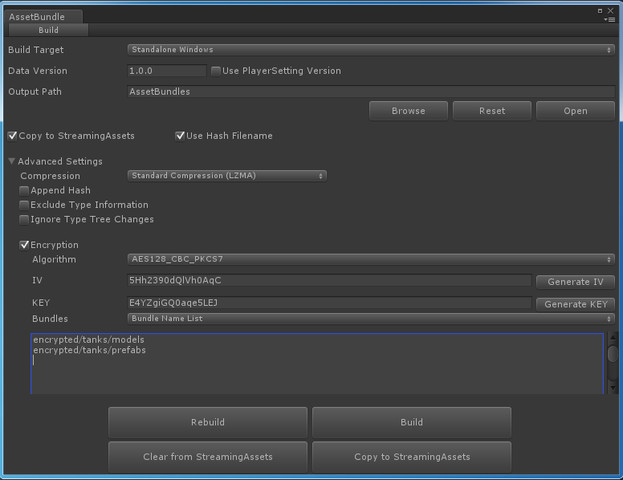

- [Loxodon Framework Log4Net](http://u3d.as/Gmr)

    Plug-in for printing logs in Unity using Log4Net, and remote debugging in LAN.

    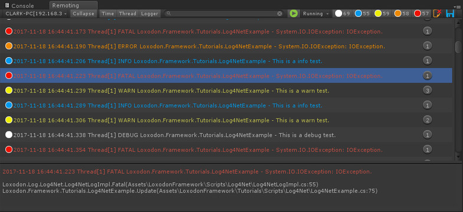

## Lua plugin installation (optional)

In this framework, the Lua language support is supported by plug-in extensions. It relies on Tencent's XLua project and the Loxodon.Framework.XLua plugin. You can find Loxodon.Framework.XLua in the project's LoxodonFramework / Docs / XLua directory. Plugin, it is optional and only needs to be installed for projects that need hot update and are developed in Lua language. The specific installation steps are as follows. To avoid errors, please strictly follow the steps below.

### Install XLua
Download the latest version of XLua from the Xlua Github repository, you can use the source code version Source code.zip or xlua_v2.x.xx.zip version (xlua_v2.x.xx.zip version is recommended to avoid conflicts with XLua example class names). Please unzip the downloaded xlua and copy it into the current project.

**Note: XLua has compatibility issues in Unity2018. In editor mode, please use .Net3.5 or .Net4.x. Do not use .Net Standard2.0, otherwise errors will occur. If you want to use .Net Standard2.0, please refer to xlua The FAQ addresses compatibility issues.**

[XLua FAQ](https://github.com/Tencent/xLua/blob/master/Assets/XLua/Doc/faq.md)

[XLua Download](https://github.com/Tencent/xLua/releases "xlua")

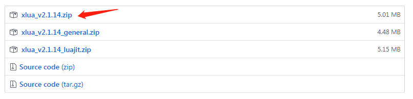

### Macro definition
Configure the Unity3D project Player Setting / Other Settings / Scripting Define Symbols, add XLUA macro definitions, in order to avoid errors when switching platforms in the future, it is best to match PC, Android, iOS and other platforms.

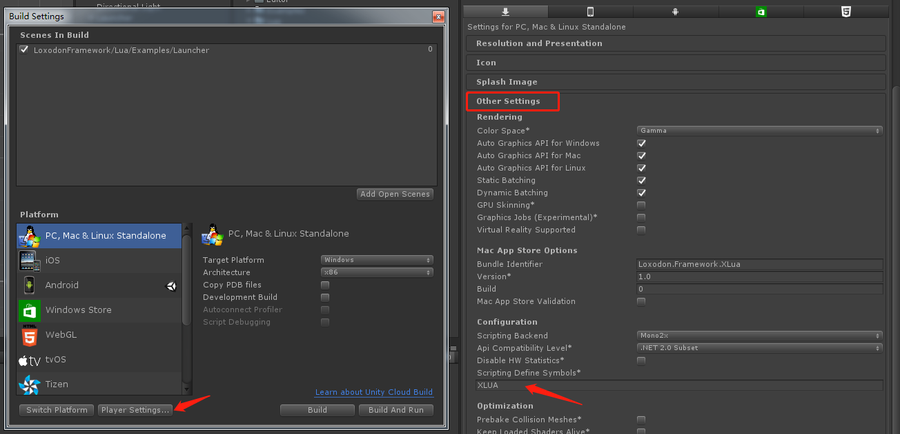

### Import Lua plugin
In the LoxodonFramework / Docs / XLua / directory, locate the Loxodon.Framework.XLua.unitypackage file and double-click the imported project.

If there is a compilation error, please check whether the XLua Examples directory is imported. The InvokeLua.cs file in this directory defines the PropertyChangedEventArgs class. Because no namespace is used, class names will conflict. Please delete the Examples folder in the XLua directory or Add a namespace to the PropertyChangedEventArgs class in the InvokeLua.cs file.

### View example
Open the LoxodonFramework/Lua/Examples directory to see examples.

## Quick start

Create a view that displays an account information on the left and a form on the right. You can modify the account information on the left through the submit button. Now we will demonstrate how we do it through the frame view and data binding functions. The interface is as follows:

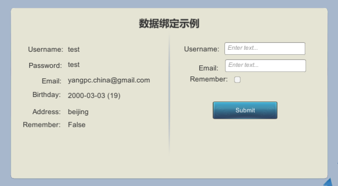

### C# example

Add the viewscript component DatabindingExample to the root object of a UI view and assign the UI control to the corresponding property. In this example, the properties are defined by C # hard coding. Of course, you can also use the dynamic property table VariableArray to Dynamically define attributes. For details, see Lua's example. After the attributes are configured, the following figure is displayed.

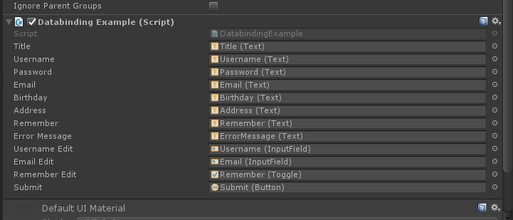

Look at the code below. If we define the view model and the view script, how we bind the view to the view model.

    /// 

    /// AccountViewModel
    /// 

    public class AccountViewModel : ObservableObject
    {
        private int id;
        private string username;
        private string password;
        private string email;
        private DateTime birthday;
        private readonly ObservableProperty<string> address = new ObservableProperty<string>();

        public int ID
        {
            get { return this.id; }
            set { this.Set<int>(ref this.id, value, "ID"); }
        }

        public string Username
        {
            get { return this.username; }
            set { this.Set<string>(ref this.username, value, "Username"); }
        }

        public string Password
        {
            get { return this.password; }
            set { this.Set<string>(ref this.password, value, "Password"); }
        }

        public string Email
        {
            get { return this.email; }
            set { this.Set<string>(ref this.email, value, "Email"); }
        }

        public DateTime Birthday
        {
            get { return this.birthday; }
            set { this.Set<DateTime>(ref this.birthday, value, "Birthday"); }
        }

        public ObservableProperty<string> Address
        {
            get { return this.address; }
        }
    }

    /// 

    /// DatabindingViewModel
    /// 

    public class DatabindingViewModel : ViewModelBase
    {
        private AccountViewModel account;
        private bool remember;
        private string username;
        private string email;
        private ObservableDictionary<string, string> errors = new ObservableDictionary<string, string>();

        public AccountViewModel Account
        {
            get { return this.account; }
            set { this.Set<AccountViewModel>(ref account, value, "Account"); }
        }

        public string Username
        {
            get { return this.username; }
            set { this.Set<string>(ref this.username, value, "Username"); }
        }

        public string Email
        {
            get { return this.email; }
            set { this.Set<string>(ref this.email, value, "Email"); }
        }

        public bool Remember
        {
            get { return this.remember; }
            set { this.Set<bool>(ref this.remember, value, "Remember"); }
        }

        public ObservableDictionary<string, string> Errors
        {
            get { return this.errors; }
            set { this.Set<ObservableDictionary<string, string>>(ref this.errors, value, "Errors"); }
        }

        public void OnUsernameValueChanged(string value)
        {
            Debug.LogFormat("Username ValueChanged:{0}", value);
        }

        public void OnEmailValueChanged(string value)
        {
            Debug.LogFormat("Email ValueChanged:{0}", value);
        }

        public void OnSubmit()
        {
            if (string.IsNullOrEmpty(this.Username) || !Regex.IsMatch(this.Username, "^[a-zA-Z0-9_-]{4,12}$"))
            {
                this.errors["errorMessage"] = "Please enter a valid username.";
                return;
            }

            if (string.IsNullOrEmpty(this.Email) || !Regex.IsMatch(this.Email, @"^\w+([-+.]\w+)*@\w+([-.]\w+)*\.\w+([-.]\w+)*$"))
            {
                this.errors["errorMessage"] = "Please enter a valid email.";
                return;
            }

            this.errors.Clear();
            this.Account.Username = this.Username;
            this.Account.Email = this.Email;
        }
    }

    /// 

    /// DatabindingExample
    /// 

    public class DatabindingExample : UIView
    {
        public Text title;
        public Text username;
        public Text password;
        public Text email;
        public Text birthday;
        public Text address;
        public Text remember;

        public Text errorMessage;

        public InputField usernameEdit;
        public InputField emailEdit;
        public Toggle rememberEdit;
        public Button submit;

        protected override void Awake()
        {
            //获得应用上下文
            ApplicationContext context = Context.GetApplicationContext();

            //启动数据绑定服务
            BindingServiceBundle bindingService = new BindingServiceBundle(context.GetContainer());
            bindingService.Start();

            //初始化本地化服务
            CultureInfo cultureInfo = Locale.GetCultureInfo();
            var provider = new DefaultDataProvider("LocalizationTutorials", new XmlDocumentParser())
            Localization.Current = Localization.Create(provider, cultureInfo);

        }

        protected override void Start()
        {
            //创建账号子视图
            AccountViewModel account = new AccountViewModel()
            {
                ID = 1,
                Username = "test",
                Password = "test",
                Email = "yangpc.china@gmail.com",
                Birthday = new DateTime(2000, 3, 3)
            };
            account.Address.Value = "beijing";

            //创建数据绑定视图
            DatabindingViewModel databindingViewModel = new DatabindingViewModel()
            {
                Account = account
            };

            //获得数据绑定上下文
            IBindingContext bindingContext = this.BindingContext();

            //将视图模型赋值到DataContext
            bindingContext.DataContext = databindingViewModel;

            //绑定UI控件到视图模型
            BindingSet<DatabindingExample, DatabindingViewModel> bindingSet;
            bindingSet = this.CreateBindingSet<DatabindingExample, DatabindingViewModel>();

            //绑定左侧视图到账号子视图模型
            bindingSet.Bind(this.username).For(v => v.text).To(vm => vm.Account.Username).OneWay();
            bindingSet.Bind(this.password).For(v => v.text).To(vm => vm.Account.Password).OneWay();
            bindingSet.Bind(this.email).For(v => v.text).To(vm => vm.Account.Email).OneWay();
            bindingSet.Bind(this.remember).For(v => v.text).To(vm => vm.Remember).OneWay();
            bindingSet.Bind(this.birthday).For(v => v.text).ToExpression(vm => string.Format("{0} ({1})",
             vm.Account.Birthday.ToString("yyyy-MM-dd"), (DateTime.Now.Year - vm.Account.Birthday.Year))).OneWay();
            bindingSet.Bind(this.address).For(v => v.text).To(vm => vm.Account.Address).OneWay();

            //绑定右侧表单到视图模型
            bindingSet.Bind(this.errorMessage).For(v => v.text).To(vm => vm.Errors["errorMessage"]).OneWay();
            bindingSet.Bind(this.usernameEdit).For(v => v.text, v => v.onEndEdit).To(vm => vm.Username).TwoWay();
            bindingSet.Bind(this.usernameEdit).For(v => v.onValueChanged).To<string>(vm => vm.OnUsernameValueChanged);
            bindingSet.Bind(this.emailEdit).For(v => v.text, v => v.onEndEdit).To(vm => vm.Email).TwoWay();
            bindingSet.Bind(this.emailEdit).For(v => v.onValueChanged).To<string>(vm => vm.OnEmailValueChanged);
            bindingSet.Bind(this.rememberEdit).For(v => v.isOn, v => v.onValueChanged).To(vm => vm.Remember).TwoWay();
            bindingSet.Bind(this.submit).For(v => v.onClick).To(vm => vm.OnSubmit);
            bindingSet.Build();

            //绑定标题,标题通过本地化文件配置
            BindingSet<DatabindingExample> staticBindingSet = this.CreateBindingSet<DatabindingExample>();
            staticBindingSet.Bind(this.title).For(v => v.text).To(() => Res.databinding_tutorials_title).OneTime();
            staticBindingSet.Build();
        }
    }

### Lua example

In the Lua example, the LuaBehaviour script is a general-purpose script provided by the framework. We only need to write a Lua script bound to this script, as shown in DatabindingExample.lua in the figure below. In LuaBehaviour, to ensure commonality, all member attributes are also dynamically defined through the VariableArray attribute table, as shown in the following figure.

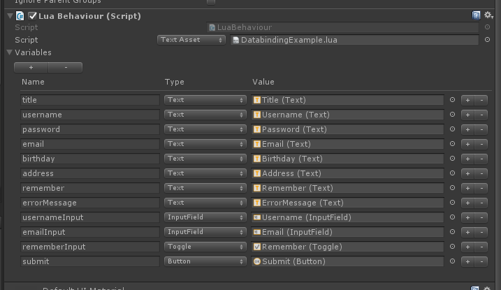

In the Lua script DatabindingExample.lua, all the dynamic properties in the above figure are registered in the Lua environment. We can access all the properties through the self object. Please see the following code.

    require("framework.System")

    local Context = CS.Loxodon.Framework.Contexts.Context
    local LuaBindingServiceBundle = CS.Loxodon.Framework.Binding.LuaBindingServiceBundle
    local ObservableObject = require("framework.ObservableObject")
    local ObservableDictionary = require("framework.ObservableDictionary")

    ---
    --创建一个Account子视图模型
    --@module AccountViewModel
    local AccountViewModel = class("AccountViewModel",ObservableObject)

    function AccountViewModel:ctor(t)
        --执行父类ObservableObject的构造函数，这个重要，否则无法监听数据改变
        AccountViewModel.base(self).ctor(self,t)

        if not (t and type(t)=="table") then
            self.id = 0
            self.username = ""
            self.Password = ""
            self.email = ""
            self.birthday = os.time({year =1970, month = 00, day =00, hour =00, min =00, sec = 00})
            self.address = ""
        end
    end

    ---
    --创建一个数据绑定示例的视图模型
    --@module DatabindingViewModel
    local DatabindingViewModel = class("DatabindingViewModel",ObservableObject)

    function DatabindingViewModel:ctor(t)
        --执行父类ObservableObject的构造函数，这个重要，否则无法监听数据改变
        DatabindingViewModel.base(self).ctor(self,t)

        if not (t and type(t)=="table") then
            self.account = Account()
            self.remember = false
            self.username = ""
            self.email = ""
            self.errors = ObservableDictionary()
        end

    end

    function DatabindingViewModel:submit()
        if #self.username < 1 then
            --注意C#字典类型的使用方式，通过set_Item或者get_Item 访问
            self.errors:set_Item("errorMessage","Please enter a valid username.")
            return
        end

        if #self.email < 1 then
            --注意C#字典类型的使用方式，通过set_Item或者get_Item 访问
            self.errors:set_Item("errorMessage","Please enter a valid email.")
            return
        end

        self.errors:Clear()

        self.account.username = self.username
        self.account.email = self.email
        self.account.remember = self.remember
    end

    ---
    --创建一个数据绑定视图,扩展DatabindingExample.cs 对象，这里的target是从C#脚本传过来的
    --@module DatabindingExample
    local M = class("DatabindingExample",target)

    function M:awake()
        local context = Context.GetApplicationContext()
        local container = context:GetContainer()

        --初始化Lua的数据绑定服务，一般建议在游戏的C#启动脚本创建
        local bundle = LuaBindingServiceBundle(container)
        bundle:Start();
    end

    function M:start()
        --初始化Account子视图模型
        local account = AccountViewModel({
                id = 1,
                username = "test",
                password = "test",
                email = "yangpc.china@gmail.com",
                birthday = os.time({year =2000, month = 03, day =03, hour =00, min =00, sec = 00}),
                address = "beijing",
                remember = true
            })

        --初始化视图模型
        self.viewModel = DatabindingViewModel({
                account = account,
                username = "",
                email = "",
                remember = true,
                errors = ObservableDictionary()
            })

        self:BindingContext().DataContext = self.viewModel

        --绑定UI控件到视图模型
        local bindingSet = self:CreateBindingSet();

        bindingSet:Bind(self.username):For("text"):To("account.username"):OneWay()
        bindingSet:Bind(self.password):For("text"):To("account.password"):OneWay()
        bindingSet:Bind(self.email):For("text"):To("account.email"):OneWay()
        bindingSet:Bind(self.remember):For("text"):To("account.remember"):OneWay()
        bindingSet:Bind(self.birthday):For("text"):ToExpression(function(vm)
                return os.date("%Y-%m-%d",vm.account.birthday)
            end ,"account.birthday"):OneWay()
        bindingSet:Bind(self.address):For("text"):To("account.address"):OneWay()
        bindingSet:Bind(self.errorMessage):For("text"):To("errors['errorMessage']"):OneWay()    
        bindingSet:Bind(self.usernameInput):For("text","onEndEdit"):To("username"):TwoWay()
        bindingSet:Bind(self.emailInput):For("text","onEndEdit"):To("email"):TwoWay()
        bindingSet:Bind(self.rememberInput):For("isOn","onValueChanged"):To("remember"):TwoWay()
        bindingSet:Bind(self.submit):For("onClick"):To("submit"):OneWay()

        bindingSet:Build()
    end

    return M

## Features Introduction

### Context

In many frameworks, we should often see the concept of context. It can be said that it is an environment related to the current code running. You can provide the environment data or services required by the current operation in the context. Here, according to the characteristics of game development, I provide the application context (ApplicationContext), player context (PlayerContext), and also support developers to create other contexts according to their own needs.

In the context, I created a service container (see the next chapter for an introduction to the service container) to store services related to the current context, and also created a dictionary to store data. Through Dispose () of the context, you can release all services registered in the context container. **However, it should be noted that the service must inherit the System.IDisposable interface, otherwise it cannot be released automatically.**

#### Application Context(ApplicationContext)

The application context is a global context, it is singleton, it mainly stores some data and services shared globally. All basic services, such as view positioning service, resource loading service, network connection service, localization service, configuration file service, Json / Xml parsing service, data binding service, etc. These are the basics that may be used throughout the game Services should be registered in the service container of the application context, which can be obtained through the application context.

    //获得全局的应用上下文
    ApplicationContext context = Context.GetApplicationContext();

    //获得上下文中的服务容器
    IServiceContainer container = context.GetContainer();

    //初始化数据绑定服务，这是一组服务，通过ServiceBundle来初始化并注册到服务容器中
    BindingServiceBundle bundle = new BindingServiceBundle(context.GetContainer());
    bundle.Start();

    //初始化IUIViewLocator，并注册到容器
    container.Register<IUIViewLocator>(new ResourcesViewLocator ());

    //初始化本地化服务，并注册到容器中
    CultureInfo cultureInfo = Locale.GetCultureInfo();
    var dataProvider = new ResourcesDataProvider("LocalizationExamples", new XmlDocumentParser());
    Localization.Current = Localization.Create(dataProvider, cultureInfo);
    container.Register<Localization>(Localization.Current);

    //从全局上下文获得IUIViewLocator服务
    IUIViewLocator locator = context.GetService<IUIViewLocator>();

    //从全局上下文获得本地化服务
    Localization localization = context.GetService<Localization>();

#### Player Context(PlayerContext)

The player context is only relevant to the currently logged-in game player. For example, after a game player Clark logs in to the game, his basic information in the game and related services should be stored in the player context. For example, the backpack service is responsible for pulling and synchronizing the player's backpack data, and caches the weapons, equipment, and props in the player's backpack. It is only relevant to the current player. When the player logs out and switches accounts, these data should be cleared And release. When we use the player context to store these services and values, we only need to call the PlayerContext.Dispose () function to release all data and services related to the current player.

The player context inherits all the services and attributes of the global context by default, so all services and data in the global context can be obtained through the player context. When the player context registers the same service or attribute as the key value in the global context, It will be stored in the player context and will not overwrite the data stored in the global context. When accessed through the key, the data in the player context will be returned first. The global context will be searched only if it is not found in the player context.

    //为玩家clark创建一个玩家上下文
    PlayerContext playerContext = new PlayerContext("clark");

    //获得玩家上下文中的服务容器
    IServiceContainer container = playerContext.GetContainer();

    //将角色信息存入玩家上下文
    playerContext.Set("roleInfo", roleInfo);

    //初始化背包服务，注册到玩家上下文的服务容器中
    container.Register<IKnapsackService>(new KnapsackService());

    //从通过玩家上下文获得在全局上下文注册的IViewLocator服务
    IUIViewLocator locator = playerContext.GetService<IUIViewLocator>();

    //从通过玩家上下文获得在全局上下文注册的本地化服务
    Localization localization = playerContext.GetService<Localization>();

    //当用户clark退出登录时，注销玩家上下文，自动注销所有注册在当前玩家上下文中的服务。
    playerContext.Dispose();

#### Other Contexts

In general, in many game developments, we only need the global context and the player context to meet the requirements, but in some cases, we also need a context to store environmental data, such as in MMO games, enter a specific A copy of the gameplay, then I need to create an exclusive context for this copy. When the battle in the copy ends, when I exit the copy, I destroy this copy context to release resources.

    //创建一个上下文，参数container值为null，在Context内部会自动创建
    //参数contextBase值为playerContext，自动继承了playerContext中的服务和属性
    Context context = new Context(null,playerContext);

    //获得上下文中的服务容器
    IServiceContainer container = context.GetContainer();

    //注册一个战斗服务到容器中
    container.Register<IBattleService>(new BattleService());

### Service Container
At the beginning of the project, I researched a lot of open source projects in C # 's control inversion and dependency injection (IoC / DI). At first I wanted to use Zenject as a service container. Later, because of the consideration of memory in mobile projects, Both CPU and CPU resources are quite valuable. I don't want to introduce such a large library to consume memory, and I don't want the performance loss caused by reflection. It is also inappropriate to force users to use IoC / DI. After all, not everyone likes it. I designed a simple service container to meet the most basic functions of service registration, deregistration, and reading.

**Note: All registered services can be automatically released at IServiceContainer.Dispose () only if they inherit the System.IDisposable interface and implement the Dispose function.**

#### Service Registrar(IServiceRegistry)

Service registration is responsible for registering and unregistering services. It can register a service instance to the container according to the service type or name, or register a service factory to the container. Users can choose whether to register a service factory according to their needs. It is created For a singleton service, a new service instance is created every time.

    IServiceContainer container = ...
    IBinder binder = ...
    IPathParser pathParser = ...

    //注册一个类型为IBinder的服务到容器中,可以通过container.Resolve<IBinder>() 或者
    //container.Resolve("IBinder") 来访问这个服务，在容器中默认使用了typeof(IBinder).Name做为Key存储。   
    container.Register<IBinder>(binder);

    //如果需要注册多个IPathParser到容器中，请使用name参数区分
    //在取值时通过name参数取值，如：container.Resolve("parser")
    container.Register<IPathParser>("parser",pathParser);
    container.Register<IPathParser>("parser2",pathParser2);

#### Service Locator(IServiceLocator)

Services can be obtained through the service locator. The service locator can query the service according to the service name or type. When the service is registered by type, you can find the service by type or type name. When the service is registered with a specific name as the Key, You can only find services by service name.

    IServiceContainer container = ...

    //IBinder服务在上段代码中，以类型方式注册，所以可以通过类型或者名称方式查询服务
    IBinder binder = container.Resolve<IBinder>()；//or container.Resolve("IBinder")

    //IPathParser在上段代码中以特定名称"parser"注册，则只能通过名称"parser"来查询服务
    IPathParser pathParser = container.Resolve("parser");

#### Service Bundle(IServiceBundle)

The role of ServiceBundle is to register and unregister a group of related services. For example, my data binding service is to register all data binding related services at one time through the ServiceBundle.Start () method. When the service is no longer needed, you can Use the ServiceBundle.Stop () method to unregister all services of the entire module (see the code below). This can be useful at certain times, such as starting and stopping all services for a module.

    //初始化数据绑定模块，启动数据绑定服务,注册服务
    BindingServiceBundle bundle = new BindingServiceBundle(context.GetContainer());
    bundle.Start();

    //停止数据绑定模块，注销所有数据绑定相关的服务
    bundle.Stop();

### Preference(Preference)
Perference can be said to be Unity3d's PlayerPrefs, but I have extended, supplemented and standardized the functions of PlayerPrefs. In addition to storing basic data types such as boolean, int, float, and string, Perference can also store DateTime, Vector2, Vector3, Vector4, Color, Version, and any object type that JsonUtility can serialize. You can even customize the type yourself. Codec (ITypeEncoder) to extend any type you want to store. Perference supports encrypted data storage, and I have implemented two persistence methods. The first is to convert the data to a string and store it in Unity3D's PlayerPrefs. The second method is to store the files in binary mode. Generally, I use the file persistence method when testing the project, because I can directly delete the files in the Application.persistentDataPath directory to easily delete the configuration.

In addition to extending the above functions, Perference also extends the scope of configuration. Like Context in the previous article, it also includes global configuration and player configuration, and also supports the configuration of a local module. The global configuration can be used to store the current resource update version, the last logged-in user name and other application-related information; there can be multiple player configurations (if multiple accounts are logged in on one machine), and it can store a specific one The player's configuration information on the machine, such as the player's background music, sound effects, picture quality, distance and distance settings in the game, and so on.

Following my code, let's understand how it is used.

    //注册一个Preference的工厂，默认是PlayerPrefsPreferencesFactory工厂，只有使用File持久化才需要改为BinaryFilePreferencesFactory工厂
    Preferences.Register(new BinaryFilePreferencesFactory());

    //获得全局配置，如果不存在则自动创建
    Preferences globalPreferences = Preferences.GetGlobalPreferences();

    //存储当前资源更新后的数据版本
    globalPreferences.SetObject<Version>("DATA_VERSION",dataVersion);

    //存储游戏最后成功登录的用户名，下次启动游戏时自动填写在账号输入框中
    globalPreferences.SetString("username","clark");

    //数据修改后调用Save函数保存数据
    globalPreferences.Save();

    //根据key值"clark@zone5"获得配置，如果不存在则自动创建，这里的意思是获得游戏第5区名为clark的用户的配置信息
    //在Preferences.GetPreferences()函数中，name只是一个存取的Key，你可以完全按自己的意思组合使用。
    Preferences userPreferences Preferences.GetPreferences("clark@zone5");

    //设置游戏音乐、音效开关，并保存
    userPreferences.SetBool("Music_Enable",true);
    userPreferences.SetBool("Sound_Enable",true);
    userPreferences.Save();

In Preferences, although I have supported many data types, but there are always special needs that I cannot meet, then you can extend your type through ITypeEncoder; and if you have requirements for the security of configuration data, Then you can also use your own password to encrypt the data.

    /// 

    /// 自定义一个类型编码器
    /// 

    public class ColorTypeEncoder : ITypeEncoder
    {
        private int priority = 900; //当一个类型被多个类型编码器支持时，优先级最高的有效(优先级在-999到999之间)

        public int Priority
        {
            get { return this.priority; }
            set { this.priority = value; }
        }

        public bool IsSupport(Type type)
        {
            if (type.Equals(typeof(Color)))
                return true;
            return false;
        }

        //将string类型转回对象类型
        public object Decode(Type type, string value)
        {
            if (string.IsNullOrEmpty(value))
                return null;

            Color color;
            if(ColorUtility.TryParseHtmlString(value,out color))
                return color;

            return null;
        }

        //将对象转换为string来保存，因为PlayerPrefs只支持string类型的数据
        public string Encode(object value)
        {            
            return ColorUtility.ToHtmlStringRGBA((Color)value);
        }
    }

    //默认使用AES128_CBC_PKCS7加密，当然你也可以自己实现IEncryptor接口，定义自己的加密算法。
    byte[] iv = Encoding.ASCII.GetBytes("5CyM5tcL3yDFiWlN");
    byte[] key = Encoding.ASCII.GetBytes("W8fnmqMynlTJXPM1");

    IEncryptor encryptor = new DefaultEncryptor(key, iv);

    //序列化和反序列化类
    ISerializer serializer = new DefaultSerializer();

    //添加自定义的类型编码器
    serializer.AddTypeEncoder(new ColorTypeEncoder());

    //注册Preferences工厂
    BinaryFilePreferencesFactory factory = new BinaryFilePreferencesFactory(serializer, encryptor);
    Preferences.Register(factory);

For more examples, see the [Basic Tutorials](https://github.com/cocowolf/loxodon-framework/tree/master/Assets/LoxodonFramework/Tutorials)

### Configuration(Properties File)

In game or application development, the configuration file is an indispensable thing. The configuration file is used to manage the configuration parameters of the game or application. Especially now that game development needs to access different platforms, there are many SDK configuration parameters, and different platforms. There are different access requirements and different upgrade and update strategies. Although these configurations can also inherit the Unity3D ScriptableObject class to create a configuration class, but because there are many access platforms, the parameters are not uniform, which will cause frequent changes as requirements change Modify these configuration classes. To avoid this, I use traditional configuration files to configure these parameters. A properties file meets all configuration requirements.

#### Supported Numeric Types

All the following types and their array types are supported by default, and new data types can be supported through a custom type converter ITypeConverter.

| Basic Type | Default Value | Description |
| :------| ------: | :------: |
| string | "" | String type |
| boolean | false | Boolean type，flase or true |
| sbyte | 0 | Signed byte, -127-128 |
| byte | 0 | Unsigned byte, 0-255 |
| short | 0 | short type |
| ushort | 0 | Unsigned short |
| int | 0 | Integer type |
| uint | 0 | Unsigned integer |
| long | 0 | Long type |
| ulong | 0 | Unsigned long |
| char | ‘’ | Character type |
| float | 0 | Float type |
| double | 0 | Double type |
| datetime | 1970-01-01T00:00:00 | Time type |
| vector2 | (0,0) | Vector2 type,eg：(0,0) |
| vector3 | (0,0,0) | Vector3 type,eg：(0,0,0) |
| vector4 | (0,0,0) | Vector4 type,eg：(0,0,0,0)|
| color | #000000 | Color type，eg：#FF0000 |
| rect | (0,0,0,0) | Rect type，eg:(x,y,width,height) |
| version | 1.0.0 | Version type，eg：1.0.0 |

#### Array Delimiter

As with the localized configuration in CSV format, the array is separated by commas, and commas between double quotes, single quotes, parentheses (), square brackets [], braces {}, and angle brackets <> are ignored If there are commas in the string of the array, please use double or single quotes to enclose the string.

#### Configuration File Example

The properties file format is as follows, configure everything with key = value, the comment text that starts with #, blank lines are ignored:

    #application config
    application.app.version = 1.0.0
    application.data.version = 1.0.0

    #gateway     
    application.config-group = local

    #local
    application.local.upgrade.url = http://test.your domain name.com/loxodon/framework/upgrade/check
    application.local.username = loxodon.framework
    application.local.password = loxodon.framework
    application.local.gateway = 127.0.0.1:8000 , 192.168.0.30:8000

    #develop
    application.develop.upgrade.url = http://test.your domain name.com/loxodon/framework/upgrade/check
    application.develop.username = loxodon.framework
    application.develop.password = loxodon.framework
    application.develop.gateway = 192.168.0.1:8000

    #pre-release
    application.pre-release.upgrade.url = http://pre.release.your domain name.com/loxodon/framework/upgrade/check
    application.pre-release.username = loxodon.framework
    application.pre-release.password = loxodon.framework
    application.pre-release.gateway = 172.217.160.78:8000 , 172.217.160.79:8000 , 172.217.160.80:8000

    #release
    application.release.upgrade.url = http://release.your domain name.com/loxodon/framework/upgrade/check
    application.release.username = loxodon.framework
    application.release.password = loxodon.framework
    application.release.gateway =  172.217.161.78:8000 , 172.217.161.79:8000 , 172.217.161.80:8000

Configuration file read example

    //初始化配置文件
    TextAsset text = Resources.Load<TextAsset>("application.properties");
    IConfiguration conf = new PropertiesConfiguration(text.text);

    //应用版本号
    Version appVersion = conf.GetVersion("application.app.version");
    //数据版本号
    Version dataVersion = conf.GetVersion("application.data.version");

    //当前配置的组名
    string groupName = conf.GetString("application.config-group");

    //根据前缀获 application.local 得配置的子集
    IConfiguration currentGroupConf = conf.Subset("application." + groupName);

    //通过子集获配置信息
    string upgradeUrl = currentGroupConf.GetString("upgrade.url");
    string username = currentGroupConf.GetString("username");
    string password = currentGroupConf.GetString("password");
    string[] gatewayArray = currentGroupConf.GetArray<string>("gateway");

### Internationalization and localization

Internationalization and localization refer to software, applications, games, etc. that can be adapted to the language, regional differences, and technical needs of the target market. Therefore, in game development, in order to meet different market requirements, localization is an indispensable function. I referenced the Android localization design ideas and designed the localization module of this framework. The localization module is the same as any of the modules mentioned above. It can also be customized and can be extended freely. Let me introduce how to use the localization module.

#### Directory Structure

Localized files can be placed in the Resources directory, accessed through Unity3D's Resources, or placed into AssetBundle, loaded through AssetBundle, or you can put it anywhere and read it through custom IDataProvider. And these methods can exist at the same time. In this framework, I provide two data providers, DefaultDataProvider and AssetBundleDataProvider, to load localized data files in Resources and AssetBundle, respectively. Whether in Resources or AssetBundle, its directory structure and loading rules are the same. First, there must be a root directory of the localization configuration file, as shown in the LocalizationExamples directory in the following figure. Create directories for each language under the root directory, such as default, zh, zh-CN, zh-TW, zh-HK, en, en-US , En-CA, en-AU, and so on (for details, refer to the Name of the System.Globalization.CultureInfo class and TwoLetterISOLanguageName, such as zh-CN is the Name and zh is the TwoLetterISOLanguageName). The configuration in the default directory must be the most complete, it is the default language configuration, and it is required, while other directories are optional. The zh directory is a Chinese directory, zh-CN is a configuration directory in mainland China, zh-TW is a configuration directory in Taiwan, and zh-HK is a configuration directory in Hong Kong, China. From the priority of the configuration file (zh-CN | zh-TW | zh-HK)> en> default, the configuration with higher priority will overwrite the configuration with lower priority.

In each configuration file directory, the configuration file is recommended to be divided into multiple files according to the business module configuration. Do not write all the configurations in a text file, as shown in the following figure. The configuration is named after the module name.

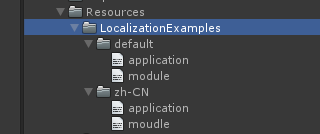

#### Format of the localization file

The localization file supports XML, Asset file (LocalizationSourceAsset) format and localized data source script by default. If necessary, you can also customize other IDocumentParser to support other formats, such as Json format, csv file format, binary format, or SQLite.

Sprites, textures (Texture2D / Texture3D), fonts (Font), audio effects (AudioClip), video (VideoClip), etc. belong to UnityEngine.Object object resources can only be stored using the Asset file format or localized data source script storage. Other textual resources are recommended to be stored in XML or other text file formats.

- Localization SourceAsset File Format (LocalizationSourceAsset) The format of the Localization SourceAsset file is as shown below. You can configure multiple types of resources. Each file corresponds to a language resource. Its directory rules are completely the same as the XML method. The only difference is Is the file format. Files such as pictures and sounds take up more memory. Please split resources by business module. The configuration of the same module is in the same Asset file. Load it into memory before using it, and unload resources from memory after using it.

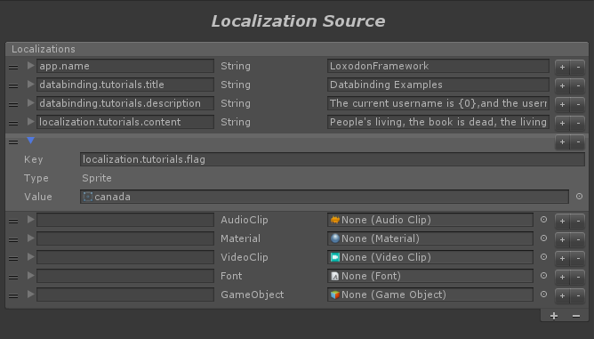
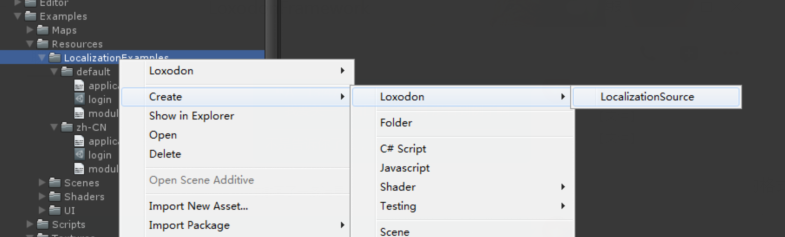

- Localization SourceBehaviour The localization source source script is attached to the GameObject object and can be stored directly in Prefab or in the scene. It cannot be stored separately by language. All localized resources that support languages should be configured in the same In a script file. The LocalizationSourceBehaviour script comes with a DataProvider. When the script is run, the data is automatically loaded, and when the object is destroyed, the data is automatically unloaded. This method is particularly suitable for use with UIView. Localized data is automatically loaded when UIView is created, and localized data is released when UIView is closed. Compared with the Asset file format, it has the advantage that it can be used like a Unity object and can be dragged into the scene or prefab. There is no need to write a script to manage it. Its disadvantage is that data for multiple language versions will be loaded. Into memory, it will take up more memory. [Localization Source Tutorials](https://github.com/cocowolf/loxodon-framework/tree/master/Assets/LoxodonFramework/Tutorials/)
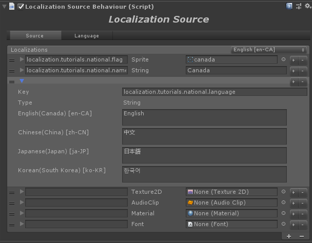
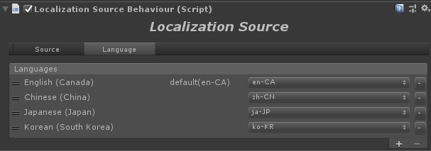

- XML file format The XML file format can easily configure text-type data, but it cannot directly configure the resources of the UnityEngine.Object object. If you want to use XML to configure resources such as sounds, pictures, and fonts, you can only configure the file paths of resources such as sounds, pictures, and fonts in XML, and dynamically load these resources by changing the file path when you use them. Text type localization does not take up much memory, it is recommended to load all into memory when the game starts, and do not release them. The XML format is configured as follows:

      <!-- application.xml -->
      <?xml version="1.0" encoding="utf-8"?>
      <resources>
          <string name="app.name">Loxodon Framework Examples</string>
          <string name="framework.name">LoxodonFramework</string>
          <vector3 name="user.position">(20 , 20.2 , 30)</vector3>
          <color name="color.black">#000000</color>
          <color-array name="button.transition.colors">
              <item>#FFFFFFFF</item>
              <item>#F5F5F5FF</item>
              <item>#C8C8C8FF</item>
              <item>#C8C8C880</item>
          </color-array>
          <datetime name="created">2016-10-27T00:00:00.000</datetime>
      </resources>

      <!-- module.xml -->
      <?xml version="1.0" encoding="utf-8"?>
      <resources>
          <string name="startup.progressbar.tip.loading">Loading...</string>
          <string name="startup.progressbar.tip.unziping">Unziping...</string>
          <string name="login.failure.tip">Login failure.</string>
          <string name="login.exception.tip">Login exception.</string>
          <string name="login.validation.username.error">Please enter a valid username.</string>
          <string name="login.validation.password.error">Please enter a valid password.</string>
          <string name="login.label.title.text">Sign in</string>
          <string name="login.button.confirm.text">Confirm</string>
          <string name="login.button.cancel.text">Cancel</string>
          <string name="login.label.username.text">Username:</string>
          <string name="login.label.password.text">Password:</string>
          <string name="login.input.username.prompt">Enter username...</string>
          <string name="login.input.password.prompt">Enter password...</string>
      </resources>

#### XML special characters

In the XML name, attributes, and content of this article, "<", ">", "&" and other characters cannot be used directly. If these characters appear in an XML tag, XML parsing will report an error. If we use The content must include these characters. There are two solutions. The first is to use escape characters. For example, the three characters in the preceding text can be replaced with "&amp;lt;", "&amp;gt;", and "&amp;amp;". The second way is to wrap the text content with tags &lt;![CDATA[]]&gt;, for example,&lt;![CDATA[&lt;color=#FF0000&gt;This is a test.&lt;/color&gt;]]&gt;, the text content it represents is "&lt;color=#FF0000&gt;This is a test &lt;/color&gt;". &lt;![CDATA[]]&gt; tags are generally recommended.

**Escape character table**

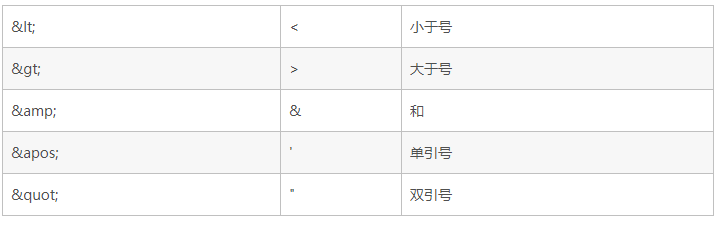

**Example**

    <?xml version="1.0" encoding="utf-8"?>
    <resources>
        <string name="mainpage.title"><![CDATA[This text is <color=#FF0000>red</color>]]></string>
        <string name="mainpage.text">This text is &lt;color=#FF0000&gt;red&lt;/color&gt;</string>
    </resources>

#### Numeric types supported by XML

All the following types and their array types are supported by default, and new data types can be supported through a custom type converter ITypeConverter.

The array type is expressed by adding a "-array" suffix after the basic type, as in the previous string array type: string-array, using &lt;item&gt;&lt;item&gt; between &lt;string-array&gt;&lt;/string-array&gt; to add array elements.

| Basic Type | Default Value | Description |
| :------| ------: | :------: |
| string | "" | String type |
| boolean | false | Boolean type，flase or true |
| sbyte | 0 | Signed byte, -127-128 |
| byte | 0 | Unsigned byte, 0-255 |
| short | 0 | short type |
| ushort | 0 | Unsigned short |
| int | 0 | Integer type |
| uint | 0 | Unsigned integer |
| long | 0 | Long type |
| ulong | 0 | Unsigned long |
| char | ‘’ | Character type |
| float | 0 | Float type |
| double | 0 | Double type |
| datetime | 1970-01-01T00:00:00 | Time type |
| vector2 | (0,0) | Vector2 type,eg：(0,0) |
| vector3 | (0,0,0) | Vector3 type,eg：(0,0,0) |
| vector4 | (0,0,0) | Vector4 type,eg：(0,0,0,0)|
| color | #000000 | Color type，eg：#FF0000 |
| rect | (0,0,0,0) | Rect type，eg:(x,y,width,height) |

#### Generate C# Code

The properties of the localized configuration, similar to the Android configuration, can be used to generate a static class. If you are using the C # version of MVVM, you can use it this way. This adds a language compilation check mechanism to avoid errors. If you are programming in Lua, this is not recommended. You can use the Localization class directly.

Right-click on the root directory of the localization configuration, and pop up the code generation menu as shown below. Click Localization Make, select the code directory and file name, and generate a C # static class.

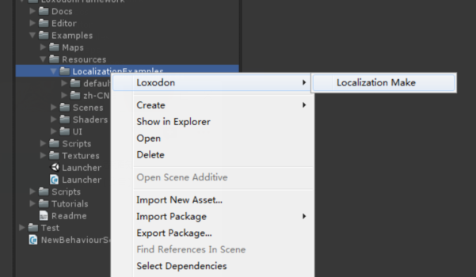

    public static partial class R
    {
        public readonly static V<string> startup_progressbar_tip_loading = new V<string>("startup.progressbar.tip.loading");

        public readonly static V<string> startup_progressbar_tip_unziping = new V<string>("startup.progressbar.tip.unziping");

        public readonly static V<string> login_failure_tip = new V<string>("login.failure.tip");

        public readonly static V<string> login_exception_tip = new V<string>("login.exception.tip");
    }

#### Localized view components

- **Localization of text**

    Supports hanging a script on UnityEngine.UI.Text or UnityEngine.TextMesh object, and configuring the key of the localized string, it can automatically support multi-language switching. If it is just displaying text, it will not change with business logic. Support the use of this Way to configure. Of course, you can also update the text of Text or TextMesh through data binding. If you modify the text in the ViewModel, the text in the view changes accordingly.

    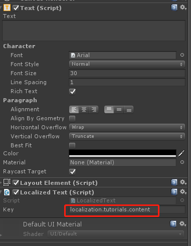

- **Localization of images, sounds, videos, fonts, materials**

    The localization of image, sound, video, font, and material resources is recommended to use Asset file configuration (LocalizationSourceAsset). The resource configuration of different language versions is classified by business module and configured in different Asset files. For example, when you need to access a business module, For UI, load the localized resources of the current language version of this module before displaying the UI.

    Of course, in addition to using the Asset file configuration method, you can also use XML and other text methods to configure the resource loading path in the XML file. When the language changes, the path of the picture or sound will also change, and the resource is loaded asynchronously through the view script , And then replace the resource. This method is very flexible, but you need to write your own code to implement the loading logic. Localized resources such as pictures, sounds, fonts can be placed in Resources or AssetBundle, or sprite atlas, etc. The script that meets all functions can only provide components that load sounds or pictures from Resources (such as: LocalizedAudioSourceInResources.cs). You can refer to my component for more ways.

    The following example is the code for loading sound effects using my Loxodon.Framework.Bundle plugin.

        [RequireComponent(typeof(AudioSource))]
        public class LocalizedAudioSource : AbstractLocalized<AudioSource>
        {
            private IResources resources;
            private void Awake()
            {
                Context context = Context.GetApplicationContext();
                this.resources = context.GetService<IResources>();
            }

            protected override void OnValueChanged(object sender, EventArgs e)
            {
                string path = (string)this.value.Value;
                var result = resources.LoadAssetAsync<AudioClip>(path);
                result.Callbackable().OnCallback(r =>
                {
                    if (r.Exception != null)
                        return;

                    this.target.clip = r.Result;
                });
            }
        }

    The following figure is an example of loading sound effects from Resources using LocalizedAudioSourceInResources.

    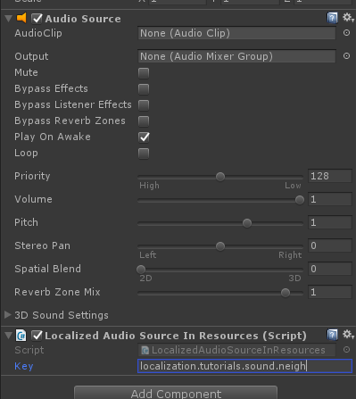

- **UI size and color localization**

    The localization component supports types such as Rect, Color, and Vector2-4. In addition to the localization of pictures, sounds, and text, the size, position, and color of the UI view can also be localized. In particular, the localization of UI size can better adapt to the inconsistent requirements of different language text lengths.

    The setting of RectTransform is related to the anchor point position. The following code is just an example. Please modify it according to your actual situation.

        public class LocalizedRectTransform : AbstractLocalized<RectTransform>
        {
            protected override void OnValueChanged(object sender, EventArgs e)
            {
                RectTransform rectTransform = this.target;
                if (this.value.Value is Vector2[])
                {
                    Vector2[] vectors = (Vector2[])this.value.Value;
                    rectTransform.offsetMin = vectors[0];
                    rectTransform.offsetMax = vectors[1];
                    return;
                }

                if (this.value.Value is Rect)
                {
                    Rect rect = (Rect)this.value.Value;
                    rectTransform.anchoredPosition = new Vector2(rect.x, rect.y);
                    rectTransform.sizeDelta = new Vector2(rect.width, rect.height);               
                    return;
                }
            }
        }

    The localization configuration is as follows:

        <?xml version="1.0" encoding="utf-8"?>
        <resources>
          <vector2-array name="button.position">
            <item>(100,50)</item>
            <item>(-100,-50)</item>
          </vector2-array>
          <rect name="button.position2">(100,100,200,60)</rect>
        </resources>

#### Data provider(IDataProvider)

The localization component of the framework supports the use of multiple data formats to configure localized resources. They have different file formats, different directory structures, and even different file search rules. No matter how complicated the situation is, you can use the data provider ( IDataProvider) and document parser (IDocumentParser) to unify them, load data through the data provider, and parse resource files through the document parser. In the framework, I provide some default data loaders, which can be based on The directory rules mentioned in the article load localized data. If you need to support more data formats, or to customize file search rules and loading methods, please refer to my code to implement a custom data provider. The following code uses the default data provider to load the files in xml and asset format from the Resources / LocalizationTutorials / (the root directory of the tutorial localization resources, the directory structure is as shown in the figure below). All xml files and text files of the current language take up less memory, do not release them. The asset format file is loaded using the DefaultLocalizationSourceDataProvider. It is configured with a specific asset file name. It only loads files in the name list, and configures multimedia resources such as pictures and sounds in the asset file. After use, delete the DefaultLocalizationSourceDataProvider to uninstall the resources. 
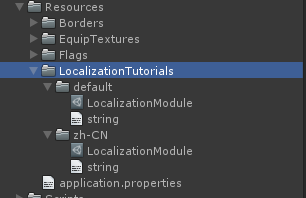

    var localization = Localization.Current;
    localization.CultureInfo = new CultureInfo("en-US"); //设置语言
    //添加一个默认的XML数据加载器，从Resources/LocalizationTutorials 目录中加载本地化资源
    //按（zh-CN|zh-TW|zh-HK) > zh > default 的规则加载文件，如果不满足要求可以自定义数据加载器
    //文本资源不占用太多内存，默认加载当前语言的所有xml文件   
    localization.AddDataProvider(new DefaultDataProvider("LocalizationTutorials", new XmlDocumentParser()));

    //添加一个Asset数据的加载器，从Resources/LocalizationExamples 目录中加载名为login.asset的资源
    //Asset类型的资源请在使用前加载，并且在不需要的时候释放它们
    var provider = new DefaultLocalizationSourceDataProvider("LocalizationTutorials","LocalizationModule.asset");
    localization.AddDataProvider(provider);

    //当数据不在被使用时，删除数据加载器，同时释放内存
    localization.RemoveDataProvider(provider);

#### Get the device's current language

In the older version of Unity3D, CultureInfo.CurrentCulture is invalid. The English language information is obtained no matter on the PC or mobile device. So I provide the Locale tool for Unity SystemLanguage to CultureInfo, which can be obtained through Locale.GetCultureInfo () The current language information is obtained through Locale.CultureInfo GetCultureInfoByLanguage (SystemLanguage.Chinese). In the Unity 2018 version, when using the .net standard 2.0, I tested it on an Android phone. CultureInfo.CurrentCulture is valid, so students who use the 2018 version can use CultureInfo.CurrentCulture to get the language information of the current system.

#### Usage example

The previous article introduced some functions of localized components. Here we use examples to understand the use of localized components.

The following example is how to use the localization function in C # code, get the localized string through the generated C# static class R or through the Localization class.

    var localization = Localization.Current;
    localization.CultureInfo = CultureInfo.CurrentCulture; //设置语言,老版本用Locale.GetCultureInfo()
    localization.AddDataProvider(new DefaultDataProvider("LocalizationTutorials", new XmlDocumentParser()));

    //通过Localization的成员方法调用
    string errorMessage = localization.GetText("login.validation.username.error", "Please enter a valid username.");

    //通过生成的静态代码调用（Loxodon/Localization Make 生成C#代码，看上文生成C#代码章节）
    string loadingMessage = R.startup_progressbar_tip_loading;

    //获得本地化配置的子集，通过子集访问
    ILocalization localizationSubset = localization.Subset("login");
    errorMessage = localizationSubset.GetText("validation.username.error", "Please enter a valid username.");

    //通过数据绑定使用，请使用localization.GetValue()获得ObservableProperty，支持值改变的通知
    bindingSet.Bind(target).For(v=>v.text)
        .ToValue(localization.GetValue("login.validation.username.error")).OneWay();

Using localized configuration with UI components, let's simulate a scenario of language switching in a game to understand the use of localized modules. In the figure below, the English in the red wireframe is loaded and modified through the localization service. It uses the LocalizedText component hanging on the Text object to switch between Chinese and English.

    public class LocalizationExample : MonoBehaviour
    {
        public Dropdown dropdown;

        private Localization localization;

        void Awake ()
        {
            CultureInfo cultureInfo = Locale.GetCultureInfoByLanguage (SystemLanguage.English);

            //创建一个数据提供器，从LocalizationTutorials目录中加载本地化文件
            var dataProvider = new DefaultDataProvider ("LocalizationTutorials", new XmlDocumentParser ())；

            //创建一个本地化服务
            Localization.Current = Localization.Create (dataProvider, cultureInfo);
            this.localization = Localization.Current;

            //监听下拉列表的改变，在英文和中文间切换
            this.dropdown.onValueChanged.AddListener (OnValueChanged);
        }

        void OnValueChanged (int value)
        {
            switch (value) {
            case 0:
                //设置本地化服务当前语言为英文
                this.localization.CultureInfo = Locale.GetCultureInfoByLanguage (SystemLanguage.English);
                break;
            case 1:
                //设置本地化服务当前语言为中文
                this.localization.CultureInfo = Locale.GetCultureInfoByLanguage (SystemLanguage.ChineseSimplified);
                break;
            default:
                //设置本地化服务当前语言为英文
                this.localization.CultureInfo = Locale.GetCultureInfoByLanguage (SystemLanguage.English);
                break;
            }
        }

        void OnDestroy ()
        {
            this.dropdown.onValueChanged.RemoveListener (OnValueChanged);
        }
    }

The localization file configuration is as follows:

    <!-- 英文版 -->
    <?xml version="1.0" encoding="utf-8"?>
    <resources>
        <string name="app.name">LoxodonFramework</string>
        <string name="databinding.tutorials.title">Databinding Examples</string>
        <string name="localization.tutorials.content">People's living, the book is dead,
            the living dead reading, can take the book to read. dead books read living,
            people reading can be put to death.</string>
    </resources>

    <!-- 中文版 -->
    <?xml version="1.0" encoding="utf-8"?>
    <resources>
        <string name="app.name">LoxodonFramework</string>
        <string name="databinding.tutorials.title">数据绑定示例</string>
        <string name="localization.tutorials.content">人是活的，书是死的，活人读死书，可以把书读活。
        死书读活人，可以把人读死。</string>
    </resources>

For more examples, see the [Localization Tutorials](https://github.com/cocowolf/loxodon-framework/tree/master/Assets/LoxodonFramework/Tutorials)

#### Localization plugin supporting CSV format

If you are accustomed to using Excel, you can download my CSV plug-in, which supports reading the localized configuration of the CSV file format, but requires that the Unity version is above 2018 and supports .net 4.x or .net standard 2.0.

Download：[Loxodon Framework Localization For CSV](https://github.com/cocowolf/loxodon-framework-localization-for-csv/releases)

**The configuration file format is as follows**

- key：The key of the configuration file. It cannot be empty. This column must exist.
- type：The type of profile value. This column must exist. For example: string type string, integer array int-array
- description:description, can be empty, and this column can be omitted
- default：the default value, it is best not to be empty, if this column does not exist, the first column of the value will be used as the default column
- zh:Chinese configuration, the value of zh is taken from CultureInfo.TwoLetterISOLanguageName, if the field is empty, the default configuration is used
- zh-CN：China, Simplified Chinese configuration, zh-CN takes value from CultureInfo.Name, if the field is empty, the configuration of zh is used

Only the key column and the type column must exist. Others can be added or omitted according to the actual situation.

**The localization query rules for values are queried based on the TwoLetterISOLanguageName and Name fields of the System.Globalization.CultureInfo class. Query by CultureInfo.Name first. If it does not exist, use CultureInfo.TwoLetterISOLanguageName to query, then the default value will be used. For example, if the current language is zh-CN, the configuration of zh-CN will be used first. If the -CN column or zh-CN configuration is empty, the configuration of the zh column is used. If the zh column does not exist or the field is empty, the configuration of the default column is used.**

**Support for type and array representation**

The CSV configuration also supports all the basic data types supported by the XML configuration in the previous section. The only difference is that the CSV file uses a comma separator to support the array type, as shown in the following table.

**Note: Arrays are separated by commas, and commas between double quotes, single quotes, brackets (), brackets [], braces {}, and angle brackets <> are ignored, as in the array string There are commas, please use double or single quotes to enclose the string, otherwise an error will occur when the array is separated**

| key | type | us-EN |
| :------| ------: | :------: |
| usernames | string-array | tom,clark,kate |
| chars | string-array | "a,b,c","d,e,f","g,h,i" |
| positions | vector3-array | (0,1,1.2),(2,2,0),(1.3,0.5,5) |
| colors | color-array | #FF0000,#00FF00 |

**XML and CSV conversion**

The XML configuration file and the CSV configuration file can be converted to each other, but you need to pay attention to the configuration of the array type. In the CSV, "," is used for division, and in XML, it is used to identify the division. "There may be an error converting to csv file format.

Select the root directory of the XML configuration file, right-click and select the Loxodon / Xml To Csv command, all xml files in the directory will be automatically converted into csv format files, and different language versions in XML will be combined into the same csv file. Similarly, the CSV file can also be converted into an XML file. If the CSV file contains configuration versions in multiple languages, it will be split into multiple XML files.

Generate csv file as follows

### Logging system

The framework provides a scalable logging system, which supports ALL, DEBUG, INFO, WARN, ERROR, FATAL and other levels. Different levels of log printing can be used during the development phase and release of the project.

Logging system I provide a debug version of Unity3D, which basically meets general development and debugging needs, but if more powerful logging functions are needed, such as printing logs to a file system, mobile terminals printing logs to a computer via a LAN, etc. You can download my log plugin [Loxodon.Framework.Log4Net](https://assetstore.unity.com/packages/tools/utilities/loxodon-framework-log4net-79440), which is a plugin implemented with Log4Net, which is very powerful.

Example of using the default logging system

    //设置默认日志系统的日志级别，默认日志工厂自动初始化
    LogManager.Default.Level = Level.DEBUG

    //如果是一个自定义的日志实现，可以如下方式来初始化
    DefaultLogFactory factory = new DefaultLogFactory();
    factory.Level = Level.ALL
    LogManager.Registry(factory)

    //为类AsyncResult，定义一个ILog
    private static readonly ILog log = LogManager.GetLogger(typeof(AsyncResult));

    //打印日志
    log.DebugFormat("My name is {0}",name)

### StreamingAssets catalog file reading (Android)

On the Android platform, the StreamingAssets directory is in the apk compressed package, so it cannot be accessed directly through the API of the C # file system. Please use my Loxodon.Framework.Utilities.FileUtil to replace the C # File class to read the file. I provide JNI to call the java interface to access it. The specific implementation is in FileUtil.Android.cs. File, unable to read resources in obb file. If the obb package is split, use the implementation in FileUtil.Compression.cs or FileUtil.IonicZip.cs. FileUtil.Compression.cs uses the native decompression function in .net standard 2.0 to implement. It needs Unity2018 and above. FileUtil.IonicZip.cs is implemented using IonicZip's compression library. Please use this version of the .net 3.5 library. To use this version, you need to find IonicZip.dll in your project and configure the macro definition IONIC_ZIP in the Unity project.

### Thread/Coroutine asynchronous results and asynchronous tasks

In order to facilitate the asynchronous calling of coroutines and threads, I designed a set of asynchronous results and asynchronous tasks according to the design pattern of Future / Promise. When using them, we can obtain the task execution results in a synchronous manner or through a callback. To get the results of the task, following the example below, let's understand the use of asynchronous results.

#### AsyncResult

Using AsyncResult, let's create a coroutine task that can be canceled, and obtain the execution result by synchronous blocking and callback respectively.

    public class AsyncResultExample : MonoBehaviour
    {

        protected IEnumerator Start ()
        {
            //********启动任务，同步方式调用示例***********//
            IAsyncResult<bool> result = StartTask();

            //等待任务完成，result.WaitForDone ()函数返回一个迭代器IEnumerator
            yield return result.WaitForDone ();

            if(r.Exception !=null)
            {
                Debug.LogFormat("任务执行失败：{0}",r.Exception);
            }
            else
            {    
                Debug.LogFormat("任务执行成功 result = {0}",r.Result);
            }

            //********启动任务，回调方式调用示例***********//
            result = StartTask();
            result.Callbackable().OnCallback((r) =>
            {
                if(r.Exception !=null)
                {
                    Debug.LogFormat("任务执行失败：{0}",r.Exception);
                }
                else
                {    
                    Debug.LogFormat("任务执行成功 result = {0}",r.Result);
                }
            });

        }

        //创建一个任务
        public IAsyncResult<bool> StartTask()
        {
            //创建一个异步结果，参数cancelable = true，支持取消操作
            AsyncResult<bool> result = new AsyncResult<bool> (true);

            //启动任务
            this.StartCoroutine (DoTask (result));

            return result;
        }

        /// 

        /// 模拟一个任务
        /// 

        /// <returns>The task.</returns>
        /// <param name="promise">Promise.</param>
        protected IEnumerator DoTask (IPromise<bool> promise)
        {
            for (int i = 0; i < 20; i++) {
                //如果外部调用了AsyncResult.Cancel()函数，则这里的IsCancellationRequested = true，请求取消任务
                if (promise.IsCancellationRequested) {        
                    promise.SetCancelled ();
                    yield break;
                }
                yield return new WaitForSeconds (0.5f);
            }

            //执行完成必须设置结果
            promise.SetResult (true);
        }
    }

#### ProgressResult

The ProgressResult is similar to the AsyncResult function, except that the task progress is increased. Let me take an example.

    /// 

    /// 任务进度
    /// 

    public class Progress
    {
        public int bytes;
        public int TotalBytes;

        public int Percentage { get { return (bytes * 100) / TotalBytes; } }
    }

    public class ProgressResultExample : MonoBehaviour
    {
        protected void Start()
        {
            //开始一个任务
            IProgressResult<Progress, string> result = StartTask();

            //打印任务进度
            result.Callbackable().OnProgressCallback(progress =>
            {
                Debug.LogFormat("Percentage: {0}% ", progress.Percentage);
            });

            //监听任务结果
            result.Callbackable().OnCallback(r =>
            {
                Debug.LogFormat("IsDone:{0} Result:{1}", r.IsDone, r.Result);
            });
        }

        public IProgressResult<Progress, string> StartTask()
        {
            ProgressResult<Progress, string> result = new ProgressResult<Progress, string>(true);

            this.StartCoroutine(DoTask(result));

            return result;
        }

        /// 

        /// 模拟一个有进度的任务
        /// 

        /// <returns>The task.</returns>
        /// <param name="promise">Promise.</param>
        protected IEnumerator DoTask(IProgressPromise<Progress, string> promise)
        {
            int n = 50;
            Progress progress = new Progress();
            progress.TotalBytes = n;
            progress.bytes = 0;
            StringBuilder buf = new StringBuilder();
            for (int i = 0; i < n; i++)
            {
                /* If the task is cancelled, then stop the task */
                if (promise.IsCancellationRequested)
                {
                    promise.SetCancelled();
                    yield break;
                }

                progress.bytes += 1;
                buf.Append(" ").Append(i);
                promise.UpdateProgress(progress);/* update the progress of task. */
                yield return new WaitForSeconds(0.01f);
            }

            //执行完成必须设置结果
            promise.SetResult(buf.ToString());
        }

    }

#### AsyncTask

An asynchronous task is an encapsulation of a thread task or a coroutine task. Passing an iterator IEnumerator to AsyncTask can create a coroutine task, or passing a delegate function to create a task that a background thread executes. According to the task execution process, a task is divided into several stages before execution, after execution is successful / after execution fails, and execution ends. In each stage, you can register your own code block through a delegate callback. In the following example, let's see how to create a coroutine task.

    public class AsyncTaskExample : MonoBehaviour
    {
        protected IEnumerator Start()
        {
            AsyncTask task = new AsyncTask(DoTask(), true);

            /* 开始任务 */
            task.OnPreExecute(() =>
            {
                //任务执行前调用
                Debug.Log("The task has started.");
            }).OnPostExecute(() =>
            {
                //任务成功执行后调用
                Debug.Log("The task has completed.");/* only execute successfully */
            }).OnError((e) =>
            {
                //任务执行失败调用
                Debug.LogFormat("An error occurred:{0}", e);
            }).OnFinish(() =>
            {
                //任务执行完毕，无论成功失败，都会调用
                Debug.Log("The task has been finished.");/* completed or error or canceled*/
            }).Start();

            //等待任务结束
            yield return task.WaitForDone();

            Debug.LogFormat("IsDone:{0} IsCanceled:{1} Exception:{2}", task.IsDone, task.IsCancelled, task.Exception);
        }

        /// 

        /// 模拟一个任务的执行
        /// 

        /// <returns>The task.</returns>
        /// <param name="promise">Promise.</param>
        protected IEnumerator DoTask()
        {
            int n = 10;
            for (int i = 0; i < n; i++)
            {
                yield return new WaitForSeconds(0.5f);
            }
        }    
    }

#### ProgressTask

ProgressTask is similar to AsyncTask in that it only increases the task progress. Similarly, ProgressTask can create a coroutine task or a background thread task.

    public class ProgressTaskExample : MonoBehaviour
    {
        protected IEnumerator Start()
        {
            //创建一个任务，这个任务将在一个后台线程中执行
            ProgressTask<float, string> task = new ProgressTask<float, string>(
                    new Action<IProgressPromise<float, string>>(DoTask), false, true);

            /* 开始一个任务 */
            task.OnPreExecute(() =>
            {
                //在任务执行前调用
                Debug.Log("The task has started.");
            }).OnPostExecute((result) =>
            {
                //在任务成功执行后调用
                Debug.LogFormat("The task has completed. result:{0}", result);/* only execute successfully */
            }).OnProgressUpdate((progress) =>
            {
                //任务执行的进度
                Debug.LogFormat("The current progress:{0}%", (int)(progress * 100));
            }).OnError((e) =>
            {
                //在任务执行失败后调用
                Debug.LogFormat("An error occurred:{0}", e);
            }).OnFinish(() =>
            {
                //任务执行完毕，无论成功失败，都会调用
                Debug.Log("The task has been finished.");/* completed or error or canceled*/
            }).Start();

            yield return task.WaitForDone();

            Debug.LogFormat("IsDone:{0} IsCanceled:{1} Exception:{2}", task.IsDone, task.IsCancelled, task.Exception);
        }

        /// 

        /// 模拟一个任务，这不是一个迭代器，这将会在一个后台线程中执行
        /// 

        /// <returns>The task.</returns>
        /// <param name="promise">Promise.</param>
        protected void DoTask(IProgressPromise<float, string> promise)
        {
            try
            {
                int n = 50;
                float progress = 0f;
                StringBuilder buf = new StringBuilder();
                for (int i = 0; i < n; i++)
                {
                    /* If the task is cancelled, then stop the task */
                    if (promise.IsCancellationRequested)
                    {
                        promise.SetCancelled();
                        break;
                    }

                    progress = i / (float)n;
                    buf.Append(" ").Append(i);
                    promise.UpdateProgress(progress);/* update the progress of task. */
                    Thread.Sleep(200);
                }
                promise.UpdateProgress(1f);
                promise.SetResult(buf.ToString()); /* update the result. */
            }
            catch (System.Exception e)
            {
                promise.SetException(e);
            }
        }
    }

#### CoroutineTask

Before C # 4.0, you needed to perform a complex asynchronous operation, generally using thread pool technology to perform a task. Introduced the Task (System.Threading.Tasks.Task) mechanism in C # 4.0, which provides a more convenient and concise API. In order to keep Unity3D coroutine asynchronous tasks and thread asynchronous tasks Task consistent, I implemented the CoroutineTask class Its API is basically the same as Task. The only difference is that it executes coroutine asynchronous tasks, and all its tasks are executed in the main thread.

    public class CoroutineTaskExample : MonoBehaviour
    {
        IEnumerator Start()
        {
            CoroutineTask task = new CoroutineTask(DoTask())
                .ContinueWith(
                    DoContinueTask(),
                    CoroutineTaskContinuationOptions.OnCompleted
                    | CoroutineTaskContinuationOptions.OnFaulted
                ).ContinueWith(
                    () => { Debug.Log("The task is completed"); }
                );

            yield return task.WaitForDone();

            Debug.LogFormat("IsDone:{0} IsCompleted:{1} IsFaulted:{2} IsCancelled:{3}",
                task.IsDone, task.IsCompleted, task.IsFaulted, task.IsCancelled);
        }

        /// 

        /// Simulate a task.
        /// 

        /// <returns>The task.</returns>
        /// <param name="promise">Promise.</param>
        protected IEnumerator DoTask()
        {
            int n = 10;
            for (int i = 0; i < n; i++)
            {
                Debug.LogFormat("Task:i = {0}", i);
                yield return new WaitForSeconds(0.5f);
            }
        }

        protected IEnumerator DoContinueTask()
        {
            int n = 10;
            for (int i = 0; i < n; i++)
            {
                Debug.LogFormat("ContinueTask:i = {0}", i);
                yield return new WaitForSeconds(0.5f);
            }
        }    

    }

For more examples, see the [Basic Tutorials](https://github.com/cocowolf/loxodon-framework/tree/master/Assets/LoxodonFramework/Tutorials)

### Thread/Coroutine Executor

In the development of Unity3d logic scripts, multi-threading is not supported. All UnityEngine.Object objects can only be accessed and modified in the main thread. However, during game development, it is difficult to avoid using multi-threaded programming. For example, it accepts data from the network through a Socket connection, downloads resources through multiple threads, and some pure CPU calculation logic is switched to a background thread to perform operations. There will be a problem of thread switching. So in the Loxodon.Framework framework, I designed a thread and coroutine executor to be used with the task results in the previous article. It can easily switch the task to the main thread for execution, and it can also easily start a background thread task.

#### Executors

    public class ExecutorExample : MonoBehaviour
    {

        IEnumerator Start()
        {
            //在后台线程中异步运行一个任务
            Executors.RunAsync(() =>
            {
                Debug.LogFormat("RunAsync ");
            });

            //在后台线程中异步运行一个任务
            Executors.RunAsync(() =>
            {
                //睡眠1000毫秒
                Thread.Sleep(1000);

                //从后台线程切换到主线程中，
                //waitForExecution = true，当前函数直到主线程执行完后才返回
                Executors.RunOnMainThread(() =>
                {
                    Debug.LogFormat("RunOnMainThread Time:{0} frame:{1}", Time.time, Time.frameCount);
                }, true);
            });

            //运行一个协程任务
            IAsyncResult result = Executors.RunOnCoroutine(DoRun());

            //等待任务完成
            yield return result.WaitForDone();
        }

        IEnumerator DoRun()
        {
            for (int i = 0; i < 10; i++)
            {
                Debug.LogFormat("i = {0}", i);
                yield return null;
            }
        }
    }

#### Scheduled Task Executor(IScheduledExecutor)

In this framework, a threaded timed task executor (ThreadScheduledExecutor) and a Unity3D coroutine timed task executor (CoroutineScheduledExecutor) are provided. Below we take the threaded timed task executor as an example to introduce its usage.

    //创建并启动一个线程的定时任务执行器
    var scheduled = new ThreadScheduledExecutor();
    scheduled.Start();

    //延时1000毫秒后执行，以固定频率，每隔2000毫秒，打印一句“This is a test.”
    IAsyncResult result = scheduled.ScheduleAtFixedRate(() =>
    {
        Debug.Log("This is a test.");
    }, 1000, 2000);

#### Interceptable Enumerator(InterceptableEnumerator)

In Unity3D coroutines, if an exception occurs, it is impossible to catch the exception. Try catch is not allowed to use across yield, finally cannot ensure that the code block can still be executed when the coroutine ends abnormally, so it is often impossible to know a coroutine. It is not convenient to find the cause if the program execution ends normally. According to the principle that the Unity3D coroutine is an iterator, I designed a interceptable iterator that can inject code blocks during the execution of the coroutine and catch exceptions. Using InterceptableEnumerator to wrap the original iterator, you can capture the execution exception of the coroutine code, and no matter whether the coroutine ends normally, you can insert a code block before the coroutine exits, ensuring that this code block will definitely be at the end of the coroutine. carried out. In my Executors, I use the InterceptableEnumerator to ensure that the task ends normally. No matter whether the coroutine is executed successfully or abnormally, I can set the result of the AsyncResult by registering the Finally block. Ensure that AsyncResult.IsDone is equal to true, which will not cause the task Stuck.

InterceptableEnumerator supports conditional statement blocks. You can insert a conditional statement block outside to control the coroutine logic or abort the coroutine. Exception statement block, you can catch coroutine exceptions, Finally statement block, to ensure that the end of the coroutine will call this statement block. Let's take a look at an example.

    /// 

    /// 这是一个迭代器的包装函数
    /// 

    protected static InterceptableEnumerator WrapEnumerator(IEnumerator routine, IPromise promise)
    {
        InterceptableEnumerator enumerator;
        if(routine is InterceptableEnumerator)
            enumerator = (InterceptableEnumerator)routine;
        else
            enumerator = new InterceptableEnumerator(routine);

        //注册一个条件语句块，如果任务取消，IsCancellationRequested = true，则结束任务
        enumerator.RegisterConditionBlock(() => !(promise.IsCancellationRequested));

        //注册一个异常捕获语句块，如果协程执行错误，则将异常赋值到任务结果，并打印错误
        enumerator.RegisterCatchBlock(e =>
        {
            if (promise != null)
                promise.SetException(e);

            if (log.IsErrorEnabled)
                log.Error(e);
        });

        //注册一个Finally语句块，确保任务能够正常结束退出
        enumerator.RegisterFinallyBlock(() =>
        {
            if (promise != null && !promise.IsDone)
            {
                if (promise.GetType().IsSubclassOfGenericTypeDefinition(typeof(IPromise<>)))
                    promise.SetException(new Exception("No value given the Result"));
                else
                    promise.SetResult();
            }
        });
        return enumerator;
    }

For more examples, see the [Basic Tutorials](https://github.com/cocowolf/loxodon-framework/tree/master/Assets/LoxodonFramework/Tutorials)

### Message System(Messenger)

Messenger is used for communication between application modules. It provides the function of message subscription and publishing. Messenger supports subscribing and publishing messages by message type, and subscribing and publishing messages by channel.

    public class MessengerExample : MonoBehaviour
    {
        private IDisposable subscription;
        private IDisposable chatroomSubscription;
        private void Start()
        {
            //获得默认的Messenger
            Messenger messenger = Messenger.Default;

            //订阅一个消息,确保subscription是成员变量，否则subscription被GC回收时会自动退订消息
            subscription = messenger.Subscribe((PropertyChangedMessage<string> message) =>
            {
                Debug.LogFormat("Received Message:{0}", message);
            });

            //发布一个属性名改变的消息
            messenger.Publish(new PropertyChangedMessage<string>("clark", "tom", "Name"));

            //订阅聊天频道"chatroom1"的消息
            chatroomSubscription = messenger.Subscribe("chatroom1", (string message) =>
             {
                 Debug.LogFormat("Received Message:{0}", message);
             });

            //向聊天频道"chatroom1"发布一条消息
            messenger.Publish("chatroom1", "hello!");
        }

        private void OnDestroy()
        {
            if (this.subscription != null)
            {
                //退订消息
                this.subscription.Dispose();
                this.subscription = null;
            }

            if (this.chatroomSubscription != null)
            {
                //退订消息
                this.chatroomSubscription.Dispose();
                this.chatroomSubscription = null;
            }
        }
    }

For more examples, see the [Basic Tutorials](https://github.com/cocowolf/loxodon-framework/tree/master/Assets/LoxodonFramework/Tutorials)

### Observables

ObservableObject, ObservableList, ObservableDictionary are indispensable in the data binding of the MVVM framework. They respectively implement the INotifyPropertyChanged and INotifyCollectionChanged interfaces. When the property of an object changes or the item in the collection changes, we can monitor the PropertyChanged and CollectionChanged events. Received notifications of property changes and collection changes. In the data binding function, only objects that implement these two interfaces will automatically notify the UI view of changes when the properties or collections change. Otherwise, you can only give the UI the initial binding. The control is assigned once, and the value of the view model is changed after binding, and the UI control cannot be notified of the change.

Let's take a look at the usage example of ObservableDictionary. When we need to create a custom ListView control, we need to understand its principle.

    public class ObservableDictionaryExample : MonoBehaviour
    {
        private ObservableDictionary<int, Item> dict;

        protected void Start()
        {
    #if UNITY_IOS
            //在IOS中，泛型类型的字典，需要提供IEqualityComparer<TKey>，否则可能JIT异常
            this.dict = new ObservableDictionary<int, Item>(new IntEqualityComparer());
    #else
            this.dict = new ObservableDictionary<int, Item>();
    #endif
            dict.CollectionChanged += OnCollectionChanged;

            //添加Item
            dict.Add(1, new Item() { Title = "title1", IconPath = "xxx/xxx/icon1.png", Content = "this is a test." });
            dict.Add(2, new Item() { Title = "title2", IconPath = "xxx/xxx/icon2.png", Content = "this is a test." });

            //删除Item
            dict.Remove(1);

            //清除字典
            dict.Clear();
        }

        protected void OnDestroy()
        {
            if (this.dict != null)
            {
                this.dict.CollectionChanged -= OnCollectionChanged;
                this.dict = null;
            }
        }

        //集合改变事件
        protected void OnCollectionChanged(object sender, NotifyCollectionChangedEventArgs eventArgs)
        {
            switch (eventArgs.Action)
            {
                case NotifyCollectionChangedAction.Add:
                    foreach (KeyValuePair<int, Item> kv in eventArgs.NewItems)
                    {
                        Debug.LogFormat("ADD key:{0} item:{1}", kv.Key, kv.Value);
                    }
                    break;
                case NotifyCollectionChangedAction.Remove:
                    foreach (KeyValuePair<int, Item> kv in eventArgs.OldItems)
                    {
                        Debug.LogFormat("REMOVE key:{0} item:{1}", kv.Key, kv.Value);
                    }
                    break;
                case NotifyCollectionChangedAction.Replace:
                    foreach (KeyValuePair<int, Item> kv in eventArgs.OldItems)
                    {
                        Debug.LogFormat("REPLACE before key:{0} item:{1}", kv.Key, kv.Value);
                    }
                    foreach (KeyValuePair<int, Item> kv in eventArgs.NewItems)
                    {
                        Debug.LogFormat("REPLACE after key:{0} item:{1}", kv.Key, kv.Value);
                    }
                    break;
                case NotifyCollectionChangedAction.Reset:
                    Debug.LogFormat("RESET");
                    break;
                case NotifyCollectionChangedAction.Move:
                    break;
            }
        }
    }

For more examples, see the [Basic Tutorials](https://github.com/cocowolf/loxodon-framework/tree/master/Assets/LoxodonFramework/Tutorials)

### Databinding

Data binding is the key technology of MVVM. It is used to bind and connect the view with the view model. The connection between the view and the view model can be two-way or one-way. The data of the view model can be changed through data binding. The function automatically notifies the view change, and the same view change can also notify the view model value to change. In addition to the connection of values, data binding can also support the binding of events, methods, and commands. Data binding exists in the framework as a service module. It consists of many functional components, such as data binding context, type converters, expression parsers, path parsers, object and method agents, properties, and fields. Visitor, etc. The data binding service is optional. It is necessary only when the framework's view module is used and the UI is developed using MVVM. Of course, you can not use the view module of this framework, but only use the data binding service.

The data binding service is a basic component. We can start the data binding service in the game initialization script and register all the components in the service container of the global context. If a friend wants to use third-party IoC components, such as Autofac, Zenject, etc., then they need to refer to the code of the BindingServiceBundle and create all the classes initialized in the OnStart function with other containers.

    //获得全局上下文
    ApplicationContext context = Context.GetApplicationContext();

    //初始化数据绑定服务
    BindingServiceBundle bindingService = new BindingServiceBundle(context.GetContainer());
    bindingService.Start();

If the Lua plugin is installed, when writing a game in Lua, the data binding service is initialized as follows. LuaBindingServiceBundle adds components that support Lua objects.

    //获得全局上下文
    ApplicationContext context = Context.GetApplicationContext();

    //初始化数据绑定服务
    LuaBindingServiceBundle bundle = new LuaBindingServiceBundle(context.GetContainer());
    bundle.Start();

#### Data binding example

    //创建一个数据绑定集合，泛型参数DatabindingExample是视图，AccountViewModel是视图模型
    BindingSet<DatabindingExample, AccountViewModel> bindingSet;
    bindingSet = this.CreateBindingSet<DatabindingExample, AccountViewModel>();

    //绑定Text.text属性到Account.Username上，OneWay是单向,将Account.Username的值赋值到UI控件
    bindingSet.Bind(this.username).For(v => v.text).To(vm => vm.Account.Username).OneWay();

    //绑定InputField.text到Username属性，双向绑定，修改Username，自动更新InputField控件，修改InputField自动更新Username属性
    bindingSet.Bind(this.usernameEdit).For(v => v.text, v => v.onEndEdit).To(vm => vm.Username).TwoWay();

    //绑定Button到视图模型的OnSubmit方法，方向属性无效
    bindingSet.Bind(this.submit).For(v => v.onClick).To(vm => vm.OnSubmit);

    bindingSet.Build();

#### Binding mode

- **OneWay**(View <-- ViewModel)

    One-way binding, only the view model can modify the value of the UI control in the view. The ViewModel must inherit the INotifyPropertyChanged interface, and the PropertyChanged event will be triggered when the property value changes. Otherwise, the effect is consistent with OneTime, and only the initialization binding is assigned once. For example, Field is only valid for the first time.

- **TwoWay**(View <--> ViewModel)

    Two-way binding, view control modification will automatically modify the view model, and view model modification will automatically modify the view control. The ViewModel must support the PropertyChanged event, and the UI control must support the onEndEdit event and be bound to the onEndEdit event.

- **OneTime**(View <-- ViewModel)

    It is only assigned once, and the value of the ViewModel is assigned to the view control only when the binding relationship is initialized.

- **OneWayToSource**(View --> ViewModel)

    One-way binding, the opposite direction to OneWay, can only assign view UI controls to properties of the view model.

#### Type converter(IConverter)

In general, basic data types are automatically converted when the field type of the view control is inconsistent with the field type of the view model, unless a custom type converter is required to support it. However, when you modify the picture or atlas on the view control through the picture path, picture name, or atlas name saved in the view model, you must use a type converter to convert it.

    //加载一个精灵图集
    Dictionary<string, Sprite> sprites = new Dictionary<string, Sprite>();
    foreach (var sprite in Resources.LoadAll<Sprite>("EquipTextures"))
    {
        if (sprite != null)
            sprites.Add(sprite.name, sprite);
    }

    //创建一个支持精灵名称到Sprite的转换器
    var spriteConverter = new SpriteConverter(sprites)；

    //获得转换器注册服务，它在数据绑定服务启动时会自动创建并注入上下文容器中
    IConverterRegistry converterRegistry = context.GetContainer().Resolve<IConverterRegistry>();

    //注册精灵转换器
    converterRegistry.Register("spriteConverter",spriteConverter);

    //通过视图模型Icon，修改精灵名称，通过spriteConverter转换为对应的Sprite，赋值到图片的sprite属性上。
    bindingSet.Bind(this.image).For(v => v.sprite).To(vm => vm.Icon).WithConversion("spriteConverter").OneWay();

For more examples, see the [ListView And Sprite Databinding Tutorials](https://github.com/cocowolf/loxodon-framework/tree/master/Assets/LoxodonFramework/Tutorials)

#### Binding type

- **Property and Field Binding**

    Property and Field binding is very simple, see the example directly

      //C#，单向绑定
      bindingSet.Bind(this.username).For(v => v.text).To(vm => vm.Account.Username).OneWay();

      //C#，双向绑定，双向绑定时视图对象必须支持视图改变的事件，如“onEndEdit”，必须在For函数中配置
      bindingSet.Bind(this.usernameEdit).For(v => v.text, v => v.onEndEdit).To(vm => vm.Username).TwoWay();

      //C#，非拉姆达表达式的方式
      bindingSet.Bind (this.username).For ("text").To ("Account.Username").OneWay ();

      --Lua，非拉姆达表达式参数的版本
      bindingSet:Bind(self.username):For("text"):To("account.username"):OneWay()
      bindingSet:Bind(self.errorMessage):For("text"):To("errors['errorMessage']"):OneWay()

- **Expression binding**

    Expression binding only supports one or more properties of the view model. Values converted to a certain type by expressions are assigned to view UI controls, which can only be of the type OneTime or OneWay. An expression binding function supports two configuration modes of lambda expression parameters and string parameters. C # code only supports the method of lambda expression parameters. The code will automatically analyze one or more attributes of the view model that the expression is concerned with. Automatically listen for changes in these attributes; Lua code only supports the method using the string parameter version. It cannot automatically analyze which attributes of the view model are used. You need to configure the attributes used by the expression in the parameters.

      //C#代码，使用拉姆达表达式为参数的ToExpression方法，自动分析监听视图模型的Price属性
      bindingSet.Bind(this.price).For(v => v.text).ToExpression(vm => string.Format("${0:0.00}", vm.Price)).OneWay();

      --Lua代码，使用string参数版本的ToExpression方法，需要手动配置price属性,如果表达式使用了vm的多个属性，
      --则在"price"后继续配置其他属性
      bindingSet:Bind(self.price):For("text"):ToExpression(function(vm)
          return string.format(tostring("%0.2f"), vm.price)
      end ,"price"):OneWay()

- **Method binding**

    Method binding is similar to property binding. It also supports two versions of lambda expressions and string parameters. Method binding must ensure that the event parameter type of the control is the same as the parameter type of the bound method of the view model.

      //C#，拉姆达表达式方式的绑定，Button.onClick 与视图模型的成员OnSubmit方法绑定
      bindingSet.Bind(this.submit).For(v => v.onClick).To(vm => vm.OnSubmit);

      //C#，拉姆达表达式方式的绑定，如果方法带参数，请在To后面加上泛型约束
      bindingSet.Bind(this.emailEdit).For(v => v.onValueChanged).To<string>(vm => vm.OnEmailValueChanged);

      --Lua，通过字符串参数绑定，Button.onClick 与视图模型的成员submit方法绑定
      bindingSet:Bind(self.submit):For("onClick"):To("submit"):OneWay()

- **Command and interactive request binding**

    A command is a wrapper for a view model method. The binding of a general UI button onClick can be either a method of the view model or a command of the view model. However, it is recommended to bind to the command. The command can not only respond to the click event of the button, but also control the clickable state of the button. The button can be grayed out immediately after the button is pressed, and the button state can be restored after the button event response is completed.

    Interaction Request (InteractionRequest) Interaction requests are often paired with commands. Commands respond to UI click events, handle click logic, and interact with requests to the control layer to control the creation, modification, and destruction of UI messages.

      //C#，绑定控制层的OnOpenAlert函数到交互请求AlertDialogRequest上
      bindingSet.Bind().For(v => this.OnOpenAlert).To(vm => vm.AlertDialogRequest);

      //绑定Button的onClick事件到OpenAlertDialog命令上
      bindingSet.Bind(this.openAlert).For(v => v.onClick).To(vm => vm.OpenAlertDialog);

- **Collection binding**

    The dictionary and list binding is basically the same as the property/field binding, see the following code

      //C#，绑定一个Text.text属性到一个字典ObservableDictionary中key ="errorMessage" 对应的对象
      bindingSet.Bind(this.errorMessage).For(v => v.text).To(vm => vm.Errors["errorMessage"]).OneWay();

- **Static class binding**

    The only difference between static class binding and view model binding is that static class binding creates a static binding set. The static binding set does not require a view model object.

      //C#，创建一个静态类的绑定集
      BindingSet<DatabindingExample> staticBindingSet = this.CreateBindingSet<DatabindingExample>();

      //绑定标题到类Res的一个静态变量databinding_tutorials_title
      staticBindingSet.Bind(this.title).For(v => v.text).To(() => Res.databinding_tutorials_title).OneWay();

- **Localized data binding**

    For localized data binding, please use the static binding set ToValue () function binding. First, obtain the IObservableProperty object through Localization.GetValue (). This is an observable property. When the language is switched, you will receive a notification of the value change. ToValue function binding, see the example below.

      //C#，创建一个静态类型的绑定集
      BindingSet<DatabindingExample> staticBindingSet = this.CreateBindingSet<DatabindingExample>();

      var localization = Localization.Current;

      //通过本地化key获得一个IObservableProperty属性，
      //必须是IObservableProperty类型，否则切换语言不会更新
      var value = localization.GetValue("databinding.tutorials.title"); //OK        
      //var value = localization.Get<string>("databinding.tutorials.title"); //NO
      staticBindingSet.Bind(this.title).For(v => v.text).ToValue(value).OneWay();

#### Command Parameter

Binding from event to command (ICommand) or method supports custom parameters. Use Command Parameter to add a custom parameter to a UI event without parameters (such as the Click event of a Button). If the UI event itself has parameters, it will be commanded Parameter override. Use Command Parameter to easily bind the Click events of multiple Buttons to the same function OnClick (int buttonNo) of the view model. Please ensure that the parameter type of the function matches the command parameter, otherwise it will cause an error. Please refer to the example below for details.

In the example, the Click event of a group of Button buttons is bound to the OnClick function of the view model. You can know which button is currently pressed by the parameter buttonNo.

    public class ButtonGroupViewModel : ViewModelBase
    {
        private string text;
        private readonly SimpleCommand<int> click;
        public ButtonGroupViewModel()
        {
            this.click = new SimpleCommand<int>(OnClick);
        }

        public string Text
        {
            get { return this.text; }
            set { this.Set<string>(ref text, value, "Text"); }
        }

        public ICommand Click
        {
            get { return this.click; }
        }

        public void OnClick(int buttonNo)
        {
            Executors.RunOnCoroutineNoReturn(DoClick(buttonNo));
        }

        private IEnumerator DoClick(int buttonNo)
        {
            this.click.Enabled = false;
            this.Text = string.Format("Click Button:{0}.Restore button status after one second", buttonNo);
            Debug.LogFormat("Click Button:{0}", buttonNo);

            //Restore button status after one second
            yield return new WaitForSeconds(1f);
            this.click.Enabled = true;
        }

    }

    protected override void Start()
    {
        ButtonGroupViewModel viewModel = new ButtonGroupViewModel();

        IBindingContext bindingContext = this.BindingContext();
        bindingContext.DataContext = viewModel;

        /* databinding */
        BindingSet<DatabindingForButtonGroupExample, ButtonGroupViewModel> bindingSet;
        bindingSet = this.CreateBindingSet<DatabindingForButtonGroupExample, ButtonGroupViewModel>();
        bindingSet.Bind(this.button1).For(v => v.onClick).To(vm => vm.Click).CommandParameter(1);
        bindingSet.Bind(this.button2).For(v => v.onClick).To(vm => vm.Click).CommandParameter(2);
        bindingSet.Bind(this.button3).For(v => v.onClick).To(vm => vm.Click).CommandParameter(3);
        bindingSet.Bind(this.button4).For(v => v.onClick).To(vm => vm.Click).CommandParameter(4);
        bindingSet.Bind(this.button5).For(v => v.onClick).To(vm => vm.Click).CommandParameter(5);

        bindingSet.Bind(this.text).For(v => v.text).To(vm => vm.Text).OneWay();

        bindingSet.Build();
    }

#### Scope Key

In some views, you may need to dynamically create binding relationships and dynamically remove binding relationships. Here we provide a way to remove binding relationships in batches, which is Scope Key.

    //C#,
    string scopeKey = "editKey";
    bindingSet.Bind(this.username).For(v => v.text).To(vm => vm.Account.Username).WithScopeKey(scopeKey).OneWay();
    bindingSet.Bind(this.submit).For(v => v.onClick).To(vm => vm.OnSubmit()).WithScopeKey(scopeKey);

    //通过Scope Key移除绑定
    this.ClearBindings(scopeKey); //or this.BindingContext().Clear(scopeKey)

#### Binding life cycle

Generally, the data binding is initialized in the view creation function. The binding relationship between the view control and the view model is configured through the BindingSet. When the Build function of the BindingSet is called, Binder creates all the binding relationship pairs in the BindingSet. The created binding pair will be saved in the BindingContext of the current view. The BindingContext is automatically created when it is first called, and a BindingContextLifecycle script is automatically generated. It is hung on the current view object, which controls the life cycle of the BindingContext. When the view is destroyed, the BindingContext is destroyed along with it. The bindings stored in the BindingContext Relationships will also be destroyed.

#### Accessors for properties and fields

In the IOS platform, JIT compilation is not allowed, and dynamic code generation is not allowed. When data binding functions access object properties, fields, and methods, they cannot be accessed through dynamic generation delegation like other platforms. They can only be accessed through reflection. The efficiency of reflection is well known. It's bad, so I provide the ability to statically inject accessors to bypass reflection. By default, I have created property accessors for some classes of the UGUI and Unity engines. With reference to my code, you can also register the accessors of common properties of the view model class to the type proxy.

    public class UnityProxyRegister
    {
        [RuntimeInitializeOnLoadMethod(RuntimeInitializeLoadType.BeforeSceneLoad)]
        static void Initialize()
        {
            Register<Transform, Vector3>("localPosition", t => t.localPosition, (t, v) => t.localPosition = v);
            Register<Transform, Vector3>("eulerAngles", t => t.eulerAngles, (t, v) => t.eulerAngles = v);
            Register<Transform, Vector3>("localEulerAngles", t => t.localEulerAngles, (t, v) => t.localEulerAngles = v);
            Register<Transform, Vector3>("right", t => t.right, (t, v) => t.right = v);
            Register<Transform, Vector3>("up", t => t.up, (t, v) => t.up = v);
            Register<Transform, Vector3>("forward", t => t.forward, (t, v) => t.forward = v);
            Register<Transform, Vector3>("position", t => t.position, (t, v) => t.position = v);
            Register<Transform, Vector3>("localScale", t => t.localScale, (t, v) => t.localScale = v);
            Register<Transform, Vector3>("lossyScale", t => t.lossyScale, null);
            Register<Transform, Quaternion>("rotation", t => t.rotation, (t, v) => t.rotation = v);
            Register<Transform, Quaternion>("localRotation", t => t.localRotation, (t, v) => t.localRotation = v);
            Register<Transform, Matrix4x4>("worldToLocalMatrix", t => t.worldToLocalMatrix, null);
            Register<Transform, Matrix4x4>("localToWorldMatrix", t => t.localToWorldMatrix, null);
            Register<Transform, int>("childCount", t => t.childCount, null);

            Register<RectTransform, Vector2>("offsetMax", t => t.offsetMax, (t, v) => t.offsetMax = v);
            Register<RectTransform, Vector2>("offsetMin", t => t.offsetMin, (t, v) => t.offsetMin = v);
            Register<RectTransform, Vector2>("pivot", t => t.pivot, (t, v) => t.pivot = v);
            Register<RectTransform, Vector2>("sizeDelta", t => t.sizeDelta, (t, v) => t.sizeDelta = v);
            Register<RectTransform, Vector2>("anchoredPosition", t => t.anchoredPosition, (t, v) => t.anchoredPosition = v);
            Register<RectTransform, Vector2>("anchorMax", t => t.anchorMax, (t, v) => t.anchorMax = v);
            Register<RectTransform, Vector3>("anchoredPosition3D", t => t.anchoredPosition3D, (t, v) => t.anchoredPosition3D = v);
            Register<RectTransform, Vector2>("anchorMin", t => t.anchorMin, (t, v) => t.anchorMin = v);
            Register<RectTransform, Rect>("rect", t => t.rect, null);

            Register<GameObject, bool>("activeSelf", t => t.activeSelf, (t, v) => t.SetActive(v));
            Register<GameObject, int>("layer", t => t.layer, (t, v) => t.layer = v);
            Register<GameObject, string>("tag", t => t.tag, (t, v) => t.tag = v);

            Register<Behaviour, bool>("enabled", t => t.enabled, (t, v) => t.enabled = v);
            Register<Behaviour, bool>("isActiveAndEnabled", t => t.isActiveAndEnabled, null);

            Register<Component, string>("tag", t => t.tag, (t, v) => t.tag = v);

            Register<Canvas, float>("planeDistance", t => t.planeDistance, (t, v) => t.planeDistance = v);
            Register<Canvas, string>("sortingLayerName", t => t.sortingLayerName, (t, v) => t.sortingLayerName = v);
            Register<Canvas, int>("sortingLayerID", t => t.sortingLayerID, (t, v) => t.sortingLayerID = v);
            Register<Canvas, int>("renderOrder", t => t.renderOrder, null);

            Register<CanvasGroup, float>("alpha", t => t.alpha, (t, v) => t.alpha = v);
            Register<CanvasGroup, bool>("interactable", t => t.interactable, (t, v) => t.interactable = v);
            Register<CanvasGroup, bool>("blocksRaycasts", t => t.blocksRaycasts, (t, v) => t.blocksRaycasts = v);
            Register<CanvasGroup, bool>("ignoreParentGroups", t => t.ignoreParentGroups, (t, v) => t.ignoreParentGroups = v);

            Register<GraphicRaycaster, bool>("ignoreReversedGraphics", t => t.ignoreReversedGraphics, (t, v) => t.ignoreReversedGraphics = v);

            Register<Mask, bool>("showMaskGraphic", t => t.showMaskGraphic, (t, v) => t.showMaskGraphic = v);

            Register<Selectable, SpriteState>("spriteState", t => t.spriteState, (t, v) => t.spriteState = v);
            Register<Selectable, ColorBlock>("colors", t => t.colors, (t, v) => t.colors = v);
            Register<Selectable, bool>("interactable", t => t.interactable, (t, v) => t.interactable = v);

            Register<Button, Button.ButtonClickedEvent>("onClick", t => t.onClick, null);

            Register<InputField, InputField.OnChangeEvent>("onValueChanged", t => t.onValueChanged, null);
            Register<InputField, InputField.SubmitEvent>("onEndEdit", t => t.onEndEdit, null);
            Register<InputField, string>("text", t => t.text, (t, v) => t.text = v);

            Register<Scrollbar, Scrollbar.ScrollEvent>("onValueChanged", t => t.onValueChanged, null);
            Register<Scrollbar, float>("size", t => t.size, (t, v) => t.size = v);
            Register<Scrollbar, float>("value", t => t.value, (t, v) => t.value = v);

            Register<Slider, Slider.SliderEvent>("onValueChanged", t => t.onValueChanged, null);
            Register<Slider, float>("value", t => t.value, (t, v) => t.value = v);
            Register<Slider, float>("maxValue", t => t.maxValue, (t, v) => t.maxValue = v);
            Register<Slider, float>("minValue", t => t.minValue, (t, v) => t.minValue = v);

            Register<Dropdown, int>("value", t => t.value, (t, v) => t.value = v);
            Register<Dropdown, Dropdown.DropdownEvent>("onValueChanged", t => t.onValueChanged, null);

            Register<Text, string>("text", t => t.text, (t, v) => t.text = v);
            Register<Text, int>("fontSize", t => t.fontSize, (t, v) => t.fontSize = v);

            Register<Toggle, bool>("isOn", t => t.isOn, (t, v) => t.isOn = v);
            Register<Toggle, Toggle.ToggleEvent>("onValueChanged", t => t.onValueChanged, (t, v) => t.onValueChanged = v);

            Register<ToggleGroup, bool>("allowSwitchOff", t => t.allowSwitchOff, (t, v) => t.allowSwitchOff = v);
        }

        static void Register<T, TValue>(string name, Func<T, TValue> getter, Action<T, TValue> setter)
        {
            var propertyInfo = typeof(T).GetProperty(name);
            if (propertyInfo is PropertyInfo)
            {
                ProxyFactory.Default.Register(new ProxyPropertyInfo<T, TValue>(name, getter, setter));
                return;
            }

            var fieldInfo = typeof(T).GetField(name);
            if (fieldInfo is FieldInfo)
            {
                ProxyFactory.Default.Register(new ProxyFieldInfo<T, TValue>(name, getter, setter));
                return;
            }

            throw new Exception(string.Format("Not found the property or field named '{0}' in {1} type", name, typeof(T).Name));
        }
    }

### UI framework

#### Variables

During the development of the UI, the view script often needs to access and control the UI controls on the UI interface. Generally speaking, we must either use Transform.Find to find it, or define a property in the View script, and control the control when editing the UI interface. Drag and drop onto this property. The first method is not efficient, and the second method adds and deletes the script properties again, which is not so flexible. Here, I provide the third method, VariableArray, which is a dynamic variable set that can be easily added and deleted, and can be used like a member property. And it not only supports all basic data types, but also supports Unity component types and value types.

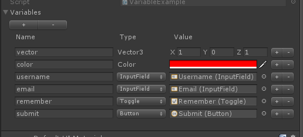

    //C#，访问变量
    Color color = this.variables.Get<Color>("color");
    InputField usernameInput = this.variables.Get<InputField>("username");
    InputField emailInput = this.variables.Get<InputField>("email");

    --Lua，可以直接通过self来访问变量，跟当前Lua表中的成员属性一样
    printf("vector:%s",self.vector:ToString())
    printf("color:%s",self.color:ToString())
    printf("username:%s",self.username.text)
    printf("email:%s",self.email.text)

#### UI view locator (IUIViewLocator)

The UI view locator is a service for querying and loading UI views. It provides services for loading UI views synchronously and asynchronously. Depending on the project, you can customize its functionality. You can load views from Resources, you can also load views from an AssetBundle, or both.

    //C#，创建一个默认的视图定位器，它支持从Resources中加载视图，如果要从AssetBundle中加载，需要自己实现
    IUIViewLocator locator = new DefaultUIViewLocator()

    //通过UI视图定位器，根据一个UI路径名加载一个Loading的窗口视图
    var window = locator.LoadWindow<LoadingWindow>("UI/Loading");
    window.Show();

#### Animations

According to the process of opening, closing, gaining focus, and losing focus of a UI view, the view animation can be divided into admission animation, exit animation, activation animation, and passivation animation. Inherit UIAnimation or IAnimation, use DoTween, iTween, etc., you can create your own UI animation.

UIView supports entry and exit animations in the framework. The animation can be played when a view is opened or a view is hidden. In addition to supporting entry and exit animations, Window also supports activation and passivation animations, and automatically controls playback. When a window gains focus, it plays an activation animation, and when it loses focus, it plays a passivation animation.

As shown below, in Examples, I created a fade-out animation, hung them on a Window view, and set it as an entrance animation and an exit animation, which gradually appear when the window opens, and slowly when the window closes. Slowly disappear.

Customize a C# fade-in animation

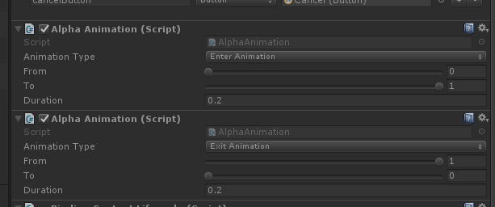

    public class AlphaAnimation : UIAnimation
    {
        [Range (0f, 1f)]
        public float from = 1f;
        [Range (0f, 1f)]
        public float to = 1f;

        public float duration = 2f;

        private IUIView view;

        void OnEnable ()
        {
            this.view = this.GetComponent<IUIView> ();
            switch (this.AnimationType) {
            case AnimationType.EnterAnimation:
                this.view.EnterAnimation = this;
                break;
            case AnimationType.ExitAnimation:
                this.view.ExitAnimation = this;
                break;
            case AnimationType.ActivationAnimation:
                if (this.view is IWindowView)
                    (this.view as IWindowView).ActivationAnimation = this;
                break;
            case AnimationType.PassivationAnimation:
                if (this.view is IWindowView)
                    (this.view as IWindowView).PassivationAnimation = this;
                break;
            }

            if (this.AnimationType == AnimationType.ActivationAnimation
                    || this.AnimationType == AnimationType.EnterAnimation)
            {
                this.view.CanvasGroup.alpha = from;
            }
        }

        public override IAnimation Play ()
        {
            this.view.CanvasGroup.DOFade (this.to, this.duration)
            .OnStart (this.OnStart)
            .OnComplete (this.OnEnd)
            .Play ();
            return this;
        }
    }

Using DoTween to customize a Lua animation

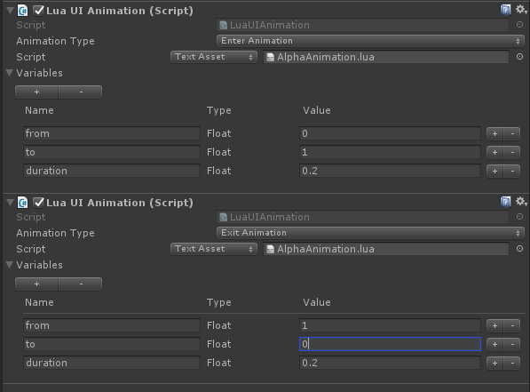

    require("framework.System")

    ---
    --模块
    --@module AlphaAnimation
    local M=class("AlphaAnimation",target)

    function M:play(view,startCallback,endCallback)
        view.CanvasGroup:DOFade(self.to, self.duration)
            :OnStart(function() startCallback() end)
            :OnComplete(function() endCallback() end)
            :Play()    
    end

    return M

#### UI controls

Although UGUI provides us with a rich UI control library, at some time, it still cannot meet our requirements. For example, we need a ListView with superior performance. At this time, we need to customize our own UI controls. In this framework, I provide some common UI controls, such as AlertDialog, Loading, Toast, etc. In the Examples / Resources / UI directory, you can find the default view interface. Refer to these interfaces to redefine the interface appearance and modify the static The ViewName property of the class can be used to reformulate the loading path of the view.

The following uses AlertDialog as an example to introduce their usage.

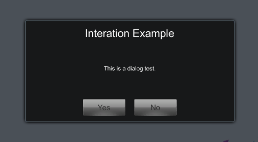

    //对话框视图默认目录路径是UI/AlertDialog，可以通过如下方式修改视图路径
    AlertDialog.ViewName = "Your view directory/AlertDialog";

    //C#，打开一个对话框窗口
    AlertDialog.ShowMessage("This is a dialog test.", "Interation Example", "Yes", null, "No", true,
    result =>
    {
        Debug.LogFormat("Result:{0}",result);
    });

#### Views, windows, and window managers

- **IView/IUIView**

    Views are popularly presented to the UI interface, images, animations, etc. that the user sees. In this framework, according to the characteristics of the game view layer, it is divided into two categories, scene views and UI views. The UI view corresponds to the IUIView interface, and the scene view corresponds to the IView interface.   

- **IViewGroup/IUIViewGroup**

    A view group is a collection of views. It can also be said as a view container. It consists of multiple views. You can add and delete subviews in a view group. At the same time, the view group itself is a view, and it can also be used as a subview of other view groups.

    In UI development, we often find that a UI interface can be divided into many areas, such as the Top bar, the left bar, the right bar, the Bottom bar, the content area, etc., and some parts can be shared between multiple UI interfaces. of. Based on these characteristics, I can make different areas into different views. When the final interface is displayed, the view group is assembled into a complete view. This not only helps to improve the reuse of the code, but also greatly reduces the code. Coupling and complexity. **The important point is that we can use this design idea to design the novice guidance system for the game. Only when the interface needs to display guidance, the guidance interface is dynamically inserted into the current interface. The novice guidance logic is completely separated from the normal game logic to avoid a high degree of coupling between the guidance logic and the game logic.**

    Similarly, in the game scene view, we can also split complex views into large and small view groups and subviews, and dynamically add and delete subviews during the game. For example, a game character is a subview in the scene. When the character enters the field of view, the view is added, and when it disappears from the field of view, the view is deleted.

    Taking the King Glory daily activity interface as an example, it can be split into a top menu bar, a left menu bar, and a content area. The menu bar view can be reused. You only need to change the view of the content area each time.

    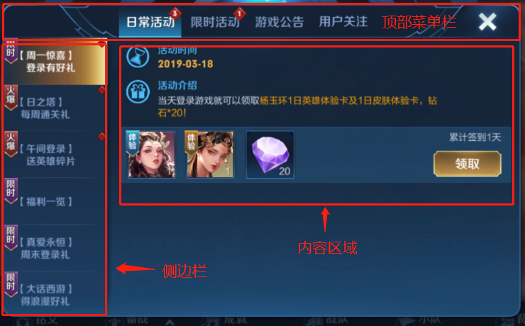

- **IWindow**

    Window is the root container of a UI interface view (IUIViewGroup, IUIView). It is also a controller. It is responsible for creating, destroying, displaying, and hiding window views. It is responsible for managing the life cycle of views and view models. Window interaction, etc.

      //C#，创建窗口
      public class ExampleWindow : Window
      {
          public Text progressBarText;
          public Slider progressBarSlider;
          public Text tipText;
          public Button button;

          protected override void OnCreate(IBundle bundle)
          {
              BindingSet<ExampleWindow, ExampleViewModel> bindingSet;
              bindingSet = this.CreateBindingSet(new ExampleViewModel());

              bindingSet.Bind(this.progressBarSlider).For("value", "onValueChanged").To("ProgressBar.Progress").TwoWay();
              bindingSet.Bind(this.progressBarSlider.gameObject).For(v => v.activeSelf)
              .To(vm => vm.ProgressBar.Enable).OneWay();
              bindingSet.Bind(this.progressBarText).For(v => v.text)
              .ToExpression(
                  vm => string.Format("{0}%", Mathf.FloorToInt(vm.ProgressBar.Progress * 100f)))
              .OneWay();
              bindingSet.Bind(this.tipText).For(v => v.text).To(vm => vm.ProgressBar.Tip).OneWay();
              bindingSet.Bind(this.button).For(v => v.onClick).To(vm => vm.Click).OneWay();
              binding,bound to the onClick event and interactable property.
              bindingSet.Build();
          }

          protected override void OnDismiss()
          {
          }
      }

      --Lua,创建窗口
      require("framework.System")

      local ExampleViewModel = require("LuaUI.Startup.ExampleViewModel")

      ---
      --模块
      --@module ExampleWindow
      local M=class("ExampleWindow",target)

      function M:onCreate(bundle)
          self.viewModel = ExampleViewModel()

          self:BindingContext().DataContext = self.viewModel

          local bindingSet = self:CreateBindingSet()

          bindingSet:Bind(self.progressBarSlider):For("value", "onValueChanged"):To("progressBar.progress"):TwoWay()
          bindingSet:Bind(self.progressBarSlider.gameObject):For("activeSelf"):To("progressBar.enable"):OneWay()
          bindingSet:Bind(self.progressBarText):For("text"):ToExpression(
              function(vm) return string.format("%0.2f%%",vm.progressBar.progress * 100) end,
          "progressBar.progress"):OneWay()
          bindingSet:Bind(self.tipText):For("text"):To("progressBar.tip"):OneWay()
          bindingSet:Bind(self.button):For("onClick"):To("command"):OneWay()
          bindingSet:Build()
      end

      return M

- **Window container and window manager**

    The window manager is a container for managing windows. When the game starts, you need to create a global window manager, GlobalWindowManager, and hang it on the outer root Canvas (see the figure below). Create and edit other root Canvas under this root Canvas Window view.

    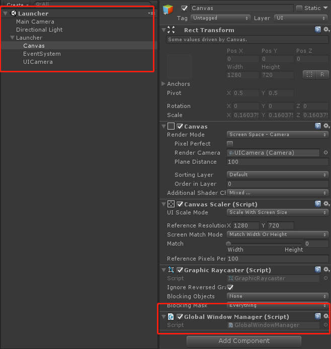

    The window container is both a window manager and a window. In the window container, you can add and delete child windows, manage child windows, and also display and hide like a normal window. Take our MMO game. Generally, a main window container named "Main" and a "Battle" window container are created. All window views opened in the main interface will be placed in the Main container, but when you enter a certain When there are two battle copies, the Main container will be hidden and the "Battle" container will be displayed. All UI windows in the battle copy will be managed by the Battle container. When exiting the copy, you only need to close the Battle container and set the Main container to be visible. Restores the hierarchical relationship of windows in the Main container.

      //C#，创建一个MAIN容器，默认会在全局窗口管理器中创建
      WindowContainer winContainer = WindowContainer.Create("MAIN");
      IUIViewLocator locator = context.GetService<IUIViewLocator>();

      //在MAIN容器中打开一个窗口
      StartupWindow window = locator.LoadWindow<StartupWindow>(winContainer, "UI/Startup/Startup");
      ITransition transition = window.Show()    

- **Window type**

  The window types are divided into four types, full-screen windows (FULL), pop-up windows (POPUP), dialog windows (DIALOG), and progress bar windows (PROGRESS). Different window types will behave differently when the window is opened and blocked. Pop-up windows will automatically close when they are covered by other windows. The dialog window and progress window have the highest priority. It will be displayed at the top level and only one can be opened. When a dialog window or progress window is displayed, if other windows are opened, other windows will not be displayed. Or the progress window will be displayed when it is closed. If multiple dialog windows are opened at the same time, the dialog windows will be queued for processing, and the next one will be displayed only when the previous one is closed.

  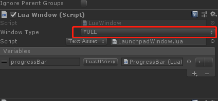  

#### Interaction Request

InteractionRequest (InteractionRequest) is the most difficult to understand, the most complicated and the most winding place in the use of the MVVM framework, and it is not mentioned in many MVVM examples on the Internet. Why do we need interactive requests? What problem does the interactive request solve? The main purpose of introducing interactive requests is to decouple the view model (ViewModel) and the view (View). In the view model, we should not create, reference and directly control the view, because that is the work of the control layer, and it should not be the view model layer. Work, the view layer can depend on the view model layer, but the opposite is not allowed, remember . In the click event of a button, the creation or destruction of the view is often triggered. In MVVM, the button click event is usually bound to a command (ICommand) in the view model layer, that is, bound to the view model. In a member method, in addition to view-independent logic, this method also contains logic that controls the creation, opening, and destruction of views. As mentioned earlier, these logics will cause references and dependencies on the view layer. This is It is not allowed, so we have introduced the concept of InteractionRequest. Through the interaction request, the view control logic is sent back to the control layer for processing (in this framework, View and Window scripts, which are both the view layer and the Control layer, see MVVM architecture diagram in previous chapter).

Take a look at the following code example, using an interactive request to open a warning dialog window, and receive the result selected by the user when the dialog window is closed.

    public class InteractionExampleViewModel : ViewModelBase
    {
        private InteractionRequest<DialogNotification> alertDialogRequest;

        private SimpleCommand openAlertDialog;

        public InteractionExampleViewModel()
        {
            //创建一个交互请求，这个交互请求的作用就是向控制层(InteractionExample)发送一个打开对话窗的通知
            this.alertDialogRequest = new InteractionRequest<DialogNotification>(this);

            //创建一个打响应按钮事件的命令
            this.openAlertDialog = new SimpleCommand(Click);
        }

        public IInteractionRequest AlertDialogRequest { get { return this.alertDialogRequest; } }

        public ICommand OpenAlertDialog { get { return this.openAlertDialog; } }

        public void Click()
        {
            //设置命令的Enable为false，通过数据绑定解耦，间接将视图层按钮设置为不可点击状态
            this.openAlertDialog.Enabled = false;

            //创建一个对话框通知
            DialogNotification notification = new DialogNotification("Interation Example",
                "This is a dialog test.", "Yes", "No", true);

            //创建一个回调函数，此回调函数会在AlertDialog对话框关闭时调用
            Action<DialogNotification> callback = n =>
            {
                //设置命令的Enable为true，通过绑定会自动恢复按钮的点击状态
                this.openAlertDialog.Enabled = true;

                if (n.DialogResult == AlertDialog.BUTTON_POSITIVE)
                {
                    //对话框Yes按钮被按下
                    Debug.LogFormat("Click: Yes");
                }
                else if (n.DialogResult == AlertDialog.BUTTON_NEGATIVE)
                {
                    //对话框No按钮被按下
                    Debug.LogFormat("Click: No");
                }
            };

            //交互请求向View层OnOpenAlert函数发送通知
            this.alertDialogRequest.Raise(notification, callback);
        }
    }

    public class InteractionExample : WindowView
    {
        public Button openAlert;
        protected override void Start()
        {
            InteractionExampleViewModel viewModel = new InteractionExampleViewModel();
            this.SetDataContext(viewModel);

            //创建一个bindingSet
            BindingSet<InteractionExample, InteractionExampleViewModel> bindingSet;
            bindingSet = this.CreateBindingSet<InteractionExample, InteractionExampleViewModel>();

            //绑定本视图的OnOpenAlert函数到视图模型的交互请求AlertDialogRequest，当交互请求触发时，自动调用OnOpenAlert函数
            bindingSet.Bind().For(v => this.OnOpenAlert(null, null)).To(vm => vm.AlertDialogRequest);

            //绑定按钮的onClick事件到视图模型的OpenAlertDialog命令上
            bindingSet.Bind(this.openAlert).For(v => v.onClick).To(vm => vm.OpenAlertDialog);

            bindingSet.Build();
        }

        //创建和打开对话框的函数，通过交互请求触发
        private void OnOpenAlert(object sender, InteractionEventArgs args)
        {
            //收到视图模型层交互请求alertDialogRequest发来的通知

            //得到通知数据
            DialogNotification notification = args.Context as DialogNotification;

            //得到AlertDialog窗口关闭时的回调函数
            var callback = args.Callback;

            if (notification == null)
                return;

            //创建一个对话窗
            AlertDialog.ShowMessage(notification.Message, notification.Title, notification.ConfirmButtonText,
                null,
                notification.CancelButtonText,
                notification.CanceledOnTouchOutside,
                (result) =>
                {
                    //将对话窗按钮事件响应结果赋值到notification，传递到视图模型层使用
                    notification.DialogResult = result;

                    //对话窗关闭时，调用交互请求中设置的回调函数，通知视图模型层处理后续逻辑
                    if (callback != null)
                        callback();
                });
        }
    }

For more examples, see the [Interaction Tutorials](https://github.com/cocowolf/loxodon-framework/tree/master/Assets/LoxodonFramework/Tutorials)

#### Interaction Action

InteractionAction is used in conjunction with InteractionRequest. An interaction request is initiated by an interaction request. The interaction task is used to complete the interaction task. It is an extension of the view method binding to the interaction request in the previous section. Generally speaking, using method binding to an interaction request Yes, but for some common functions, such as requesting to open or close a Loading window, you can use InteractionAction to facilitate code reuse. In different views, you only need to create a LoadingInteractionAction instance to complete the opening function of the Loading window. See the example below to enable Loading

    //在ViewModel中创建一个交互请求
    this.loadingRequest = new InteractionRequest<VisibilityNotification>();

    //在ViewModel中创建一个显示Loading窗口的命令，通过命令调用交互请求打开一个Loading界面
    this.ShowLoading = new SimpleCommand(() =>
    {
        VisibilityNotification notification = new VisibilityNotification(true);
        this.loadingRequest.Raise(notification);
    });

    //在View中创建一个交互请求LoadingInteractionAction
    this.loadingInteractionAction = new LoadingInteractionAction();

    //绑定InteractionAction到InteractionRequest
    bindingSet.Bind().For(v => v.loadingInteractionAction).To(vm => vm.LoadingRequest);

For more examples, see the [Interaction Tutorials](https://github.com/cocowolf/loxodon-framework/tree/master/Assets/LoxodonFramework/Tutorials)

#### Collection and list view binding

In Unity3D game development, we often need to use UGUI's ScrollRect control. For example, we want to display a list of equipment, or all the items in a backpack. So can we use the data binding function to automatically update the content in the list, such as adding, deleting, and modifying data in a gear set, will the gear list view automatically update the interface content? The answer is yes. Use the ObservableList or ObservableDictionary collection to store equipment information. Through the data binding collection to a view script, you can automatically update the content of the equipment list, but the view script here needs to be implemented by ourselves because each item List views are not standardized, and I cannot provide a universal script to provide bindings to collections.

In the following example, I created a ListView view script and used it to dynamically update the view of an equipment list.

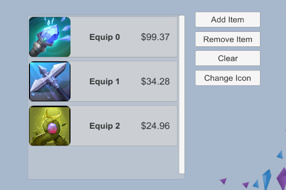

First we create a ListView control, and use this control to listen for changes in the ObservableDictionary of the equipment collection. When the content in the collection changes, the UGUI view is automatically updated, and equipment is added to and removed from the equipment list.

    public class ListView : UIView
    {
        public class ItemClickedEvent : UnityEvent<int>
        {
            public ItemClickedEvent()
            {
            }
        }

        private ObservableList<ListItemViewModel> items;

        public Transform content;

        public GameObject itemTemplate;

        public ItemClickedEvent OnSelectChanged = new ItemClickedEvent();

        //装备集合，通过数据绑定赋值
        public ObservableList<ListItemViewModel> Items
        {
            get { return this.items; }
            set
            {
                if (this.items == value)
                    return;

                if (this.items != null)
                    this.items.CollectionChanged -= OnCollectionChanged;

                this.items = value;

                this.OnItemsChanged();

                if (this.items != null)
                    this.items.CollectionChanged += OnCollectionChanged;
            }
        }

        /// 

        /// 监听装备集合的改变，自动更新装备列表界面
        /// 

        /// <param name="sender"></param>
        /// <param name="eventArgs"></param>
        protected void OnCollectionChanged(object sender, NotifyCollectionChangedEventArgs eventArgs)
        {
            switch (eventArgs.Action)
            {
                case NotifyCollectionChangedAction.Add:
                    this.AddItem(eventArgs.NewStartingIndex, eventArgs.NewItems[0]);
                    break;
                case NotifyCollectionChangedAction.Remove:
                    this.RemoveItem(eventArgs.OldStartingIndex, eventArgs.OldItems[0]);
                    break;
                case NotifyCollectionChangedAction.Replace:
                    this.ReplaceItem(eventArgs.OldStartingIndex, eventArgs.OldItems[0], eventArgs.NewItems[0]);
                    break;
                case NotifyCollectionChangedAction.Reset:
                    this.ResetItem();
                    break;
                case NotifyCollectionChangedAction.Move:
                    this.MoveItem(eventArgs.OldStartingIndex, eventArgs.NewStartingIndex, eventArgs.NewItems[0]);
                    break;
            }
        }

        protected virtual void OnItemsChanged()
        {
            for (int i = 0; i < this.items.Count; i++)
            {
                this.AddItem(i, items[i]);
            }
        }

        protected virtual void OnSelectChange(GameObject itemViewGo)
        {
            if (this.OnSelectChanged == null || itemViewGo == null)
                return;

            for (int i = 0; i < this.content.childCount; i++)
            {
                var child = this.content.GetChild(i);
                if (itemViewGo.transform == child)
                {
                    this.OnSelectChanged.Invoke(i);
                    break;
                }
            }
        }

        protected virtual void AddItem(int index, object item)
        {
            var itemViewGo = Instantiate(this.itemTemplate);
            itemViewGo.transform.SetParent(this.content, false);
            itemViewGo.transform.SetSiblingIndex(index);

            Button button = itemViewGo.GetComponent<Button>();
            button.onClick.AddListener(() => OnSelectChange(itemViewGo));
            itemViewGo.SetActive(true);

            UIView itemView = itemViewGo.GetComponent<UIView>();
            itemView.SetDataContext(item);
        }

        protected virtual void RemoveItem(int index, object item)
        {
            Transform transform = this.content.GetChild(index);
            UIView itemView = transform.GetComponent<UIView>();
            if (itemView.GetDataContext() == item)
            {
                itemView.gameObject.SetActive(false);
                Destroy(itemView.gameObject);
            }
        }

        protected virtual void ReplaceItem(int index, object oldItem, object item)
        {
            Transform transform = this.content.GetChild(index);
            UIView itemView = transform.GetComponent<UIView>();
            if (itemView.GetDataContext() == oldItem)
            {
                itemView.SetDataContext(item);
            }
        }

        protected virtual void MoveItem(int oldIndex, int index, object item)
        {
            Transform transform = this.content.GetChild(oldIndex);
            UIView itemView = transform.GetComponent<UIView>();
            itemView.transform.SetSiblingIndex(index);
        }

        protected virtual void ResetItem()
        {
            for (int i = this.content.childCount - 1; i >= 0; i--)
            {
                Transform transform = this.content.GetChild(i);
                Destroy(transform.gameObject);
            }
        }
    }

Then create an Item view ListItemView of the equipment list, which is responsible for binding the UGUI control on the Item view to the equipment's view model, and automatically update the content of the Item view when the equipment's view model changes.

    public class ListItemView : UIView
    {
        public Text title;
        public Text price;
        public Image image;
        public GameObject border;

        protected override void Start()
        {
            //绑定Item上的视图元素
            BindingSet<ListItemView, ListItemViewModel> bindingSet = this.CreateBindingSet<ListItemView, ListItemViewModel>();
            bindingSet.Bind(this.title).For(v => v.text).To(vm => vm.Title).OneWay();
            bindingSet.Bind(this.image).For(v => v.sprite).To(vm => vm.Icon).WithConversion("spriteConverter").OneWay();
            bindingSet.Bind(this.price).For(v => v.text).ToExpression(vm => string.Format("${0:0.00}", vm.Price)).OneWay();
            bindingSet.Bind(this.border).For(v => v.activeSelf).To(vm => vm.IsSelected).OneWay();
            bindingSet.Build();
        }
    }

Finally, the view model code for the ListView control and ListItemView is as follows.

    public class ListViewViewModel : ViewModelBase
    {
        private readonly ObservableList<ListItemViewModel> items = new ObservableList<ListItemViewModel>();

        public ObservableList<ListItemViewModel> Items
        {
            get { return this.items; }
        }

        public ListItemViewModel SelectedItem
        {
            get
            {
                foreach (var item in items)
                {
                    if (item.IsSelected)
                        return item;
                }
                return null;
            }
        }

        public void AddItem()
        {
            int i = this.items.Count;
            int iconIndex = Random.Range(1, 30);
            this.items.Add(new ListItemViewModel() {
                Title = "Equip " + i,
                Icon = string.Format("EquipImages_{0}", iconIndex),
                Price = Random.Range(10f, 100f)
            });
        }

        public void RemoveItem()
        {
            if (this.items.Count <= 0)
                return;

            int index = Random.Range(0, this.items.Count - 1);
            this.items.RemoveAt(index);
        }

        public void ClearItem()
        {
            if (this.items.Count <= 0)
                return;

            this.items.Clear();
        }

        public void ChangeItemIcon()
        {
            if (this.items.Count <= 0)
                return;

            foreach (var item in this.items)
            {
                int iconIndex = Random.Range(1, 30);
                item.Icon = string.Format("EquipImages_{0}", iconIndex);
            }
        }

        public void Select(int index)
        {
            if (index <= -1 || index > this.items.Count - 1)
                return;

            for (int i = 0; i < this.items.Count; i++)
            {
                if (i == index)
                {
                    items[i].IsSelected = !items[i].IsSelected;
                    if (items[i].IsSelected)
                        Debug.LogFormat("Select, Current Index:{0}", index);
                    else
                        Debug.LogFormat("Cancel");
                }
                else
                {
                    items[i].IsSelected = false;
                }
            }
        }
    }

    public class ListItemViewModel : ViewModelBase
    {
        private string title;
        private string icon;
        private float price;
        private bool selected;

        public string Title
        {
            get { return this.title; }
            set { this.Set<string>(ref title, value, "Title"); }
        }
        public string Icon
        {
            get { return this.icon; }
            set { this.Set<string>(ref icon, value, "Icon"); }
        }

        public float Price
        {
            get { return this.price; }
            set { this.Set<float>(ref price, value, "Price"); }
        }

        public bool IsSelected
        {
            get { return this.selected; }
            set { this.Set<bool>(ref selected, value, "IsSelected"); }
        }
    }

    public class ListViewDatabindingExample : MonoBehaviour
    {
        private int itemCount;
        private ListViewViewModel viewModel;

        public Button addButton;

        public Button removeButton;

        public Button clearButton;

        public Button changeIconButton;

        public ListView listView;

        void Awake()
        {
            ApplicationContext context = Context.GetApplicationContext();
            BindingServiceBundle bindingService = new BindingServiceBundle(context.GetContainer());
            bindingService.Start();

            Dictionary<string, Sprite> sprites = new Dictionary<string, Sprite>();
            foreach (var sprite in Resources.LoadAll<Sprite>("EquipTextures"))
            {
                if (sprite != null)
                    sprites.Add(sprite.name, sprite);
            }
            IConverterRegistry converterRegistry = context.GetContainer().Resolve<IConverterRegistry>();
            converterRegistry.Register("spriteConverter", new SpriteConverter(sprites));
        }

        void Start()
        {
            viewModel = new ListViewViewModel();
            for (int i = 0; i < 3; i++)
            {
                viewModel.AddItem();
            }

            IBindingContext bindingContext = this.BindingContext();
            bindingContext.DataContext = viewModel;

            BindingSet<ListViewDatabindingExample, ListViewViewModel> bindingSet;
            bindingSet = this.CreateBindingSet<ListViewDatabindingExample, ListViewViewModel>();
            bindingSet.Bind(this.listView).For(v => v.Items).To(vm => vm.Items).OneWay();
            bindingSet.Bind(this.listView).For(v => v.OnSelectChanged).To(vm => vm.Select(0)).OneWay();

            bindingSet.Bind(this.addButton).For(v => v.onClick).To(vm => vm.AddItem());
            bindingSet.Bind(this.removeButton).For(v => v.onClick).To(vm => vm.RemoveItem());
            bindingSet.Bind(this.clearButton).For(v => v.onClick).To(vm => vm.ClearItem());
            bindingSet.Bind(this.changeIconButton).For(v => v.onClick).To(vm => vm.ChangeItemIcon());

            bindingSet.Build();
        }
    }

For more examples, see the [ListView And Sprite Databinding Tutorials](https://github.com/cocowolf/loxodon-framework/tree/master/Assets/LoxodonFramework/Tutorials)

#### Data binding and asynchronous loading sprites

In the previous example, I had a binding to a sprite, but it was loaded into memory ahead of time. Here I will talk about how to load a sprite asynchronously through data binding. Similar to collection binding in the previous section, asynchronous loading of sprites can be easily achieved with a view script. Let's look at an example.

Click the "Change Icon" button in the figure to change the icon. The loading of the icon is asynchronous, and there is a loading animation.

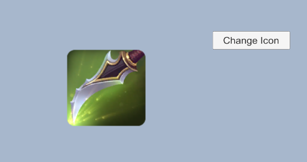

First, we implement a sprite asynchronous loader and hang it on the Image control that needs to load sprite images asynchronously.

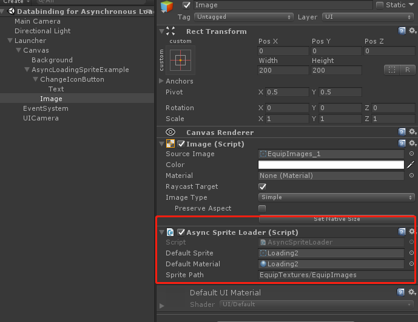

    [RequireComponent(typeof(Image))]
    public class AsyncSpriteLoader : MonoBehaviour
    {
        private Image target;
        private string spriteName;
        public Sprite defaultSprite;
        public Material defaultMaterial;
        public string spritePath;

        public string SpriteName
        {
            get { return this.spriteName; }
            set
            {
                if (this.spriteName == value)
                    return;

                this.spriteName = value;
                if (this.target != null)
                    this.OnSpriteChanged();
            }
        }

        protected virtual void OnEnable()
        {
            this.target = this.GetComponent<Image>();
        }

        protected virtual void OnSpriteChanged()
        {
            if (string.IsNullOrEmpty(this.spriteName))
            {
                this.target.sprite = null;
                this.target.material = null;
                return;
            }

            this.target.sprite = defaultSprite;
            this.target.material = defaultMaterial;

            StartCoroutine(LoadSprite());
        }

        /// 

        /// 异步加载精灵，为了效果明显，在加载器等待了一秒钟
        /// 

        /// <returns></returns>
        IEnumerator LoadSprite()
        {
            yield return new WaitForSeconds(1f);

            Sprite[] sprites = Resources.LoadAll<Sprite>(this.spritePath);
            foreach(var sprite in sprites)
            {
                if(sprite.name.Equals(this.spriteName))
                {
                    this.target.sprite = sprite;
                    this.target.material = null;
                }
            }
        }
    }

Then create the view and view model code of the sample interface as follows.

    public class SpriteViewModel : ViewModelBase
    {
        private string spriteName = "EquipImages_1";

        public string SpriteName
        {
            get { return this.spriteName; }
            set { this.Set<string>(ref spriteName, value, "SpriteName"); }
        }

        public void ChangeSpriteName()
        {
            this.SpriteName = string.Format("EquipImages_{0}", Random.Range(1, 30));
        }
    }

    public class DatabindingForAsyncLoadingSpriteExample : MonoBehaviour
    {
        public Button changeSpriteButton;

        public AsyncSpriteLoader spriteLoader;

        void Awake()
        {
            ApplicationContext context = Context.GetApplicationContext();
            BindingServiceBundle bindingService = new BindingServiceBundle(context.GetContainer());
            bindingService.Start();
        }

        void Start()
        {
            var viewModel = new SpriteViewModel();

            IBindingContext bindingContext = this.BindingContext();
            bindingContext.DataContext = viewModel;

            BindingSet<DatabindingForAsyncLoadingSpriteExample, SpriteViewModel> bindingSet;
            bindingSet = this.CreateBindingSet<DatabindingForAsyncLoadingSpriteExample, SpriteViewModel>();
            bindingSet.Bind(this.spriteLoader).For(v => v.SpriteName).To(vm => vm.SpriteName).OneWay();

            bindingSet.Bind(this.changeSpriteButton).For(v => v.onClick).To(vm => vm.ChangeSpriteName());

            bindingSet.Build();
        }
    }

For more examples, see the [Databinding for Asynchronous Loading Sprites Tutorials](https://github.com/cocowolf/loxodon-framework/tree/master/Assets/LoxodonFramework/Tutorials)

## Lua

### Modules and inheritance

Using Lua's original table inheritance, the concepts of classes (modules) and inheritance are simulated in Lua development. Through the class function of the System module, you can define modules, inherit modules, inherit C # classes, extend C # instances, and write with object-oriented thinking. lua code.

With the following code example, let's see how to define modules and inherit modules.

    -- 定义一个名为 Animal 的基类
    local Animal = class("Animal")

    -- Animal类的构造函数，通过Animal()来创建Animal类的实例，同时会调用这个构造函数
    function Animal:ctor(...)
    end

    -- 为Animal定义一个walk()的方法
    function Animal:walk()
        print("animal walk")
    end

    -- 为Animal定义一个run()方法
    function Animal:run()
        print("animal run")
    end

    -- 定义一个名为Cat的类，它继承了Animal类
    local Cat = class("Cat",Animal)

    -- Cat类的构造函数
    function Cat:ctor()
        -- 重载了构造函数，会覆盖父类构造函数，通过如下显示的调用父类构造函数
        Cat.super.ctor(self)
        self.age = 5
    end

In addition to Lua, modules can also inherit C # classes, and of course static classes. To inherit a non-static C # class in Lua, this class must be able to be instantiated by the new keyword or provide other instantiation functions. For example, the MonoBehaviour script class cannot be instantiated by the new keyword and cannot be inherited in Lua. In the class function, the first parameter is the class name, and the second parameter must be a C # class or an instantiated function of the C # class. We can rewrite the function of the parent class in Lua script, or call the function of the parent class in Lua, see the following code.

**Note: The function of the parent class must be called using the module name, not self**

    M.super.Get(self,name,cascade) --正确

    self.super.Get(self,name,cascade) --错误

    M.super:Get(name,cascade) --错误

Lua inherits C # class Loxodon.Framework.Contexts.Context, adds GetName () function, and overrides Context.Get (string name, bool cascade) function.

    -- 定义一个继承C#类Context的模块，推荐模块的变量名默认都使用M
    local M = class("LuaContext",CS.Loxodon.Framework.Contexts.Context)

    -- 新增一个函数
    function M:GetName()

        --代码省略

    end

    -- 重写父类的函数，调用父类的函数
    function M:Get(name,cascade)    
        -- 调用父类的函数
        local ret = M.super.Get(self,name,cascade)
        if ret then return ret end

        --代码省略

    end

    return M

A MonoBehaviour script cannot be inherited, but its instance can be extended by Lua. Using the class function, we can add new properties and methods to it. Unlike C # class inheritance, the second parameter of class is an instance of a C # class. Look at the Lua example, the C # script LuaLauncher extension code.

The "target" object is in the C # script LuaLauncher. When initializing the lua script environment, it injects its own instance into the lua environment. In all extension scripts of this framework, the "target" variable name is used uniformly. Follow this rule.

C# code, part of LuaLauncher script to initialize lua execution environment.

    var luaEnv = LuaEnvironment.LuaEnv;
    scriptEnv = luaEnv.NewTable();

    LuaTable meta = luaEnv.NewTable();
    meta.Set("__index", luaEnv.Global);
    scriptEnv.SetMetaTable(meta);
    meta.Dispose();

    //将this注入到lua环境表中，这里请统一使用target变量名
    scriptEnv.Set("target", this);

    string scriptText = "";
    if(script.Type == ScriptReferenceType.TextAsset)
        scriptText = script.Text.text;
    else
        string.Format("require(\"framework.System\");local cls = require(\"{0}\");return extends(target,cls);",
         script.Filename)

    object[] result = luaEnv.DoString(scriptText, string.Format("{0}({1})", "Launcher", this.name), scriptEnv);

    if (result.Length != 1 || !(result[0] is LuaTable))
        throw new Exception();

    metatable = (LuaTable)result[0];

    onAwake = metatable.Get<Action<MonoBehaviour>>("awake");
    onEnable = metatable.Get<Action<MonoBehaviour>>("enable");
    onDisable = metatable.Get<Action<MonoBehaviour>>("disable");
    onStart = metatable.Get<Action<MonoBehaviour>>("start");
    onDestroy = metatable.Get<Action<MonoBehaviour>>("destroy");

Extend LuaLauncher script function through lua, awake, enable, disable, start, destroy functions can all be implemented in lua and called in C #.

    require("framework.System")

    local WindowContainer = CS.Loxodon.Framework.Views.WindowContainer
    local Context = CS.Loxodon.Framework.Contexts.Context
    ---
    --Launcher 模块，参数target是约定的，请不要修改。
    --@module Launcher
    local M=class("Launcher",target)

    function M:start()
        -- 获得应用上下文，一个游戏建议创建应用上下文和玩家上下文。
        -- 全局的服务都放入应用上下文中，如账号服务，网络组件，配置服务等基础组件和服务
        -- 只与某个玩家相关的如背包服务、装备服务、角色服务都放入玩家上下文，当登出游戏可以统一释放
        local context = Context.GetApplicationContext()

        -- 从应用上下文获得一个视图定位器
        local locator = context:GetService("IUIViewLocator")

        -- 创建一个名为MAIN的窗口容器
        local winContainer = WindowContainer.Create("MAIN")

        -- 通过视图定位器，加载一个启动窗口视图
        local window = locator:LoadWindow(winContainer, "LuaUI/Startup/Startup")

        --创建窗口
        window:Create()

        --显示窗口，返回一个transition对象，窗口显示一般会有窗口动画，所以是一个持续过程的操作
        local transition = window:Show()

        --监听显示窗口过程的窗口状态
        transition:OnStateChanged(function(w,state) print("Window:"..w.Name.." State:"..state:ToString()) end)

        --监听窗口显示完成事件        
        transition:OnFinish(function() print("OnFinished")  end)
    end

    return M

### Lua's ObserableObject

To meet the requirements of MVVM data binding, Lua's Table can trigger the notification of property modification when the property changes, then it must inherit ObserableObject. It is similar to the ObserableObject function of C #, but it is a version reimplemented in Lua language to adapt to Lua development. The view model and subview model defined in Lua must inherit this class. See example below.

    require("framework.System")

    local ObservableObject = require("framework.ObservableObject")

    ---
    --创建一个Account视图模型
    --@module AccountViewModel
    local M = class("AccountViewModel",ObservableObject)

    function M:ctor(t)
        --执行父类ObservableObject的构造函数，这个重要，否则无法监听数据改变
        M.base(self).ctor(self)

        self.id = 0
        self.username = ""
        self.Password = ""
        self.email = ""
        self.birthday = os.time({year =1970, month = 00, day =00, hour =00, min =00, sec = 00})
        self.address = ""

        if t and type(t)=="table" then
            for k,v in pairs(t) do self[k] = v end
        end
    end

    return M

### Coroutines in Lua using Unity

XLua provides us with a function util.cs_generator () that creates an iterator (IEnumerator) in lua. Through this function, a lua method can be wrapped into a C # IEnumerator, and then a coroutine is executed in C#.

The following doLoad function simulates a loading task, executes a loop from 1 to 50, uses the lua coroutine yield method, and sleeps for 0.1 seconds each time.

    ---
    -- 模拟一个加载任务
    function M:doLoad(promise)
        print("task start")

        for i = 1, 50 do
            --如果有取消请求，即调用了ProgressResult的Cancel()函数，则终止任务
            if promise.IsCancellationRequested then
                break
            end

            promise:UpdateProgress(i/50) --更新任务进度        

            --这里coroutine.yield中可以不传入参数，则表示是每帧执行一次，
            --也可以传入所有继承了YieldInstruction的参数，如:UnityEngine.WaitForSeconds(0.1)
            --还可以传入一个IEnumerator对象，如：AsyncResult.WaitForDone()
            coroutine.yield(CS.UnityEngine.WaitForSeconds(0.1))--等待0.1秒
        end    
        promise:UpdateProgress(1)
        promise:SetResult()    --设置任务执行完成
        print("task end")
    end

Use XLua's function util.cs_generator to wrap doLoad into an IEnumerator and execute it in Executors.RunOnCoroutineNoReturn.

    local Executors = require("framework.Executors")

    local result = ProgressResult(true)
    Executors.RunOnCoroutineNoReturn(util.cs_generator(function() self:doLoad(result) end))

In Lua, the C # Executors class is extended, and two functions RunLuaOnCoroutine and RunLuaOnCoroutineNoReturn are extended. Through them, Lua functions can be automatically wrapped into an IEnumerator and executed in the coroutine of Unity3D.

    local Executors = require("framework.Executors")

    --前一个示例中，我们也可以如下方式执行doLoad函数
    local result = ProgressResult(true)
    Executors.RunLuaOnCoroutineNoReturn(function(r) self:doLoad(r) end,result)

    --或者使用下面方式执行，它与前面的方式是等价的，self.doLoad 是需要执行的函数，self和result是doLoad函数的参数
    --Executors.RunLuaOnCoroutineNoReturn(self.doLoad,self,result)
    return result

Define and execute a coroutine function as a closure.

    --执行一个协程并且返回一个IAsyncResult。传入一个过期时间duration（单位秒），执行duration秒后协程退出
	return Executors.RunLuaOnCoroutine(function(duration)
			local wait = CS.UnityEngine.WaitForSeconds(0.05)
			local startTime = Time.realtimeSinceStartup
			while Time.realtimeSinceStartup - startTime < duration do				
				coroutine.yield(wait)
			end
		end,duration)

For more information about Lua coroutines, see framework.Executors and examples LoxodonFramework/Lua/Examples/Coroutine Tutorials.

### Using the logging system in Lua

The framework provides a Lua version of the logging system. The underlying layer still uses Loxodon.Log.ILog to provide services, but functions are repackaged in Lua. It supports multiple levels of DEBUG, INFO, WARN, ERROR, and FATAL. The level of log printing can be set in the code or configuration file (if log4net is used). At the same time, it also supports displaying the file path and line number of the log, which is convenient for code debugging.

    --如果使用默认的日志工厂，可以如下设置日志打印的级别
    --如果使用log4net，请在log4net配置文件中设置日志打印的级别
    CS.Loxodon.Log.LogManager.Default.Level = CS.Loxodon.Log.Level.INFO

    --初始化日志系统
    local logger = require("framework.Logger").GetLogger()

    --打印日志
    logger:debug("This is a test.")
    logger:info("This is a test.")

### Lua precompiled tools

Lua precompilation tools can be used to precompile Lua scripts into bytecode files, and you can choose whether to encrypt the file. Lua official luac command compiled byte code points 64 and 32, if you want to compile 64-bit and 32-bit compatible bytecode, please refer XLua official documents, relating to common bytecode compiler part ["universal bytes Code"](https://github.com/Tencent/xLua/blob/master/Assets/XLua/Doc/compatible_bytecode.md).

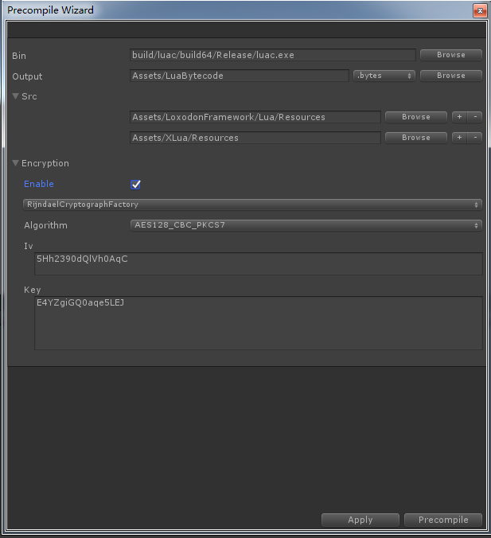

- Bin:luac command path. If you want to compile 64-bit, 32-bit, or compatible bytecode, select the corresponding luac command.
- Output：The directory where the compiled bytecode files are stored. You can select one of the directories under Assets and package them into an AssetBundle, or you can select a directory under StreamingAssets and load it directly from the StreamingAssets folder. The extension of pre-compiled bytecode files can be ".luac" or ".bytes", or other extensions can be customized.
- Src：the root directory of lua source code, supports multiple source code directories. The source code file extension must be ".lua" or ".lua.txt".
- Encryption：Encryption function, which supports AES encryption by default, or you can extend the new encryption method yourself. The panel of the encryption part is dynamic, and the new encryption method is extended, and it will be automatically displayed in the interface of the tool.
- Apply：Save settings
- Precompile：Precompile Lua scripts

#### Lua loader

- FileLoader

    File loader, supports loading Lua scripts or Lua bytecode files from local folders, and also supports loading files from Android apk or obb, so if your lua source code or bytecode files are stored in the StreamingAssets folder , Can also load correctly on the Android platform.

- AssetBundleLoader

    Support loading lua scripts or bytecodes from AssetBundle. Generally speaking, it is recommended to put all lua bytecodes in the same AssetBundle, load them into memory when the game starts, configure AssetBundleLoader loader, and load from this AssetBundle first lua code.

- DecodableLoader

    Decodeable loader, which works with file loader or AssetBundle loader to decrypt binary data.

#### Example

In the following example, in Editor mode, a Lua file with the extension ".lua.txt" or ".lua" is loaded from the "Assets/LuaScripts/" directory via FileLoader. In the real machine mode, load the lua bytecode file from the Application.persistentDataPath + "/LuaScripts/" directory through FileLoader. If it is not found, search the Application.streamingAssetsPath + "/LuaScripts/" directory and use the DecodableLoader loader to decrypt it.

**Multiple loaders can be added in LuaEnv. Loaders added later take precedence over those added first.**

    var luaEnv = LuaEnvironment.LuaEnv;

    #if UNITY_EDITOR
        //开发模式，从本地目录加载lua源码
        luaEnv.AddLoader(new FileLoader(Application.dataPath + "/LuaScripts/", ".lua"));
        luaEnv.AddLoader(new FileLoader(Application.dataPath + "/LuaScripts/", ".lua.txt"));
    #else
        //真机模式，从persistentDataPath或者streamingAssetsPath目录加载lua的bytecode.
        var key = Encoding.ASCII.GetBytes("E4YZgiGQ0aqe5LEJ");
        var iv = Encoding.ASCII.GetBytes("5Hh2390dQlVh0AqC");
        var decryptor = new RijndaelCryptograph(128,key, iv);

        var loader1 = new FileLoader(Application.streamingAssetsPath + "/LuaScripts/", ".bytes");
        luaEnv.AddLoader(new DecodableLoader(loader1, decryptor));

        var loader2 = new FileLoader(Application.persistentDataPath + "/LuaScripts/", ".bytes");
        luaEnv.AddLoader(new DecodableLoader(loader2, decryptor));
    #endif

#### Expand other encryption way

Inherit the Loxodon.Framework.Security.Cryptography.IDecryptor and Loxodon.Framework.Security.Cryptography.IEncryptor interfaces to create a cryptographic decryptor. For specific implementation, refer to the source code of the RijndaelCryptograph class.

Extending the Loxodon.Framework.XLua.Editors.EncryptorFactory class can create a factory class for the new encryptor, define the parameters required for encryption as class member variables in the class, and identify the field as serializable, that is, add "SerializeField" Attributes. So that the pre-compilation tool can automatically search for this class and create an editing interface for it. For specific implementation, please refer to the RijndaelCryptographFactory class.

For example, if you add the following code, you can see the interface as shown in the editing interface.

    public class ExampleCryptographFactory : EncryptorFactory
    {
        [Multiline(2)]
        [SerializeField]
        private string privateKey;

        [Multiline(5)]
        [SerializeField]
        private string publicKey;

        public override IEncryptor Create()
        {
            throw new NotImplementedException();
        }
    }

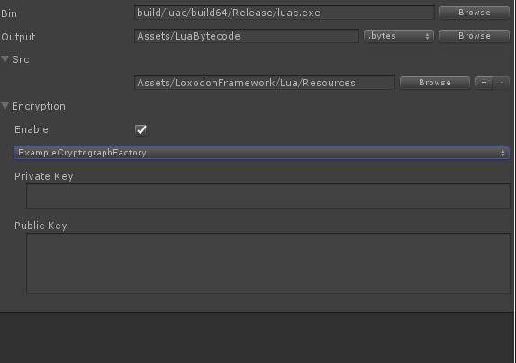

## Layered architecture

Generally speaking, in order to reduce the complexity of project development, the complex business is decomposed, divided and conquered, and a classification and layered solution will be adopted. Divided from the vertical direction, a complex project can be composed of multiple subsystems, and a subsystem can be composed of multiple business modules. From the horizontal direction, the three-tier architecture can be divided into the presentation layer, the domain layer, and the base layer, and the four-tier architecture can be divided into the presentation layer, the application layer, the domain layer, and the base layer. Generally speaking, you should choose according to the specific situation and complexity of your project. You can find related articles or books on the Internet. If you are interested in DDD programming, you can learn about the knowledge of "Domain Driven Design (DDD Programming)". I won't go into too much detail here, but I just combine it MVVM framework, briefly explain how a game client project should be layered.

**Please refer to the directory structure of my project examples**

### User Interface

The presentation layer is the layer responsible for presenting information to the user and receiving user input. Combined with the MVVM framework, it can be divided into view layer / control layer (similar to Android's Activity class, view and control are combined in one class), and view model layer.

- View

  The view layer generally includes windows, view scripts, UI controls, animation scripts, view resources, and other view layer auxiliary tools, such as view locators. Specifically, you can abstract and plan according to your own project situation.

  - Window/UIView

    Window and view scripts control the life cycle of all views, such as the creation and destruction of subviews and subwindows should be written in this layer of code. If the logic of opening and closing the interface is triggered by functions in the ViewModel layer, then use IDialogService or exchange requests to send events to the view script for execution.

  - UI controls (UGUI controls or custom controls)

    UI control layer, custom UI controls should be written in this layer, and it is strongly recommended that UI functions be controlled, such as lists, dialog boxes, progress bars, Grid, Menu, etc. should be written as universal UI controls.

  - Animation

    UI animation layer, for example, you can use DoTween to write various window animations or interface animations, and directly hang them on the UI GameObject. You can refer to my example to write. If it is a window animation, please inherit my UIAnimation or use GenericUIAnimation to implement.

  - View locator(IUIViewLocator)

    View locator, which uses the view locator to load view templates from Resources or from AssetBundle. Of course, you can refer to my UI view locator to write your own 3D view locator.

  - Interation Action

    Interaction behavior. This is an abstraction for window and view creation code reuse. It encapsulates some frequently used interface creation code as interaction behavior.

- ViewModel
  - ViewModel

    The view model layer contains all the view models and subview models. Generally, the view models of Window and View are paired one by one. A window must have a view model, and the subviews under a window should generally have corresponding subviews. model. However, pure view object-encapsulated subview models, such as UserInfoVM, can be shared by multiple views, and when the UserInfoVM property changes, multiple interfaces bound to it will change at the same time.

    The view model is not allowed to depend on the objects of the view layer, but the view layer can depend on the view model, so the dependence of the view on the view model is one-way. The view model creates or destroys the view through an interactive request or IDialogService.

    The view model directly calls the application layer Service to process the business. The view model can register events to the application layer Service to listen to changes in model object data. For example, if the role information changes, then the role service should trigger an event where the role information changes. When the view model layer receives the event, it updates the values in the role information view model object to trigger all UI interface changes.

  - View model locator (IViewModelLocator)

    View model locator, which is used to manage the shared sub-view model, or to save the window view model (such as the window is closed but the view model is not destroyed, the next time you open the window, you can use it to restore the window state). This layer is not necessary, it can be omitted or replaced with another solution.

### Application (Service)

The application layer is mainly used to express user use cases and coordinate the behavior between objects in different domains. If the design concept of the DDD congestion model is adopted, it is only a very thin layer. It exists as a bridge between the presentation layer and the domain layer, and provides services for the presentation layer through application services. If the design idea of the traditional anemia model is adopted, it should include all the business logic processing. I don't know much about DDD programming among the students who use the framework, so here I recommend the design idea of the traditional anemia model to develop the game. In my project example, it corresponds to the Services layer.

For example, a game project may include character services, backpack services, equipment services, skill services, chat services, item services, and so on. These services are used to manage character information, items in the backpack, user equipment, user learned skills, chat information , Chat room information, and more. The service caches this information and ensures that they are synchronized with the server through Load or server push. When there is a message update, an event is triggered to notify the view model layer to update. For example, various red dots on the main interface (the state that prompts a new message) can be designed through the events of each service and the red dot status on the view model.

### Domain Model

The domain layer is responsible for the expression and processing of business logic and is the core of the entire business. If you program according to DDD, the domain layer generally includes concepts such as entities, value objects, domain services, aggregation, aggregation roots, storage, and factories, because the concepts involved are numerous and persistence needs to be compatible with the CQRS + ES model, and there are considerable thresholds to master. So if you are not very familiar with DDD, I don't recommend designing your code completely according to the DDD programming idea, but adopt the idea of the anemia model. Below, I will only make a simple idea of some concepts to be used in the anemia model. Introduction.

- Entity

  Entities must have unique identifiers, such as objects such as account numbers, characters, skills, equipment, and props in the game, which are all entity objects.

- Value Object

  The value object is used to describe an object in a certain aspect of the domain that does not have a conceptual identifier. The value object is different from the entity. It has no unique identifier and its attributes are immutable, such as some game table information.

- Repository

  The warehousing layer is responsible for functions such as adding, deleting, modifying, and checking the entity objects. Through the warehousing layer, you can read data or persist data. The data can be saved in local Json, xml, SQLite, or on the server through the network.

### Infrastructure

The base layer contains the framework, database access components, network components, Log components, Protobuf components, public helper classes and methods.

## Contact information
Email: [yangpc.china@gmail.com](mailto:yangpc.china@gmail.com)   
Website: [https://cocowolf.github.io/loxodon-framework/](https://cocowolf.github.io/loxodon-framework/)  
QQ group: 622321589 
