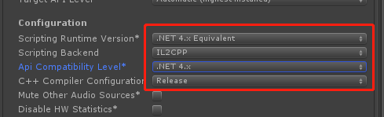
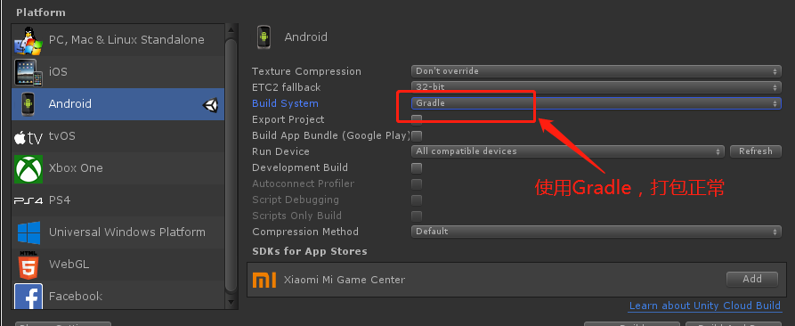
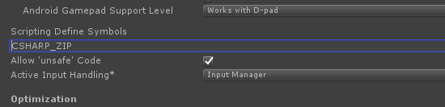

# FAQ

## 在Unity3d 2018及以上版本，导入 XLua 插件后，执行LoxodonFramework/Lua/Examples目录下的示例报错，或者是执行xlua生成代码的命令生成代码后报错。

这是XLua在Unity3D 2018及以上版本兼容性问题，在Editor下，项目开发过程中，请如下图修改 Api Compatibility Level 为".NET 4.x"，并且不要生成代码，可以正常执行。

当发布版本时请改为 ".NET Standard 2.0"，并且执行xlua生成代码的命令生成代码，如报错，请将报错的函数或者属性加入黑名单。具体详情可查看XLua的[FAQs](https://github.com/Tencent/xLua/blob/master/Assets/XLua/Doc/faq.md)。

## 在Unity 2018版本，打包Android平台的Apk时，StreamingAssets中的资源都没有被打包到APK文件中

这应该是Unity的一个bug，如下图修改Build System为Gradle可以成功打包。

## Lua开发，按钮绑定到Command后，运行一段时间后失效了

这是因为SimpleCommand或者RelayCommand使用了弱引用机制，Lua函数是通过XLua转为Action委托的，是一个匿名委托，注册到Command后，以弱引用存储，一段时间后，被GC回收了。所以请确保 keepStrongRef = true，使用强引用保存Lua函数，请看下面的代码，确保最后一个参数为true。

	self.loginCommand = SimpleCommand(function() self:login() end,true)
	self.cancelCommand = SimpleCommand(function() self.interactionFinished:Raise(nil) end,true)
	

## Lua开发，LuaPerfect无法断点调试

请查看Lua脚本是否是通过TextAsset的方式设置在LuaBehaviour上的，请改为通过文件路径加载的方式，就可以断点调试了。

## Android平台分包OBB文件后，无法读取StreamingAssets文件夹中内容

在Unity2019.3以后版本，默认情况下没有开启FileUtil.Compression.cs脚本，请给Unity项目添加宏定义"CSHARP_ZIP"，并且在项目的Assets目录下添加csc.rsp文件，导入System.IO.Compression.dll和System.IO.Compression.FileSystem.dll两个动态库，并且重启Unity3D应用程序。

csc.rsp 内容如下：

    -r:System.IO.Compression.dll
    -r:System.IO.Compression.FileSystem.dll
    
CSHARP_ZIP宏定义

## 开启FairyGUI的支持

通过配置宏"FAIRY_GUI"开启FairyGUI的支持。
